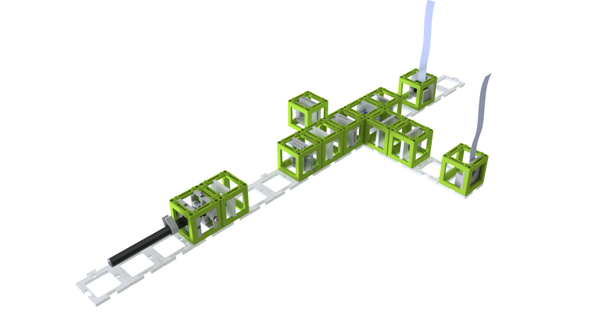
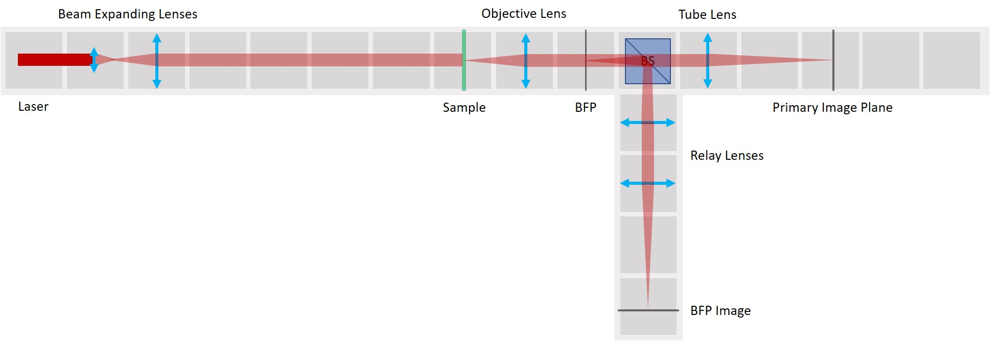

# Abbe Diffraction Experiment
This is the repository for the Abbe Diffraction Experiment. It has two cameras where one captures the Fourier plane and the other acquires the image plane.

## Setup
This experiment is also a part of the [CourseBOX](../../TheBOX/CourseBOX) and the detailed alignment tutorial is found [here](../../TheBOX/CourseBOX/ALIGNMENT_InfOptics).

## Devices' features:

* Capture Fourier Plane
* Capture Image Plane
* Low-cost acquisition
* Open-Source
* Compatible with Educational purposes

## Parts
The [Bill of Materials](https://docs.google.com/spreadsheets/d/1U1MndGKRCs0LKE5W8VGreCv9DJbQVQv7O6kgLlB6ZmE/edit?usp=sharing) is always the most up-to-date version!

### Modules for this setup

|  Name | Properties  |  Price | Link  | # |
|---|---|---|---|---|
| Baseplate puzzle| - | 5€  | [Base-plate](../../CAD/ASSEMBLY_Baseplate/)  | 14|
|  Module: Raspberry Pi Camera | Having two cameras is optional since one camera can be moved between two planes!  | 20 €  | [Raspi Camera Cube](../../CAD/ASSEMBLY_CUBE_RaspiCam)  | 2|
|  Module: Laser  | - | ??€  | [Laser](../../CAD/ASSEMBLY_CUBE_Laser)  | 1|
|  Module: Lens | 2× 50 mm lens and 3× 100 mm lens | 10€  | [Lens Cube](../../CAD/ASSEMBLY_CUBE_Lens)  | 5 |
|  Module: Beam splitter | - | 30€  | [Beamsplitter Cube](../../CAD/ASSEMBLY_CUBE_Beamsplitter)  | 1 |
|  Module: Sample holder | - | ?€  | [Sampleholder Cube](../../CAD/ASSEMBLY_CUBE_Sample_Holder)  | 2 |
|  Module: Sample Comb | optional but useful | ?€  | [Sampleholder Cube](../../CAD/ASSEMBLY_CUBE_Sample_Holder)  | 1 |
|  Module: Circular Aperture | - | ?€  | [Circular Aperture Cube](../../CAD/ASSEMBLY_CUBE_Aperture_Circular)  | 1 |
|  Module: Rectangular Aperture | - | ?€  | [Rectangular Aperture Cube](../../CAD/ASSEMBLY_CUBE_Aperture_Rectangular)  | 1 |

###  3D-printing
To acquire the STL-files use the [UC2-Configurator](https://uc2configurator.netlify.app/). The files themselves are in the [RAW](../../CAD/RAW/STL) folder. The module can be built using injection-moulded (IM) or 3D-printed (3DP) cubes.

### Additional components
* Check out the [RESOURCES](../../TUTORIALS/RESOURCES) for more information!
* 1x Raspberry Pi
* 1x camera splitter for Raspberry Pi
* 1x wired LED (blue)
* Aluminium Foil for the apertures/pinhole
* 1x Power Supply for Raspberry Pi
* long camera cables

##  Assembly
For assembly instructions of the respective modules refer to the links in Modules for this setup.

## Alignment
A detailed alignment tutorial is found [here](../../TheBOX/CourseBOX/ALIGNMENT_InfOptics).

## Software
Please have a look at our **ImJoy** [Github-Repository](https://github.com/bionanoimaging/UC2-ImJoy-GIT) for this Application.

##  Results
None yet. Be the first to share yours!

## Participate!
If you find this piece useful or you want to improve it, please feel free to file an issue or write us a message!
