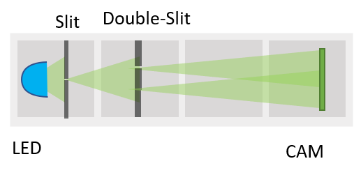
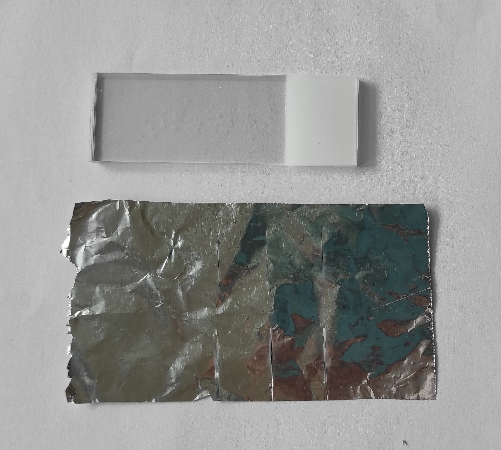
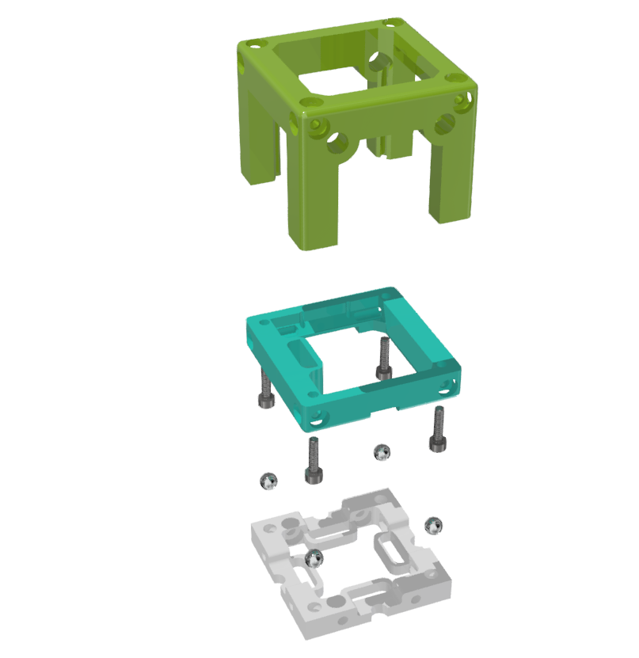

# Double-slit experiment

Light can behave characteristics of both waves and particles. We developed a very easy-to-use setup to demonstrate the classical double-slit experiment sometimes referred to as Young's experiment or Young's slits.

In the experiment, a wave is split into two separate waves and later they are combined into a single wave. The path lengths of both waves are different and have a phase shift which creates an interference pattern. The [Mach–Zehnder interferometer,](./APP_Mach-Zehnder_Interferometer) is an another version which splits the beam with a mirror.

## Components
The CAD parts can also be found [here](./STL).

In particular you need the following parts:

### 3D-printed components
* here will be a list of 3D-printed components

### Miscellaneous
* here will be a list of components
* Check out the [RESOURCES](../../TUTORIALS/RESOURCES) for more information!

### Preparing Single-slit and Double-slit

It's easy to prepare our Single-Slit and Double-Slit slides at home with basic equipments:
+ Aluminum foil
+ Sharp knife (Keep your fingers in safe   :raised_hand_with_fingers_splayed: )
+ 4 piece of microscope slides (optional)
+ tape

1. Take a small piece of aluminum foil.
2. Cut thin slit (or two slit next to each other) with your knife.
3. Use this foil with your sample holder directly.
4. (OPTIONAL) Insert aluminum foil piece between 2 microscope slides and tape two edges with tape.

And you have 2 new products and I called them as Single-Slit Slide and Double-Slit slide. Feel free to give a special name like Zombie :zombie: and genie :genie:

In the photo, there are 3 single-slits in the top line and 3 double-slit pairs in the bottom line. Each single-slit has different width and each double-slit has different distance between each other.

Let's put slides into the cube.

## Assembly of the cube
Putting the parts together is as simple as that:

##  Results  

*Will be updated soon!*

## Suggestions
If you have any problems or suggestions, please file an issue. Thank you!
