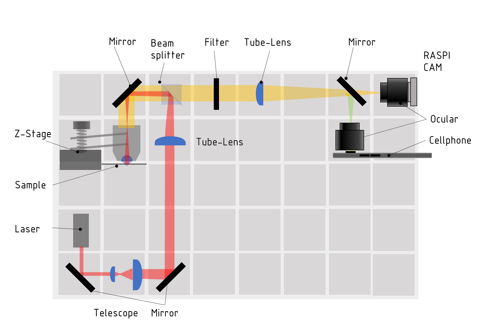
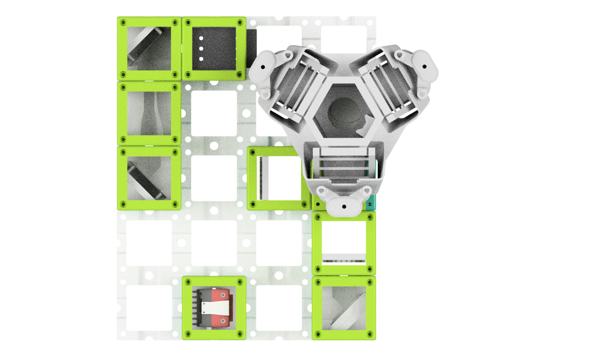
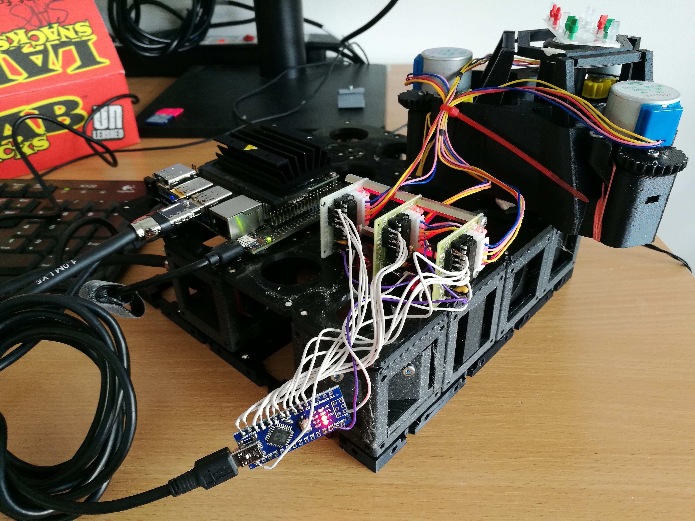
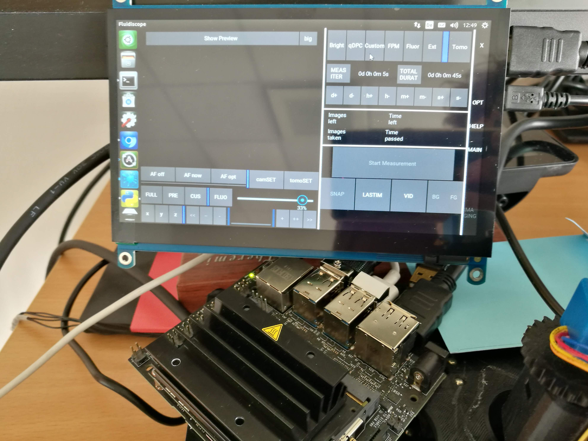
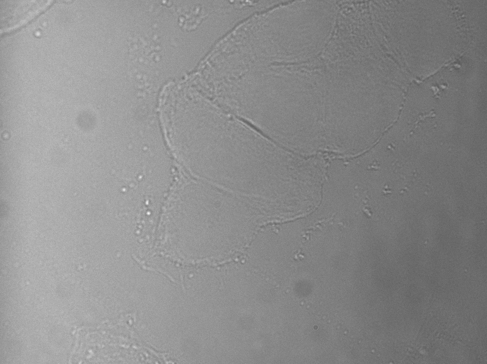
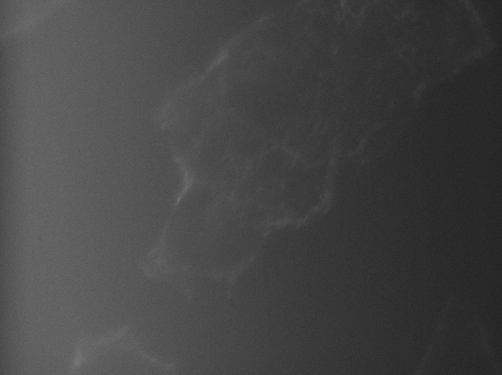
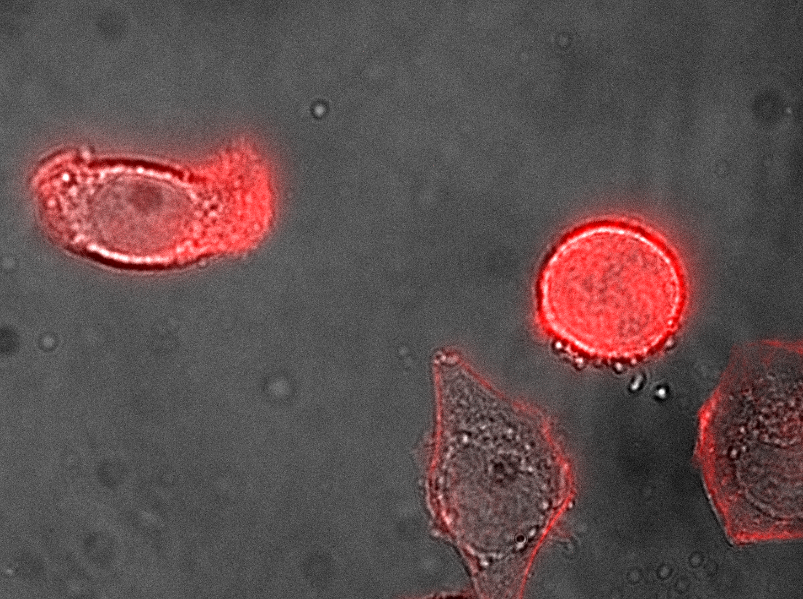

# Fluorescence Microscope (infinity)
This is the repository for the laser-based fluorescence microscope with infinity optics. It is capable to acquire Time-Lapse videos from living cells inside an incubator.

The current version of the Z-stage is inspired by the flexure-bearing Z-stage from Richard Bowman's openflexure microscope design. Their open-source project can be found [here](https://openflexure.org). We also emphasize to use the [delta stage](https://openflexure.org/projects/deltastage/) where [UC2 provides an adapter](../CAD/CUBE_INSERT_OpenFlexure_Deltastage/README.md) for our system

The setup looks as follows:

We use a high power entertainment laser to excite a specific fluorophore, where the emission signal is either filtered by a proper dichroic mirror cube (dichroic+filter) or a low-cost version of a simple 50/50 beamsplitter and an emission filter. The setup uses infinity optics and can either be used with a bare chip or a combination of cellphone camera (with lens) and an eyepiece to achieve proper imaging.

It is a very early developer version. Please feel free to contribute to the documentation and device development.

Note: The pictures on this site do not show the latest version of the Z-stage. Follow the respective assembly guidelines.

## Devices features:

* X/Y/Z/t Acquisitions possible
* Fluorescent imaging
* Quantitative Phase Imaging
* Modularized design
* Low-cost acquisition
* Based on off-the-shelf components
* Open-Source
* infinity corrected optics
* use of low-cost CMOS sensors possible

## Parts
## Alignment

### Modules for this setup

|  Name | Properties  |  Price | Link  | # |
|---|---|---|---|---|
|  4×5 Baseplate | - | 5€  | [Base-plate](../../CAD/ASSEMBLY_Baseplate_v2/)  | 1|
|  Module: Z-Stage | Optionally with Fluomodule  | ?? €  | [Z-Stage](../../CAD/ASSEMBLY_CUBE_Z-STAGE_v2)  | 1|
| (Alternative) [Delta stage](https://openflexure.org/projects/deltastage/)  | Openflexure | ?? €  | [Deltastage](../CAD/CUBE_INSERT_OpenFlexure_Deltastage/README.md)  | 1|
|  Module: Kinematic Mirror 45°  (THORLABS!) | - | 5€  | [Mirror 45](../../CAD/ASSEMBLY_CUBE_Mirror_Kinematic_45_v2)  | 4|
|  Module: Alvium CMOS Camera  | Low-Cost Camera | 5€  | [Alvium Camera](../../CAD/ASSEMBLY_CUBE_AlliedVision_Alvium)  | 4|
|  Module: Beamexpander  | Expands beam by ~3x | ??€  | [Beamexpander](../../CAD/ASSEMBLY_CUBE_Beamexpander_v2)  | 1|
|  Module: Beamsplitter (dichroic)  | Expands beam by ~3x | ??€  | [Beamexpander](../../CAD/ASSEMBLY_CUBE_Dichroic_Beamsplitter_v2)  | 1|

###  3D-printing
To acquire the STL-files use the [UC2-Configurator](https://uc2configurator.netlify.app/). The files themselves are in the [RAW](../RAW/STL) folder. The module can be built using injection-moulded (IM) or 3D-printed (3DP) cubes.

##  Additional components
(**TODO:** need to be updated!)

* Check out the [RESOURCES](../../TUTORIALS/RESOURCES) for more information!
* 1× Laser Module, 635/637nm entertainment laser (laserlands.net, #3450, Dot Laser Module, 300mW, 50 Euro, China) [🢂](https://www.laserlands.net/diode-laser-module/600nm-640nm-orange-red-laser-module/635dot/200mw-300mw-637nm-638nm-laser-diode-module-ttl-stage-lighting-dj-show-12vdc.html)
* 1x Objective lens, No Name, 100x, NA1.25, 50 Euro, China  [🢂](https://de.aliexpress.com/item/664303199.html)
*  32× 5mm Ball magnets [🢂](https://www.magnetmax.de/Neodym-Kugelmagnete/Magnetkugel-Kugelmagnet-O-5-0-mm-Neodym-vernickelt-N40-haelt-400-g::158.html)
* 20× - 40× Screws DIN912 ISO 4762 M3×12 mm [🢂](https://eshop.wuerth.de/Zylinderschraube-mit-Innensechskant-SHR-ZYL-ISO4762-88-IS25-A2K-M3X12/00843%20%2012.sku/de/DE/EUR/)
* 1× M3×30 mm and M3 nut - non-magnetic
* 2× M2×12 mm and 2× M2 nut - non-magnetic
* 1× Raspberry Pi Camera [🢂](https://www.amazon.de/Raspberry-Pi-v2-1-1080P-Kamera-Modul/dp/B01ER2SMHY/ref=sr_1_4?__mk_de_DE=%C3%85M%C3%85%C5%BD%C3%95%C3%91&crid=1LUZK9XHFS5CX&keywords=raspberry+pi+camera+v2.1&qid=1565008837&s=gateway&sprefix=raspberry+pi+camera+%2Caps%2C163&sr=8-4)
* 1× Objective Lens (e.g. 10×, NA 0.3) [🢂](https://de.aliexpress.com/item/32947647522.html?spm=a2g0x.search0104.3.54.6cf57a4c3DwsTO&transAbTest=ae803_3&ws_ab_test=searchweb0_0%2Csearchweb201602_6_10065_10130_10068_10890_10547_319_10546_317_10548_10545_10696_10084_453_454_10083_10618_10307_537_536_10902_10059_10884_10887_321_322_10103%2Csearchweb201603_6%2CppcSwitch_0&algo_pvid=06d972be-b176-4446-8665-56d9e61a8d2c&algo_expid=06d972be-b176-4446-8665-56d9e61a8d2c-7)
* 1× Mirrors (e.g. 30×30 mm² Toymirrors) [🢂](https://www.amazon.de/Rayher-14548606-Spiegelmosaik-selbstklebend-SB-Btl/dp/B008KJ8438/ref=pd_bxgy_201_img_3/258-8761405-4543762?_encoding=UTF8&pd_rd_i=B008KJ8438&pd_rd_r=80fd534c-997b-4a19-b91a-9bf38dbf4ade&pd_rd_w=4DEXV&pd_rd_wg=7SLRE&pf_rd_p=98c98f04-e797-4e4b-a352-48f7266a41af&pf_rd_r=N95R9S45MNSYNQX2BAJE&psc=1&refRID=N95R9S45MNSYNQX2BAJE)
* 2× ESP32 [🢂](https://www.amazon.de/AZDelivery-NodeMCU-Development-Nachfolgermodell-ESP8266/dp/B074RGW2VQ/ref=sr_1_3?__mk_de_DE=%C3%85M%C3%85%C5%BD%C3%95%C3%91&keywords=esp32&qid=1565008313&s=gateway&sr=8-3)
* 1× Stepper Motor and 1× Driver Board [🢂](https://www.amazon.de/Elegoo-Stepper-Schrittmotor-28BYJ-48-Treiberplatine/dp/B01MEGIHLF/ref=sr_1_1_sspa?__mk_de_DE=%C3%85M%C3%85%C5%BD%C3%95%C3%91&keywords=stepper+arduino&qid=1565008205&s=gateway&sr=8-1-spons&psc=1)
* 9× Female-Female Jumper Wire, 0.14 mm² [🢂](https://www.amazon.de/ZOORE-120pcs-Multicolored-Female-Breadboard/dp/B07P85V1G3/ref=sr_1_5?__mk_de_DE=%C3%85M%C3%85%C5%BD%C3%95%C3%91&keywords=jumper+male&qid=1565690543&s=industrial&sr=1-5)
* 2× Power cables for ESP32 - USB-microUSB [🢂](https://www.amazon.de/Gritin-Datenkabel-Geflochtene-Robust-Daten%C3%BCbertragung-Grau/dp/B07CJJHVKX/ref=sr_1_3?keywords=usb+c+kabel&qid=1566029225&s=gateway&sr=8-3)
* Optional (for Fluomodule): 2× Star-LEDs blue (high power 1-3 Watt) [🢂](https://www.ebay.de/itm/Hi-Power-LED-1W-3W-UV-STAR-Ultraviolet-/131326525056?var=)
* Optional (for Fluomodule): 1x MOS-FET/Power PNP Transistor [🢂](https://www.ebay.de/itm/BD809-Transistor-npn-80V-10A-90W-TO220/360661360188?hash=item53f9179e3c:g:ssEAAOSw-fNaqt1l)
* Optional (for Fluomodule): 4× Screws DIN912 ISO 4762 M3×18 mm [🢂](https://eshop.wuerth.de/Zylinderschraube-mit-Innensechskant-SHR-ZYL-ISO4762-88-IS25-A2K-M3X18/00843%20%2018.sku/de/DE/EUR/)

## Setup variants

Top View             | Side View
:-------------------------:|:-------------------------:
This setup has only a z-stage
  |   
| This setup is based on the delta stage from the Bowman lab
  |   
To make it more stable you can "sandwich" it with a second baseplate |   

**Assembled Setups with a Jetson-driven mono camera:**

For more infos about the camera look [here](../../CAD/ASSEMBLY_CUBE_AlliedVision_Alvium)

## Parts
in List form:

| Amount | Type                                      | Properties                        | Price  | Source                                                                                                                                                                    |
|--------|-------------------------------------------|-----------------------------------|--------|---------------------------------------------------------------------------------------------------------------------------------------------------------------------------|
|    1   | Kamera                                    | USB ALVIUM 1800 U -158            | 250    | [Allied Vision](https://www.alliedvision.com/de/produkte/embedded-vision-kameras/detail/Alvium%201800%20U/-158.html)                                                                      |
|    3   | Laser                                     | 635/637 nm                        | 50     |[ Laserlands.net](https://www.laserlands.net/diode-laser-module/600nm-640nm-orange-red-laser-module/635dot/200mw-300mw-637nm-638nm-laser-diode-module-ttl-stage-lighting-dj-show-12vdc.html) |
|    1   | Beam Splitter Dichroic                    | Comar optics Dichro 740 IY als 45 | 40     | [Comar ](https://www.comaroptics.com/components/filters/dichroic-filters/long-pass-dichroic-filters)                                                                                |
|    1   | Filter Emission                           | Emissionsfilter 655 IY als 0°     | 40     | [Comar](https://www.comaroptics.com/components/filters/dichroic-filters/long-pass-dichroic-filters)                                                                                |
|   200  | Magnets                                   | 5mm Ball Magnets, NEoxym          | 0,31   | [Magnetmax](https://www.magnetmax.de/Neodym-Kugelmagnete/Magnetkugel-Kugelmagnet-O-5-0-mm-Neodym-vernickelt-N40-haelt-400-g::158.html?XTCsid=8a83b5bb1601ec808d634714960a4e25)         |
|    4   | Mirrors 1 inch                            | Thoralbs                          | ~50    | [Thorlabs](https://www.thorlabs.com/thorproduct.cfm?partnumber=PF10-03-P01)                                                                                                           |
|    1   | Tube lense according to   objective lens  |                                   | ?      | -                                                                                                                                            |
|    1   | Tube Lens                                 | Achromat, f 156,4mm / ∅ 40,0mm    | 5,9    | [PGI-Versand](https://www.pgi-versand.de/?id=47&mode=artdet&artnr=563.OA.63)                                                                                                             |
| 1      | Tube Lens alternative                     | Achromat, f 182,8mm / ∅ 50,0mm    | 7,9    | [PGI-Versand](https://www.pgi-versand.de/?id=47&mode=artdet&artnr=564.OA.64)                                                                                                             |
|  1x500 | Screws M3x12                              |                                   | ?      | [Würth](https://eshop.wuerth.de/Zylinderschraube-mit-Innensechskant-SHR-ZYL-ISO4762-88-IS25-A2K-M3X12/00843%20%2012.sku/de/DE/EUR/)                                                |
|        | Beam Expander Lens                        | Achromat, + 26,5mm / ∅ 18,0mm     | 4,6    | [PGI-Versand](https://www.pgi-versand.de/?id=47&mode=artdet&artnr=551.OAL)                                                                                                               |

##  Assembly and alignment
For assembly instructions of the respective modules refer to the links in Modules for this setup.

A simplified scheme can be found [here](./IMAGES/UC2_fullBOX_incubator_EN.pdf).

##  Electronics
🢂 Find more in the [Electronics section](../../ELECTRONICS)

##  Software
🢂 Find the software for this setup in our dedicated [UC2-Software-GIT](https://github.com/bionanoimaging/UC2-Software-GIT)

##  Results

This is a set of ATTO 647 labelled *e.colis* provided by O. Helle from UiO imaged with a 100x, 1.25, a cellphone (Huawei P20 Pro, monochromatic camera, Freedcam) and a 635/637 nm exciation.

This is acquired with the Allied Vision Alvium 1500-158 and the new UC2 Nvidia Jetson Nano GUI. HeLa labelled with Alexa Fluor 647 Phal.

***Brightfield***

***Fluorescence***

***Overlay***

##  Participate!

Do you want to show your own results? Do you have ideas for improvements? Let us know!
