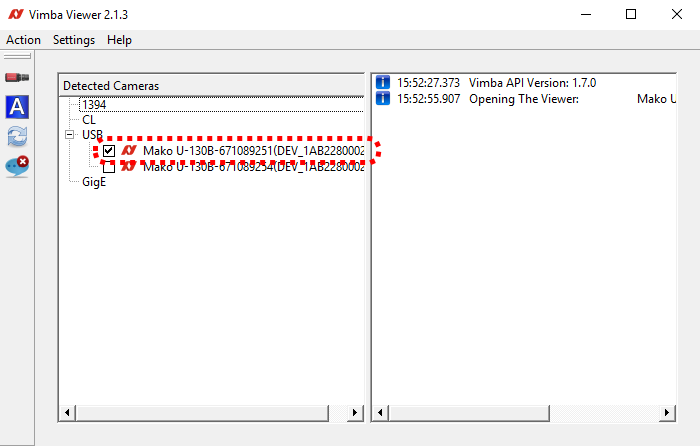

# Tutorial:
__________________
*How to use the UC2 infinity-corrected microscope?*


Version: 2020-08-11

This tutorial correpsonds to the Nvidia Jetson GUI in our [Software-Branch](https://github.com/bionanoimaging/UC2-Software-GIT). 

### Connect to the Jetson

The current Jetson Nano runs with Linux (Ubuntu). You can connect to it using ```SSH```. The easiest is to create a WiFi Hotspot with an Android (tested, possibly also iPHONE) cellphone. Connect your computer (e.g. MAC/Windows) as well as the Jetson to it.

#### MAC

- Open the terminal

```
cd /home/bene/Downloads/UC2-Software-GIT/GUI/RASPBERRY_PI/RASPIapp_py3
export DISPLAY=:0
python main.py
```

#### Windows 

- Download and install WinSCP + Putty 
- open Putty and connect to the Nvidia Jetson Nano; Use its IP which can be determined by typing ifconfig into the terminal 

expected output:

```
[INFO   ] [Logger      ] Record log in /home/bene/.kivy/logs/kivy_20-08-11_5.txt
[INFO   ] [Kivy        ] v2.0.0rc3, git-9ff5f12, 20200803
[INFO   ] [Kivy        ] Installed at "/home/bene/.local/lib/python3.7/site-packages/kivy/__init__.py"
[INFO   ] [Python      ] v3.7.5 (default, Nov  7 2019, 10:50:52) 
[GCC 8.3.0]
[INFO   ] [Python      ] Interpreter at "/usr/bin/python3.7"
[INFO   ] [Factory     ] 186 symbols loaded
[INFO   ] [Image       ] Providers: img_tex, img_dds, img_sdl2, img_pil (img_ffpyplayer ignored)
[INFO   ] [Text        ] Provider: sdl2(['text_pango'] ignored)
[INFO   ] [Window      ] Provider: sdl2
dbus[8533]: arguments to dbus_message_new_method_call() were incorrect, assertion "path != NULL" failed in file ../../../dbus/dbus-message.c line 1362.
This is normally a bug in some application using the D-Bus library.

[INFO   ] [GL          ] Using the "OpenGL" graphics system
[INFO   ] [GL          ] Backend used <gl>
[INFO   ] [GL          ] OpenGL version <b'4.6.0 NVIDIA 32.3.1'>
[INFO   ] [GL          ] OpenGL vendor <b'NVIDIA Corporation'>
[INFO   ] [GL          ] OpenGL renderer <b'NVIDIA Tegra X1 (nvgpu)/integrated'>
[INFO   ] [GL          ] OpenGL parsed version: 4, 6
[INFO   ] [GL          ] Shading version <b'4.60 NVIDIA'>
[INFO   ] [GL          ] Texture max size <16384>
[INFO   ] [GL          ] Texture max units <32>
[INFO   ] [Window      ] auto add sdl2 input provider
[INFO   ] [Window      ] virtual keyboard not allowed, single mode, not docked
ERROR: Could not import scipy!
[ DEBUG    ] [ UC2           ] Logging successfully initialized to -> uc2-20200811_122326.log
Configuration file loaded
```

alternative double-click on the icon on the Desktop ```startUC2.sh```. 


## Getting started

### UC2 GUI 

The GUI has the following functionalities:

```
- BURST: Take fluorescent images at "high-speed" (T=0.5s)
- Preview: Observe the image using the preview window 
- Long-Term experiments: Take fluorescent and/or brightfield images sequentially (T>1s, multiple days)
- Hardware control: X/Y/Z, Laser intensity, LED on/off
```

*Quick tour:*

<p align="center">

</p> 

#### BURST-Mode *(T<1s)*

You can take fluorescent images at a rate of *0.5 s* by first (!) pressing the button "BURST", then hit "Start Preview". The images will be saved in the Folder ```DATA``` with a unique name which follows the current date. 

#### Long-term Acquisitions *(T>1s)*

For long-term image series where you want to have multi-modal imaging capabilities (e.g. BF+FLUO), you can hit "Start Experiment" and choose the period and length of the experiment. Then select Fluo and/or BF and start the experiment. The images are saved in the folder ```data```. 

#### Hardware Control

##### XYZ-Stage

The deltastage from the openflexure project can be controlled by first typing the direction button (e.g. ***X***) and then drive back/forth. You can vary the step-size by pressing ***--/++***. The stage may wobble, we will update that soon! 

##### Fluorscence (Laser)

The button ***FLUO*** activates the laser which can be controled in intensity. Therefore move the slider until you get the right intensity in the sample plane. 

##### Brightfield 

The button ***FULL*** activates the LED. 


### Vimba Viewer 

You can start the VIMBA-Viewer by double clicking the Icon ```startVimbaViewer.sh```on the Desktop. It starts the GUI to have full control over the camera:

<p align="center">

</p> 


## Align the setup

1. Mount the LED with this tripod mechanism so that it's in the center of the Objective lens
2. Follow the path of the transmitted light until . It has to go tr
## Mount the sample 

## Focus the sample 

## Downloading Data

### BURST Data

The data can be found in the folder ```./DATA```

### Long-term Data

The data can be found in the folder ```./data```


## Trouble Shooting
 
### If nothing is woking

-  Did you turn it off and on again?

### Autofocus does not work

- This feature is currently not implemented in the Alvium Camera framework

 

 