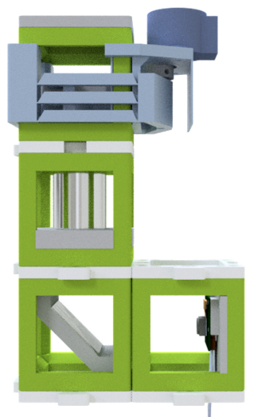
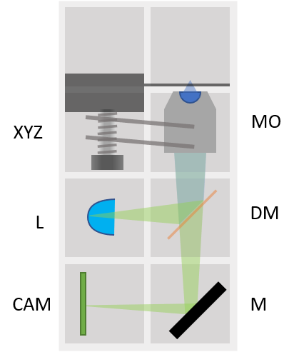

# In-Incubator Microscope with fluorescence module
This is the repository for the in-incubator microscope. It is capable to acquire Time-Lapse videos from living cells inside an incubator.

The current version of the Z-stage is inspired by the flexure-bearing Z-stage from Richard Bowman's openflexure microscope design. Their open-source project can be found [here](https://openflexure.org).

Each functional block has an Arduino acting as a BUS-communicator. Therefore it's possible to control (i.e. switch on/off) devices from the MASTER-device (i.e. Raspberry pi). We aim to build a low-cost solution for high throughput acquisitions, acting as a new tools for (not only) biologists.

It is a very early developer version. Please feel free to contribute to the documentation and device development.

Fluorescence version:

## Devices features:

* X/Y/Z/t Acquisitions possible
* Fluorescent imaging
* Quantitative Phase Imaging
* modularized design
* Low-cost acquisition
* based on off-the-shelf components
* Open-Source

## Parts
The [Bill of Materials](https://docs.google.com/spreadsheets/d/1U1MndGKRCs0LKE5W8VGreCv9DJbQVQv7O6kgLlB6ZmE/edit?usp=sharing) is always the most up-to-date version!

### Modules for this setup

|  Name | Properties  |  Price | Link  | # |
|---|---|---|---|---|
|  Baseplate puzzle| - | 5€  | [Base-plate](../../CAD/ASSEMBLY_Baseplate/)   | 5|
|  Module: Z-Stage | -  | ?? €  | [Z-Stage](../../CAD/ASSEMBLY_CUBE_Z-STAGE_sample)  | 1|
|  Module: Mirror 45°  | - | 5€  | [Mirror 45](../../CAD/ASSEMBLY_CUBE_Mirror_45)  | 1|
|  Module: Raspberry Camera  | - | ??€  | [RaspiCam](../../CAD/ASSEMBLY_CUBE_RaspiCam)  | 1|
|  Module: LED | - | ??€  | [LED](../../CAD/ASSEMBLY_CUBE_LED)  | 1|
|  Module: Dichroic Beam splitter | - | ??€  | [Dichroic Beam splitter](../../CAD/ASSEMBLY_CUBE_Dichroic_Beamsplitter)  | 1|

###  3D-printing
To acquire the STL-files use the [UC2-Configurator](https://uc2configurator.netlify.app/). The files themselves are in the [RAW](../../RAW/STL) folder. The module can be built using injection-moulded (IM) or 3D-printed (3DP) cubes.

### Additional components
* Check out the [RESOURCES](../../TUTORIALS/RESOURCES) for more information!

##  Results
None yet. Be the first to share yours!
