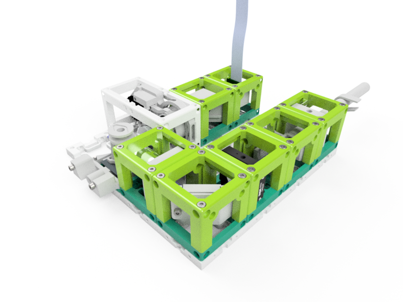

# Lightsheet Setup (Workshop)
This is the manual for the Lightsheet Microscope used for the International Day of Light (IDoL) workshop.

### Purpose
Produce 3D images with better sectioning.

Note: The pictures on this site do not show the latest version of the cubes. Follow the respective assembly guidelines.

## 3D printing

### Modules for this setup

|  Name | Properties  |  Price | Link  | # |
|---|---|---|---|---|
|  4×4 Baseplate | - | 5€  | [Base-plate](../../CAD/ASSEMBLY_Baseplate_v2/)  | 1|
|  Module: Laser  | - | ??€  | [Laser](../../CAD/ASSEMBLY_CUBE_Mirror_Kinematic_45_v2)  | 1|
|  Module: Beamexpander  | - | ??€  | [Beamexpander](../../CAD/ASSEMBLY_CUBE_Beamexpander_v2)  | 1|
|  Module: Cylindrical Lens  | - | ??€  | [Cylindrical Lens](../../CAD/ASSEMBLY_CUBE_Lens_CYLINDRICAL_v2)  | 1|
|  Module: Kinematic Mirror 45°  | - | ??€  | [Kinematic Mirror 45](../../CAD/ASSEMBLY_CUBE_Mirror_Kinematic_45_v2)  | 1|
|  Module: Objective Lens  | - | ??€  | [Objective Lens](../../CAD/ASSEMBLY_CUBE_Lens_v2)  | 1|
|  Module: Sample-Stage | -  | ?? €  | [S-Stage](../../CAD/ASSEMBLY_CUBE_S-STAGE_v2)  | 1|
|  Module: Z-Stage | Without Fluomodule!  | ?? €  | [Z-Stage](../../CAD/ASSEMBLY_CUBE_Z-STAGE_v2)  | 1|
|  Module: Raspberry Camera  | - | ??€  | [RaspiCam](../../CAD/ASSEMBLY_CUBE_RaspiCam_v2)  | 1|

###  Parts to print
* 1× [Base-Plate 4×4](./STL/Assembly_base_4x4.stl)
* 6× [1×1 Cube](./STL/10_Cube_1x1_v2.stl)
* 6× [1×1 Cube Lid](./STL/10_Lid_1x1_v2.stl)
* 1× [1×1 Thin Lid](./STL/10_Lid_1x1_v2_thin.stl)
* 1× [2×1 Cube](./STL/10_Cube_2x1_v2.stl)
* 1× [2×1 Cube Lid](./STL/10_Lid_el_2x1_v2.stl)
* 1× [Z-Stage](./STL/20_focus_inlet_linearflexure_v0.stl)
* 1× [Z-Stage Objective Mount](./STL/30_focus_inlet_objective_mount_v7.stl)
* 2× [Coupling Screw M3](./STL/30_Coupling_Screw_28BYJ_M3.stl)
* 1× [Cube Raspicam Insert](./STL/20_Cube_Insert_RaspiCam.stl)
* 1× [Sample-Stage](./STL/30_Z_Translator_Lightsheet_v4.stl)
* 2× [Laser Mount](./STL/20_Cube_Insert_Laser_Mount.stl)
* 1× [Laser Switch](./STL/00_Laser_Clamp_OnOffSwitch.stl)
* 1× [Beamexpander Insert](./STL/20_Cube_Insert_Beamexpander.stl)
* 1× [Beamexpander Lens Adapter](./STL/30_Lens_Adapter_Beamexpander.stl) - if needed
* 1× [Cylindrical Lens Insert](./STL/20_Cube_Insert_Lens_Cylindrical.stl)
* 1× [Kinematic Mirror Insert](./STL/20_Cube_Insert_Kinematic_Mirrormount_45_base.stl)
* 1× [Objective Lens Insert](./STL/20_Cube_Insert_Objective_Holder.stl)
* 1× [Syringe Holder](./STL/30_Syringe_holder_v2.stl) - useful for alignment
* Optional: 1× [Syringe Holder - top part](./STL/00_Syringe_holder_lid_v2.stl)
* Optional: 1× [Sample Chamber](./STL/30_Samplechamber.stl)

##  Additional components
*  36× - 64× 5mm Ball magnets [🢂](https://www.magnetmax.de/Neodym-Kugelmagnete/Magnetkugel-Kugelmagnet-O-5-0-mm-Neodym-vernickelt-N40-haelt-400-g::158.html)
* 50× - 70× Screws DIN912 ISO 4762 M3×12 mm [🢂](https://eshop.wuerth.de/Zylinderschraube-mit-Innensechskant-SHR-ZYL-ISO4762-88-IS25-A2K-M3X12/00843%20%2012.sku/de/DE/EUR/)
* 2× M3×30 mm and 2× M3 nut - non-magnetic
* 2× M2×12 mm and 2× M2 nut - non-magnetic
* 1× Raspberry Pi Camera [🢂](https://www.amazon.de/Raspberry-Pi-v2-1-1080P-Kamera-Modul/dp/B01ER2SMHY/ref=sr_1_4?__mk_de_DE=%C3%85M%C3%85%C5%BD%C3%95%C3%91&crid=1LUZK9XHFS5CX&keywords=raspberry+pi+camera+v2.1&qid=1565008837&s=gateway&sprefix=raspberry+pi+camera+%2Caps%2C163&sr=8-4)
* 1× Laser pointer [🢂](https://www.laserlands.net/11040037.html)
* 1× Smartphone Camera Lens [🢂](https://www.amazon.de/BisLinks%C2%AE-Facing-Kamera-Ersatz-Repair/dp/B01M9K9RVN/ref=sr_1_10?__mk_de_DE=%C3%85M%C3%85%C5%BD%C3%95%C3%91&keywords=lg+g3+camera&qid=1565005739&s=gateway&sr=8-10)
* 1× Planoconvex Lens, *f'* = 25 mm (Artikel 2002 or 2107) [🢂](https://optikbaukasten.de/)
* 1× Objective Lens (e.g. 10×, NA 0.3) [🢂](https://de.aliexpress.com/item/32947647522.html?spm=a2g0x.search0104.3.54.6cf57a4c3DwsTO&transAbTest=ae803_3&ws_ab_test=searchweb0_0%2Csearchweb201602_6_10065_10130_10068_10890_10547_319_10546_317_10548_10545_10696_10084_453_454_10083_10618_10307_537_536_10902_10059_10884_10887_321_322_10103%2Csearchweb201603_6%2CppcSwitch_0&algo_pvid=06d972be-b176-4446-8665-56d9e61a8d2c&algo_expid=06d972be-b176-4446-8665-56d9e61a8d2c-7)
* 1× Objective Lens 4× [🢂](https://de.aliexpress.com/item/32947647522.html?spm=a2g0x.search0104.3.54.6cf57a4c3DwsTO&transAbTest=ae803_3&ws_ab_test=searchweb0_0%2Csearchweb201602_6_10065_10130_10068_10890_10547_319_10546_317_10548_10545_10696_10084_453_454_10083_10618_10307_537_536_10902_10059_10884_10887_321_322_10103%2Csearchweb201603_6%2CppcSwitch_0&algo_pvid=06d972be-b176-4446-8665-56d9e61a8d2c&algo_expid=06d972be-b176-4446-8665-56d9e61a8d2c-7)
* 1× Cylindrical Lens, *f'* = 63 mm (e.g. 63 YQ 40) [🢂](https://www.comaroptics.com/components/lenses/cylindrical-lenses/quality-planoconvex-cylindrical-lenses-visibleuv)
* 2× Metal plate 30×40 mm (galvanized steel)
* 1× Mirrors (e.g. 30×30 mm² Toymirrors) [🢂](https://www.amazon.de/Rayher-14548606-Spiegelmosaik-selbstklebend-SB-Btl/dp/B008KJ8438/ref=pd_bxgy_201_img_3/258-8761405-4543762?_encoding=UTF8&pd_rd_i=B008KJ8438&pd_rd_r=80fd534c-997b-4a19-b91a-9bf38dbf4ade&pd_rd_w=4DEXV&pd_rd_wg=7SLRE&pf_rd_p=98c98f04-e797-4e4b-a352-48f7266a41af&pf_rd_r=N95R9S45MNSYNQX2BAJE&psc=1&refRID=N95R9S45MNSYNQX2BAJE)
* 2× ESP32 [🢂](https://www.amazon.de/AZDelivery-NodeMCU-Development-Nachfolgermodell-ESP8266/dp/B074RGW2VQ/ref=sr_1_3?__mk_de_DE=%C3%85M%C3%85%C5%BD%C3%95%C3%91&keywords=esp32&qid=1565008313&s=gateway&sr=8-3)
* 2× Stepper Motor and 2× Driver Board [🢂](https://www.amazon.de/Elegoo-Stepper-Schrittmotor-28BYJ-48-Treiberplatine/dp/B01MEGIHLF/ref=sr_1_1_sspa?__mk_de_DE=%C3%85M%C3%85%C5%BD%C3%95%C3%91&keywords=stepper+arduino&qid=1565008205&s=gateway&sr=8-1-spons&psc=1)
* 12× Female-Female Jumper Wire, 0.14 mm² [🢂](https://www.amazon.de/ZOORE-120pcs-Multicolored-Female-Breadboard/dp/B07P85V1G3/ref=sr_1_5?__mk_de_DE=%C3%85M%C3%85%C5%BD%C3%95%C3%91&keywords=jumper+male&qid=1565690543&s=industrial&sr=1-5)
* 2× Power cables for ESP32 - USB-microUSB [🢂](https://www.amazon.de/Gritin-Datenkabel-Geflochtene-Robust-Daten%C3%BCbertragung-Grau/dp/B07CJJHVKX/ref=sr_1_3?keywords=usb+c+kabel&qid=1566029225&s=gateway&sr=8-3)

##  Assembly and alignment
* [Baseplate ](../../CAD/ASSEMBLY_Baseplate_v2/)
* [Laser Cube ](../../CAD/ASSEMBLY_CUBE_Laser_v2/)
* [Beamexpander Cube ](../../CAD/ASSEMBLY_CUBE_Beamexpander_v2/)
* [Cylindrical Lens Cube ](../../CAD/ASSEMBLY_CUBE_Lens_Cylindrical_v2/)
* [Kinematic Mirror Cube ](../../CAD/ASSEMBLY_CUBE_Mirror_45_v2/)
* [Objective Lens Cube ](../../CAD/ASSEMBLY_CUBE_Lens_v2/)
* [Sample-stage ](../../CAD/ASSEMBLY_CUBE_S-STAGE_v2/)
* [Z-stage ](../../CAD/ASSEMBLY_CUBE_Z-STAGE_v2/)
* [Raspberry Camera Cube ](../../CAD/ASSEMBLY_CUBE_RaspiCam_v2/)

##  Electronics
🢂 Find more in the [Electronics section](../../ELECTRONICS)

##  Software
🢂 Find the software for this setup in our dedicated [UC2-Software-GIT](https://github.com/bionanoimaging/UC2-Software-GIT)

### Alignment of the optical path

Here we give a step-by-step tutorial on how-to align the beam-path.

The illumination path is independent from the detection path - the order how you align it is up to you.

A simplified scheme can be found [here](./IMAGES/UC2_fullBOX_lightsheet_EN.pdf).

## Safety
Don't touch the optical surfaces of lenses and objectives!

Attention, don't cut your fingers while removing the lens from the iPhone sensor and the support material from 3D printed parts!

Never (!) look into the laser pointer! It will damage your eye immediately!

* ATTENTION: NEVER LOOK DIRECTLY INTO THE LASER! EYE WILL BE DAMAGED DIRECTLY
* NEVER SWITCH ON THE LASER WITHOUT INTENDED USE
* BEAM HAS TO GO AWAY FROM ONESELF - ALWAYS!

### Align the illumination path (light sheet)
Here we try to form the light sheet.

##### 1. Mount the pre-assembled laser cube
* Make sure the Laser-Cube is mounted in such a way, that the four screws that are used for centering the laser are pointing each through a different side of the cube. In other words, the laser inserts must be rotated by 180° with respect to each other.
* Insert the laser in the cube the way that the end with the light source is not sticking out of the cube. The centering screw from the top should be pressing on the light source end.
* The end with the switch is sticking out of the cube. Make sure you can switch it on with the clamp.
* Switch on the laser with the clamp.
* The laser has a line profile. Rotate it inside the holder until the line is horizontal.
* Center the laser roughly with the four centering screws.
* Place he Laser-Cube on the baseplate as indicated by the Animation below.
* ATTENTION: !Don't hit your or anybody's eyes!
* If you make a break or do something else than aligning at the moment, always switch off the laser to make sure you don't endanger anybody's eyesight!

##### 2. Align the telescope
* Place the pre-assembled telescope on the baseplate right after the laser.
* After the laser, first comes the iPhone lens and that the convex lens, in order to collimate the beam.
* Shift the iPhone lens inside the rail back and forth until a parallel (i.e. collimated) beam is created.
* This can be measured by simply comparing the beam at a distance of 2cm and 20 cm right after the telescope: The diameter should not change.
* The telescope should be in the same height as the laser, hence centered.
* Align the telescope and the laser to the same height - The beam profile must not be visible after collimation. If the height is not correctly aligned, the collimated beam will fade away on one side.
* ATTENTION: !Don't hit your or anybody's eyes!

##### 3. Add the cylindrical lens
* Place the pre-assembled lens-mount on the baseplate right after the telescope.
* The axis of the cylindrical lens must be horizontal.
* The flat side of the lens must face away from the telescope - in the direction of the mirror-Cube.
* Currently, 63 mm cylindrical lenses are used. Slide the lens inside the cube as far as possible from the telescope.
* Observe the line-focus of the collimated beam. The focus line must be vertical.
* ATTENTION: !Don't hit your or anybody's eyes!

##### 4. Add the pre-mounted fold-mirror
* Place the pre-assembled 45° fold kinematic mirror on the baseplate after the cylindrical lens.
* It the beginning, the mirror should fold the beam by roughly 90°.
* ATTENTION: !Now the laser beam is going to a perpendicular direction to the one before. Make sure to block the light with i.e. a cardboard, so it can't leave you setup and hit somebody's eyes!

##### 5. Add the pre-mounted objective lens
* If not done already, remove the covers of the 4× objective - they're in the way of your working distance.
* Place the pre-assembled 4x objective lens on the baseplate perpendicular to the kinematic mirror
* Slide the objective holder inside the cube as far as possible from the mirror.
* Tune the kinematic mirror to get as much light as possible through the objective.
* If the height is too far off, adjust the position of the telescope and centering of the laser.
* Tune the focus of the illumination so that the light sheet is roughly in the center of the following block-position.
* Tuning the objective lens can be done by shifting it back and forth in the spring-loaded spiral bearing.  

##### 6. Add the sample-stage
* Place the pre-assembled sample-stage on the baseplate right after the 4x objective lens
* The motor must be pointing over the side of the baseplate
* The light sheet should be aligned in the center of the sample-stage plate and in mid-height.
* Switch the laser off for now.

### Time to chceck the electronics

##### 1. Rasperry Pi
* Plug the camera in the RasPi, if not done already.
* Plug the Raspi into an electrical socket. It will switch on automatically.
* When loaded, open the UC2 GUI by double-clicking the icon on the screen and choosing "Execute in command window". Wait until it loads.

##### 2. Motors
* Plug the USB hub in the RasPi.
* Plug the Z-stage and sample-stage into the USB hub using the two USB-microUSB cables. There should be a light on the ESP, once you plug it in.

##### 3. Check if everything works
* Check the camera by clicking on "Camera preview" in the GUI. Let it run.
* Check the Z-stage: Choose Z in the bottom left part on the screen. You can change the step size and move it in either of the directions. Check that the stage really moves in both directions when you press the buttons.
* Check the sample-stage: Choose X in the bottom left part on the screen. You can change the step size and move it in either of the directions. Check that the stage really moves in both directions when you press the buttons.

### Assemble the detection path
Here we try to form the simple microscope.

##### 1. Mount the pre-assembled z-stage
* Make sure the objective is mounted in the Z-stage in such a way that it is "looking out of the cube and to the other side than the motor is mounted".
* Place the Z-stage perpendicular to the illumination light sheet. The objective is now looking roughly on the center of the sample-stage.
* Be careful, do not break any electronics.

##### 2. Place the camera cube
* Place the camera cube behind the Z-stage, with leaving one free position in between them.
* Attach the filter in front of the camera using sticky tape.

##### 3. Find the focus of the detection path
* From now on, the stray light might be a problem. Cover your setup or at least the detection path.
* Take a flashlight and shine through the detection objective on the camera.
* Take a piece of paper and hold it in front of the detection objective. Move it back and forth and observe the image of the RasPi camera. Find the focus of your detection path.
* Move the objective in the Z-stage by hand in order to bring the focus plane of your detection path to the center of the sample-stage.
* The detection objective has to "hang" out of the Z-stage quite a lot in order to allow you to image the center of the sample-stage.  

##### 4. Align the detection path
* Place a sample (ideally a sheet of paper tilted 45° w.r.t. the illumination/detection path).
* Use a lens tissue painted with an yellow highlighter - then you directly use the fluorescence property!
* The paper can be mounted using the magnetic sample mount and fixed with some sticky tape.
* Take a flashlight and shine through the detection objective on the camera.
* Move your sample by hand the see a focused part of the paper on the screen. Tilt your sample with respect to your detection so you'll also see the defocused parts that are closer or further.
* Remove the sample for now.

##### 5. Align the illumination path
* Switch on the laser. Be careful! Do not hit somebody's eyes!
* Firstly, the light sheet should be aligned in height to illuminate the area observed by the detection objective. Adjust the height of the illumination path if necessary (see steps above).
* Align the light sheet roughly in such a way that the waist (the thinnest part of the light sheet) is in front of the detection objective). Trace your light sheet with a piece of paper to find the waist.
* The focus of the 4× objective lens (therefore of the light-sheet) can be varied coarsely by shifting the lens back and forth in the spiral mount.
* Place the sample(the lens tissue) on the sample stage. Bring it to the focus as described in the previous section, using flashlight and focusing in by hand.
* Once you see the structure of the paper, align the light sheet onto the focus plane - tilt the kinematic mirror, adjust the focus of the 4× objective.
* Kinematic mirror: Take a hex key and turn the screw of the mirror - this mirror varies the angle of the light sheet and the position where it hits the back focal plane of the 4x objective lens respectively.

##### 5. Use of filters
* When using a correct filter between the Z-stage and the camera, it's possible to observe a fluorescent image of the sample.
* Without filters you capture only the scattering image.

## Imaging with the light sheet microscope
* The focus of the detection path can be finely adjusted using the Z-stage motor (GUI - Z).
* Z-series can be acquired by moving the sample (GUI - X) through the focused light sheet plane - Move the sample-stage in both directions, using the lens tissue as a sample, to observe how the camera image changes.
* To acquire an image: Choose "Start experiment" on the right side of the screen, click "Custom" on the top right side and then "Snap" on the bottom right side.

##  Results
### The result could look like this:

##### Fluorescent Image (*Pollen grain in Agarose*)

##### Brightfield Image (*Pollen grain in Agarose*)

##### Zebra fish embryo

##  Participate!

Do you want to show your own results? Do you have ideas for improvements? Let us know!
