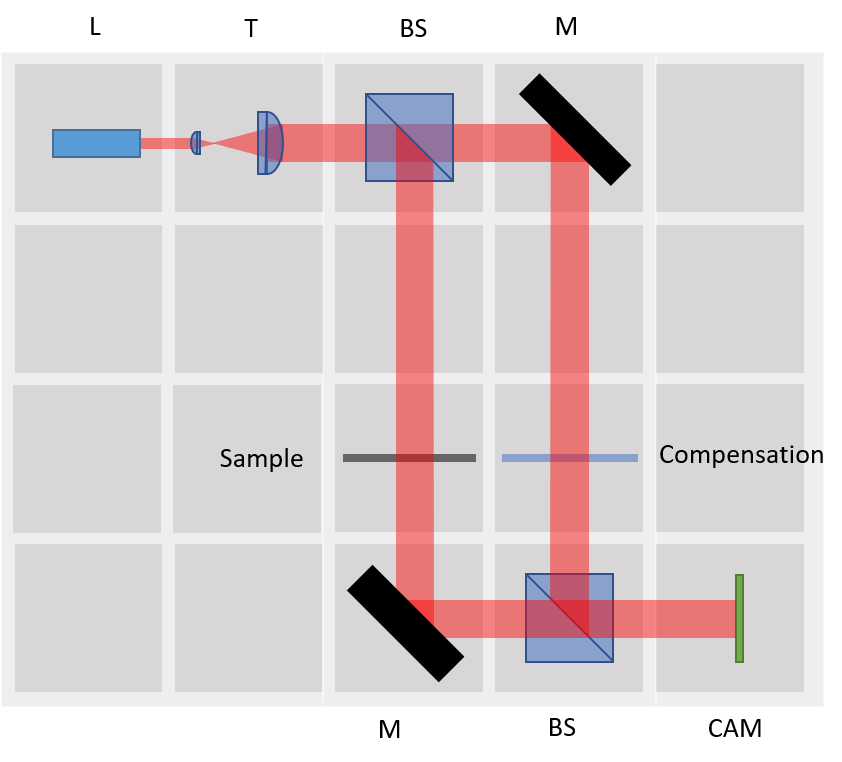

# Mach-Zehnder Interferometer

In the end the setup could look like this here:

## Components
The CAD parts can also be found [here](./STL).

In particular you need the following parts:

### 3D-printed components
* here will be a list of 3D-printed components

### Miscellaneous
* here will be a list of components
* Check out the [RESOURCES](../../TUTORIALS/RESOURCES) for more information!

## Assembly of the cube
Putting the parts together is as simple as that:

##  Results
None yet. Be the first to share yours! 

## Suggestions
If you have any problems or suggestions, please file an issue. Thank you!
