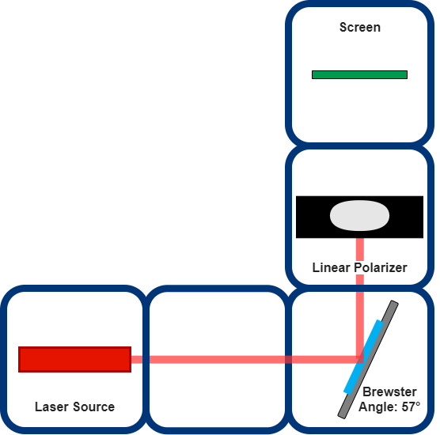
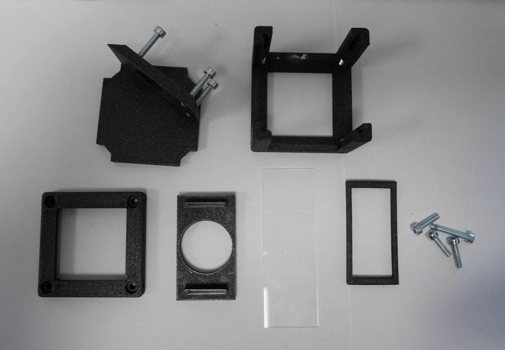
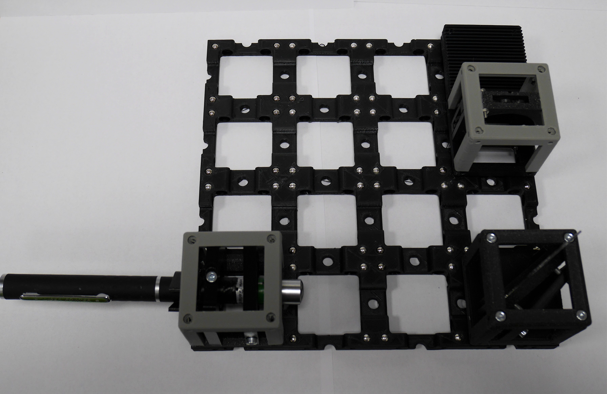
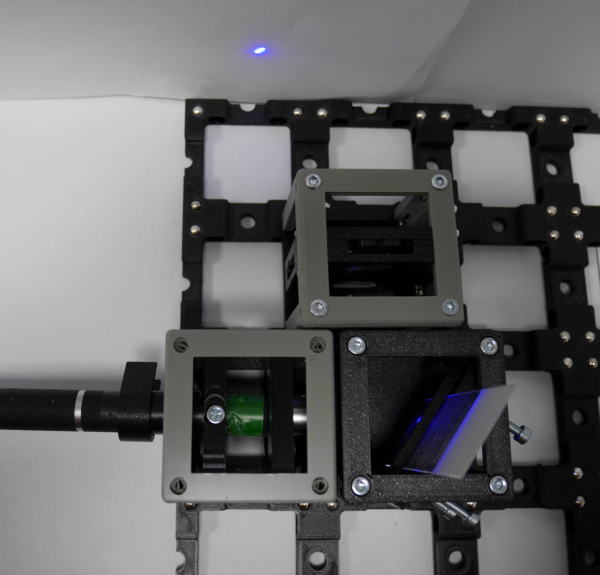
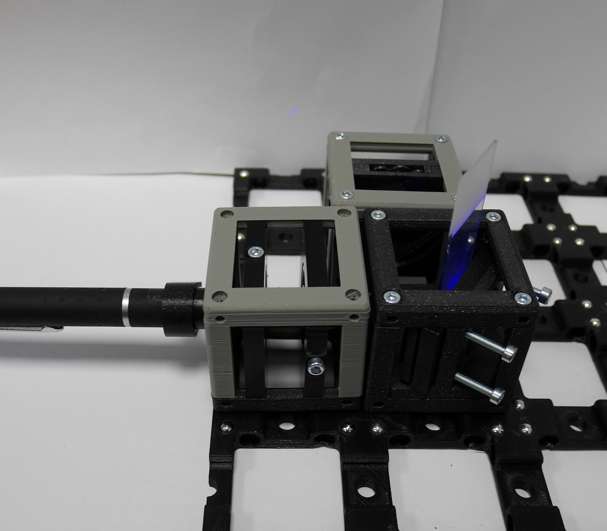

# Brewster Angle Experiment

There are several ways to produce polarized light. Optical processes reflection or refraction can be easily used to achieve that.  
When unpolarized light rays travel through a dielectric or insulating material, reflected and refracted light rays from the flat surface are mostly partially polarized.  
The amount of reflected light is specified by the optical properties of the reflecting surface such as plastic sheets, glass, or highways.         
The incident angle of the incoming electromagnetic light wave and refractive indices of media in which light travels through them have an important role in the polarization degree of the reflected and refracted polarized light beams.

You can see the representation of reflection and transmission of unpolarized light with most of the incident angle (𝜃) values below.

###### What is the Brewster angle?

When the incident ray travels from a less dense medium (n1) to a higher dense medium (n2) with a critical angle (𝜃_B), the reflected ray is perfectly s-polarized in which the orientation of the electric field vectors are perpendicular to the plane of incidence. Otherwise, the refracted beam has a 90-degree polarization angle, and it is partially p-polarized. This critical angle is called a Brewster angle or polarization angle and is represented by 𝜃_B in the scheme below.

Brewster angle can be easily calculated using refractive indices of travelling media of light. In our experiment, we used air (n1 = 1) as the first medium in which light comes first and reflects in this part and microscope slide glass (n2 = 1.5) as the second medium which light transmits through. When we calculate the Brewster angle for our experiment, it equals approximately 57 degrees and the equation can be found below.  

## Parts

### Modules for this setup

|  Name | Properties  |  Price | Link  | # |
|---|---|---|---|---|
|  4×4 Baseplate | - |  32.68 €  | [Base-plate](../../CAD/ASSEMBLY_Baseplate_v2)  | 1|
|  Module: Polarizer Cube | Linearly Polarizing Filter  |  €  | [Linear Polarizer](../../CAD/ASSEMBLY_POL_Polarizer_Holder)  | 1|
|  Module: Mirror Holder Cube | To insert the microscope slide in Brewster angle (53 degrees)  |  €  | [Microscope Slide Holder](../../CAD/ASSEMBLY_CUBE_Mirror_Kinematic_45_v2)  | 1|
|  Module: Laser Cube | LASER source holder  | 18.4 €  | [Light Source ](../../CAD/ASSEMBLY_CUBE_Laser_v2)  | 1|
|  Module: Sample Holder Comb | To hold the screen | 1.4 €  | [Screen](../../CAD/ASSEMBLY_CUBE_Sample_Holder_v2)  | 1|

### Parts to print

* 1 × [Base-plate 4×4](../../APPLICATIONS/APP_POL_Brewster_Angle_Experiment/STL/Assembly_base_4x4.stl)
* 3 × [Cube base 1×1](../../CAD/ASSEMBLY_CUBE_Base_v2/STL/10_Cube_1x1_v2.stl)
* 4 x [Cube lid 1×1](../../CAD/ASSEMBLY_CUBE_Base_v2/STL/10_Lid_1x1_v2.stl)
* 1 × [Polarizer Guide](../../CAD/ASSEMBLY_POL_Polarizer_Holder/STL/20_Cube_Insert_Polarizer_Guide.stl)
* 1 × [Polarizer Wheel](../../CAD/ASSEMBLY_POL_Polarizer_Holder/STL/20_Cube_Insert_Polarizer_Wheel.stl)
* 1 × [Polarizer Lid](../../CAD/ASSEMBLY_POL_Polarizer_Holder/STL/20_Cube_Insert_Polarizer_Lid.stl)
* 1 × [Laser Mount](../../CAD/ASSEMBLY_CUBE_Sample_Holder_v2/STL/20_Cube_Insert_Laser_Mount.stl)
* 1 x [Laser Clamp](../../CAD/ASSEMBLY_CUBE_Sample_Holder_v2/STL/00_Laser_Clamp_OnOffSwitch.stl)
* 1 x [Microscope Slide Holder Brewster Angle Base](../../APPLICATIONS/APP_POL_Brewster_Angle_Experiment/STL/20_POL_brewster _angle_Kinematic_Mirrormount_base.stl)
* 1 × [Microscope Slide Holder Brewster Angle Plate](../../APPLICATIONS/APP_POL_Brewster_Angle_Experiment/STL/20_POL_brewster _angle_Kinematic_Mirrormount_plate.stl)
* 1× [Microscope Slide Holder Brewster Angle Clamp ](../../APPLICATIONS/APP_POL_Brewster_Angle_Experiment/STL/20_POL_brewster _angle_Kinematic_Mirrormount_clamp.stl)
* 1x [Sample Holder - comb](../../CAD/ASSEMBLY_CUBE_Sample_Holder_v2/STL/20_Cube_Sampleholder.stl)

##  Additional components
* Check out the [RESOURCES](../../TUTORIALS/RESOURCES) for more information!
* 1 × Linear Polarizer Film [🢂](https://amazon.de/-/en/Polarizing-A4-Sheet-Polarizer-Educational-Polarized/dp/B06XWXRB75/ref=pd_sbs_421_3/262-2115536-7173904?_encoding=UTF8&pd_rd_i=B06XWXRB75&pd_rd_r=b88e7340-b061-4e0b-8daa-8ec533fd7c71&pd_rd_w=qlkAY&pd_rd_wg=At9EZ&pf_rd_p=a03ac387-6e4d-4f6b-96b6-1853da0bb37b&pf_rd_r=49HX2Z4Q5KRZSQ2FWRQR&psc=1&refRID=49HX2Z4Q5KRZSQ2FWRQR)
* 16 × 5 mm Ball magnets [🢂](https://www.magnetmax.de/Neodym-Kugelmagnete/Magnetkugel-Kugelmagnet-O-5-0-mm-Neodym-vernickelt-N40-haelt-400-g::158.html)
* 16 × (or 32 ×) Screws DIN912 ISO 4762 M3×12 mm [🢂](https://eshop.wuerth.de/Zylinderschraube-mit-Innensechskant-SHR-ZYL-ISO4762-88-IS25-A2K-M3X12/00843%20%2012.sku/de/DE/EUR/)
* 1 × LASER [🢂](https://www.laserlands.net/11040037.html)
* Sample
* White paper or cardboard as a screen

  

##  Assembly

* [Baseplate](../../CAD/ASSEMBLY_Baseplate_v2/)
* [Polarizer Cube](../../CAD/ASSEMBLY_POL_Polarizer_Holder)
* [Microscope Slide Holder Cube](../../CAD/ASSEMBLY_CUBE_Mirror_Kinematic_45_v2) : It has same assembling procedure with Mirror Holder Diagonal 45 degrees.
* [Sample Holder for Screen](../../CAD/ASSEMBLY_CUBE_Sample_Holder_v2/)
* [LASER Source cube](../../CAD/ASSEMBLY_CUBE_Laser_v2)

All necessary parts to assemble a Microscope Slide Glass Holder Module be gathered in the image below:

##  Results

Brewster's angle experiment setup can be prepared easily. After printing and assembling the module parts, we try to find a critical angle or Brewster's angle as much as we can.

In this setup, we use LASER as a light source because it is easier to observe the polarization degree changes by reflection. As a first step, LASER light beams reflect from microscope slide glass and pass through a linear polarizer. Then a piece of paper is inserted on the sample holder comb. Finally, we can observe the totally polarized reflected light.

We should make a good alignment to find the Brewster angle as the incidence angle of the incoming light. In practice, it is hard because of using screws, we could not find the exact incidence angle of a microscope slide. Nevertheless, I could take results that are almost perfectly polarized light after reflection in almost critical angle.   
You can see the reflected laser light beam without alignment at a random incident angle above.

In the image below, the incoming beam is reflected with almost Brewster angle, 57 degrees for microscope slide glass:

Let's look at our almost perfectly polarized light by reflection experiment video records. The orientation direction of the linear polarizer only changes in 1st and 2nd videos, and we see that reflected light is totally polarized almost.  The light is blocked, and we can see almost no light after the polarizer when the orientation of the linear polarizer is perpendicular to the polarization orientation of the reflected beam.

## New Ideas
We are open to new ideas. Please contribute to the project freely, this place is a free country which is built by codes and machines :robot:
