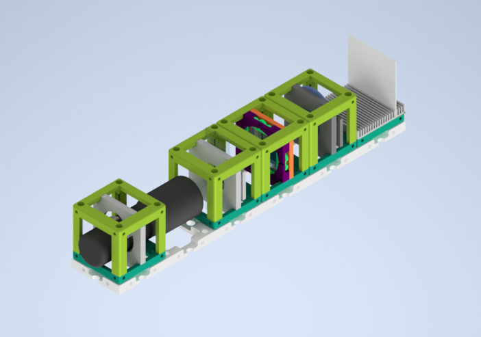

# Circular Polarizer   

In nature, a circular polarization state is uncommon but not impossible. Some organisms can produce circularly polarized light by reflection. Many kinds of beetles, shrimps and several other organisms reflect a strongly circularly polarized light or the larvae of few fireflies emit circularly polarized light.
If we look at an ordinary day of a human being, we use circularly polarized light to have fun with 3D cinema goggles!

The polarized glasses are used in cinemas in that it changes patterns between every frame of a movie. The left eye part of the glasses have a left-hand circular polarizer and the right eye side has a right-hand circular polarizer.  

3D cinema glasses can produce two different types of polarization together. One side has a linear polarizing filter and another side has a circular polarizing filter. When we watch a movie, our glasses turn the incoming light to circularly polarized light. But if turn the glasses and look at the movie, we use linearly polarized light to watch our 3D movie. Naturally, we can't watch the movie.

##### What is the difference between Linear and Circular Polarization?

The polarized light can be classified into three types depending on the orientation of the electric field: Linear polarized, circular polarized and elliptical polarized light.

If the electric field of light is limited to a single plane along the propagation direction, the light is *linearly polarized*.
If the electric field of light has two perpendicular linear components to each other with equal amplitudes and  π/2 phase differences, the light is *circularly polarized*.
Depending on the rotation direction, light can be left-hand circularly polarized or right-hand circularly polarized.
If the electric field of light describes an ellipse shape with the combination of two linear components with unequal amplitudes and/or phase difference (not π/2), the light is *elliptically polarized*. Circular and linear polarized light can be described as special cases of elliptically polarized light.

Clockwise (right-circularly polarized light)

counterclockwise (left-circularly polarized light)

## Parts

### Modules for this setup

|  Name | Properties  |  Price | Link  | # |
|---|---|---|---|---|
|  4×1 Baseplate | - | 8.22€  | [Base-plate](../../CAD/ASSEMBLY_Baseplate_v2)  | 1|
|  Module: Polarizer Cube | Linearly Polarizing Filter  |  €  | [Linear Polarizer](../../CAD/ASSEMBLY_CUBE_Linear_Polarizer)  | 1|
|  Module: Circular Polarizer Cube | To insert the circular polarizer filter film | €  | [Circular Polarizer](../../CAD/ASSEMBLY_CUBE_Sample_Holder_v2)  | 1|
|  Module: Sample Holder Cube | To insert the sample  | 2.5 €  | [Sample Holder](../../CAD/ASSEMBLY_CUBE_Sample_Holder_v2)  | 1|
|  Module: Sample Holder Comb | To hold the screen | 1.4 €  | [Screen](../../CAD/ASSEMBLY_CUBE_Sample_Holder_v2)  | 1|
|  Module: Flashlight Lamp Cube | Light source  | €  | [Flashlight ](../../CAD/Assembly_Cube_Eyepiece_v2)  | 1|

### Parts to print

* 1 × [Base-plate 4×1](../../CAD/ASSEMBLY_Baseplate_v2/STL/Assembly_base_4x1.stl)
* 4 × [Cube base 1×1](../../CAD/ASSEMBLY_CUBE_Base_v2/STL/10_Cube_1x1_v2.stl)
* 5 x [Cube lid 1×1](../../CAD/ASSEMBLY_CUBE_Base_v2/STL/10_Lid_1x1_v2.stl)
* 1 × [Polarizer Guide](../../CAD/ASSEMBLY_CUBE_Linear_Polarizer/STL/20_Cube_Insert_Polarizer_Guide.stl)
* 1 × [Polarizer Wheel](../../CAD/ASSEMBLY_CUBE_Linear_Polarizer/STL/20_Cube_Insert_Polarizer_Wheel.stl)
* 1 × [Polarizer Lid](../../CAD/ASSEMBLY_CUBE_Linear_Polarizer/STL/20_Cube_Insert_Polarizer_Lid.stl)
* 1 × [Circular Polarizing Filter Holder](../../APPLICATIONS/APP_POL_Circular_Polarizer/STL/20_Cube_POL_Circular_Polarizer_holder.stl)
* 1 x [Circular Polarizing Filter Holder Clamp](../../APPLICATIONS/APP_POL_Circular_Polarizer/STL/20_Cube_POL_Circular_Polarizer_holder_clamp.stl)
* 1 × [Sample Holder](../../CAD/ASSEMBLY_CUBE_Sample_Holder_v2/STL/20_Cube_insert_Sample_holder.stl)
* 1 x [Sample Holder Clamp](../../CAD/ASSEMBLY_CUBE_Sample_Holder_v2/STL/20_Cube_Insert_Sample_clamp.stl)
* 1 × [Flashlight Holder](../../CAD/ASSEMBLY_CUBE_Eyepiece_v2/STL/20_Cube_Insert_Holder-okular_v2.stl) - the diameter works for the flashlight linked in the eyepiece insert
* 1 x [Sample Holder - comb](../../CAD/ASSEMBLY_CUBE_Sample_Holder_v2/STL/20_Cube_Sampleholder.stl)

##  Additional components
* Check out the [RESOURCES](../../TUTORIALS/RESOURCES) for more information!
* 1× Linear Polarizer Film [🢂](https://amazon.de/-/en/Polarizing-A4-Sheet-Polarizer-Educational-Polarized/dp/B06XWXRB75/ref=pd_sbs_421_3/262-2115536-7173904?_encoding=UTF8&pd_rd_i=B06XWXRB75&pd_rd_r=b88e7340-b061-4e0b-8daa-8ec533fd7c71&pd_rd_w=qlkAY&pd_rd_wg=At9EZ&pf_rd_p=a03ac387-6e4d-4f6b-96b6-1853da0bb37b&pf_rd_r=49HX2Z4Q5KRZSQ2FWRQR&psc=1&refRID=49HX2Z4Q5KRZSQ2FWRQR)
* 1 x 3D cinema googles [🢂](https://www.amazon.de/ZYCX123-Passive-Circular-Polarized-Projector/dp/B07JHRYPF5/ref=sr_1_26?__mk_de_DE=%C3%85M%C3%85%C5%BD%C3%95%C3%91&dchild=1&keywords=polarize+3d+cinema+glasses&qid=1599483648&sr=8-26)    
* 32 × 5mm Ball magnets [🢂](https://www.magnetmax.de/Neodym-Kugelmagnete/Magnetkugel-Kugelmagnet-O-5-0-mm-Neodym-vernickelt-N40-haelt-400-g::158.html)
* 16 × (or 24× for both surfaces) Screws DIN912 ISO 4762 M3×12 mm [🢂](https://eshop.wuerth.de/Zylinderschraube-mit-Innensechskant-SHR-ZYL-ISO4762-88-IS25-A2K-M3X12/00843%20%2012.sku/de/DE/EUR/)
* 1 × flashlight [🢂](https://www.pollin.de/p/led-taschenlampe-alu-5-w-cree-led-3xmicro-schwarz-b-ware-535448)
* Sample
* White paper or cardboard as a screen

##  Assembly

* [Baseplate](../../CAD/ASSEMBLY_Baseplate_v2/)
* [Linear Polarizer Cube](../../CAD/ASSEMBLY_CUBE_Linear_Polarizer)
* [Circular Polarizer Cube](../../CAD/ASSEMBLY_POL_Circular_Polarizer)
* [Sample Holder Cube](../../CAD/ASSEMBLY_CUBE_Sample_Holder_v2/)
* [Sample Holder Cube Comb for Screen](../../CAD/ASSEMBLY_CUBE_Sample_Holder_v2/)
* [Flashlight cube](../../CAD/Assembly_Cube_Eyepiece_v2) : Simply insert the holder in a cube and close it as any other

##  Results

The circular polarizer experiment without a specific sample and extra light source below is demonstrated.
The incoming light passes through a linear polarizer (grey UC2 cube). In the next step, new demonstrated linearly polarized light travels to the circular polarizer module (black UC2 cube). When an observer looks from the circular polarizer side, she/he can see the circularly polarized light.

The circular polarizer filter was taken out of 3D cinema glasses, and it was inserted into a sample holder insert. This new circular polarizer filter insert was assembled with a UC2 unit block. Ta-da! The circular polarizer cube is ready for flight.

The effect of the propagation direction of the linear polarizer can be seen in the video below. The polarization direction of light before the circular polarizer changes with turning the wheel of the linear polarizer and changing its orientation.

## New Ideas

Dear Visitor,  
you have an opportunity to view our experiments. If you have a new idea, just open a new issue and shine our eyes with your light.  
Greetings from UC2 Team
