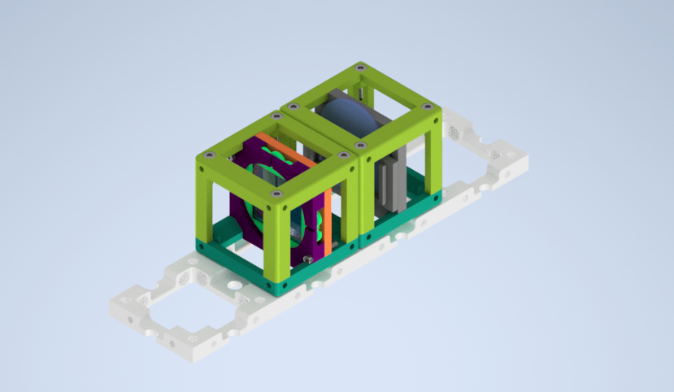

# Circular Polarizer   

In nature, a circular polarization state is uncommon but not impossible. Some organisms can produce circularly polarized light by reflection. Many beetles, shrimps, and other species reflect strongly circularly polarized light, while a few fireflies emit circularly polarized light. If we look at an ordinary day of a human being, we use circularly polarized light to have fun with 3D cinema goggles!

The polarized glasses are used in cinemas in that it changes patterns between every frame of a movie. The left eye part of the glasses has a left-hand circular polarizer, and the right eye side has a right-hand circular polarizer.   

3D cinema glasses can produce two different types of polarization together. One side has a linear polarizing filter, and another has a circular polarizing filter. Our glasses turn the incoming light to circularly polarized light when we watch a movie. But if we turn the glasses and look at the film, we use linearly polarized light to watch our 3D movie. Naturally, we can't watch the movie.

##### What is the difference between Linear and Circular Polarization?

The polarized light can be classified into three types depending on the orientation of the electric field: Linear polarized, circularly polarized, and elliptically polarized light.

If the electric field of light is limited to a single plane along the propagation direction, the light is *linearly polarized*.
If the electric field of light has two perpendicular linear components with equal amplitudes and  π/2 phase differences, the light is *circularly polarized*. Light can be left-hand circularly polarized or right-hand circularly polarized depending on the rotation direction.
If the electric field of light describes an ellipse shape with the combination of two linear components with unequal amplitudes or phase differences (not π/2), the light is *elliptically polarized*. Circular and linear polarized light can be described as exceptional cases of elliptically polarized light.

Clockwise or right-hand circularly polarized light experimental diagram:

Counterclockwise or left-hand circularly polarized light experiment sketch:

## Parts

### Modules for this setup

|  Name | Properties  |  Price | Link  | # |
|---|---|---|---|---|
|  4 × 1 Baseplate | Skeleton of the System | 5.47 €  | [Base-plate](../../CAD/ASSEMBLY_Baseplate)  | 1 |
|  MODULE:  *Polarizer Cube* | It holds the linearly polarizing filter  |  4.31 €  | [Linear Polarizer](../../CAD/ASSEMBLY_POL_Linear_Polarizer)  | 1 |
|  MODULE: Circular Polarizer Cube | It inserts the circular polarizer filter film into the setup | 2.96 €  | [Circular Polarizer](../../CAD/ASSEMBLY_POL_Circular_Polarizer)  | 1 |
| EXTRA MODULE: Sample Holder Cube | It holds the Sample (Not Used in Practice) | 1.3 €  | [Sample Holder](../../CAD/ASSEMBLY_CUBE_Sample_Holder)  | 1 |
|  EXTRA MODULE: Screen Holder Cube | It holds the Display Screen (Not Used in Practice) | 1 €  | [Screen](../../CAD/ASSEMBLY_CUBE_Sample_Holder)  | 1 |
|  EXTRA MODULE: Flashlight Lamp Cube | Light Source  | 7.2 €  | [Flashlight](../../CAD/ASSEMBLY_CUBE_Flashlight)  | 1 |

### Parts to print

* 1 × [Base-plate 4×1](./STL/Assembly_Cube_Baseplate_4x1_v2.stl)
* 2 × [Cube base 1×1](./STL/10_Cube_1x1_v2.stl)
* 2 x [Cube lid 1×1](./STL/10_Lid_1x1_v2.stl)
* 1 × [Polarizer Guide](./STL/20_POL_Cube_Insert_Linear_Polarizer_Guide.stl)
* 1 × [Polarizer Wheel](./STL/20_POL_Cube_Insert_Linear_Polarizer_Wheel.stl)
* 1 × [Polarizer Lid](./STL/20_POL_Cube_Insert_Linear_Polarizer_Lid.stl)
* 1 × [Circular Polarizing Filter Holder](./STL/20_POL_Cube_Circular_Polarizer_holder.stl)
* 1 x [Circular Polarizing Filter Holder Clamp](./STL/20_POL_Cube_Circular_Polarizer_clamp.stl)   
__*Extra Holder Parts but NOT USED in our experiment:*__
* 1 × [Sample Holder](./STL/20_Cube_insert_Sample_holder.stl)
* 1 x [Sample Holder Clamp](./STL/20_Cube_Insert_Sample_clamp.stl)
* 1 x [Sample Holder - comb](./STL/20_Cube_Sampleholder.stl)
* 1 × [Flashlight Holder](./STL/20_Cube_Insert_Holder-okular+flashlight_v2.stl)

##  Additional components
* Check out the [RESOURCES](../../TUTORIALS/RESOURCES) for more information!
* 1 × Linear Polarizing Sheet [🢂](https://amazon.de/-/en/Polarizing-A4-Sheet-Polarizer-Educational-Polarized/dp/B06XWXRB75/ref=pd_sbs_421_3/262-2115536-7173904?_encoding=UTF8&pd_rd_i=B06XWXRB75&pd_rd_r=b88e7340-b061-4e0b-8daa-8ec533fd7c71&pd_rd_w=qlkAY&pd_rd_wg=At9EZ&pf_rd_p=a03ac387-6e4d-4f6b-96b6-1853da0bb37b&pf_rd_r=49HX2Z4Q5KRZSQ2FWRQR&psc=1&refRID=49HX2Z4Q5KRZSQ2FWRQR)
* 16 × 5 mm Ball magnets [🢂](https://www.magnetmax.de/Neodym-Kugelmagnete/Magnetkugel-Kugelmagnet-O-5-0-mm-Neodym-vernickelt-N40-haelt-400-g::158.html)
* 16 x Screws DIN912 ISO 4762 - M3×12 mm [🢂](https://eshop.wuerth.de/Zylinderschraube-mit-Innensechskant-SHR-ZYL-ISO4762-88-IS25-A2K-M3X12/00843%20%2012.sku/de/DE/EUR/)
* 3 x Screws DIN912 ISO 4762 M2×16 mm [🢂](https://www.amazon.de/Edelstahl-Sechskopf-Knopf-Schrauben-Unterlegscheiben-Sortiment-Aufbewahrung/dp/B073SS7D8J/ref=sr_1_fkmr0_1?__mk_de_DE=%C3%85M%C3%85%C5%BD%C3%95%C3%91&keywords=zylinderkopfschrauben+set+galvanisiert&qid=1565007371&s=diy&sr=1-1-fkmr0)
* 1 x 3D cinema googles [🢂](https://www.amazon.de/-/en/Circular-Polarized-Passive-Glasses-Special/dp/B08SHWPVCM/ref=sr_1_3?keywords=polarisierte+3d+kino+brille&qid=1668693530&sr=8-3)  
* _NOT USED_ 1 × flashlight [🢂](https://www.pollin.de/p/led-taschenlampe-alu-5-w-cree-led-3xmicro-schwarz-b-ware-535448)

##  Assembly

* [Baseplate](../../CAD/ASSEMBLY_Baseplate)
* [Linear Polarizer Cube](../../CAD/ASSEMBLY_POL_Linear_Polarizer)  
* [Circular Polarizer Cube](../../CAD/ASSEMBLY_POL_Circular_Polarizer)                            
* __*EXTRA MODULE:*__  [Sample Holder Cube](../../CAD/ASSEMBLY_CUBE_Sample_Holder)
* __*EXTRA MODULE:*__  [Sample Holder for Screen](../../CAD/ASSEMBLY_CUBE_Sample_Holder)
* __*EXTRA MODULE:*__  [Flashlight cube](../../CAD/ASSEMBLY_CUBE_Flashlight)

If all written modules are used in the experiment, the setup will look like:

##  Results

The circular polarizer experiment without a specific sample and extra light source below is demonstrated.
The incoming light passes through a linear polarizer (grey UC2 cube). In the next step, new demonstrated linearly polarized light travels to the circular polarizer module (black UC2 cube). When an observer looks from the circular polarizer side, she/he can see the circularly polarized light.

[The quarter wave plate](http://hyperphysics.phy-astr.gsu.edu/hbase/phyopt/quarwv.html) was used for the demonstration of the circular polarizing light.  It was taken out of 3D cinema glasses, and it was inserted into a sample holder insert. This new circular polarizer filter insert was assembled with a UC2 unit block. Ta-da! The circular polarizer cube is ready for flight.

The effect of the propagation direction of the linear polarizer can be seen in the video below. The polarization direction of light before the circular polarizer changes with turning the wheel of the linear polarizer and changing its orientation.

## New Ideas

Dear Visitor,  
you have an opportunity to view our experiments. If you have a new idea, just open a new issue and shine our eyes with your light.  
Greetings from UC2 Team
