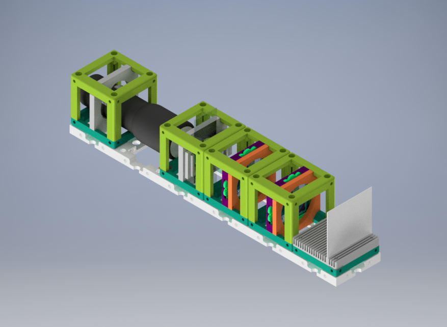
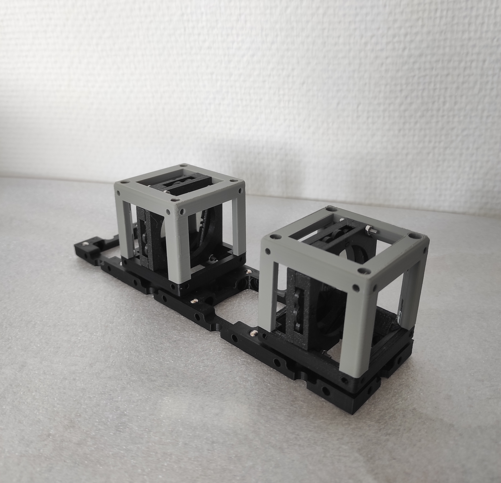

# Crossed Polarizers

*Crossed Polarizers* are used to analyze the polarization of light. We use two linear polarizers and they are located perpendicular to each other.   

The polarizing direction of the first polarizer is oriented vertically to the incoming beam and it will allow passing only vertical electric field vectors. After the first polarizer, we have an s-polarized light wave.

The second polarizer is located horizontally with respect to the electric field vector. These two polarizers should be oriented at right angles with each other. It blocks the wave which passes through the first polarizer.

Time to build a Crossed Polarizers setup!

## Parts

### Modules for this setup

|  Name | Properties  |  Price | Link  | # |
|---|---|---|---|---|
|  4×1 Baseplate | - | 16,44€  | [Base-plate](../../CAD/ASSEMBLY_Baseplate_v2)  | 2|
|  Module: Polarizer Cube | Linearly Polarizing Filter  |  €  | [Linear Polarizer](../../CAD/ASSEMBLY_CUBE_Linear_Polarizer)  | 2|
|  Module: Sample Holder Cube | To insert the sample  | 2,5 €  | [Sample Holder](../../CAD/ASSEMBLY_CUBE_Sample_Holder_v2)  | 1|
|  Module: Sample Holder Comb | To hold the screen | 1,4 €  | [Screen](../../CAD/ASSEMBLY_CUBE_Sample_Holder_v2)  | 1|
|  Module: Flashlight Lamp Cube | -  | €  | [Flashlight ](../../CAD/Assembly_Cube_Eyepiece_v2)  | 1|

### Parts to print

* 2× [Base-plate 4×1](../../CAD/ASSEMBLY_Baseplate_v2/STL/Assembly_base_4x1.stl)
* 5× [Cube base 1×1](../../CAD/ASSEMBLY_CUBE_Base_v2/STL/10_Cube_1x1_v2.stl)
* 5x [Cube lid 1×1](../../CAD/ASSEMBLY_CUBE_Base_v2/STL/10_Lid_1x1_v2.stl)
* 2× [Polarizer Guide](../../CAD/ASSEMBLY_CUBE_Linear_Polarizer/STL/20_Cube_Insert_Polarizer_Guide.stl)
* 2× [Polarizer Wheel](../../CAD/ASSEMBLY_CUBE_Linear_Polarizer/STL/20_Cube_Insert_Polarizer_Wheel.stl)
* 2× [Polarizer Lid](../../CAD/ASSEMBLY_CUBE_Linear_Polarizer/STL/20_Cube_Insert_Polarizer_Lid.stl)
* 1× [Sample Holder](../../CAD/ASSEMBLY_CUBE_Sample_Holder_v2/STL/20_Cube_insert_Sample_holder.stl)
* 1x [Sample Holder Clamp](../../CAD/ASSEMBLY_CUBE_Sample_Holder_v2/STL/20_Cube_Insert_Sample_clamp.stl)
* 1× [Flashlight Holder](../../CAD/ASSEMBLY_CUBE_Eyepiece_v2/STL/20_Cube_Insert_Holder-okular_v2.stl) - the diameter works for the flashlight linked in the eyepiece insert
* 1x [Sample Holder - comb](../../CAD/ASSEMBLY_CUBE_Sample_Holder_v2/STL/20_Cube_Sampleholder.stl)

##  Additional components
* Check out the [RESOURCES](../../TUTORIALS/RESOURCES) for more information!
* 1× Linear Polarizer Film [🢂](https://amazon.de/-/en/Polarizing-A4-Sheet-Polarizer-Educational-Polarized/dp/B06XWXRB75/ref=pd_sbs_421_3/262-2115536-7173904?_encoding=UTF8&pd_rd_i=B06XWXRB75&pd_rd_r=b88e7340-b061-4e0b-8daa-8ec533fd7c71&pd_rd_w=qlkAY&pd_rd_wg=At9EZ&pf_rd_p=a03ac387-6e4d-4f6b-96b6-1853da0bb37b&pf_rd_r=49HX2Z4Q5KRZSQ2FWRQR&psc=1&refRID=49HX2Z4Q5KRZSQ2FWRQR)
* 16× 5mm Ball magnets [🢂](https://www.magnetmax.de/Neodym-Kugelmagnete/Magnetkugel-Kugelmagnet-O-5-0-mm-Neodym-vernickelt-N40-haelt-400-g::158.html)
* × - 24× Screws DIN912 ISO 4762 M3×12 mm [🢂](https://eshop.wuerth.de/Zylinderschraube-mit-Innensechskant-SHR-ZYL-ISO4762-88-IS25-A2K-M3X12/00843%20%2012.sku/de/DE/EUR/)
* 1× flashlight [🢂](https://www.pollin.de/p/led-taschenlampe-alu-5-w-cree-led-3xmicro-schwarz-b-ware-535448)
* Sample
* White paper or cardboard as a screen

  

##  Assembly

* [Baseplate](../../CAD/ASSEMBLY_Baseplate_v2/)
* [Polarizer Cube](../../CAD/ASSEMBLY_CUBE_Linear_Polarizer)
* [Sample Holder Cube](../../CAD/ASSEMBLY_CUBE_Sample_Holder_v2/)
* [Sample Holder Cube Comb for Screen](../../CAD/ASSEMBLY_CUBE_Sample_Holder_v2/)
* [Flashlight cube](../../CAD/Assembly_Cube_Eyepiece_v2) : Simply insert the holder in a cube and close it as any other

##  Results

We printed and assembled the module parts and bought necessary components and inserted them into cubes.  
You will find basic version of Crossed Polarization experiment without specific sample and extra light source below.

We can observe the direct effect of the angle between two linear polarizers in the video below. The intensity of passing light through two polarizers on the eye of observer changes when the wheel insert of polarization filter takes one 360 degrees turn.

## New Ideas
We are open to new ideas. Please contribute the project freely, this place is a free country which is built by codes and machines :robot:
