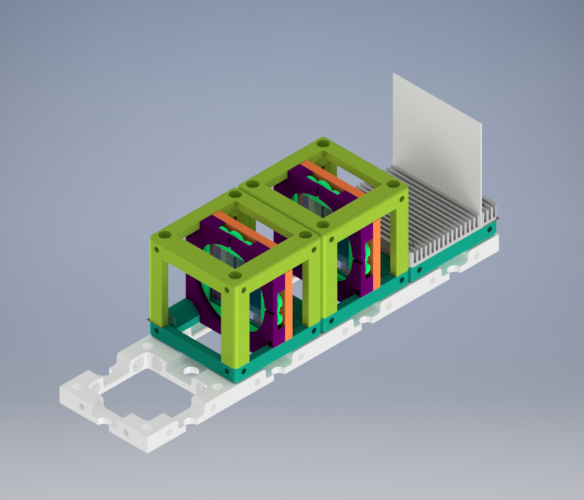
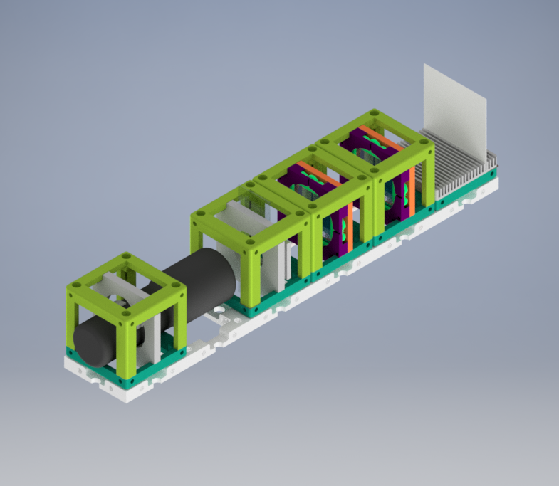

# Crossed Polarizers

*Crossed Polarizers* are used to analyze the polarization of light. We use two linear polarizers which are located perpendicular to each other. [1]

In the experiment, the polarizing direction of the first polarizer is oriented vertically to the incoming beam, and it will allow passing only vertical electric field vectors. After the first polarizer, we have an s-polarized light wave. [2]

The second polarizer is located horizontally with respect to the electric field vector. It blocks the wave which passes through the first polarizer. These two polarizers should be oriented at the right angle with respect to each other.

Time to build a Crossed Polarizers setup!

## Parts

### Modules for this setup

|  Name | Properties  |  Price | Link  | # |
|---|---|---|---|---|
|  4×1 Baseplate | Skeleton of the System | 8.22 €  | [Base-plate](../../CAD/ASSEMBLY_Baseplate)  | 1|
|  Module: Polarizer Cube | Linearly Polarizing Filter  |  €  | [Linear Polarizer](../../CAD/ASSEMBLY_POL_Polarizer_Holder)  | 2|
|  Module: Sample Holder Cube | Holding the Sample (Not Used in Practice) | 2.5 €  | [Sample Holder](../../CAD/ASSEMBLY_CUBE_Sample_Holder)  | 1|
|  Module: Display Screen | Holding the Screen (Not Used in Practice) | 1.4 €  | [Screen](../../CAD/ASSEMBLY_CUBE_Sample_Comb)  | 1|
|  Module: Flashlight Lamp Cube | Light Source  | €  | [Flashlight](../../CAD/ASSEMBLY_CUBE_Flashlight)  | 1|

### Parts to print

* 1× [Base-plate 4×1](./STL/Assembly_base_4x1.stl)
* 2× [Cube base 1×1](.STL/10_Cube_1x1_v2.stl)
* 2x [Cube lid 1×1](./STL/10_Lid_1x1_v2.stl)
* 2× [Polarizer Guide](./STL/20_Cube_Insert_Polarizer_Guide.stl)
* 2× [Polarizer Wheel](./STL/20_Cube_Insert_Polarizer_Wheel.stl)
* 2× [Polarizer Lid](./STL/20_Cube_Insert_Polarizer_Lid.stl)
* _NOT USED_ 1× [Sample Holder](./STL/20_Cube_insert_Sample_holder.stl)
* _NOT USED_ 1x [Sample Holder Clamp](./STL/20_Cube_Insert_Sample_clamp.stl)
* _NOT USED_ 1x [Sample Holder - comb](./STL/20_Cube_Sampleholder.stl)
*_NOT USED_ 1× [Flashlight Holder](./STL/20_Cube_Insert_Holder-okular_v2.stl)

##  Additional components
* Check out the [RESOURCES](../../TUTORIALS/RESOURCES) for more information!
* 1× Linear Polarizing Sheet [🢂](https://amazon.de/-/en/Polarizing-A4-Sheet-Polarizer-Educational-Polarized/dp/B06XWXRB75/ref=pd_sbs_421_3/262-2115536-7173904?_encoding=UTF8&pd_rd_i=B06XWXRB75&pd_rd_r=b88e7340-b061-4e0b-8daa-8ec533fd7c71&pd_rd_w=qlkAY&pd_rd_wg=At9EZ&pf_rd_p=a03ac387-6e4d-4f6b-96b6-1853da0bb37b&pf_rd_r=49HX2Z4Q5KRZSQ2FWRQR&psc=1&refRID=49HX2Z4Q5KRZSQ2FWRQR)
* 16× 5mm Ball magnets [🢂](https://www.magnetmax.de/Neodym-Kugelmagnete/Magnetkugel-Kugelmagnet-O-5-0-mm-Neodym-vernickelt-N40-haelt-400-g::158.html)
* 8× (or 16× for both top and surface) Screws DIN912 ISO 4762 - M3×12 mm [🢂](https://eshop.wuerth.de/Zylinderschraube-mit-Innensechskant-SHR-ZYL-ISO4762-88-IS25-A2K-M3X12/00843%20%2012.sku/de/DE/EUR/)
* _NOT USED_ 1× flashlight [🢂](https://www.pollin.de/p/led-taschenlampe-alu-5-w-cree-led-3xmicro-schwarz-b-ware-535448)
* _NOT USED_ Sample
* _NOT USED_ White paper or cardboard as a screen

  

##  Assembly

* [Baseplate](../../CAD/ASSEMBLY_Baseplate)
* [Polarizer Cube](../../CAD/ASSEMBLY_POL_Polarizer_Holder)
*  _NOT USED_ [Sample Holder Cube](../../CAD/ASSEMBLY_CUBE_Sample_Holder)
*  _NOT USED_ [Sample Holder for Screen](../../CAD/ASSEMBLY_CUBE_Sample_Comb)
*  _NOT USED_ [Flashlight cube](../../CAD/ASSEMBLY_CUBE_Flashlight) : Simply insert the holder in a cube and close it as any other

If all written modules are used in the experiment, the setup will look like:

  

##  Results

We printed and assembled the module parts. Then, we bought the necessary components and inserted them into cubes.  
You will find the basic version of Crossed Polarization experiment without a specific sample and extra light source below.

We can observe the direct effect of the angle between two linear polarizers in the video below. The intensity of passing light through two polarizers on the eye of the observer changes when the wheel insert of the polarization filter takes a 360 degrees turn.

## New Ideas
We are open to new ideas. Please contribute to the project freely, this place is a free country which is built by codes and machines :robot:

## References
[1] Introduction to Polarized Light. (n.d.). Nikon’s MicroscopyU. Retrieved February 15, 2021, from https://www.microscopyu.com/techniques/polarized-light/introduction-to-polarized-light

[2] Logiurato, F. (2018). Teaching Light Polarization by Putting Art and Physics Together. The Physics Teachers, 1–5. https://arxiv.org/ftp/arxiv/papers/1803/1803.09645.pdf
