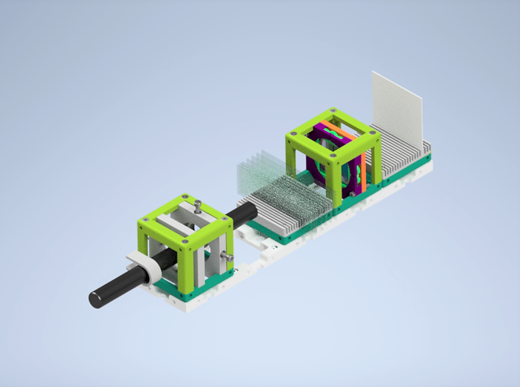
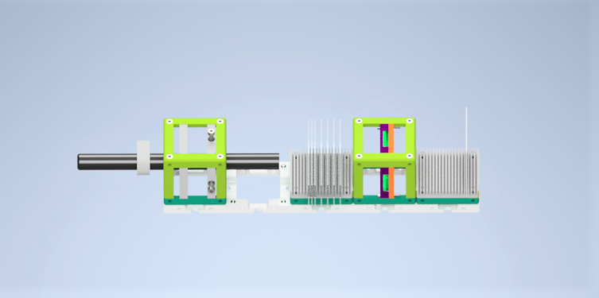
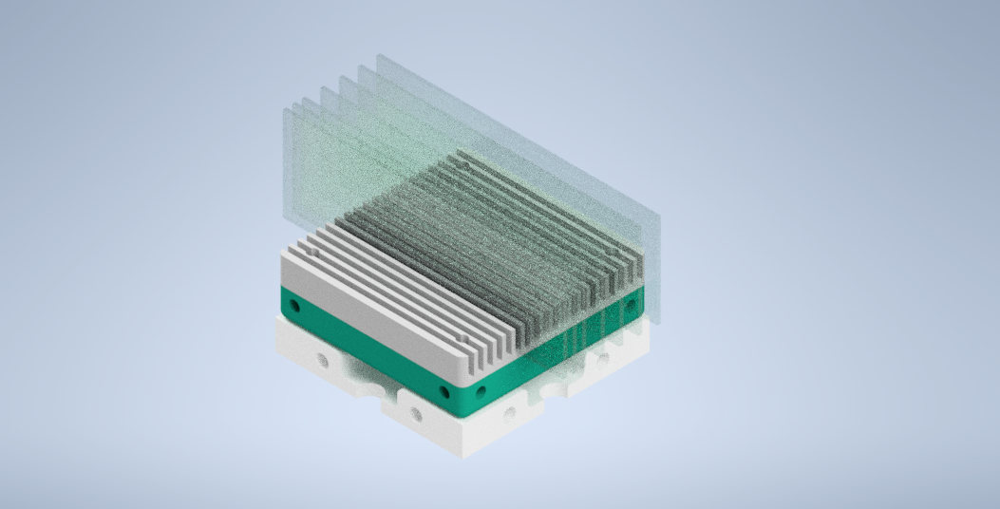

# Many Microscope Slides Experiment

There are different ways of producing polarized light from unpolarized light.  In an example process: light travels from medium 1 to medium 2. Some part of the incident light reflects from the surface of medium 2. This reflected light can be partially polarized light or totally polarized light in the Brewster angle. Another part of the initial light is refracted to medium 2 as a partially polarized light. You can have more detailed information about the polarization of the light by reflection  [in the Brewster Angle Experiment](../../APPLICATIONS/APP_POL_Brewster_Angle_Experiment).

However, transmission light eventually polarizes based on the polarization by reflection, when the light is transmitted many times through several microscope slides.

In the experiment, a medium is constructed with 7 adjacent microscope slides by the experimenter. Then, unpolarized light rays travel through microscope slides. After this glass medium, many times transmitted rays will be polarized. If we transmit light through only one microscope slide, refracted light will be partially polarized. But if we repeat this process many times such as 7 or more times, in one point transmitted light will be perfectly polarized.

*Polarization by Refraction:* Unpolarized or partially polarized incoming light travels, reflects as partially s polarized and transmits as partially p polarized between medium 1and medium 2.

## Parts

### Modules for this setup

|  Name | Properties  |  Price | Link  | # |
|---|---|---|---|---|
|  4×1 Baseplate | Skeleton of the System | 5.47 €  | [Base-plate](../../CAD/ASSEMBLY_Baseplate)  | 1 |
|  MODULE:  *Polarizer Cube* | It holds the linearly polarizing filter  |  4.31 €  | [Linear Polarizer](../../CAD/ASSEMBLY_POL_Linear_Polarizer)  | 1 |
|  MODULE: *Many Microscope Slides Holder* | It hold 7 or more microscope slides back to back  | 2.11 €  | [Slides Holder](../../CAD/ASSEMBLY_CUBE_Sample_Comb)  | 1 |
|  MODULE: *Laser Cube* | LASER source holder  | 17.68 €  | [Light Source ](../../CAD/ASSEMBLY_CUBE_Laser)  | 1 |
|  EXTRA MODULE: Screen Holder Cube | It holds the Display Screen (Not Used in Practice) | 1 €  | [Screen](../../CAD/ASSEMBLY_CUBE_Sample_Comb)  | 1 |

### Parts to print

* 1 × [Base-plate 4×4](./STL/Assembly_base_4x4.stl)
* 2 × [Cube base 1×1](.STL/10_Cube_1x1_v2.stl)
* 3 x [Cube lid 1×1](./STL/10_Lid_1x1_v2.stl)
* 1 × [Polarizer Guide](./STL/20_POL_Cube_Insert_Linear_Polarizer_Guide.stl)
* 1 × [Polarizer Wheel](./STL/20_POL_Cube_Insert_Linear_Polarizer_Wheel.stl)
* 1 × [Polarizer Lid](./STL/20_POL_Cube_Insert_Linear_Polarizer_Lid.stl)
* 1 x [Many Microscope Slides Holder](./STL/20_Cube_Sampleholder.stl)
* 2 × [Laser Mount](./STL/20_Cube_Insert_Laser_Mount.stl)
* 1 x [Laser Clamp](./STL/00_Laser_Clamp_OnOffSwitch.stl)   

  

##  Additional components
* Check out the [RESOURCES](../../TUTORIALS/RESOURCES) for more information!
* 1 × Linear Polarizing Sheet [🢂](https://amazon.de/-/en/Polarizing-A4-Sheet-Polarizer-Educational-Polarized/dp/B06XWXRB75/ref=pd_sbs_421_3/262-2115536-7173904?_encoding=UTF8&pd_rd_i=B06XWXRB75&pd_rd_r=b88e7340-b061-4e0b-8daa-8ec533fd7c71&pd_rd_w=qlkAY&pd_rd_wg=At9EZ&pf_rd_p=a03ac387-6e4d-4f6b-96b6-1853da0bb37b&pf_rd_r=49HX2Z4Q5KRZSQ2FWRQR&psc=1&refRID=49HX2Z4Q5KRZSQ2FWRQR)
* 16 × 5 mm Ball magnets [🢂](https://www.magnetmax.de/Neodym-Kugelmagnete/Magnetkugel-Kugelmagnet-O-5-0-mm-Neodym-vernickelt-N40-haelt-400-g::158.html)
* 24 x Screws DIN912 ISO 4762 - M3×12 mm [🢂](https://eshop.wuerth.de/Zylinderschraube-mit-Innensechskant-SHR-ZYL-ISO4762-88-IS25-A2K-M3X12/00843%20%2012.sku/de/DE/EUR/)
* 3 x Screws DIN912 ISO 4762 M2×16 mm [🢂](https://www.amazon.de/Edelstahl-Sechskopf-Knopf-Schrauben-Unterlegscheiben-Sortiment-Aufbewahrung/dp/B073SS7D8J/ref=sr_1_fkmr0_1?__mk_de_DE=%C3%85M%C3%85%C5%BD%C3%95%C3%91&keywords=zylinderkopfschrauben+set+galvanisiert&qid=1565007371&s=diy&sr=1-1-fkmr0)
* 9 x Microscope Rectangular Coverslips [🢂](https://www.ebay.de/itm/223260964391?hash=item33fb63f627:g:pukAAOSwsGpb%7E14N)
* 1 × 5 mW Blue UV Laser Pointer [🢂](https://www.laserlands.net/5mw-450nm-blue-laser-pointer-pen.html)

  

##  Assembly

* [Baseplate](../../CAD/ASSEMBLY_Baseplate)
* [Linear Polarizer Cube](../../CAD/ASSEMBLY_POL_Linear_Polarizer)  
* [Microscope Slides Holders](../../CAD/ASSEMBLY_CUBE_Sample_Comb)   
* [LASER Holder Cube](../../CAD/ASSEMBLY_CUBE_Laser)    
__*EXTRA MODULES:*__
* [Sample Holder for Screen](../../CAD/ASSEMBLY_CUBE_Sample_Comb)

  

##  Results

We printed and assembled the module parts. After that, we bought the necessary components and inserted them into cubes.  
You will find the basic version of ........... experiment without a specific sample and extra light source below.

We can observe the

## New Ideas

Rat-Tat! We are here to hear new ideas. Please don't shy and have a heart-to-heart talk with us.  :gift_heart:
