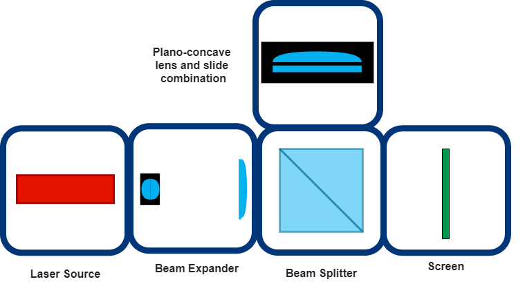
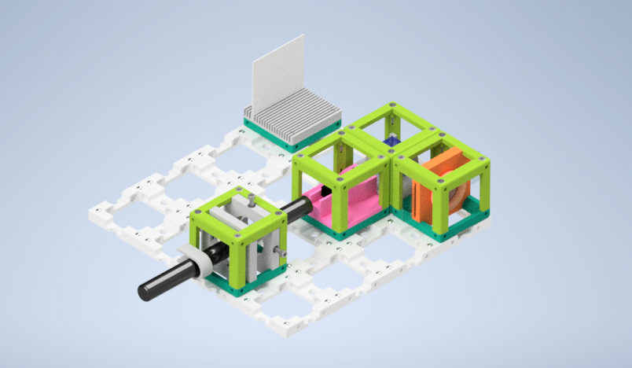
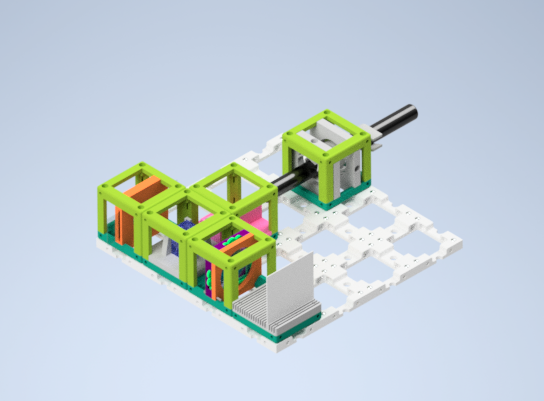

# Newton's Rings Experiment

*WILL BE UPDATED*

## Parts

### Modules for this setup

|  Name | Properties  |  Price | Link  | # |
|---|---|---|---|---|
|  4×4 Baseplate | Skeleton of the System |  21.79 €  | [Base-plate](../../CAD/ASSEMBLY_Baseplate)  | 1 |
|  MODULE: *Beam Expander Cube* | It expands the laser beam size  |  13.55 €  | [Beam Expander](../../CAD/ASSEMBLY_CUBE_Beamexpander)  | 1 |
|  MODULE: *Beam Splitter Cube* | It splits the incoming beam and recombine them  |  29.17 €  | [Beam Splitter Holder](../../CAD/ASSEMBLY_CUBE_Beamsplitter)  | 1 |
|  MODULE: *Newton's Rings Slide-Lens Holder Cube* | It creates Newton's Rings  | 7.54 €  | [Lens - Slide Holder](../../CAD/ASSEMBLY_POL_Newtons_Rings_Module )  | 1 |
|  MODULE:  *Polarizer Cube* | It holds the linearly polarizing filter  |  4.31 €  | [Linear Polarizer](../../CAD/ASSEMBLY_POL_Linear_Polarizer)  | 1 |
|  MODULE: *Laser Cube* | LASER source holder  | 17.68 €  | [Light Source](../../CAD/ASSEMBLY_CUBE_Laser)  | 1 |
|  EXTRA MODULE: Screen Holder Cube | It holds the Display Screen (Not Used in Practice) | 1 €  | [Screen](../../CAD/ASSEMBLY_CUBE_Sample_Holder)  | 1 |

### Parts to print

* 1 × [Base-plate 4×4](./STL/Assembly_Cube_Baseplate_4x4_v2.stl)
* 5 × [Cube base 1×1](./STL/10_Cube_1x1_v2.stl)
* 6 x [Cube lid 1×1](./STL/10_Lid_1x1_v2.stl)
* 1 x [Beam Expander Holder](./STL/20_Cube_Insert_Beamexpander_astromedia_v3.stl)
* 1 × [Beam Splitter Cube Holder](./STL/20_Cube_Insert_Beamsplitter.stl)
* 1 × [Newton's Rings - Lens & Slide Holder](./STL/20_POL_Cube_Insert_Newtons_Rings_LensHolder.stl)
* 1 × [Newton's Rings - Lens & Slide Holder Clamp](./STL/20_POL_Cube_Insert_Newtons_Rings_Lens_Clamp.stl)
* 2 × [Laser Holder](./STL/20_Cube_Insert_Laser_Holder_v2.stl)
* 1 x [Laser Clamp](./STL/00_Laser_Clamp_OnOffSwitch.stl)
* 1 × [Polarizer Guide](./STL/20_POL_Cube_Insert_Linear_Polarizer_Guide.stl)
* 1 × [Polarizer Wheel](./STL/20_POL_Cube_Insert_Linear_Polarizer_Wheel.stl)
* 1 × [Polarizer Lid](./STL/20_POL_Cube_Insert_Linear_Polarizer_Lid.stl)        
__*Extra Holder Parts but NOT USED in our experiment:*__
* 1 x [Sample Holder - comb](./STL/20_Cube_Sampleholder.stl)

  

##  Additional components
* Check out the [RESOURCES](../../TUTORIALS/RESOURCES) for more information!
* 1 × Linear Polarizing Sheet [🢂](https://amazon.de/-/en/Polarizing-A4-Sheet-Polarizer-Educational-Polarized/dp/B06XWXRB75/ref=pd_sbs_421_3/262-2115536-7173904?_encoding=UTF8&pd_rd_i=B06XWXRB75&pd_rd_r=b88e7340-b061-4e0b-8daa-8ec533fd7c71&pd_rd_w=qlkAY&pd_rd_wg=At9EZ&pf_rd_p=a03ac387-6e4d-4f6b-96b6-1853da0bb37b&pf_rd_r=49HX2Z4Q5KRZSQ2FWRQR&psc=1&refRID=49HX2Z4Q5KRZSQ2FWRQR)
* 64 × 5 mm Ball magnets [🢂](https://www.magnetmax.de/Neodym-Kugelmagnete/Magnetkugel-Kugelmagnet-O-5-0-mm-Neodym-vernickelt-N40-haelt-400-g::158.html)
* 44 x Screws DIN912 ISO 4762 - M3×12 mm [🢂](https://eshop.wuerth.de/Zylinderschraube-mit-Innensechskant-SHR-ZYL-ISO4762-88-IS25-A2K-M3X12/00843%20%2012.sku/de/DE/EUR/)
* 3 x Screws DIN912 ISO 4762 M2×16 mm [🢂](https://www.amazon.de/Edelstahl-Sechskopf-Knopf-Schrauben-Unterlegscheiben-Sortiment-Aufbewahrung/dp/B073SS7D8J/ref=sr_1_fkmr0_1?__mk_de_DE=%C3%85M%C3%85%C5%BD%C3%95%C3%91&keywords=zylinderkopfschrauben+set+galvanisiert&qid=1565007371&s=diy&sr=1-1-fkmr0)
* 1 x Beamsplitter Cube (Art. 2137) [🢂](https://optikbaukasten.de/)
* 1 x Microscope Rectangular Coverslips [🢂](https://www.ebay.de/itm/223260964391?hash=item33fb63f627:g:pukAAOSwsGpb%7E14N)
* 1 x Plano-Convex Lens [🢂](https://www.comaroptics.com/components/lenses/simple-convex-lenses/plastic-lenses)
* 1 × 5 mW Blue UV Laser Pointer [🢂](https://www.laserlands.net/5mw-450nm-blue-laser-pointer-pen.html)
* 1 x iPhone 5 Lens f'=3mm (separated from an iPhone camera spare part) [🢂](https://www.amazon.de/BisLinks%C2%AE-Facing-Kamera-Ersatz-Repair/dp/B01M9K9RVN/ref=sr_1_10?__mk_de_DE=%C3%85M%C3%85%C5%BD%C3%95%C3%91&keywords=lg+g3+camera&qid=1565005739&s=gateway&sr=8-10)
* 1 x Achromat Lens f' = 26,5 mm [🢂](https://pgi-shop.de/achromat-2-lens-oe-15-mm-f-26.5-mm/)

  

##  Assembly

* [Baseplate](../../CAD/ASSEMBLY_Baseplate)
* [Beam Expander Cube](../../CAD/ASSEMBLY_CUBE_Beamexpander)
* [Beam Splitter Cube](../../CAD/ASSEMBLY_CUBE_Beamsplitter)
* [Newton's Rings Slide-Lens Holder Cube](../../CAD/ASSEMBLY_POL_Newtons_Rings_Module)
* [Linear Polarizer Cube](../../CAD/ASSEMBLY_POL_Linear_Polarizer)
* [LASER Holder Cube](../../CAD/ASSEMBLY_CUBE_Laser)   
__*EXTRA MODULES:*__
* [Sample Holder for Screen](../../CAD/ASSEMBLY_CUBE_Sample_Holder)

##  Results

*WILL BE UPDATED*

## New Ideas
We are open to new ideas. Please contribute to the project freely, this place is a free country which is built by codes and machines :robot:
