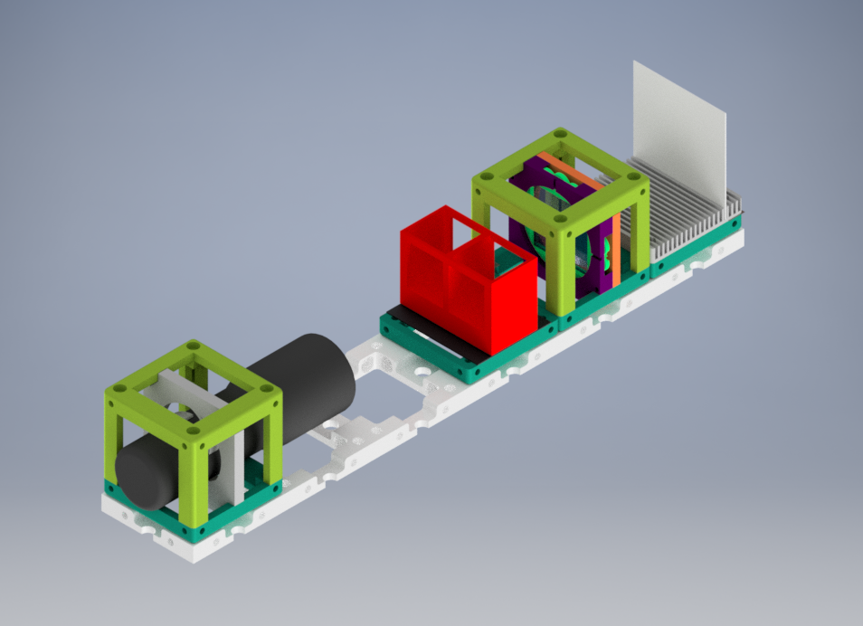

# Polarization Experiment using Optically Active Solution

Optical rotation ?

Opticall Active solution means ?

## Parts

### Modules for this setup

|  Name | Properties  |  Price | Link  | # |
|---|---|---|---|---|
|  4×1 Baseplate | - | 8.22 €  | [Base-plate](../../CAD/ASSEMBLY_Baseplate_v2)  | 1|
|  Module: Polarizer Cube | Linearly Polarizing Filter  |  €  | [Linear Polarizer](../../CAD/ASSEMBLY_POL_Polarizer_Holder)  | 2|
|  Module: Sample Holder Cube | To insert the optically active solution | €  | [Sample Holder](../../CAD/ASSEMBLY_CUBE_Sample_Holder_v2)  | 1|
|  Module: Sample Holder Comb | To hold the screen | 1.4 €  | [Screen](../../CAD/ASSEMBLY_CUBE_Sample_Holder_v2)  | 1|
|  Module: Flashlight Lamp Cube | -  | €  | [Flashlight ](../../CAD/Assembly_Cube_Eyepiece_v2)  | 1|

### Parts to print

* 1 × [Base-plate 4×1](../../CAD/ASSEMBLY_Baseplate_v2/STL/Assembly_base_4x1.stl)
* 2 × [Cube base 1×1](../../CAD/ASSEMBLY_CUBE_Base_v2/STL/10_Cube_1x1_v2.stl)
* 4 x [Cube lid 1×1](../../CAD/ASSEMBLY_CUBE_Base_v2/STL/10_Lid_1x1_v2.stl)
* 1 × [Polarizer Guide](../../CAD/ASSEMBLY_POL_Polarizer_Holder/STL/20_Cube_Insert_Polarizer_Guide.stl)
* 1 × [Polarizer Wheel](../../CAD/ASSEMBLY_POL_Polarizer_Holder/STL/20_Cube_Insert_Polarizer_Wheel.stl)
* 1 × [Polarizer Lid](../../CAD/ASSEMBLY_POL_Polarizer_Holder/STL/20_Cube_Insert_Polarizer_Lid.stl)
* 1 x [Sample Holder - comb](../../CAD/ASSEMBLY_CUBE_Sample_Holder_v2/STL/20_Cube_Sampleholder.stl)
* 1 × [Sample Holder Chamber](../../CAD/ASSEMBLY_CUBE_Sample_Holder_v2/STL/)
* 1 × [Flashlight Holder](../../CAD/ASSEMBLY_CUBE_Eyepiece_v2/STL/20_Cube_Insert_Holder-okular_v2.stl) - the diameter works for the flashlight linked in the eyepiece insert

##  Additional components
* Check out the [RESOURCES](../../TUTORIALS/RESOURCES) for more information!
* 1× Linear Polarizer Film [🢂](https://amazon.de/-/en/Polarizing-A4-Sheet-Polarizer-Educational-Polarized/dp/B06XWXRB75/ref=pd_sbs_421_3/262-2115536-7173904?_encoding=UTF8&pd_rd_i=B06XWXRB75&pd_rd_r=b88e7340-b061-4e0b-8daa-8ec533fd7c71&pd_rd_w=qlkAY&pd_rd_wg=At9EZ&pf_rd_p=a03ac387-6e4d-4f6b-96b6-1853da0bb37b&pf_rd_r=49HX2Z4Q5KRZSQ2FWRQR&psc=1&refRID=49HX2Z4Q5KRZSQ2FWRQR)
* 16× 5mm Ball magnets [🢂](https://www.magnetmax.de/Neodym-Kugelmagnete/Magnetkugel-Kugelmagnet-O-5-0-mm-Neodym-vernickelt-N40-haelt-400-g::158.html)
* × - 24× Screws DIN912 ISO 4762 M3×12 mm [🢂](https://eshop.wuerth.de/Zylinderschraube-mit-Innensechskant-SHR-ZYL-ISO4762-88-IS25-A2K-M3X12/00843%20%2012.sku/de/DE/EUR/)
* 1× flashlight [🢂](https://www.pollin.de/p/led-taschenlampe-alu-5-w-cree-led-3xmicro-schwarz-b-ware-535448)
* Sample
* White paper or cardboard as a screen

  

##  Assembly

* [Baseplate](../../CAD/ASSEMBLY_Baseplate_v2/)
* [Polarizer Cube](../../CAD/ASSEMBLY_POL_Polarizer_Holder)
* [Sample Holder Cube](../../CAD/ASSEMBLY_CUBE_Sample_Holder_v2/)
* [Sample Holder for Screen](../../CAD/ASSEMBLY_CUBE_Sample_Holder_v2/)
* [Flashlight cube](../../CAD/Assembly_Cube_Eyepiece_v2) : Simply insert the holder in a cube and close it as any other

##  Results

We printed and assembled the module parts.After that, we bought necessary components and inserted them into cubes.  
You will find basic version of Crossed Polarization experiment without specific sample and extra light source below.

## New Ideas
We are open to new ideas. Please contribute the project freely, this place is a free country which is built by codes and machines :robot:
