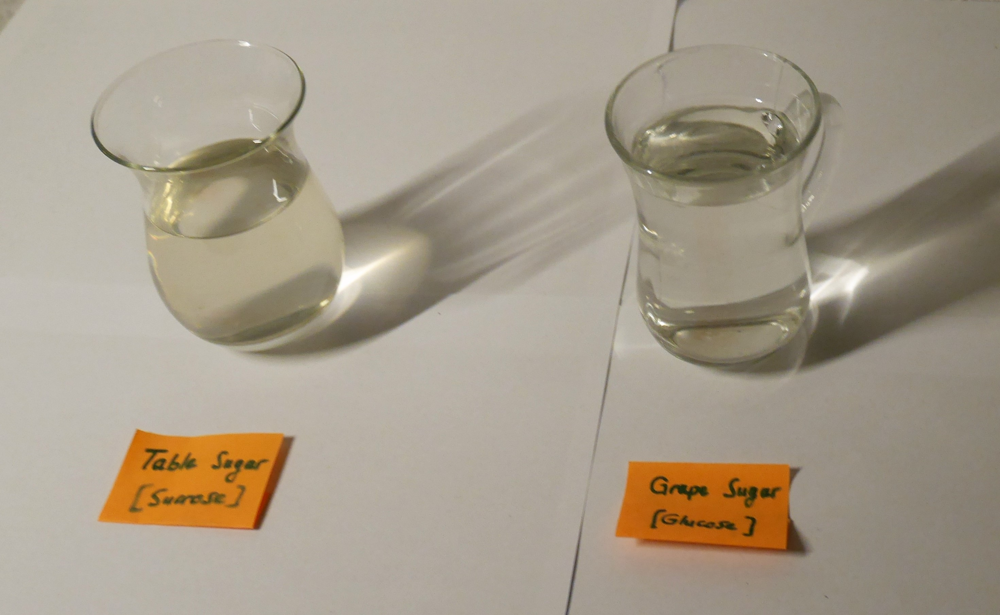
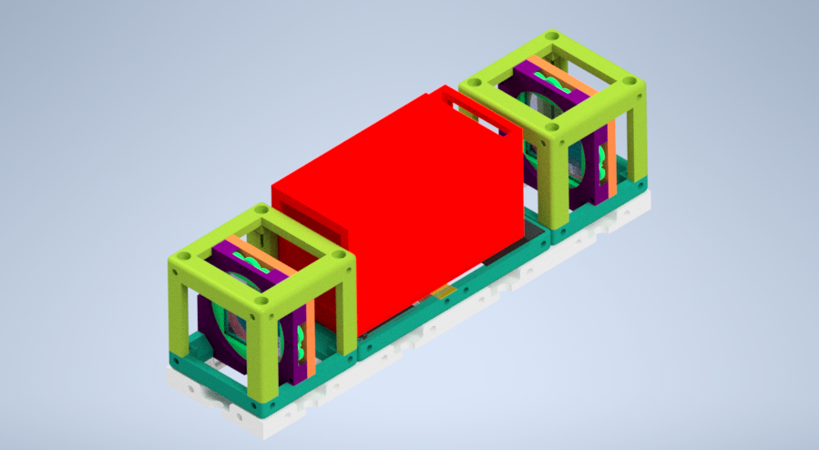
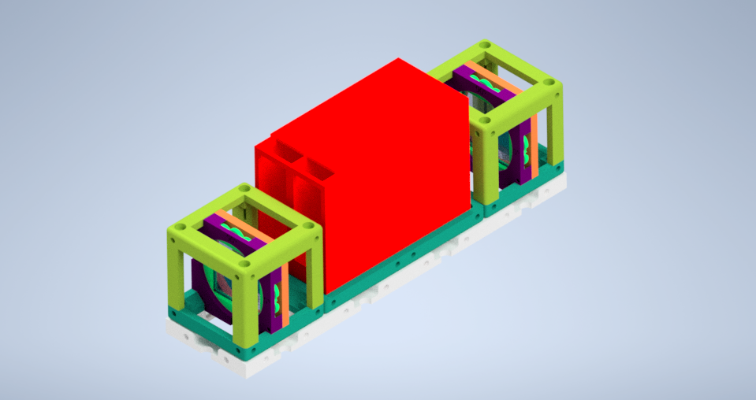
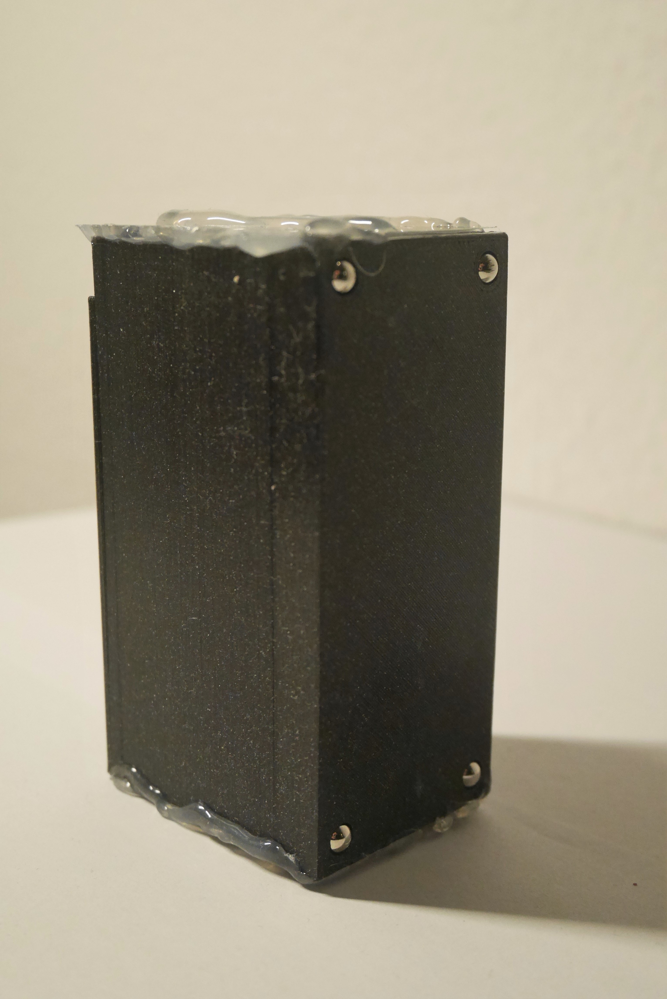
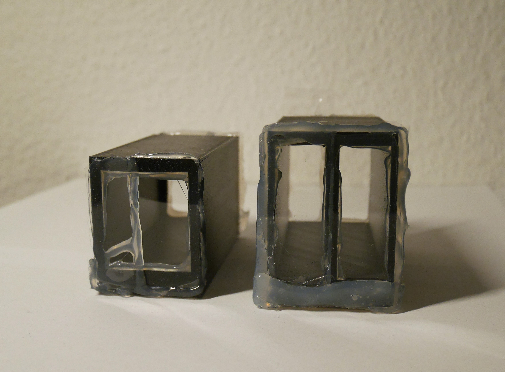
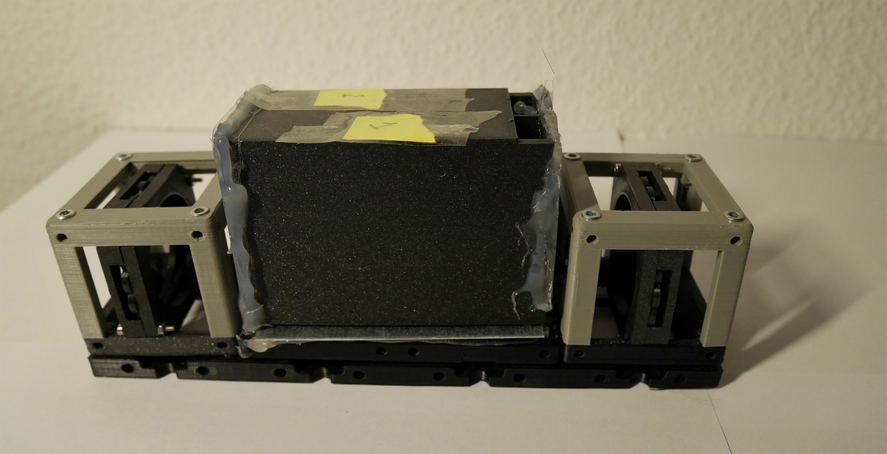
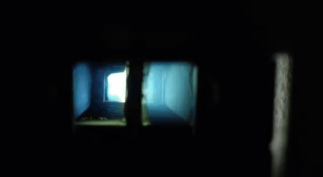

# Polarization Experiment using Optically Active Solution

The optical activity was discovered by Arago in the quartz in 1811. In 1847, molecular chirality was observed by scientist Louis Pasteur. He found that natural tartaric acid is optically active, and its external crystals have isomerism and chiral morphology *[1]*.

Two molecules with the same chemical formula, the mirror image of the other, describe molecular chirality. These come in two varieties: dextrorotatory (rotate plane-polarized light clockwise) and levorotatory (counterclockwise).

Sucrose is a disaccharide made of glucose and fructose and dextrorotatory, which rotates the plane-polarized light to the right. A well-known example of sucrose is table sugar produced naturally in plants. Fructose is a simple ketonic sugar and levorotatory which rotates the plane-polarized light to the left. Glucose is a simple sugar that belongs to the carbohydrate family and is dextrorotatory. The molecules of fructose and glucose are mirror images of each other. Corn syrup is one of the most commonly used sugar solutions *[2]*.

Two simple sugar-water solutions were prepared and used in the experiment. The first solution was produced with one cup of table sugar and one cup of water. Table sugar is sucrose and dextrorotatory, turning clockwise to the right plane-polarized light. Grape sugar is dextrorotatory and glucose, and the second solution mixes grape sugar (Traubenzucker) and water components in the same amount. It rotates the incoming light polarization state to the right, clockwise direction. However, two solutions have different polarization states at the same time because of their molecular structure and demonstrate different colors inside the crossed polarizers.

In the image, Table sugar-water solution is shown in left-side, Grape sugar-water solution is in the right glass.

## Parts

### Modules for this setup

|  Name | Properties  |  Price | Link  | # |
|---|---|---|---|---|
|  4×1 Baseplate | Skeleton of the System | 5.47 €  | [Base-plate](../../CAD/ASSEMBLY_Baseplate)  | 1 |
|  MODULE:  *Polarizer Cube* | It holds the linearly polarizing filter  |  8.62 €  | [Linear Polarizer](../../CAD/ASSEMBLY_POL_Linear_Polarizer)  | 2 |
|  MODULE:  *Active Solution Chamber* | It contains sugar-water solutions.  |  7.32 €  | [Active Solution Chambers](../../CAD/ASSEMBLY_POL_Active_Solution_Chamber)  | 1 |
|  EXTRA MODULE: Flashlight Lamp Cube | Light Source  | 7.2 €  | [Flashlight](../../CAD/ASSEMBLY_CUBE_Flashlight)  | 1 |

### Parts to print

* 1 × [Base-plate 4×1](./STL/Assembly_Cube_Baseplate_4x1_v2.stl)
* 2 × [Cube base 1×1](./STL/10_Cube_1x1_v2.stl)
* 2 x [Cube lid 1×1](./STL/10_Lid_1x1_v2.stl)
* 2 × [Polarizer Guide](./STL/20_POL_Cube_Insert_Linear_Polarizer_Guide.stl)
* 2 × [Polarizer Wheel](./STL/20_POL_Cube_Insert_Linear_Polarizer_Wheel.stl)
* 2 × [Polarizer Lid](./STL/20_POL_Cube_Insert_Linear_Polarizer_Lid.stl)  
* 1 × [Cube Lid 2x1](./STL/10_Lid_el_2x1_v2.stl)
* 1 x [Active Solution Chamber - Alternative 1 with Two Sections](./STL/10_POL_Active_Solution_Chamber_90long_40High_Double_TOP.stl)
* 1 x [Active Solution Chamber - Alternative 2 with One Sections](./STL/10_POL_Active_Solution_Chamber_90long_40High_TOP.stl)    
__*Extra Holder Parts but NOT USED in our experiment:*__
* 1 × [Flashlight Holder](./STL/20_Cube_Insert_Holder-okular+flashlight_v2.stl)

  

##  Additional components
* Check out the [RESOURCES](../../TUTORIALS/RESOURCES) for more information!
* 1 × Linear Polarizing Sheet [🢂](https://amazon.de/-/en/Polarizing-A4-Sheet-Polarizer-Educational-Polarized/dp/B06XWXRB75/ref=pd_sbs_421_3/262-2115536-7173904?_encoding=UTF8&pd_rd_i=B06XWXRB75&pd_rd_r=b88e7340-b061-4e0b-8daa-8ec533fd7c71&pd_rd_w=qlkAY&pd_rd_wg=At9EZ&pf_rd_p=a03ac387-6e4d-4f6b-96b6-1853da0bb37b&pf_rd_r=49HX2Z4Q5KRZSQ2FWRQR&psc=1&refRID=49HX2Z4Q5KRZSQ2FWRQR)
* 24 × 5 mm Ball magnets [🢂](https://www.magnetmax.de/Neodym-Kugelmagnete/Magnetkugel-Kugelmagnet-O-5-0-mm-Neodym-vernickelt-N40-haelt-400-g::158.html)
* 20 x Screws DIN912 ISO 4762 - M3×12 mm [🢂](https://eshop.wuerth.de/Zylinderschraube-mit-Innensechskant-SHR-ZYL-ISO4762-88-IS25-A2K-M3X12/00843%20%2012.sku/de/DE/EUR/)
* 6 x Screws DIN912 ISO 4762 M2×16 mm [🢂](https://www.amazon.de/Edelstahl-Sechskopf-Knopf-Schrauben-Unterlegscheiben-Sortiment-Aufbewahrung/dp/B073SS7D8J/ref=sr_1_fkmr0_1?__mk_de_DE=%C3%85M%C3%85%C5%BD%C3%95%C3%91&keywords=zylinderkopfschrauben+set+galvanisiert&qid=1565007371&s=diy&sr=1-1-fkmr0)
* 2 x metal plates
* Microscope Rectangular Coverslips [🢂](https://www.ebay.de/itm/223260964391?hash=item33fb63f627:g:pukAAOSwsGpb%7E14N)
* _NOT USED_ 1 × flashlight [🢂](https://www.pollin.de/p/led-taschenlampe-alu-5-w-cree-led-3xmicro-schwarz-b-ware-535448)

##  Assembly

* [Baseplate](../../CAD/ASSEMBLY_Baseplate)
* [Linear Polarizer Cube](../../CAD/ASSEMBLY_POL_Linear_Polarizer)  
* [Active Solution Chambers](../../CAD/ASSEMBLY_POL_Active_Solution_Chamber)  
__*EXTRA MODULE:*__
* [Flashlight cube](../../CAD/ASSEMBLY_CUBE_Flashlight)

  

##  Results

We printed and assembled two Linear Polarizer and Active Solution Chamber module parts. Then, we bought the necessary components and inserted them into cubes.  
You can see the datils of the Active Solution Chamber designs.

Two different chamber design is shown in the image below. Left-side chamber has a container only for 1 active solution. In the other one, two different mixtures can be observed in the same time.  

You can find the basic version of Polarization Using Optically Active Solution experiment with an additional flashlight source below.  Depends on the experiment place conditions, you can add an extra light source.

The chamber module was inserted between two linear polarizers, the Crossed Polarizers. We can observe the direct effect of the angle between two linear polarizers in the video below. The intensity of passing light through crossed polarizers changes when the direction angle of the polarization filter changes 360 degrees.

Experimental result of two optically active solutions is shown in the video:      
   *  Left Is Grape Sugar-water Solution (Glucose) Table,          
   * Right Is Sugar-water Solution (Sucrose

## References

[1] Gal, J. (2017). Pasteur and the art of chirality. Nature Chemistry, 9(7), 604–605. https://doi.org/10.1038/nchem.2790    

[2] Logiurato, F. (2018). Teaching Light Polarization by Putting Art and Physics Together. The Physics Teachers, 1–5. https://arxiv.org/ftp/arxiv/papers/1803/1803.09645.pdf

## New Ideas
We are open to new ideas. Please contribute the project freely, this place is a free country which is built by codes and machines :robot:
