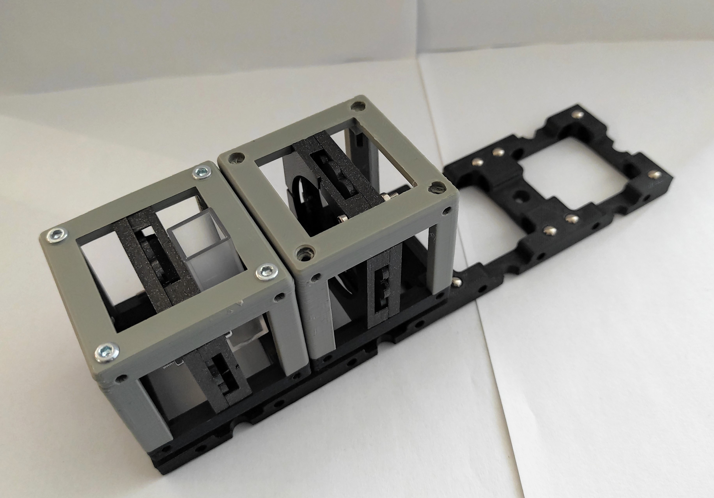

# Stress Birefringence Experiment

Birefringence is

## Parts

### Modules for this setup

|  Name | Properties  |  Price | Link  | # |
|---|---|---|---|---|
|  4×1 Baseplate | - | €  | [Base-plate](../../CAD/ASSEMBLY_Baseplate_v2)  | 1|
|  Module: Linear Polarizer Cube | -  |  €  | [Linear Polarizer](../../CAD/ASSEMBLY_CUBE_Linear_Polarizer)  | 2|
|  Module: Sample Holder Cube | -  | 20 €  | [Sample Holder](../../CAD/ASSEMBLY_CUBE_Sample_Holder_v2)  | 1|
|  Module: Flashlight Lamp Cube | -  | 10 €  | [Flashlight Holder](../../CAD/Assembly_Cube_Eyepiece_v2)  | 1|

### Parts to print

* 2× [Base-plate 4×1](../../CAD/ASSEMBLY_Baseplate_v2/STL/Assembly_base_4x1.stl)
* 5× [Cube base 1×1](../../CAD/ASSEMBLY_CUBE_Base_v2/STL/10_Cube_1x1_v2.stl)
* 5x [Cube lid 1×1](../../CAD/ASSEMBLY_CUBE_Base_v2/STL/10_Lid_1x1_v2.stl)
* 2× [Polarizer Guide](../../CAD/ASSEMBLY_CUBE_Linear_Polarizer/STL/20_Cube_Insert_Polarizer_Guide.stl)
* 2× [Polarizer Wheel](../../CAD/ASSEMBLY_CUBE_Linear_Polarizer/STL/20_Cube_Insert_Polarizer_Wheel.stl)
* 2× [Polarizer Lid](../../CAD/ASSEMBLY_CUBE_Linear_Polarizer/STL/20_Cube_Insert_Polarizer_Lid.stl)
* 1× [Sample Holder](../../CAD/ASSEMBLY_CUBE_Sample_Holder_v2/STL/20_Cube_insert_Sample_holder.stl)
* 1x [Sample Holder Clamp](../../CAD/ASSEMBLY_CUBE_Sample_Holder_v2/STL/20_Cube_Insert_Sample_clamp.stl)
* 1× [Flashlight Holder](../../CAD/ASSEMBLY_CUBE_Eyepiece_v2/STL/20_Cube_Insert_Holder-okular_v2.stl) - the diameter works for the flashlight linked in the eyepiece insert
* 1x [Camera Holder](../../CAD/ASSEMBLY_CUBE_RaspiCam_v2/STL/20_Cube_Insert_RaspiCam.stl)

##  Additional components
* Check out the [RESOURCES](../../TUTORIALS/RESOURCES) for more information!
* 1× Linear Polarizer Film [🢂](https://amazon.de/-/en/Polarizing-A4-Sheet-Polarizer-Educational-Polarized/dp/B06XWXRB75/ref=pd_sbs_421_3/262-2115536-7173904?_encoding=UTF8&pd_rd_i=B06XWXRB75&pd_rd_r=b88e7340-b061-4e0b-8daa-8ec533fd7c71&pd_rd_w=qlkAY&pd_rd_wg=At9EZ&pf_rd_p=a03ac387-6e4d-4f6b-96b6-1853da0bb37b&pf_rd_r=49HX2Z4Q5KRZSQ2FWRQR&psc=1&refRID=49HX2Z4Q5KRZSQ2FWRQR)
* 16× 5mm Ball magnets [🢂](https://www.magnetmax.de/Neodym-Kugelmagnete/Magnetkugel-Kugelmagnet-O-5-0-mm-Neodym-vernickelt-N40-haelt-400-g::158.html)
* 12× - 24× Screws DIN912 ISO 4762 M3×12 mm [🢂](https://eshop.wuerth.de/Zylinderschraube-mit-Innensechskant-SHR-ZYL-ISO4762-88-IS25-A2K-M3X12/00843%20%2012.sku/de/DE/EUR/)
* 1× flashlight [🢂](https://www.pollin.de/p/led-taschenlampe-alu-5-w-cree-led-3xmicro-schwarz-b-ware-535448)
* (ADDITIONAL) 1× Raspi Camera (v1, v2) [🢂](https://www.amazon.de/Raspberry-Pi-v2-1-1080P-Kamera-Modul/dp/B01ER2SMHY/ref=sr_1_4?__mk_de_DE=%C3%85M%C3%85%C5%BD%C3%95%C3%91&crid=1LUZK9XHFS5CX&keywords=raspberry+pi+camera+v2.1&qid=1565008837&s=gateway&sprefix=raspberry+pi+camera+%2Caps%2C163&sr=8-4)
* (ADDITIONAL) 1× long cable for Raspi Camera [🢂](https://www.az-delivery.de/collections/raspberry-pi-kamera-zubehor/products/100cmflexkabel?ls=de)
* (ADDITIONAL) 2× M2*10 screws (best: plastic)
* (ADDITIONAL) 2× M2 nuts (best: plastic)
* Sample

##  Assembly

* [Baseplate](../../CAD/ASSEMBLY_Baseplate_v2/)
* [Polarizer Cube](../../CAD/ASSEMBLY_CUBE_Linear_Polarizer)
* [Sample Cube](../../CAD/ASSEMBLY_CUBE_Sample_Holder_v2/)
* [Flashlight cube](../../CAD/Assembly_Cube_Eyepiece_v2) : Simply insert the holder in a cube and close it as any other

## Stress Birefringence

In the experiment, we can use simple materials to observe stress birefringence such as plastic cutlery, a plastic cup or homemade punched pocket&tape sheet. 

##  Results

## New Ideas
If you have any problems or suggestions, please file an issue. Thank you!
