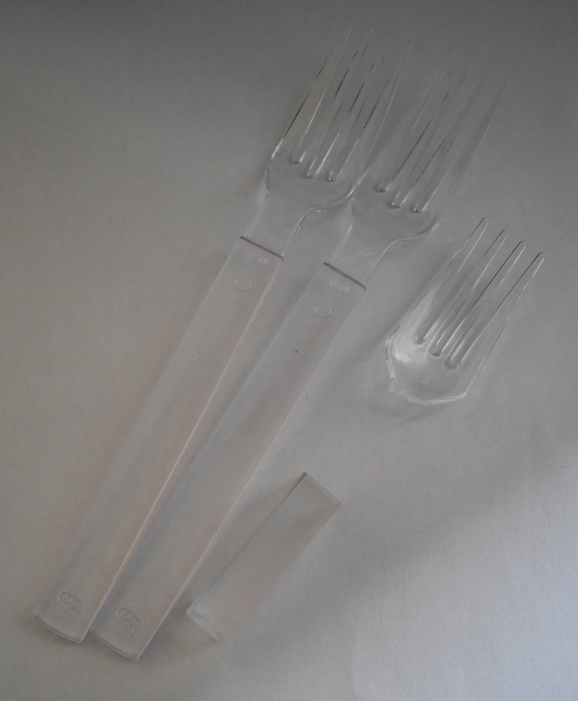
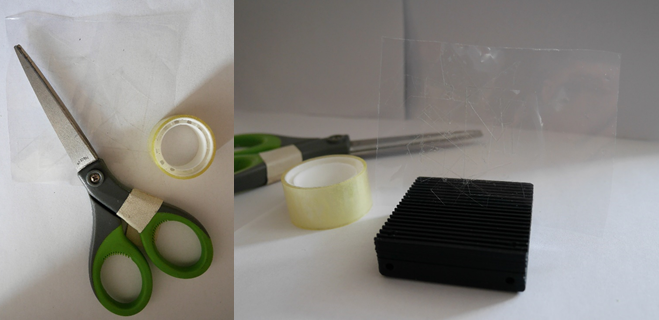
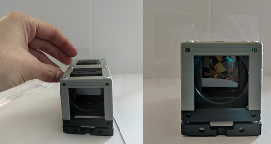
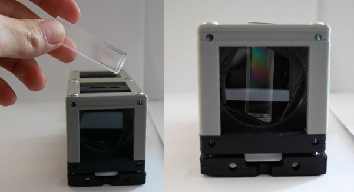
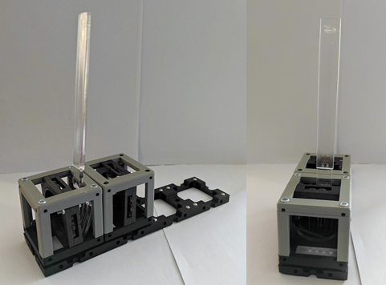

# Stress Birefringence Experiment

Some physical processes can be used to produce the polarized light such as absorption, refraction, reflection, diffraction and birefringence.   
__Birefringence__ is the optical property of a material which has a dependent refractive index to polarization and propagation direction of light. These optically anisotropic materials are said to be birefringent.

In general, birefringence is the double refraction of light. Each incoming light through the birefringent material such as calcite crystal is split by polarization into two rays; an ordinary and an extraordinary ray. These rays have different paths and polarizations.

*Common birefringent materials are;*

    * best characterized birefringent materials are crystals
    * many plastics under mechanical stress such as cellophane or plastic boxes
    * many biological materials such as collagen, found in cartilage, tendon, bone, corneas, and several other areas in the body or some proteins.
      Polarized light microscopy is commonly used in biological tissue.

Birefringence is used in many optical and medical devices. In medical applications, it can be used for the measurement of the optical nerve thickness or the diagnosis of glaucoma.

###### Well then, what is the connection with polarization?

Let's think. You ordered a new T-shirt from Amazon. You tried it and liked it. How beautiful! But wait wait. You can use plastic cargo package for a polarization experiment and demonstrate stress birefringence of plastic sheet easily. Yesss, you can make science using 'garbage' too.   
Let's look at that more closely!

Polarizers are frequently used to detect stress in plastics; birefringence. In this experiment, we use basic materials from our daily life as samples and see birefringence with our naked eyes. Let's collect simple objects such as plastic boxes, plastic cutlery (Image 1) or plastic packages. Even we can prepare own birefringent object (Image 2) using plastic punched pocket and sticky tape.

Image 1 :

Image 2:

##### Stress Birefringence

Stress birefringence results with stressed or deformation of  isotropic materials and applying stressed causes a loss of physical isotropy and generates birefringence.  

How can the stress be applied?  Externally or as another method can be used. A birefringent plastic object is manufactured using injection molding and is cooled.

## Parts

### Modules for this setup

|  Name | Properties  |  Price | Link  | # |
|---|---|---|---|---|
|  4×1 Baseplate | - | 8.22 €  | [Base-plate](../../CAD/ASSEMBLY_Baseplate_v2)  | 1|
|  Module: Polarizer Cube | Linearly Polarizing Filter  |  €  | [Linear Polarizer](../../CAD/ASSEMBLY_POL_Polarizer_Holder)  | 1|
|  Module: Sample Holder Cube | To insert the sample  | 2.5 €  | [Sample Holder](../../CAD/ASSEMBLY_CUBE_Sample_Holder_v2)  | 1|
|  Module: Sample Holder Comb | To hold the screen | 1.4 €  | [Screen](../../CAD/ASSEMBLY_CUBE_Sample_Holder_v2)  | 1|
|  Module: Flashlight Lamp Cube | -  | €  | [Flashlight ](../../CAD/Assembly_Cube_Eyepiece_v2)  | 1|

### Parts to print

* 1 × [Base-plate 4×1](../../CAD/ASSEMBLY_Baseplate_v2/STL/Assembly_base_4x1.stl)
* 3 × [Cube base 1×1](../../CAD/ASSEMBLY_CUBE_Base_v2/STL/10_Cube_1x1_v2.stl)
* 4 x [Cube lid 1×1](../../CAD/ASSEMBLY_CUBE_Base_v2/STL/10_Lid_1x1_v2.stl)
* 1 × [Polarizer Guide](../../CAD/ASSEMBLY_POL_Polarizer_Holder/STL/20_Cube_Insert_Polarizer_Guide.stl)
* 1 × [Polarizer Wheel](../../CAD/ASSEMBLY_POL_Polarizer_Holder/STL/20_Cube_Insert_Polarizer_Wheel.stl)
* 1 × [Polarizer Lid](../../CAD/ASSEMBLY_POL_Polarizer_Holder/STL/20_Cube_Insert_Polarizer_Lid.stl)
* 1 × [Sample Holder](../../CAD/ASSEMBLY_CUBE_Sample_Holder_v2/STL/20_Cube_insert_Sample_holder.stl)
* 1 x [Sample Holder Clamp](../../CAD/ASSEMBLY_CUBE_Sample_Holder_v2/STL/20_Cube_Insert_Sample_clamp.stl)
* 1 × [Flashlight Holder](../../CAD/ASSEMBLY_CUBE_Eyepiece_v2/STL/20_Cube_Insert_Holder-okular_v2.stl) - the diameter works for the flashlight linked in the eyepiece insert
* 1 x [Sample Holder - comb](../../CAD/ASSEMBLY_CUBE_Sample_Holder_v2/STL/20_Cube_Sampleholder.stl)

##  Additional components
* Check out the [RESOURCES](../../TUTORIALS/RESOURCES) for more information!
* 1× Linear Polarizer Film [🢂](https://amazon.de/-/en/Polarizing-A4-Sheet-Polarizer-Educational-Polarized/dp/B06XWXRB75/ref=pd_sbs_421_3/262-2115536-7173904?_encoding=UTF8&pd_rd_i=B06XWXRB75&pd_rd_r=b88e7340-b061-4e0b-8daa-8ec533fd7c71&pd_rd_w=qlkAY&pd_rd_wg=At9EZ&pf_rd_p=a03ac387-6e4d-4f6b-96b6-1853da0bb37b&pf_rd_r=49HX2Z4Q5KRZSQ2FWRQR&psc=1&refRID=49HX2Z4Q5KRZSQ2FWRQR)
* 16× 5mm Ball magnets [🢂](https://www.magnetmax.de/Neodym-Kugelmagnete/Magnetkugel-Kugelmagnet-O-5-0-mm-Neodym-vernickelt-N40-haelt-400-g::158.html)
* × - 24× Screws DIN912 ISO 4762 M3×12 mm [🢂](https://eshop.wuerth.de/Zylinderschraube-mit-Innensechskant-SHR-ZYL-ISO4762-88-IS25-A2K-M3X12/00843%20%2012.sku/de/DE/EUR/)
* 1× flashlight [🢂](https://www.pollin.de/p/led-taschenlampe-alu-5-w-cree-led-3xmicro-schwarz-b-ware-535448)
* Birefringent Materials/Samples
* White paper or cardboard as a screen

##  Assembly

* [Baseplate](../../CAD/ASSEMBLY_Baseplate_v2/)
* [Polarizer Cube](../../CAD/ASSEMBLY_POL_Polarizer_Holder)
* [Sample Holder Cube](../../CAD/ASSEMBLY_CUBE_Sample_Holder_v2/)
* [Sample Holder for Screen](../../CAD/ASSEMBLY_CUBE_Sample_Holder_v2/)
* [Flashlight cube](../../CAD/Assembly_Cube_Eyepiece_v2) : Simply insert the holder in a cube and close it as any other

##  Results

You will find basic version of Stress Birefringence experiment without an extra light source below.  
A sample is placed in the setup, and color patterns can be observed clearly. Polarization of a light ray is rotated after passing through a birefringent material and the amount of rotation is dependent on wavelength.

The printed cube parts were assembled and the result images of experiences were taken for 3 different birefringent materials.  

*In the 1st Experiment,* we prepared our sample using a plastic punched pocket and randomly applied sticky tape on it.

*In the 2nd Experiment,* we used a plastic box/piece as sample for the setup.

*In the 3rd Experiment,* a plastic cutlery is used.

## New Ideas

Rat-Tat! We are here to hear new ideas. Please don't shy and have a heart-to-heart talk with us.  :gift_heart:
