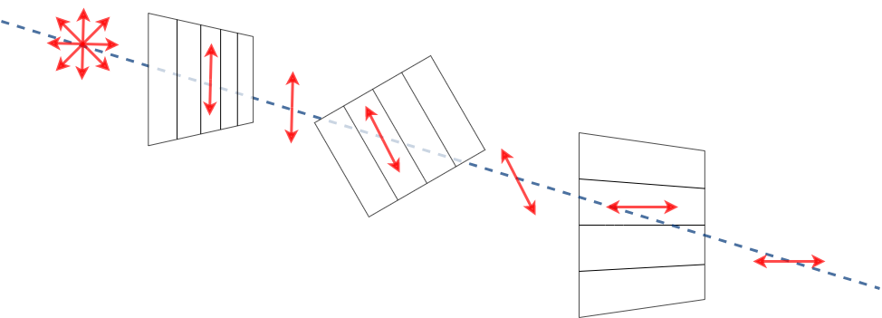
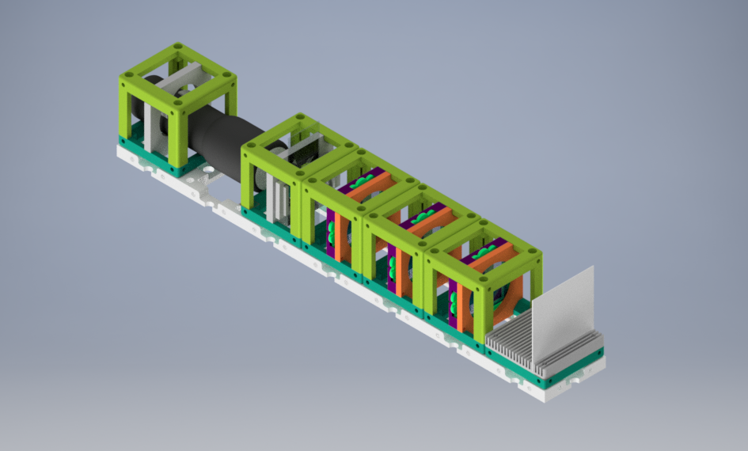

# Three Polarizers (0, 45, 90 degrees)    

We use two linear polarizers in [crossed polarizers experiment](../../APPLICATIONS/APP_POL_Crossed_Polarizers) and block all traveling light and see almost darkness. :open_mouth:    
But if we add a third polarizer between them, we see the light at the end of the tunnel. MAGIC? :crystal_ball:    No, science. :brain:

In crossed polarizers, two polarizers are oriented perpendicular to each other, and light passes through the first polarizer (s-polarizer, 0 degrees) and blocks by the second polarizer (p-polarizer, 90 degrees). The extinction of the light reaches its maximum value.  
Some light will pass through three polarizers if we add a third polarizer between these two crossed polarizers.  

In the __*Three Linear Polarizers setup,*__ the amount of light passing through the polarizers can be calculated by the Law of Malus, cosine-squared law.  

__*I*__      : the intensity of passing light through polarizers (total amount of passing light into three polarizers setup)  
__*I(0)*__   : the intensity of incoming light  
__*θ*__      : the angle between the transmission axes of two polarizers

The polarization direction of the first polarizer is oriented vertically to the incoming beam at 0 degrees. Incoming unpolarized light passes through the first polarizer (linear s-polarized). After the first polarizer, the vertically polarized light travels to the second linear polarizer, which is rotated by 45 degrees to the first polarizer. Then the traveling light passes through the third polarizer (linear p-polarized), oriented at 90 degrees tilted for the first polarizer. Due to the orientation angle of each linear polarizer, transmitted light intensity changes based on the Law of Malus.  

Three linear polarizers are used in the experiment, and each of them has different angles concerning the transmission axis.

## Parts

### Modules for this setup

|  Name | Properties  |  Price | Link  | # |
|---|---|---|---|---|
|  4×1 Baseplate | Skeleton of the System | 5.47 €  | [Base-plate](../../CAD/ASSEMBLY_Baseplate)  | 1 |
|  MODULE:  *Polarizer Cube* | It holds the linearly polarizing filter  |  13.43 €  | [Linear Polarizer](../../CAD/ASSEMBLY_POL_Linear_Polarizer)  | 3 |
| EXTRA MODULE: Sample Holder Cube | It holds the Sample (Not Used in Practice) | 1.3 €  | [Sample Holder](../../CAD/ASSEMBLY_CUBE_Sample_Holder)  | 1 |
|  EXTRA MODULE: Screen Holder Cube | It holds the Display Screen (Not Used in Practice) | 1 €  | [Screen](../../CAD/ASSEMBLY_CUBE_Sample_Comb)  | 1 |
|  EXTRA MODULE: Flashlight Lamp Cube | Light Source  | 7.2 €  | [Flashlight](../../CAD/ASSEMBLY_CUBE_Flashlight)  | 1 |

### Parts to print

* 1 × [Base-plate 4×1](./STL/Assembly_base_4x1.stl)
* 3 × [Cube base 1×1](.STL/10_Cube_1x1_v2.stl)
* 3 x [Cube lid 1×1](./STL/10_Lid_1x1_v2.stl)
* 3 × [Polarizer Guide](./STL/20_POL_Cube_Insert_Linear_Polarizer_Guide.stl)
* 3 × [Polarizer Wheel](./STL/20_POL_Cube_Insert_Linear_Polarizer_Wheel.stl)
* 3 × [Polarizer Lid](./STL/20_POL_Cube_Insert_Linear_Polarizer_Lid.stl)  
__*Extra Holder Parts but NOT USED in our experiment:*__
* 1 × [Sample Holder](./STL/20_Cube_insert_Sample_holder.stl)
* 1 x [Sample Holder Clamp](./STL/20_Cube_Insert_Sample_clamp.stl)
* 1 x [Sample Holder - comb](./STL/20_Cube_Sampleholder.stl)
* 2 × [Flashlight Holder](./STL/20_Cube_Insert_Holder-okular_v2.stl)

##  Additional components
* Check out the [RESOURCES](../../TUTORIALS/RESOURCES) for more information!
* 1 × Linear Polarizing Sheet [🢂](https://amazon.de/-/en/Polarizing-A4-Sheet-Polarizer-Educational-Polarized/dp/B06XWXRB75/ref=pd_sbs_421_3/262-2115536-7173904?_encoding=UTF8&pd_rd_i=B06XWXRB75&pd_rd_r=b88e7340-b061-4e0b-8daa-8ec533fd7c71&pd_rd_w=qlkAY&pd_rd_wg=At9EZ&pf_rd_p=a03ac387-6e4d-4f6b-96b6-1853da0bb37b&pf_rd_r=49HX2Z4Q5KRZSQ2FWRQR&psc=1&refRID=49HX2Z4Q5KRZSQ2FWRQR)
* 16 × 5 mm Ball magnets [🢂](https://www.magnetmax.de/Neodym-Kugelmagnete/Magnetkugel-Kugelmagnet-O-5-0-mm-Neodym-vernickelt-N40-haelt-400-g::158.html)
* 24 x Screws DIN912 ISO 4762 - M3×12 mm [🢂](https://eshop.wuerth.de/Zylinderschraube-mit-Innensechskant-SHR-ZYL-ISO4762-88-IS25-A2K-M3X12/00843%20%2012.sku/de/DE/EUR/)
* 9 x Screws DIN912 ISO 4762 M2×16 mm [🢂](https://www.amazon.de/Edelstahl-Sechskopf-Knopf-Schrauben-Unterlegscheiben-Sortiment-Aufbewahrung/dp/B073SS7D8J/ref=sr_1_fkmr0_1?__mk_de_DE=%C3%85M%C3%85%C5%BD%C3%95%C3%91&keywords=zylinderkopfschrauben+set+galvanisiert&qid=1565007371&s=diy&sr=1-1-fkmr0)
* _NOT USED_ 1 × flashlight [🢂](https://www.pollin.de/p/led-taschenlampe-alu-5-w-cree-led-3xmicro-schwarz-b-ware-535448)

If all written modules are used in the experiment, the setup will look like:

##  Assembly

* [Baseplate](../../CAD/ASSEMBLY_Baseplate)
* [Linear Polarizer Cube](../../CAD/ASSEMBLY_POL_Linear_Polarizer)  
__*EXTRA MODULES:*__
* [Sample Holder Cube](../../CAD/ASSEMBLY_CUBE_Sample_Holder)
* [Sample Holder for Screen](../../CAD/ASSEMBLY_CUBE_Sample_Comb)
* [Flashlight cube](../../CAD/ASSEMBLY_CUBE_Flashlight)

##  Results

The basic version of the Three Polarizers experiment without a specific sample and extra light source below is demonstrated. You can see the experiment images below.

The effect of the angle between two linear polarizers can be seen in the video below. The intensity of passing light on the eye of the observer through the polarizers changes when the wheel insert of polarization filter wheeled 45 angles.

## New Ideas
We are open to new idea source (dad joke about the open-source project :neutral_face: ). Just open a new issue and spread your idea!
