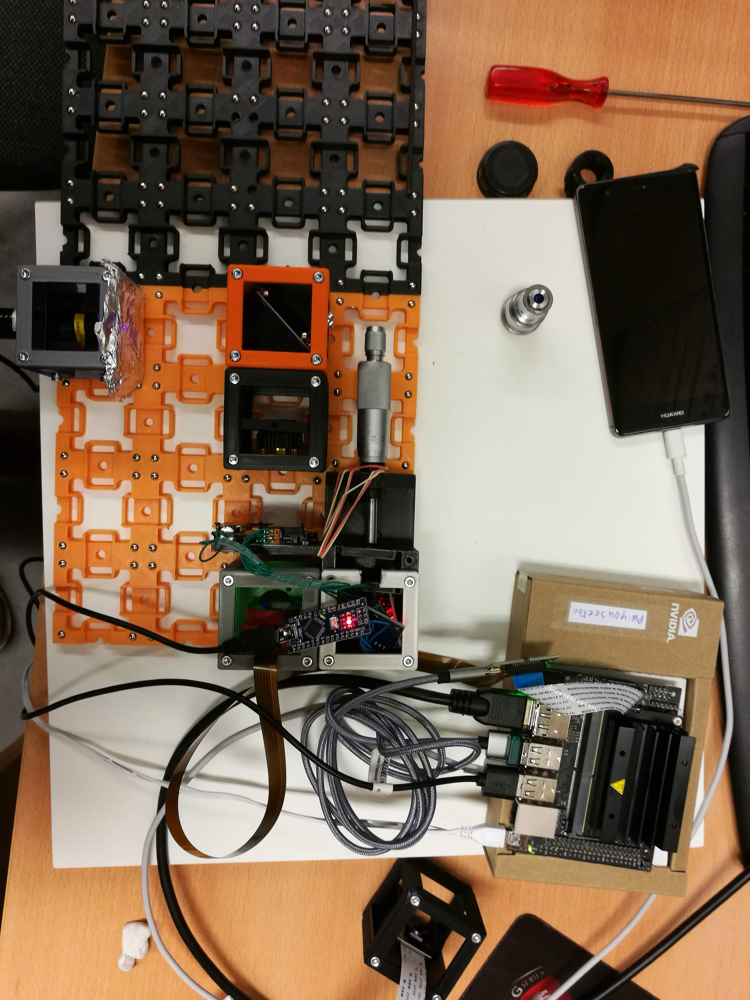
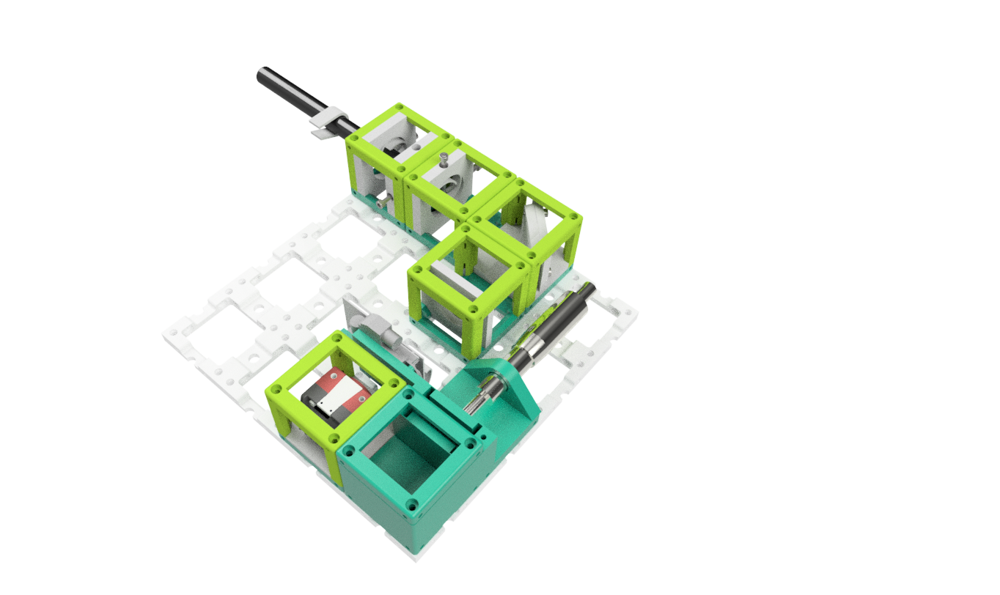

# APP Ptychography 

## Tutorial 

- Open the terminal
- Type 

```
cd ~/PTYCHOGRAPHY
sudo python3 01_CameraSerial_XY_v3.py 
```

- Password is ```youseetoo```


Images are getting saved in the folder PTYCHOGRAPHY -> subfolder according to the time-stamp.- 


# General Remarks

STop the current programm: 
CTRl+c


open the live-stream camera by typing 
```qv4l2```
and hit enter 

this is just a viewer only - no settings are transfered to the ptychographic code! Good for aligning the beam 


list cameras with 
v4l2-ctl -d /dev/video0 --list-formats


## Available Camera Parameters

Entering the command ```v4l2-ctl -d /dev/video0 --list-ctrls``` follows in: 

```
                    brightness 0x00980900 (int)    : min=0 max=255 step=1 default=0 value=0 flags=slider
                          gamma 0x00980910 (int)    : min=40 max=240 step=5 default=100 value=100 flags=slider
                       exposure 0x00980911 (int)    : min=147515 max=2147483647 step=33313 default=5011232 value=1013653 flags=slider
                      auto_gain 0x00980912 (bool)   : default=0 value=0
                           gain 0x00980913 (int)    : min=0 max=2400 step=10 default=0 value=0 flags=slider
                      reverse_x 0x00980914 (bool)   : default=0 value=0
                      reverse_y 0x00980915 (bool)   : default=0 value=0
          frame_timeout_enabled 0x009809c8 (bool)   : default=1 value=1
                  frame_timeout 0x009809c9 (int)    : min=100 max=12000 step=1 default=4000 value=4000
       stride_alignment_enabled 0x009809ca (bool)   : default=1 value=1
         crop_alignment_enabled 0x009809cb (bool)   : default=0 value=0

Camera Controls

                  exposure_auto 0x009a0901 (menu)   : min=0 max=1 default=1 value=1
              exposure_absolute 0x009a0902 (int64)  : min=1 max=99999 step=1 default=1 value=10
                    bypass_mode 0x009a2064 (intmenu): min=0 max=1 default=0 value=0
                override_enable 0x009a2065 (intmenu): min=0 max=1 default=0 value=0
                   height_align 0x009a2066 (int)    : min=1 max=16 step=1 default=1 value=1
                     size_align 0x009a2067 (intmenu): min=0 max=2 default=0 value=0
               write_isp_format 0x009a2068 (bool)   : default=0 value=0
       sensor_signal_properties 0x009a2069 (u32)    : min=0 max=4294967295 step=1 default=0 [30][18] flags=read-only, has-payload
        sensor_image_properties 0x009a206a (u32)    : min=0 max=4294967295 step=1 default=0 [30][16] flags=read-only, has-payload
      sensor_control_properties 0x009a206b (u32)    : min=0 max=4294967295 step=1 default=0 [30][34] flags=read-only, has-payload
              sensor_dv_timings 0x009a206c (u32)    : min=0 max=4294967295 step=1 default=0 [30][16] flags=read-only, has-payload
               low_latency_mode 0x009a206d (bool)   : default=0 value=0
                   sensor_modes 0x009a2082 (int)    : min=0 max=30 step=1 default=30 value=1 flags=read-only

```

# Setup
<p align="center">

</p>


<p align="center">

</p>


## Gstreamer code for live-preview

```gst-launch-1.0  v4l2src device=/dev/video0 extra-controls="c,exposure=10000000,exposure_auto=1"  ! video/x-raw, format=BGRx ! ximagesink```


## Results

<p align="center">

</p>


