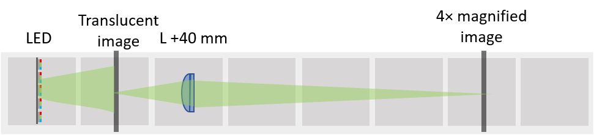
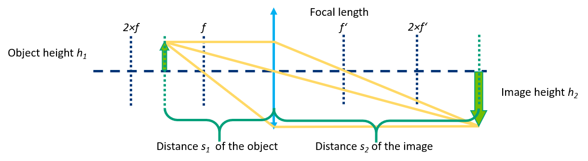

# Simple Projector
We developed a very easy-to-use setup to demonstrate single lens imaging and magnification.

## Parts
The [Bill of Materials](https://docs.google.com/spreadsheets/d/1U1MndGKRCs0LKE5W8VGreCv9DJbQVQv7O6kgLlB6ZmE/edit?usp=sharing) is always the most up-to-date version!

### Modules for this setup

|  Name | Properties  |  Price | Link  | # |
|---|---|---|---|---|
|  Baseplate puzzle| - | 5€  | [Base-plate](../../CAD/ASSEMBLY_Baseplate/)  | 3|
|  Module: Lens Cube | -  | 20 €  | [Lens](../../CAD/ASSEMBLY_CUBE_Lens)  | 1|
|  Module: Sample Holder Cube | -  | 10 €  | [Sample holder](../../CAD/ASSEMBLY_CUBE_Sample_Holder)  | 1|

###  3D-printing
To acquire the STL-files use the [UC2-Configurator](https://uc2configurator.netlify.app/). The files themselves are in the [RAW](../../CAD/RAW/STL) folder. The module can be built using injection-moulded (IM) or 3D-printed (3DP) cubes.

##  Additional components
* Check out the [RESOURCES](../../TUTORIALS/RESOURCES) for more information!
* 2× planoconvex lens, *f'* = +40 mm, diameter 25,4 mm, (Artikel 2120) [🢂](https://optikbaukasten.de/)
* 16× 5mm Ball magnets [🢂](https://www.magnetladen.de/kugelmagnet-5-mm-n42-nickel/)
* 12× - 24× Screws DIN912 ISO 4762 M3×12 mm [🢂](https://eshop.wuerth.de/Zylinderschraube-mit-Innensechskant-SHR-ZYL-ISO4762-88-IS25-A2K-M3X12/00843%20%2012.sku/de/DE/EUR/)
1× flashlight [🢂](https://www.pollin.de/p/led-taschenlampe-alu-5-w-cree-led-3xmicro-schwarz-b-ware-535448)
* Diapositiv or any other image on a translucent medium, you can for example draw something on a microscope slide or a foil

##  Assembly
For assembly instructions of the respective modules refer to the links in Modules for this setup.

## Single lens as a projector

The *Lens Equation* tells us that the image is not formed anywhere - its position depends on the position of the object and the focal length of the lens:  
***1/f' = 1/s1 + 1/s2***  
The magnification is given by  
***M = h2/h1 = s2/s1***  
When using a lens as a projecor, the image is always inverted, magnified and real.

The projector is also a part of the [SimpleBOX](../../TheBOX/SimpleBOX). Find out more about in the [SimpleBOX manuals](../../../TheBOX/SimpleBOX/DOCUMENTS)

##  Results
None yet. Be the first to share yours!

##  Participate!

Do you want to show your own results? Do you have ideas for improvements? Let us know!
