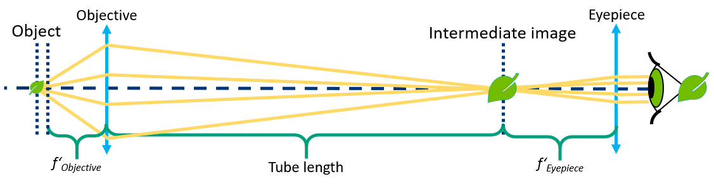
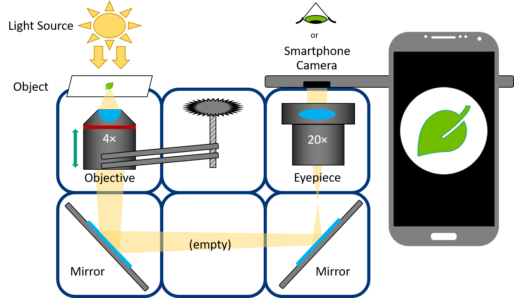
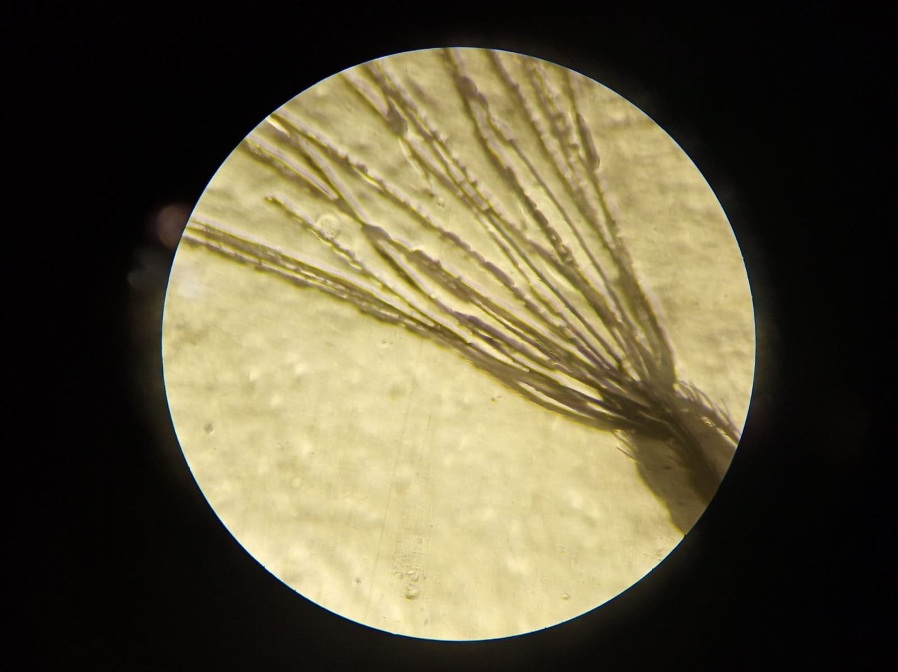

# Simple Smartphone Microscope

This is the repository for the simple version of the [Smartphone Microscope](../APP_SMARTPHONE_MICROSCOPE).

There is a [mechanical only version](./mechanical) and a [version with electronics](./electronic), but without the need of Raspberry Pi or the android app, as compared to the full version of this microscope.

  Electronic version

The microscope is an optical instrument that makes it possible to see magnified images of objects that are too small to be seen by the naked eye.

Old or simple microscopes use objectives that are designed for a defined tube length and they form a real intermediate image in a given distance from the objective. The intermediate image is further magnified by the eyepiece. These microscopes are „finite“ optical systems.

  Mechanical version.

The optical path is composed of two main elements - microscope objective and an eyepiece. The finite corrected objective (MO) lens produces an intermediate image in its tube length (160 mm). This image is propagated to infinity by the eyepiece (EP). The smartphone (CAM) focusses this image on the smartphone's camera sensor. The mirrors (M) are just folding the beam. In the electronic version, the LED-Array (LA) is giving the option of different illumination intensity.

Magnification of the microscope is given by  
***M = Mobjective × Meyepiece***

Note: Not all the pictures on this site show the latest version of the Z-stage. Follow the respective assembly guidelines.

## Device's features:

* Z-Focus
* Inverted Microscope
* High resolution
* Open-Source
* Compatible with Educational/Professional fields
* Compatible with almost any smartphone
* Different illumination intensity

In the end it should look like this (UC2_v2 version displayed):

##  Results
This is a quick result we shot with an Xperia Z5 of potato starch cells:

This is a quick result we shot with an Huawei P9 of dandelion fuss:

##  Participate!

Do you want to show your own results? Do you have ideas for improvements? Let us know!
