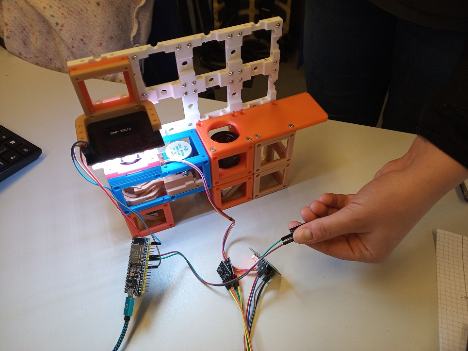
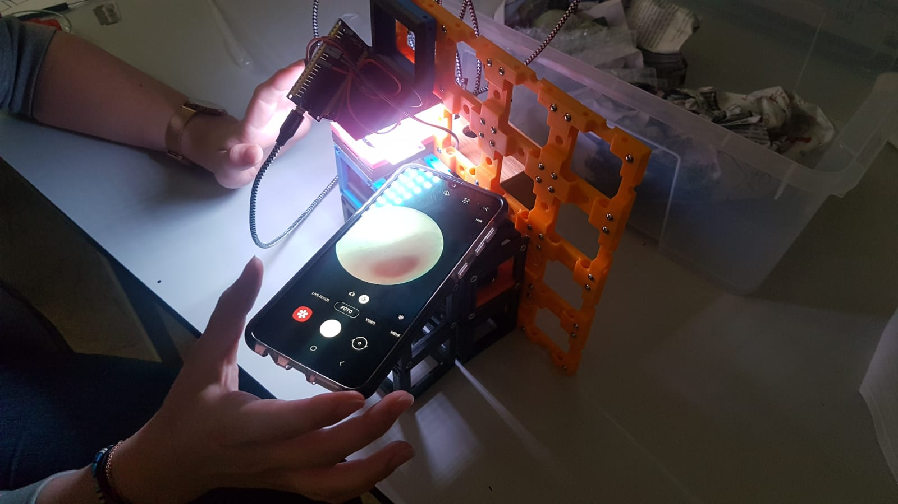
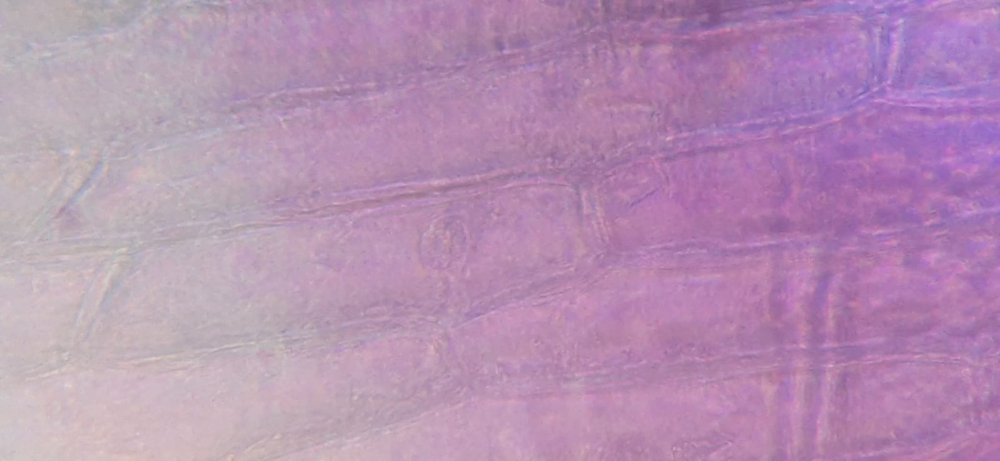

# Simple Smartphone Microscope - version with electronics

This is the repository for the simple electronic version of the [Smartphone Microscope](../../APP_SMARTPHONE_MICROSCOPE).

This microscope and the code for the ESP32 is a work of students from KL-Gymnasium in Erfurt. It was updated to the v3 version by UC2 core team.

## Devices' features:
* Simple microscope for smartphone imaging
* Manual alignment helps to understand the principle of a microscope
* Teaching the basics of electronics that are needed for more advanced setups

## Parts
The [Bill of Materials](https://docs.google.com/spreadsheets/d/1U1MndGKRCs0LKE5W8VGreCv9DJbQVQv7O6kgLlB6ZmE/edit?usp=sharing) is always the most up-to-date version!

### Modules for this setup

|  Name | Properties  |  Price | Link  | # |
|---|---|---|---|---|
|  Baseplate puzzle| - | 5€  | [Base-plate](../../../CAD/ASSEMBLY_Baseplate/)  | 8|
|  Module: Z-Stage | -  | ?? €  | [Z-Stage](../../../CAD/ASSEMBLY_CUBE_Z-STAGE_objective)  | 1|
|  Module: Sample holder | -  | 5 €  | [Sample holder](../../../CAD/ASSEMBLY_CUBE_Sample_Holder)  | 1|
|  Module: Mirror 45°  | - | 5€  | [Mirror 45](../../../CAD/ASSEMBLY_CUBE_Mirror_45)  | 2|
|  Module: Eyepiece with Smartphone Holder  | - | ??€  | [Eyepiece + Smartphone](../../../CAD/ASSEMBLY_CUBE_Eyepiece)  | 1|
|  Module: LED array  | -| ??€  | [LED array](../../../CAD/ASSEMBLY_CUBE_LED_Matrix)  | 1|
|  Module: Empty Cube  | For stability of the setup, it is better to fill the empty positions under other cubes. | 4€  | [Cube](../../../CAD/ASSEMBLY_CUBE_Base)  | 2|

###  3D-printing
To acquire the STL-files use the [UC2-Configurator](https://uc2configurator.netlify.app/). The files themselves are in the [RAW](../../RAW/STL) folder. The module can be built using injection-moulded (IM) or 3D-printed (3DP) cubes. Choose the APP_Smartphone microscope for this one.

In the end it should look like this (UC2_v2 cubes displayed):

##  Additional components
* Check out the [RESOURCES](../../../TUTORIALS/RESOURCES) for more information!
* 1× Smartphone
* 1× LED-Array, Neopixel, 8x8 [🢂](https://www.amazon.de/AZDelivery-Matrix-CJMCU-8-Arduino-Raspberry/dp/B078HYP681/ref=sr_1_2?__mk_de_DE=%C3%85M%C3%85%C5%BD%C3%95%C3%91&keywords=neopixel+matrix&qid=1565008576&s=gateway&sr=8-2)
*  36× - 68× 5mm Ball magnets [🢂](https://www.magnetmax.de/Neodym-Kugelmagnete/Magnetkugel-Kugelmagnet-O-5-0-mm-Neodym-vernickelt-N40-haelt-400-g::158.html)
* 36× - 72× Screws DIN912 ISO 4762 M3×12 mm [🢂](https://eshop.wuerth.de/Zylinderschraube-mit-Innensechskant-SHR-ZYL-ISO4762-88-IS25-A2K-M3X12/00843%20%2012.sku/de/DE/EUR/)
* 1× M3×30 mm and M3 nut - non-magnetic
* 1× Objective Lens (e.g. 10×, NA 0.3) [🢂](https://de.aliexpress.com/item/32947647522.html?spm=a2g0x.search0104.3.54.6cf57a4c3DwsTO&transAbTest=ae803_3&ws_ab_test=searchweb0_0%2Csearchweb201602_6_10065_10130_10068_10890_10547_319_10546_317_10548_10545_10696_10084_453_454_10083_10618_10307_537_536_10902_10059_10884_10887_321_322_10103%2Csearchweb201603_6%2CppcSwitch_0&algo_pvid=06d972be-b176-4446-8665-56d9e61a8d2c&algo_expid=06d972be-b176-4446-8665-56d9e61a8d2c-7)
* 1× Eyepiece (e.g. 20×) [🢂](https://de.aliexpress.com/item/32965050204.html?spm=a2g0o.productlist.0.0.7aa657eeefLUfu&algo_pvid=cd60fca0-3fa5-4191-9ce9-303815e2afa7&algo_expid=cd60fca0-3fa5-4191-9ce9-303815e2afa7-1&btsid=76036b58-6717-4d1f-a4a0-c3d4bacd0450&ws_ab_test=searchweb0_0,searchweb201602_2,searchweb201603_52)
* 2× Mirrors (e.g. 30×30 mm² Toymirrors) [🢂](https://www.amazon.de/Rayher-14548606-Spiegelmosaik-selbstklebend-SB-Btl/dp/B008KJ8438/ref=pd_bxgy_201_img_3/258-8761405-4543762?_encoding=UTF8&pd_rd_i=B008KJ8438&pd_rd_r=80fd534c-997b-4a19-b91a-9bf38dbf4ade&pd_rd_w=4DEXV&pd_rd_wg=7SLRE&pf_rd_p=98c98f04-e797-4e4b-a352-48f7266a41af&pf_rd_r=N95R9S45MNSYNQX2BAJE&psc=1&refRID=N95R9S45MNSYNQX2BAJE)
* 2× ESP32 [🢂](https://www.amazon.de/AZDelivery-NodeMCU-Development-Nachfolgermodell-ESP8266/dp/B074RGW2VQ/ref=sr_1_3?__mk_de_DE=%C3%85M%C3%85%C5%BD%C3%95%C3%91&keywords=esp32&qid=1565008313&s=gateway&sr=8-3)
* 1× Stepper Motor and 1× Driver Board [🢂](https://www.amazon.de/Elegoo-Stepper-Schrittmotor-28BYJ-48-Treiberplatine/dp/B01MEGIHLF/ref=sr_1_1_sspa?__mk_de_DE=%C3%85M%C3%85%C5%BD%C3%95%C3%91&keywords=stepper+arduino&qid=1565008205&s=gateway&sr=8-1-spons&psc=1)
* 3× Button [🢂](https://www.az-delivery.de/products/button-modul?_pos=2&_sid=f2080c1b0&_ss=r)
* 15× Female-Female Jumper Wire, 0.14 mm² [🢂](https://www.amazon.de/ZOORE-120pcs-Multicolored-Female-Breadboard/dp/B07P85V1G3/ref=sr_1_5?__mk_de_DE=%C3%85M%C3%85%C5%BD%C3%95%C3%91&keywords=jumper+male&qid=1565690543&s=industrial&sr=1-5)
* 2× Power cables for ESP32 - USB-microUSB [🢂](https://www.amazon.de/dp/B0778FV6K4/ref=sr_1_2?dchild=1&fst=as%3Aoff&qid=1586361990&refinements=p_89%3AGritin&rnid=669059031&s=computers&sr=1-2)

##  Assembly
For assembly instructions of the respective modules refer to the links in Modules for this setup.

##  Electronics (for dummies)

Don't have much experience with electronics? It's actually really simple:

* When using jumper wires you can avoid soldering.
* LED array - 3 wires + 2 wires for the button

* Z-stage - 6 wires + motor connection + 2×2 wires for two buttons

* Power the ESP32 simply with microUSB cables.
* And it works just like that ;-)

##  Code
In the [CODE](./CODE) folder you find the code for both the [LED array](./CODE/ESP32_ledarr_simple) and [Z-stage](./CODE/ESP32_z_motor_simple).

Have a look in the [TUTORIALS](../../../TUTORIALS) for a beginners guide to UC2 hardware controls.

Prerequisities:
* [Arduino IDE](https://www.arduino.cc/en/main/software) installed
* ESP32 libraries - [Installation guide here](https://randomnerdtutorials.com/installing-the-esp32-board-in-arduino-ide-windows-instructions/)
* [FastLED.h](https://www.arduinolibraries.info/libraries/fast-led) library

##  Results

 
Right: Smartphone microscope during the classroom experiments; left: Red onion cells, the nucleus visible in the center

**Where next?**  
Find out more about the smartphone microscope in the [SimpleBOX manuals](../../../TheBOX/SimpleBOX/DOCUMENTS)  
Find out more about the electronics in the [Electronics section](../../../ELECTRONICS)  
Find out more about the software for this setup in our dedicated [UC2-Software-GIT](https://github.com/bionanoimaging/UC2-Software-GIT)   
Or return to the [TUTORIALS](../../../TUTORIALS)

##  Participate!

Do you want to show your own results? Do you have ideas for improvements? Let us know!
