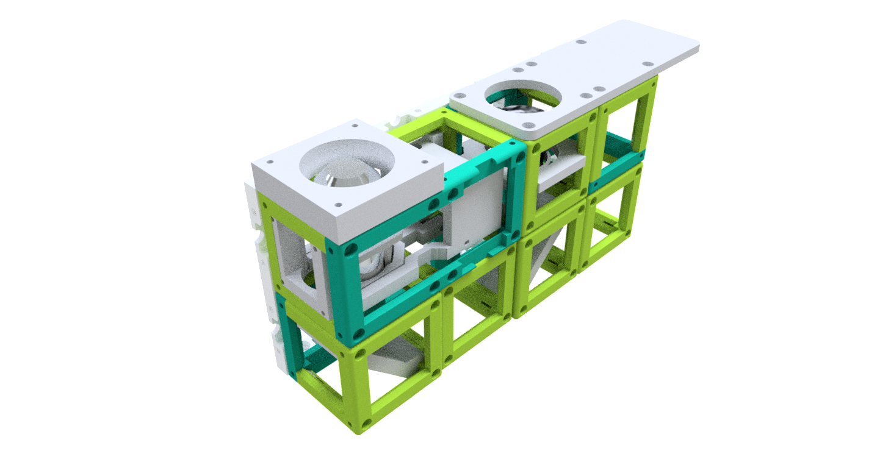

# Simple Smartphone Microscope - mechanical only version

This is the repository for the simple mechanical-only version of the [Smartphone Microscope](../../APP_SMARTPHONE_MICROSCOPE).

## Parts

### Modules for this setup

|  Name | Properties  |  Price | Link  | # |
|---|---|---|---|---|
|  4×2 Baseplate | - | 5€  | [Base-plate](../../../CAD/ASSEMBLY_Baseplate_v2/)  | 1|
|  Module: mechanical Z-Stage | -  | ?? €  | [Z-Stage](../../../CAD/ASSEMBLY_CUBE_Z-STAGE_mechanical_v2)  | 1|
|  Module: Mirror 45°  | - | 5€  | [Mirror 45](../../../CAD/ASSEMBLY_CUBE_Mirror_45_v2)  | 2|
|  Module: Eyepiece with Smartphone Holder  | - | ?? €  | [Eyepiece + Smartphone](../../../CAD/ASSEMBLY_CUBE_Eyepiece_v2)  | 1|
|  Module: Empty Cube  | For stability of the setup, it is better to fill the empty positions under other cubes. | 4€  | [Cube](../../../CAD/ASSEMBLY_CUBE_Base_v2)  | 3|

### Parts to print

* 1× [Base-plate 4×2](../STL/Assembly_base_4x2.stl)
* 6× [Cube base 1×1](../STL/10_Cube_1x1_v2.stl)
* 6x [Cube lid 1×1](../STL/10_Lid_1x1_v2.stl)
* 1× [Cube base 2×1](../STL/10_Cube_2x1_v2.stl)
* 1× [Cube lid 2×1](../STL/10_Lid_el_2x1_v2.stl)
* 1× [Cube Insert for Eyepiece](../STL/20_Cube_Insert_Holder-okular_v2.stl)
* 1× [Smartphone Holder](../STL/30_Smartphone_Holder.stl)
* 2× [Cube Insert for Mirror - 45°](../STL/20_Cube_Insert_Mirror_Holder_30x30Mirror_v2.stl)
* 1× [Cube Insert for Z-stage](../STL/20_focus_inlet_linearflexure_v0.stl)
* 1× [Z-stage Insert for Objective](../STL/30_focus_inlet_objective_mount_v7.stl)
* 1× [Z-stage bottom plate](../STL/Assembly_Z-Focus_Linearbearing_mechanical_v0_20_focus_inlet_plate_bottom_2)
* 1× [Z-stage top plate](../STL/Assembly_Z-Focus_Linearbearing_mechanical_v0_20_focus_inlet_plate_top_3)
* 1× [Z-stage gear](../STL/Assembly_Z-Focus_Linearbearing_mechanical_v0_00_large_gear_4)
* 1× [Z-stage Sample plate](../STL/Assembly_Z-Focus_Linearbearing_mechanical_v0_30_Z_Stage_Sampleplate_8)
* 1× [Coupling Screw M3](../STL/30_Coupling_Screw_28BYJ_M3.stl)
* Optional: 1× [Generic Clamp for Slides](../STL/30_Sampleclamp_generic.stl)- current design is for 5 mm magnets (same as Baseplate)

In the end it should look like this:

##  Additional components
* Check out the [RESOURCES](../../../TUTORIALS/RESOURCES) for more information!
* 1× Smartphone
*  32× 5mm Ball magnets [🢂](https://www.magnetmax.de/Neodym-Kugelmagnete/Magnetkugel-Kugelmagnet-O-5-0-mm-Neodym-vernickelt-N40-haelt-400-g::158.html)
* 40× - 72× Screws DIN912 ISO 4762 M3×12 mm [🢂](https://eshop.wuerth.de/Zylinderschraube-mit-Innensechskant-SHR-ZYL-ISO4762-88-IS25-A2K-M3X12/00843%20%2012.sku/de/DE/EUR/)
* 1× M3×30 mm and M3 nut - non-magnetic
* 1× Objective Lens (e.g. 10×, NA 0.3) [🢂](https://de.aliexpress.com/item/32947647522.html?spm=a2g0x.search0104.3.54.6cf57a4c3DwsTO&transAbTest=ae803_3&ws_ab_test=searchweb0_0%2Csearchweb201602_6_10065_10130_10068_10890_10547_319_10546_317_10548_10545_10696_10084_453_454_10083_10618_10307_537_536_10902_10059_10884_10887_321_322_10103%2Csearchweb201603_6%2CppcSwitch_0&algo_pvid=06d972be-b176-4446-8665-56d9e61a8d2c&algo_expid=06d972be-b176-4446-8665-56d9e61a8d2c-7)
* 1× Eyepiece (e.g. 20×) [🢂](https://de.aliexpress.com/item/32965050204.html?spm=a2g0o.productlist.0.0.7aa657eeefLUfu&algo_pvid=cd60fca0-3fa5-4191-9ce9-303815e2afa7&algo_expid=cd60fca0-3fa5-4191-9ce9-303815e2afa7-1&btsid=76036b58-6717-4d1f-a4a0-c3d4bacd0450&ws_ab_test=searchweb0_0,searchweb201602_2,searchweb201603_52)
* 2× Mirrors (e.g. 30×30 mm² Toymirrors) [🢂](https://www.amazon.de/Rayher-14548606-Spiegelmosaik-selbstklebend-SB-Btl/dp/B008KJ8438/ref=pd_bxgy_201_img_3/258-8761405-4543762?_encoding=UTF8&pd_rd_i=B008KJ8438&pd_rd_r=80fd534c-997b-4a19-b91a-9bf38dbf4ade&pd_rd_w=4DEXV&pd_rd_wg=7SLRE&pf_rd_p=98c98f04-e797-4e4b-a352-48f7266a41af&pf_rd_r=N95R9S45MNSYNQX2BAJE&psc=1&refRID=N95R9S45MNSYNQX2BAJE)

##  Assembly

* [Baseplate ](../../../CAD/ASSEMBLY_Baseplate_v2/)
* [Z-stage ](../../../CAD/ASSEMBLY_CUBE_Z-STAGE_mechanical_v2/)
* 2× [Mirror Cube ](../../../CAD/ASSEMBLY_CUBE_Mirror_45_v2/)
* [Eyepiece Cube ](../../../CAD/ASSEMBLY_CUBE_Eyepiece_v2/)
* [Smartphone holder Cube ](../../../CAD/ASSEMBLY_CUBE_Cellphonemount/)
* 2× Additional [empty cube](../../../CAD/ASSEMBLY_CUBE_Base_v2)

**Where next?**  
Find out more about the smartphone microscope in the [SimpleBOX manuals](../../../TheBOX/SimpleBOX/DOCUMENTS)     
Or return to the [TUTORIALS](../../../TUTORIALS)

##  Participate!

Do you want to show your own results? Do you have ideas for improvements? Let us know!
