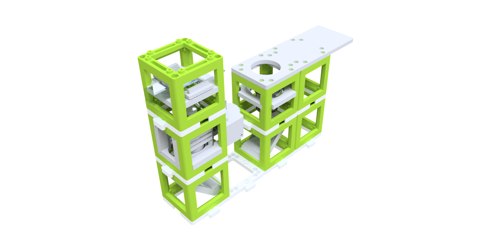
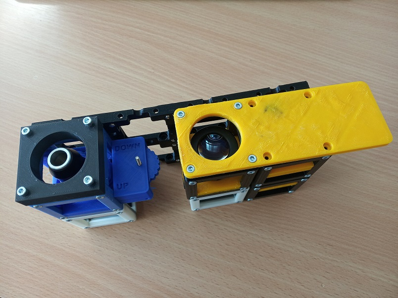
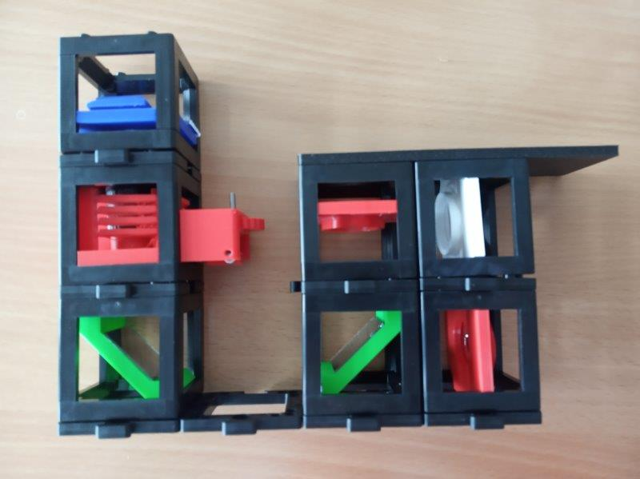

# Simple Smartphone Microscope - mechanical only version

This is the repository for the simple mechanical-only version of the [Smartphone Microscope](../../APP_SMARTPHONE_MICROSCOPE).

## Devices' features:
* Simple microscope for smartphone imaging
* Manual alignment helps to understand the principle of a microscope
* **Estimated price of the setup: 65€**

## Parts
The [Bill of Materials](https://docs.google.com/spreadsheets/d/1U1MndGKRCs0LKE5W8VGreCv9DJbQVQv7O6kgLlB6ZmE/edit?usp=sharing) is always the most up-to-date version!

### Modules for this setup

|  Name | Properties  |  Price | Link  | # |
|---|---|---|---|---|
|  Baseplate puzzle| - | 5€  | [Base-plate](../../../CAD/ASSEMBLY_Baseplate/)  | 8|
|  Module: mechanical Z-Stage | -  | 20 €  | [Z-Stage](../../../CAD/ASSEMBLY_CUBE_Z-STAGE_mechanical)  | 1|
|  Module: Sample holder | -  | 5 €  | [Sample holder](../../../CAD/ASSEMBLY_CUBE_Sample_Holder)  | 1|
|  Module: Mirror 45°  | - | 3€  | [Mirror 45](../../../CAD/ASSEMBLY_CUBE_Mirror_45)  | 2|
|  Module: Eyepiece with Smartphone Holder  | Alternatively, a lens | 16 €  | [Eyepiece + Smartphone](../../../CAD/ASSEMBLY_CUBE_Eyepiece)  | 1|
|  Module: Empty Cube  | For stability of the setup, it is better to fill the empty positions under other cubes. | 3€  | [Cube](../../../CAD/ASSEMBLY_CUBE_Base)  | 2|

###  3D-printing
To acquire the STL-files use the [UC2-Configurator](https://uc2configurator.netlify.app/). The files themselves are in the [RAW](../../../CAD/RAW/STL) folder. The module can be built using injection-moulded (IM) or 3D-printed (3DP) cubes. Choose the APP_Simple Smartphone microscope for this one.

In the end it should look like this:

##  Additional components
* Check out the [RESOURCES](../../../TUTORIALS/RESOURCES) for more information!
* 1× Smartphone
*  32× - 36× 5mm Ball magnets [🢂](https://www.magnetmax.de/Neodym-Kugelmagnete/Magnetkugel-Kugelmagnet-O-5-0-mm-Neodym-vernickelt-N40-haelt-400-g::158.html)
* 32× - 56× Screws DIN912 ISO 4762 M3×12 mm [🢂](https://eshop.wuerth.de/Zylinderschraube-mit-Innensechskant-SHR-ZYL-ISO4762-88-IS25-A2K-M3X12/00843%20%2012.sku/de/DE/EUR/)
* 7× DIN912 M3×8 screws (galvanized steel)
* 1× M3×30 mm and M3 nut - non-magnetic
* 1× Objective Lens (e.g. 10×, NA 0.3) [🢂](https://de.aliexpress.com/item/32947647522.html?spm=a2g0x.search0104.3.54.6cf57a4c3DwsTO&transAbTest=ae803_3&ws_ab_test=searchweb0_0%2Csearchweb201602_6_10065_10130_10068_10890_10547_319_10546_317_10548_10545_10696_10084_453_454_10083_10618_10307_537_536_10902_10059_10884_10887_321_322_10103%2Csearchweb201603_6%2CppcSwitch_0&algo_pvid=06d972be-b176-4446-8665-56d9e61a8d2c&algo_expid=06d972be-b176-4446-8665-56d9e61a8d2c-7)
* 1× Eyepiece (e.g. 20×) [🢂](https://de.aliexpress.com/item/32965050204.html?spm=a2g0o.productlist.0.0.7aa657eeefLUfu&algo_pvid=cd60fca0-3fa5-4191-9ce9-303815e2afa7&algo_expid=cd60fca0-3fa5-4191-9ce9-303815e2afa7-1&btsid=76036b58-6717-4d1f-a4a0-c3d4bacd0450&ws_ab_test=searchweb0_0,searchweb201602_2,searchweb201603_52)
* 2× Mirrors (e.g. 30×30 mm² Toymirrors) [🢂](https://www.amazon.de/Rayher-14548606-Spiegelmosaik-selbstklebend-SB-Btl/dp/B008KJ8438/ref=pd_bxgy_201_img_3/258-8761405-4543762?_encoding=UTF8&pd_rd_i=B008KJ8438&pd_rd_r=80fd534c-997b-4a19-b91a-9bf38dbf4ade&pd_rd_w=4DEXV&pd_rd_wg=7SLRE&pf_rd_p=98c98f04-e797-4e4b-a352-48f7266a41af&pf_rd_r=N95R9S45MNSYNQX2BAJE&psc=1&refRID=N95R9S45MNSYNQX2BAJE)

##  Assembly
For assembly instructions of the respective modules refer to the links in Modules for this setup.

## Building the Smartphone microscope
Smartphone microscope is the biggest and coolest experiment you can do and when you build that, you can move from the realm of Physics to Biology and start observing real samples from around you. But it's very important that you build it correctly
  * Build a 4×1 baseplate

  * Add the two mirrors to their positions, facing each other

  * Add an additional cube (empty or one you won't need for this microscope). The scheme is mirror - empty - mirror - random cube

  * Add an additional cube (empty or one you won't need for this microscope). The scheme is mirror - empty - mirror - random cube

  *  Add the next layer of cubes: Z-stage - (empty because there is no first layer) - 40 mm lens or eyepiece - random cube for support

  *  Add one baseplate puzzle on top of the Z-stage

  *  Add the Sample holder cube above the Z-stage - above the objective

  *  Place the Smartphone holder over the 40 mm lens (eyepiece) and the support cube. It attaches do the pins of the cube the same way the baseplates do

  *  This is how the finished microscope looks like

  *  The sample goes into the holder, above the objective

  *  Then you can observe it through the eyepiece

  * Tips and trick for the alignment:
      * The objective has to be quite high up - the plane where the ring and the objective housing touch should be 160 mm from the mirror that is below the eyepiece
      * Every phone is a little different and in order to match the pupils you might need to take of the case of your phone (to get closer) or introduce some extra spacer, like a folded piece of paper (to get further from the eyepiece lens)
      * Before assembling the microscope completely, align the objective by shifting it in the rail of the Z-stage. Mind the required distance of 160 mm to the mirror. Roughly, the red stripe on the objective should be just above the cube's face
      * With the microscope assembled and the sample on top, look through the eyepiece and move the sample holder insert in its cube by hand to get roughly into focusing. You can start by moving the sample through the whole range of the cube to get a feeling for where the focus lies

**Where next?**  
Find out more about the smartphone microscope in the [SimpleBOX manuals](../../../TheBOX/SimpleBOX/DOCUMENTS)     

### This was TUT06 of [TUTORIALS](../../../TUTORIALS). Continue to [TUT07](../../../CAD/ASSEMBLY_CUBE_LED_Matrix_simple)!

##  Participate!

Do you want to show your own results? Do you have ideas for improvements? Let us know!
