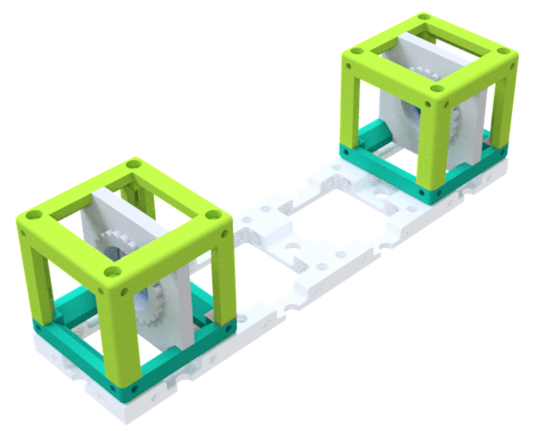
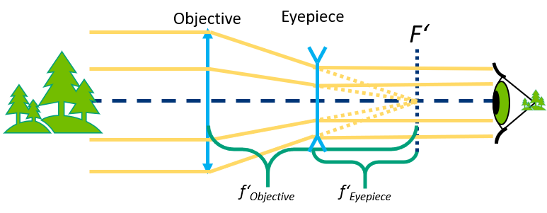
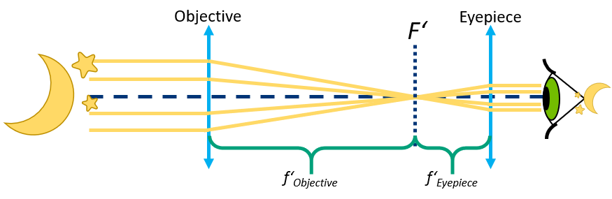
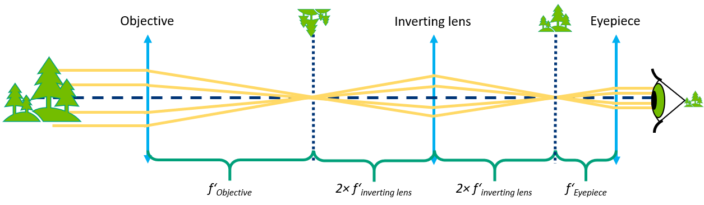

# Simple Telescopes

([TUT05 of TUTORIALS](../../../TUTORIALS))

We developed a very easy-to-use setup to help you understand how a telescope works. It guides you through different optical designs, all with one goal: magnifying far-away objects.

### Schemes of the telescopes

## Parts

### Modules for this setup

|  Name | Properties  |  Price | Link  | # |
|---|---|---|---|---|
|  4×1 Baseplate | - | 5€  | [Base-plate](../ASSEMBLY_Baseplate_v2/)  | 2|
|  Module: Lens Cube | -  | 20 €  | [Lens](../ASSEMBLY_CUBE_Lens_v2)  | 4|

### Parts to print

* 2× [Base-plate 4×1](./STL/Assembly_base_4x1.stl)
* 4× [Cube base 1×1](./STL/10_Cube_1x1_v2.stl)
* 4x [Cube lid 1×1](./STL/10_Lid_1x1_v2.stl)
* 3× [Thin Lens Holder](./STL/1inch_Assembly_Insert_Lens_mount_fixed_20_Lens_holder.stl)
* 1× [Thick Lens Holder](./STL/20_Lens_mount_thick_lens.stl)
* 4x [Lens Clamp](./STL/1inch_Assembly_Insert_Lens_mount_fixed_20_Lens_holder_clamp.stl)

In the [STL](./STL) folder you find lens holders for a thin and thick lens with diameter of 1 inch. When using different lenses, please follow our [Tutorial: Design your own Lens Holder](../../CAD/ASSEMBLY_CUBE_Lens_v2/STL#design-your-own-lens-holder).

##  Additional components
* 1× planoconvex lens, *f'* = +100 mm, diameter 25,4 mm (Artikel 2004) [🢂](https://optikbaukasten.de/)
* 2× planoconvex lens, *f'* = +40 mm, diameter 25,4 mm, (Artikel 2120) [🢂](https://optikbaukasten.de/)
* 1× planoconcave lens, *f'* = -50 mm, diameter 25,4 mm [🢂](https://www.thorlabs.com/thorproduct.cfm?partnumber=LC1259)
* 32× 5mm Ball magnets [🢂](https://www.magnetmax.de/Neodym-Kugelmagnete/Magnetkugel-Kugelmagnet-O-5-0-mm-Neodym-vernickelt-N40-haelt-400-g::158.html)
* 16× - 32× Screws DIN912 ISO 4762 M3×12 mm [🢂](https://eshop.wuerth.de/Zylinderschraube-mit-Innensechskant-SHR-ZYL-ISO4762-88-IS25-A2K-M3X12/00843%20%2012.sku/de/DE/EUR/)

##  Assembly

* [Baseplate](../../CAD/ASSEMBLY_Baseplate_v2/)
* [Lens Cube](../../CAD/ASSEMBLY_CUBE_Lens_v2/)

## Alignment

Pre-align the telescope by putting every lens holder roughly in the center of the cube. Then look through it on some far away object (rather out of the window then across the table) and shift the eyepiece lens until you see a sharp magnified image.

The mutual position of the lenses is crucial for the working principle of the telescope. Read more about how the telescopes work and align them properly :-)

## Behind the telescope

A refracting telescope (also called a refractor) is a type of optical telescope that uses lenses to form an image. Refractors were the earliest type of optical telescope. The first practical refracting telescopes appeared in the Netherlands about 1608. All refracting telescopes use the same principles. The combination of an objective lens and eyepiece lens is used to gather more light than the human eye is able to collect on its own, focus it, and present the viewer with a brighter, clearer, and magnified virtual image.

The magnification of such a simple telescope is given by  
***M =  f1 / |f2|***

### Galilean Telescope

The design Galileo Galilei used in 1609 is commonly called a Galilean telescope. It used a convergent (plano-convex) objective lens and a divergent (plano-concave) eyepiece lens [Galileo, 1610].  In a Galilean telescope, the image is non-inverted, since the design has no intermediary focus.

Galileo’s best telescope magnified objects about 30 times. Because of flaws in its design, such as the shape of the lens and the narrow field of view, the images were blurry and distorted. Despite these flaws, the telescope was still good enough for Galileo to explore the sky. The Galilean telescope could view the phases of Venus, and was able to see craters on the Moon and four moons orbiting Jupiter.  

The concave lens L2 serves as an eyepiece and is placed in front of the focal plane of the objective lens L1 in such a way that the back focal point F1‘ of L1 coincides with the focal point F2 of L2. The distance between the principle planes of objective and eyepiece is f1 - │f2│.  

We then observe a virtual non-inverted magnified image of the observed object.

### Keplerian Telescope

The Keplerian telescope, invented by Johannes Kepler in 1611, is an improvement on Galileo's design. It uses a convex lens as the eyepiece instead of Galileo's concave one. The advantage of this arrangement is that the rays of light emerging from the eyepiece are converging. This allows for a much wider field of view and greater eye relief, but the image for the viewer is inverted. Considerably higher magnifications can be reached with this design, but to overcome aberrations the simple objective lens needs to have a very high ratio of focal distances (Johannes Hevelius built one with a 46-metre  focal length, and even longer tubeless "aerial telescopes" were constructed).  

Keplerian telescope is composed of two convex lenses. The objective lens L1, focal distance f1, creates an image which is then observed through the eyepiece lens L2 with focal distance f2. The distance between the principle planes of objective and eyepiece is f1 + f2 .

We then observe a virtual inverted magnified image of the observed object.

### Terrestrial telescope

A terrestrial telescope is a telescope which, unlike most telescopes used for astronomical purposes, contains an arrangement of lenses presenting a non-inverted image to the observer, suitable for observation of objects on the Earth's surface.

A terrestrial telescope is, in a way, just a Keplerian telescope modified for terrestrial observation. An inverting lens is placed between the objective and the eyepiece and it inverts the image in the focal plane of the objective, so it’s flipped when viewed through the eyepiece.

The inverting lens doesn’t contribute to the magnification and the magnification is calculated the same way as in a Keplerian telescope.

Source of information for the above text:  [1](https://en.wikipedia.org/wiki/Refracting_telescope)  [2](https://en.wiktionary.org/wiki/terrestrial_telescope)

Where next?  
The telescopes are also a part of the [SimpleBOX](../../TheBOX/SimpleBOX). Find out more about in the [SimpleBOX manuals](../../../TheBOX/SimpleBOX/DOCUMENTS)    
Or return to the [TUTORIALS](../../../TUTORIALS)

##  Participate!

Do you want to show your own results? Do you have ideas for improvements? Let us know!
