# Smartphone Microscope

This is the repository for the Smartphone Microscope.

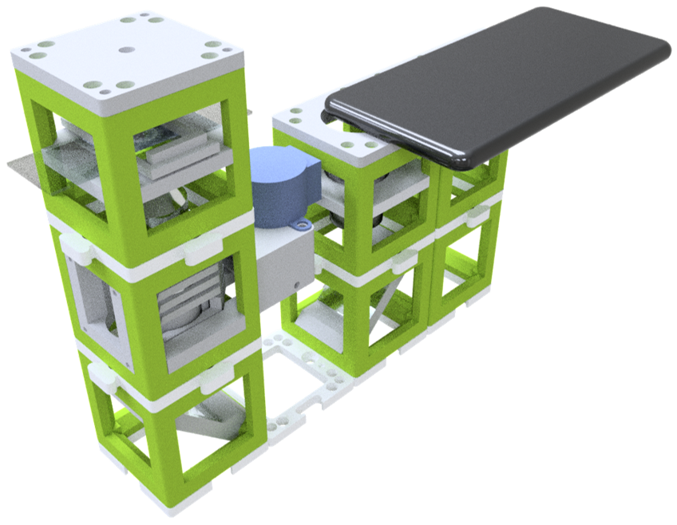

It's based on a compound microscope which itself relies on finite corrected objective lenses. The Smartphone reimages the image of the ocular onto the camera sensor. This means that the cellphone's camera lens acts like the eye. Proper imaging is achieved if the exit pupil of the eyepiece is matching well with the entrance pupil of the smartphone camera.

Further details can also be found in the *cell-scope* publication by Professor Fletcher at Berkeley. It can also be found on  [their website](https://cellscope.berkeley.edu/).

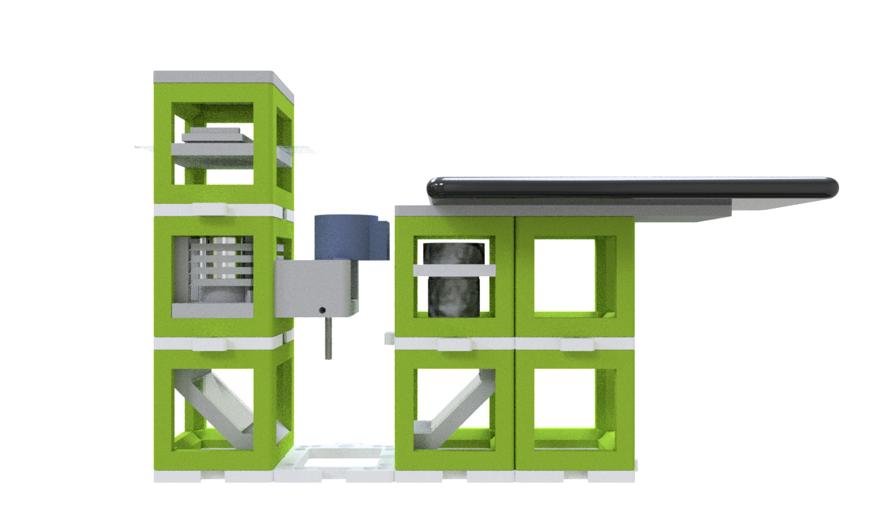

The optical path is relying on the finite corrected objective (MO) lens which produces an intermediate image in its tube-length. This image is propagated to infinity by the eyepiece (EP). The smartphone (CAM) expects this image to form an image on the cellphone's camera-sensor. The mirrors (M) are basically just folding the beam, the LED-Array (LA) is giving the opportunity to have different imaging modalities like Dark-, Brightfield or (quantitative) Differential Phase Contrast.

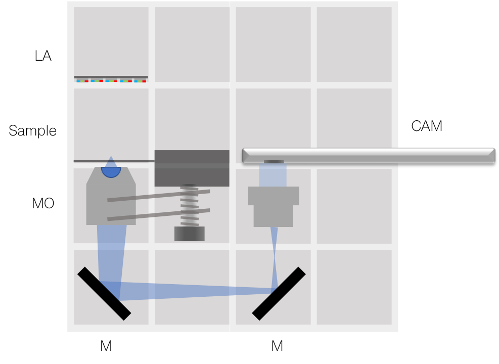

Alternatively, you could build this microscope using the [Z-stage (sample)](../../CAD/ASSEMBLY_CUBE_Z-STAGE_sample) instead of the [Z-stage (objective)](../../CAD/ASSEMBLY_CUBE_Z-STAGE_objective).

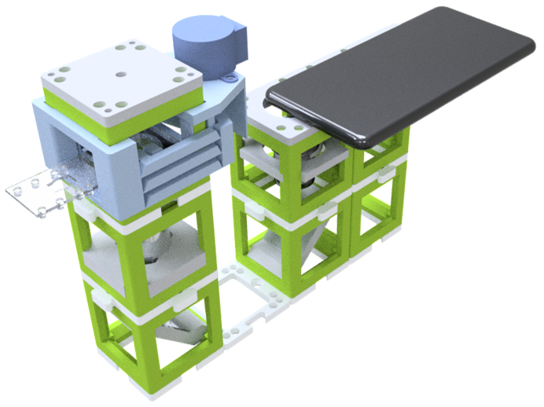
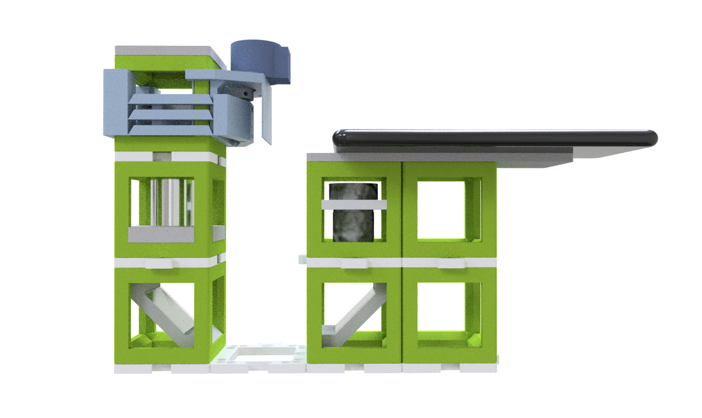

Note: The pictures on this site do not show the latest version of the Z-stage. Follow the respective assembly guidelines.

## Device's features:

* Z-Focus
* Upright Microscope
* High resolution
* Open-Source
* Compatible with Educational/Professional fields
* Compatible with almost any smartphone
* Different imaging modalities
* Different illumination modes
* Fluorescent Module enables "true" fluorescent imaging
* The electronics can be operated via WiFi

## Parts
The [Bill of Materials](https://docs.google.com/spreadsheets/d/1U1MndGKRCs0LKE5W8VGreCv9DJbQVQv7O6kgLlB6ZmE/edit?usp=sharing) is always the most up-to-date version!

### Modules for this setup

|  Name | Properties  |  Price | Link  | # |
|---|---|---|---|---|
|  Baseplate puzzle| - | 5€  | [Base-plate](../../CAD/ASSEMBLY_Baseplate/)  | 8|
|  Module: Z-Stage | -  | ?? €  | [Z-Stage](../../CAD/ASSEMBLY_CUBE_Z-STAGE_objective)  | 1|
|  Module: Mirror 45°  | - | 5€  | [Mirror 45](../../CAD/ASSEMBLY_CUBE_Mirror_45)  | 2|
|  Module: Eyepiece with Smartphone Holder  | - | ??€  | [Eyepiece + Smartphone](../../CAD/ASSEMBLY_CUBE_Eyepiece)  | 1|
|  Module: LED array  | Optionally LED Ring | ??€  | [LED array](../../CAD/ASSEMBLY_CUBE_LED_Matrix)  | 1|
|  Module: Empty Cube  | For stability of the setup, it is better to fill the empty positions under other cubes. | 4€  | [Cube](../../CAD/ASSEMBLY_CUBE_Base)  | 2|

###  3D-printing
To acquire the STL-files use the [UC2-Configurator](https://uc2configurator.netlify.app/). The files themselves are in the [RAW](../../RAW/STL) folder. The module can be built using injection-moulded (IM) or 3D-printed (3DP) cubes.

In the end it should look like this (UC2_v0 cubes displayed):

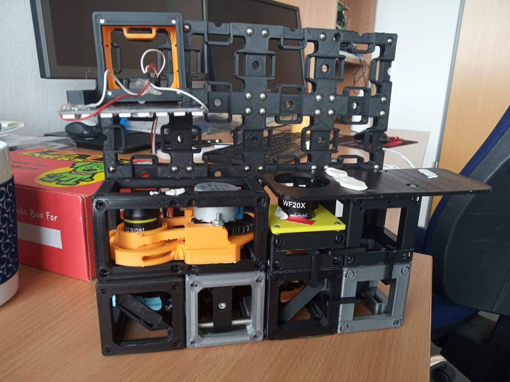
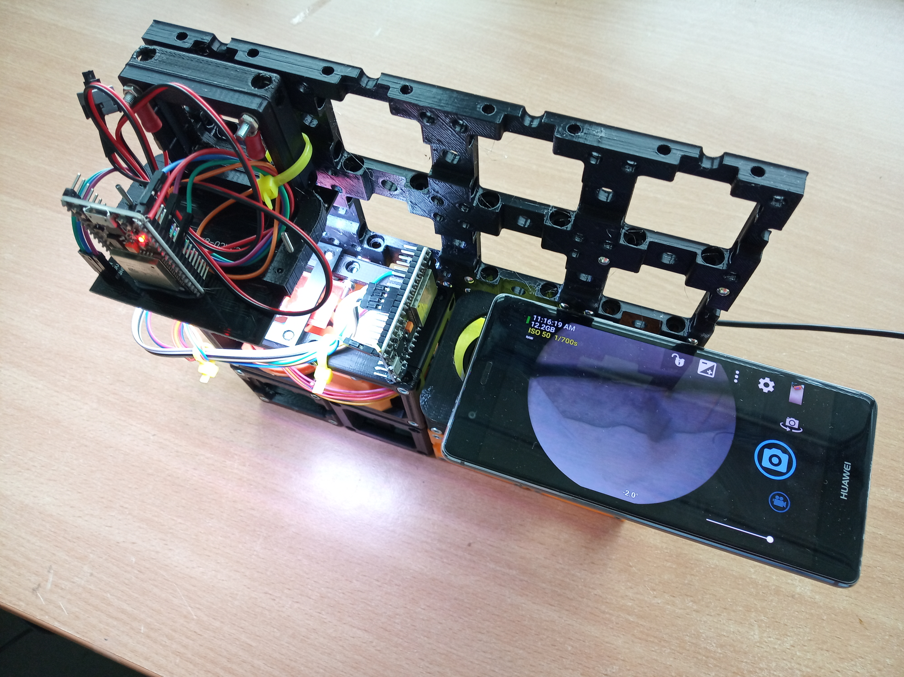
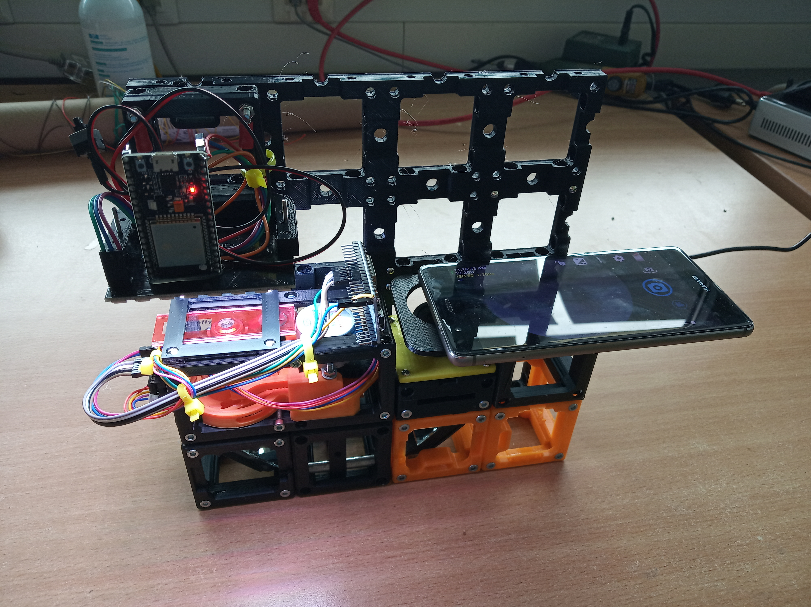

##  Additional components
* Check out the [RESOURCES](../../TUTORIALS/RESOURCES) for more information!
* 1× Smartphone
* 1× LED-Array, Neopixel, 8x8 [🢂](https://www.amazon.de/AZDelivery-Matrix-CJMCU-8-Arduino-Raspberry/dp/B078HYP681/ref=sr_1_2?__mk_de_DE=%C3%85M%C3%85%C5%BD%C3%95%C3%91&keywords=neopixel+matrix&qid=1565008576&s=gateway&sr=8-2)
*  32× - 68× 5mm Ball magnets [🢂](https://www.magnetmax.de/Neodym-Kugelmagnete/Magnetkugel-Kugelmagnet-O-5-0-mm-Neodym-vernickelt-N40-haelt-400-g::158.html)
* 32× - 42× Screws DIN912 ISO 4762 M3×12 mm [🢂](https://eshop.wuerth.de/Zylinderschraube-mit-Innensechskant-SHR-ZYL-ISO4762-88-IS25-A2K-M3X12/00843%20%2012.sku/de/DE/EUR/)
* 1× M3×30 mm and M3 nut - non-magnetic
* 1× Objective Lens (e.g. 10×, NA 0.3) [🢂](https://de.aliexpress.com/item/32947647522.html?spm=a2g0x.search0104.3.54.6cf57a4c3DwsTO&transAbTest=ae803_3&ws_ab_test=searchweb0_0%2Csearchweb201602_6_10065_10130_10068_10890_10547_319_10546_317_10548_10545_10696_10084_453_454_10083_10618_10307_537_536_10902_10059_10884_10887_321_322_10103%2Csearchweb201603_6%2CppcSwitch_0&algo_pvid=06d972be-b176-4446-8665-56d9e61a8d2c&algo_expid=06d972be-b176-4446-8665-56d9e61a8d2c-7)
* 1× Eyepiece (e.g. 20×) [🢂](https://de.aliexpress.com/item/32965050204.html?spm=a2g0o.productlist.0.0.7aa657eeefLUfu&algo_pvid=cd60fca0-3fa5-4191-9ce9-303815e2afa7&algo_expid=cd60fca0-3fa5-4191-9ce9-303815e2afa7-1&btsid=76036b58-6717-4d1f-a4a0-c3d4bacd0450&ws_ab_test=searchweb0_0,searchweb201602_2,searchweb201603_52)
* 2× Mirrors (e.g. 30×30 mm² Toymirrors) [🢂](https://www.amazon.de/Rayher-14548606-Spiegelmosaik-selbstklebend-SB-Btl/dp/B008KJ8438/ref=pd_bxgy_201_img_3/258-8761405-4543762?_encoding=UTF8&pd_rd_i=B008KJ8438&pd_rd_r=80fd534c-997b-4a19-b91a-9bf38dbf4ade&pd_rd_w=4DEXV&pd_rd_wg=7SLRE&pf_rd_p=98c98f04-e797-4e4b-a352-48f7266a41af&pf_rd_r=N95R9S45MNSYNQX2BAJE&psc=1&refRID=N95R9S45MNSYNQX2BAJE)
* 2× ESP32 [🢂](https://www.amazon.de/AZDelivery-NodeMCU-Development-Nachfolgermodell-ESP8266/dp/B074RGW2VQ/ref=sr_1_3?__mk_de_DE=%C3%85M%C3%85%C5%BD%C3%95%C3%91&keywords=esp32&qid=1565008313&s=gateway&sr=8-3)
* 1× Stepper Motor and 1× Driver Board [🢂](https://www.amazon.de/Elegoo-Stepper-Schrittmotor-28BYJ-48-Treiberplatine/dp/B01MEGIHLF/ref=sr_1_1_sspa?__mk_de_DE=%C3%85M%C3%85%C5%BD%C3%95%C3%91&keywords=stepper+arduino&qid=1565008205&s=gateway&sr=8-1-spons&psc=1)
* 9× Female-Female Jumper Wire, 0.14 mm² [🢂](https://www.amazon.de/ZOORE-120pcs-Multicolored-Female-Breadboard/dp/B07P85V1G3/ref=sr_1_5?__mk_de_DE=%C3%85M%C3%85%C5%BD%C3%95%C3%91&keywords=jumper+male&qid=1565690543&s=industrial&sr=1-5)
* 2× Power cables for ESP32 - USB-microUSB [🢂](https://www.amazon.de/dp/B0778FV6K4/ref=sr_1_2?dchild=1&fst=as%3Aoff&qid=1586361990&refinements=p_89%3AGritin&rnid=669059031&s=computers&sr=1-2)
* Optional (for Fluomodule): 2× Star-LEDs blue (high power 1-3 Watt) [🢂](https://www.ebay.de/itm/Hi-Power-LED-1W-3W-UV-STAR-Ultraviolet-/131326525056?var=)
* Optional (for Fluomodule): 1x MOS-FET/Power PNP Transistor [🢂](https://www.ebay.de/itm/BD809-Transistor-npn-80V-10A-90W-TO220/360661360188?hash=item53f9179e3c:g:ssEAAOSw-fNaqt1l)
* Optional (for Fluomodule): 4× Screws DIN912 ISO 4762 M3×18 mm [🢂](https://eshop.wuerth.de/Zylinderschraube-mit-Innensechskant-SHR-ZYL-ISO4762-88-IS25-A2K-M3X18/00843%20%2018.sku/de/DE/EUR/)

##  Assembly
For assembly instructions of the respective modules refer to the links in Modules for this setup.

##  Electronics (for dummies)

Don't have much experience with electronics? It's actually really simple:

* When using jumper wires you can avoid most of the soldering.
* LED array - 3 wires

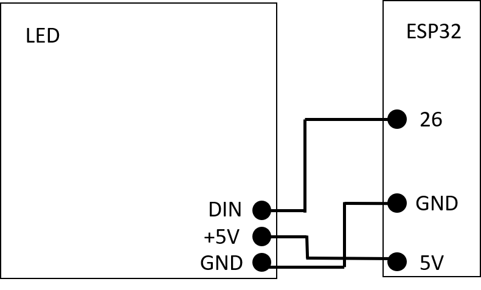

* Z-stage - 6 wires + motor connection

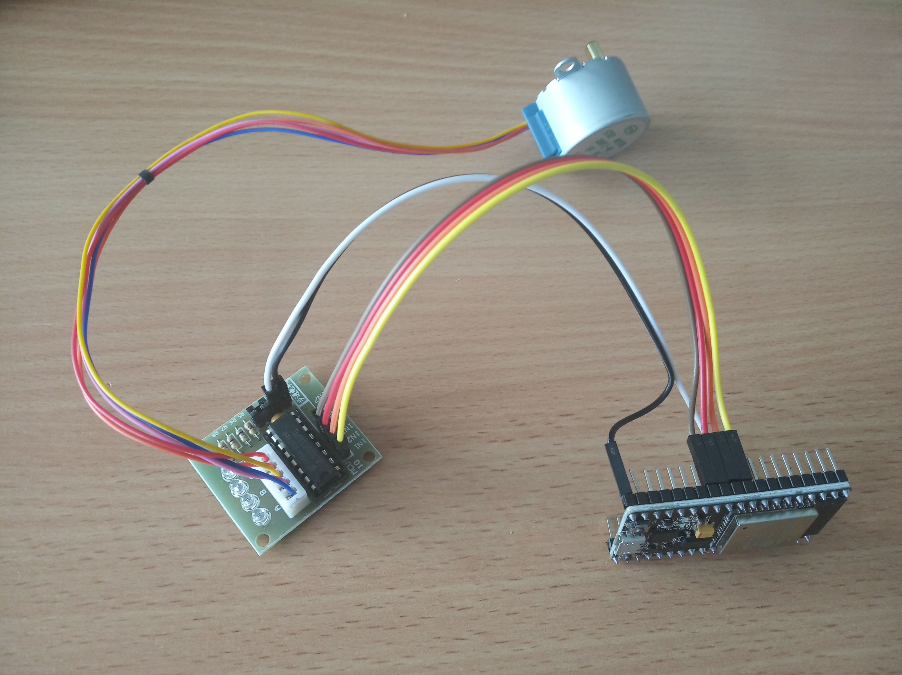

* Power the ESP32 simply with microUSB cables.
* And it works just like that ;-)

🢂 Find more in the [Electronics section](../../ELECTRONICS)

##  Software
🢂 Find the software for this setup in our dedicated [UC2-Software-GIT](https://github.com/bionanoimaging/UC2-Software-GIT)

##  Results
This is a quick result we shot with an Xperia Z5 of potato starch cells:

This is a quick result we shot with an Huawei P9 of dandelion fuss:

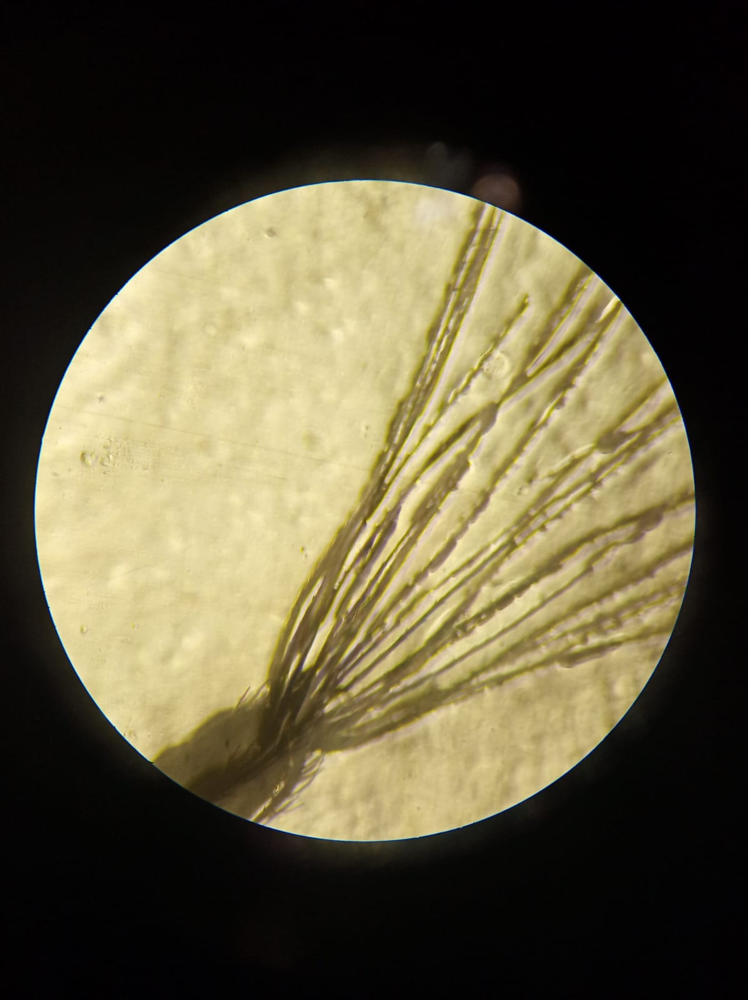

##  Participate!

Do you want to show your own results? Do you have ideas for improvements? Let us know!
