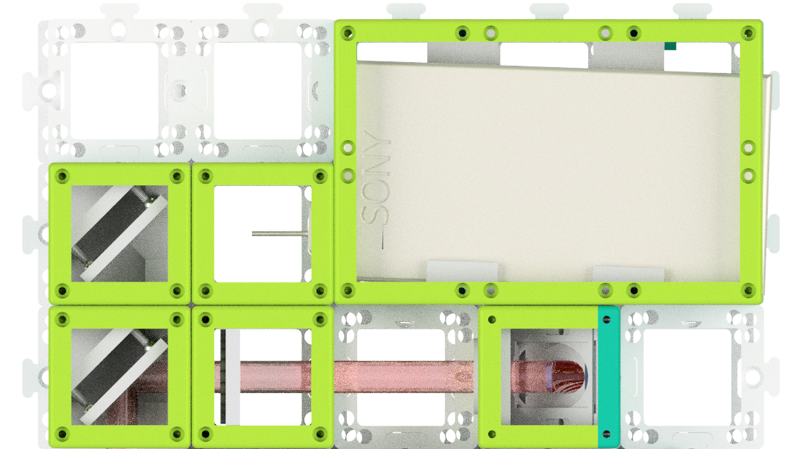
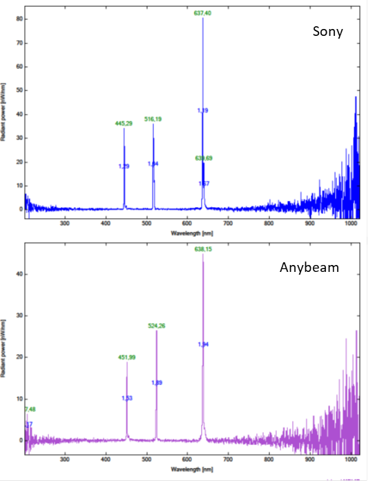
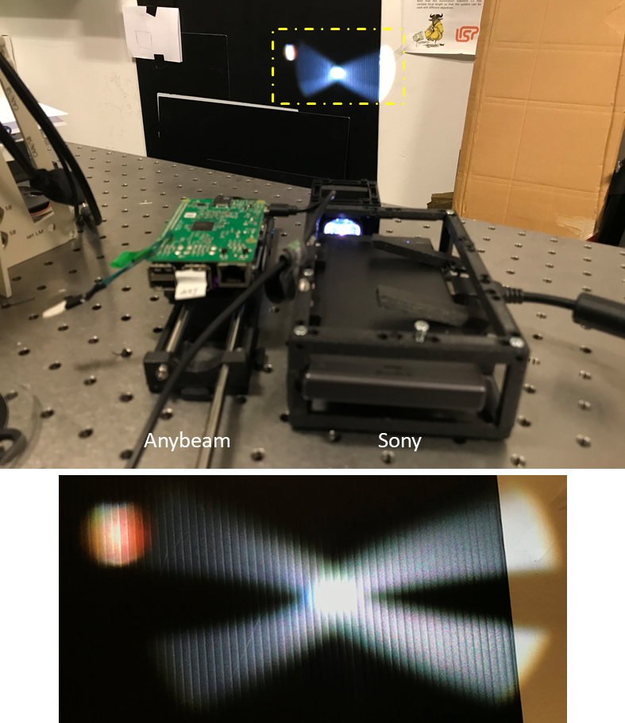
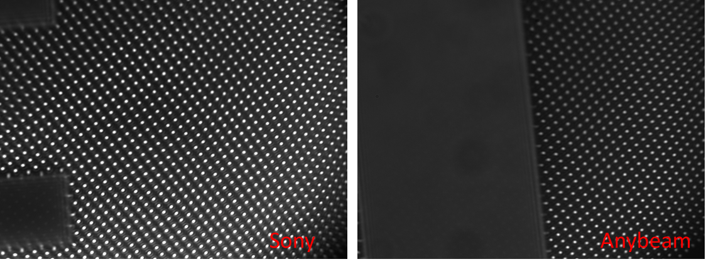

# ISM alignment tutorial

This tutorial is aming to align the openISM module to the microscope. The required components and setup steps are similar to the openSIM module which is in the Github repository.

  - openISM module
  - optical components
  - UC2 cubes and inserts
  - target sample
  - magical hand
  
## Introduction of the openISM module

In the openISM module, the illumination source is a commercially available laser video projector (Sony/Anybeam HAT). Both of them have integrated different colored laser diodes and the desired image is displayed with the help of a MEMS mirror. In this project, we have built a openSIM/ISM setup, which the imaging and sample modules of the setup are shared. The illumination of the openISM module is shown in Fig. 1. 

***Fig. 1*** *The openISM illumination module based on our UC2 CAD design. Comparing to the openSIM module, the ISM part is relative simply thanks to the projector, which has integrated laser diodes and MEMS mirror. The laser beam is directed twice with the help of two mirrors and focus on the back focal plane of the objective.*

The spectra of both projectors are illustrated in Fig. 2

***Fig. 2*** *Spectra of Sony/Anybeam laser projector.Both projectors used the laser diodes which have similar spectra. They can used to excite fluorescent, such as GFP, mCherry and Alexa Flour 647, with the correct filter set.*

## Alignmen of the telescope
After collimate the beam with first lens, the beam is directed by two mirrors to the second 165 mm lens. After the second lens, the beam should refocus at the back focal plane (BFP) of the objective and reimage the MEMS mirror. Due to the effct of the freeform lens integrated in the sony projector, the collimated beam from sony shaped a round shape with some unexpected external strucutres.

***Fig. 3*** *The laser beam come from both projectors is collimated by the first lens of the telescope. The beam should keep the same size irrelevantly to the distance. The lower image shows the detail of the beam at the wall. The beam shape from the Sony projector is not only a round spot due to the freeform lens in front of the MEMS mirror.*

## Alignment of the system
When the setup is in general once adjusted, place the objective cube with z-stage on it. We updated a new [linear z-stage](https://en.wikipedia.org/wiki/Update) which is compatible with injection moulded cube. Put a sample on the stage and turn on the projector to display some image, we should observe at least some part of the image on the camera, when not, try to center the image at the position of the objective. Slightly adjust the position of the image pattern with rotate the adjusting screws of the kinetic mirrors. A well-aligned openISM module should capture the point array pattern similar to this:

***Fig. 4*** *After alignment, the image at the sample plane should be as shown here. The point array image is illuminated on a negative USAF target, with good aglinment, the point array should focus at the surface of the target with sharp pattern.*

Now the setup is ready to use and try to lighten some fluorescence samples!
