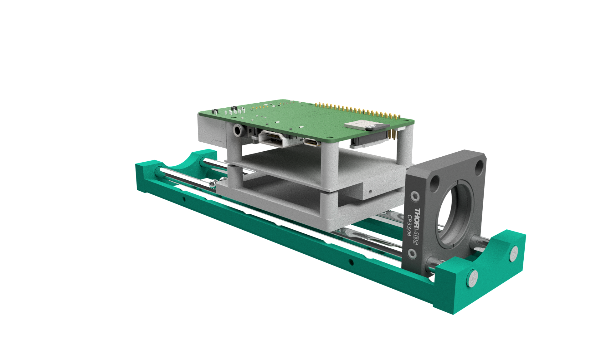
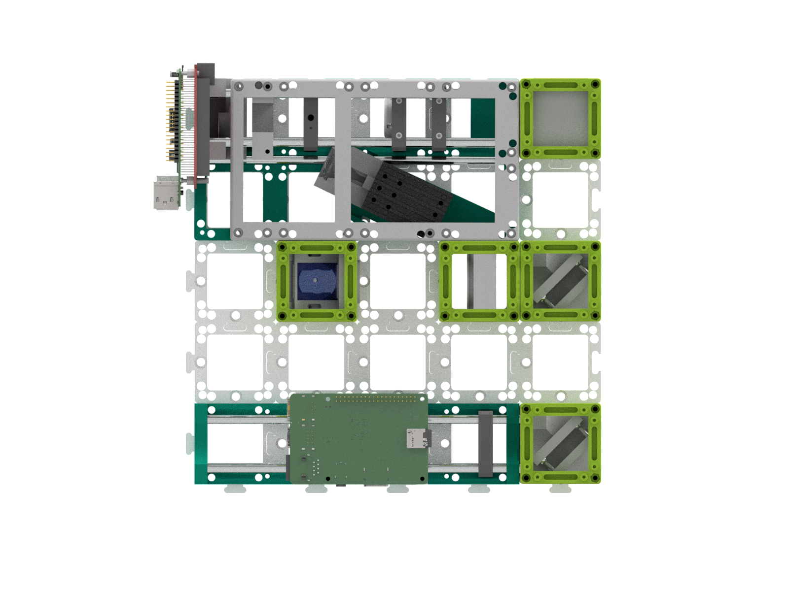
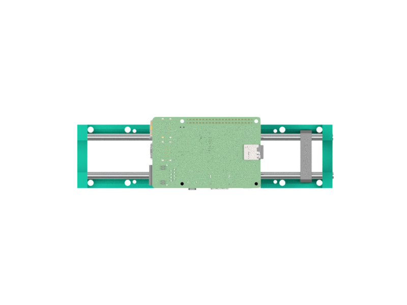
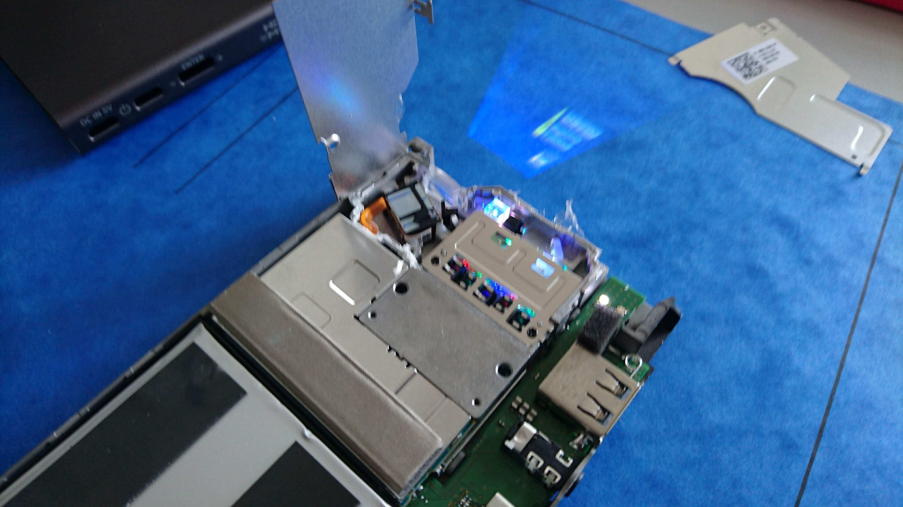
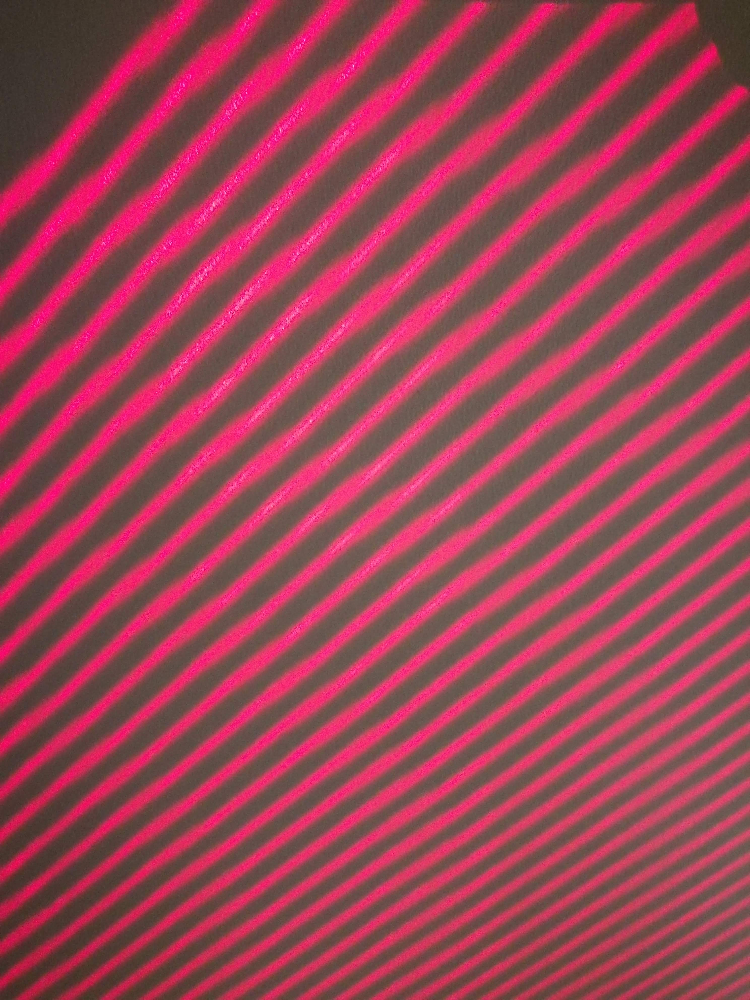
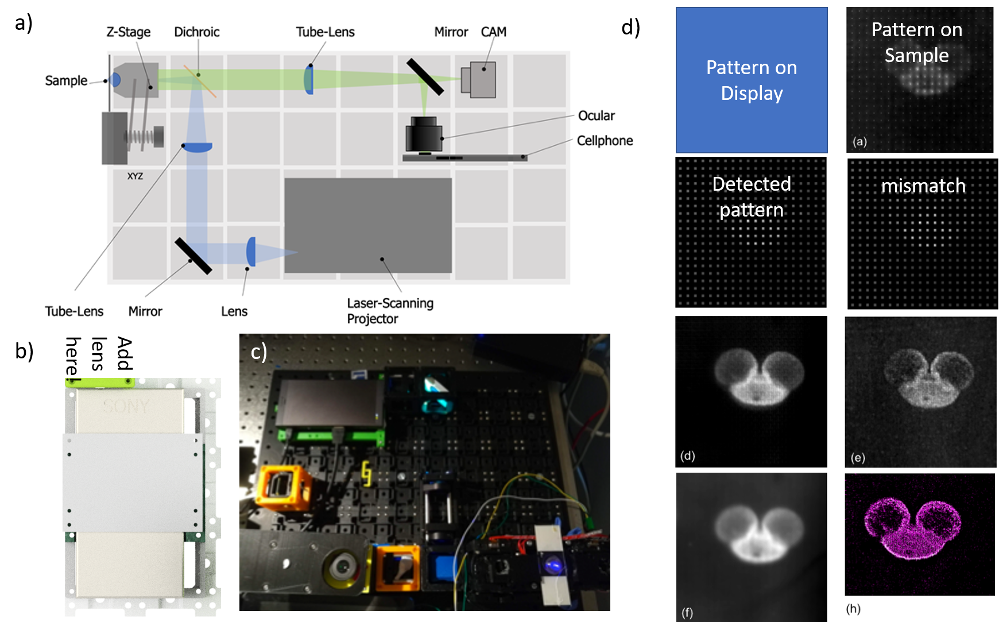

## openISM

This is the repository for the openISM project which integrates a laser-scanning module for image-scanning microscopy (ISM) to the UC2-system.

🧾 The manuscript for the openISM and openSIM can be found under the [DOI:10.1101/2021.01.08.425840](https://doi.org/10.1101/2021.01.08.425840)

<p align="center">

</p>

***Fig 1:*** *This is the ready-to-print module which clicks into the UC2-system. It hosts the Nebra AnyBeam HAT with a Raspberry Pi as a control unit*


This module is based on the work about Image Scanning Microscopy (ISM) by Enderlein et al. [1] and instant Structured Illumination Microscopy (iSIM) by A. York et al. [2]. It uses a low-cost MEMS-based laser-scanning video-project ([Sony CL1A, Tokyo, Japan, 300€](https://www.sony.com.sg/electronics/support/televisions-projectors-projectors/mp-cl1a/specifications); [Anybeam HAT, UK, 200€](https://uk.pi-supply.com/products/nebra-anybeam-hat-laser-projector-for-the-raspberry-pi?lang=de)) to generate a structured illumination for microscopy. We apply a point-wise incoherent lattice/grid-like pattern to increase lateral and axial resolution. The overall gain in resolution is limited, hence more suitable for educational purposes or data generation.  

<p align="center">

</p>

***Fig 2:*** *This shows the optical assemlby; the laser beam deflected by the scanning mirror is "collimated" and stired by a set of two kinematic mirror mounts before a tube lens (f'=165mm) forms a magnified image in back focal plane (BFP) of the objective lens (not shown) which follows the dichroic mirror*


In recent years portable devices to experience entertainment "on-the-go" like video-projectors or movie screens have found their ways to the consumer market. Many of these produce like portable projectors share the same components as their scientific counterparts (e.g. digital mirror devices, DMD) but for a much lower price since components are mass-produced. Besides wide-field projection system based on LCoS (liquid crystal on silica), LCD or DMD displays, more exotic laser-scanning based systems like the here used Sony MP.CL1A (Japan) enable the creation of laser-scanning microscopes for a very low price (e.g. 300€).

To display a color image on a screen (e.g. wall), a small MEMS (Micro-Electro-Mechanical Systems) scans a set of RGB Blue=450nm, Green}=530, Red = 650, laser-beams over the 2D (e.g. X/Y) plane with a frame-rate of 60fps at a spatial resolution of 1920*720 pixel^2. 
This device can easily be integrated in the UC2-system by providing a customized  adapter which makes the device compatible with the 50*5 mm^2 grid. Following the work by Enderlein et al. (ISM) (Muller2010a) and York et al. (iSIM)  (York2012) we displayed an incoherent grid of point sources in the sample plane, which can be used to create a better optical sectioning and improve optical resolution. This is done in a post-processing step, where each 2D image gets divided in a series of tiles of the size of the PSF-extend around one illumination position. Each tile corresponds to a confocal-like measurement, where the information can computationally be confined, when a de-centred detection pinhole is assumed. The resulting signal is placed on a canvas with twice the sampling of the original measurement, which creates an optical super-resolution up to a factor of sqrt(2) (McGregor2015).

Since this device is not meant to be used for scientific instrumentation, there are only limited information available. Also, since the resolution of 1920*720 pixels^2 is not very common, ordinary computers to generate a display on this device where interpolating the images. Connecting the device to a Apple Macbook (USA) at a display-resolution of 720p ensured a one-to-one pixel mapping, where we created a customized Python-script to generate and display the ISM-patterns full-screen. The monochromatic cellphone-camera (Huasei P20, China) was driven using the open-source software FreeDCam (Fuchs2018), where the exposure time t=1/60s matches the frame-rate of the laser-scanning projector in order to reduce bouncing effects of both refresh-rates.


<p align="center">

</p>

***Fig 3:*** *The full system based on the modular cubes. This variant is based on a cellphone camera as the detection system. Also instead of the AnyBeam MEMS projector, we use the SONY device*


## Device's features:

- Increased optical sectioning and higher resolution
- Very low cost:  ~300€
- Easy to align
- Open-Source
- Three wavelengths 


## Optical System

<p align="center">

</p>


## Optical Setup

**NEED TO BE UPDATE**

The optical setup shown in Fig. 1 is straight-forward. The resonating MEMS in the projector needs to be imaged into the BFP of the microscope objective lens. In order to get high-resolution images, the BFP is over-filled by the mirror ideally. We assumed a diameter of the aluminium mirror of d_{mirror}=1.5mm and a diameter of the BFP of around d_{BFP}=5.5mm which requires a telescope, created by a lens f'_1=30mm and a following tube-lens f'_2=180mm. The low-cost infinity-corrected microscope objective (Optika, 20x, NA=0.4,  N-plan, [here](https://www.optik-pro.de/fuer-mikroskope/optika-objektiv-20x-0-40-infinity-n-plan-pol-b-383pol-m-146p/p,56893#tab_bar_1_select) was put in a motor-driven Z-stage to allow focussing the objective relative to the sample. A set of different dichroic-mirror cubes with suitable filters allows the switching between different fluorophores and excitation wave-lengths.


## Parts

### Bill of material

(This is for the Anybeam, since the Sony projector seems to be discontinued) 

|  Type | Details  |  Price | Link  |
|---|---|---|---|
| MEMS | Nebra AnyBeam HAT |  200 € | [Pi Supply](https://uk.pi-supply.com/products/nebra-anybeam-hat-laser-projector-for-the-raspberry-pi?lang=de)  |
| Raspberry Pi | Raspi+SD-Card+Case+Powersupply(for DMD+Raspi, 5V, >=3A!) |  70 € | [Reichelt](https://www.reichelt.de/raspberry-pi-4-b-4x-1-5-ghz-1-gb-ram-wlan-bt-rasp-pi-4-b-1gb-p259874.html?PROVID=2788&gclid=Cj0KCQiAz53vBRCpARIsAPPsz8X9hCOt9yVVB_WqLCmKSs2e-KuThVnrMEtl2TRbAUTqtVoNZU3zM3YaAg2ZEALw_wcB&&r=1)  |
| "Scan" lens | 1x Achromatic 1 inch Lens, f=30mm |  82 € | [Thorlabs](https://www.thorlabs.com/thorproduct.cfm?partnumber=AC254-030-A)  |
| 5mm ball magnets  | 8x Neodym Ball Magnets |  5 € | [Various]()  |
| 6mm Rods | 20mm Rods (ferromagnetic/galvanized), 6mm diameter   |  40 € | [Thorlabs, Edmund Optics ?]()  |

| M3 Screws | Various |  1 € | [Various]()  |


* Check out the [RESOURCES](../../TUTORIALS/RESOURCES) for more information!


### 3D printed parts

Parts to print:

* 1× [openISM AnyBeam Mount](./STL/20_Cube_insert_openISM_AnyBeamMount.stl)
* 1× [Cube insert openISM vase v3](./STL/20_Cube_insert_openISM_vase_v3.stl)


## Electronics

### Having a look into the MEMS-based laser projector (Sony)


<p align="center">

</p>

***Fig 1:*** *The assembly faeatures three laser wavelengths fused with a complicated assembly of optical parts to remove speckles*

<p align="center">

</p>

***Fig 2:*** *Funnily, the polarization beamsplitter from a bluray drive fits in there to enable any kind of descanning arrangement*

<p align="center">

</p>

***Fig 3:*** *Beam coming out of the projector*

### Problems with the Nebra Anybeam 

The pattern of the Nebra Anybeam HAT seems to fluctuate temporally. We believe this is due to the scanning scheme of the MEMS. 
Read more [here](https://github.com/NebraLtd/AnyBeam/issues/14).

<p align="center">

</p>

***Fig 1:*** *One can observe a gitter which moves temporally*

<p align="center">

</p>

***Fig 2:*** *The three different wavelenghts are not in-line*

<p align="center">

</p>

***Fig 3:*** *Inhomogenities due to bouncning of the pixels*


## Software  


### Install the Anybeam Nebra with the Raspberry Pi

Please follow the steps mentioned on the [AnyBeam HAT github page](https://github.com/NebraLtd/AnyBeam/).


Open the file ```/boot/config.txt``` and add the following lines:

```
# Additional overlays and parameters are documented /boot/overlays/README
dtoverlay=dpi24
overscan_left=0
overscan_right=0
overscan_top=0
overscan_bottom=0
framebuffer_width=1280
framebuffer_height=720
enable_dpi_lcd=1
display_default_lcd=1
dpi_group=2
dpi_mode=85
dpi_output_format=0x070027
```


## Further reading

This will come in the future.


## Result

This is just one frame of some fluorescent pollen grains:
<p align="center">

</p>

<p align="center">

</p>


## Participate!

Do you want to show your own results? Do you have ideas for improvements? Let us know!
