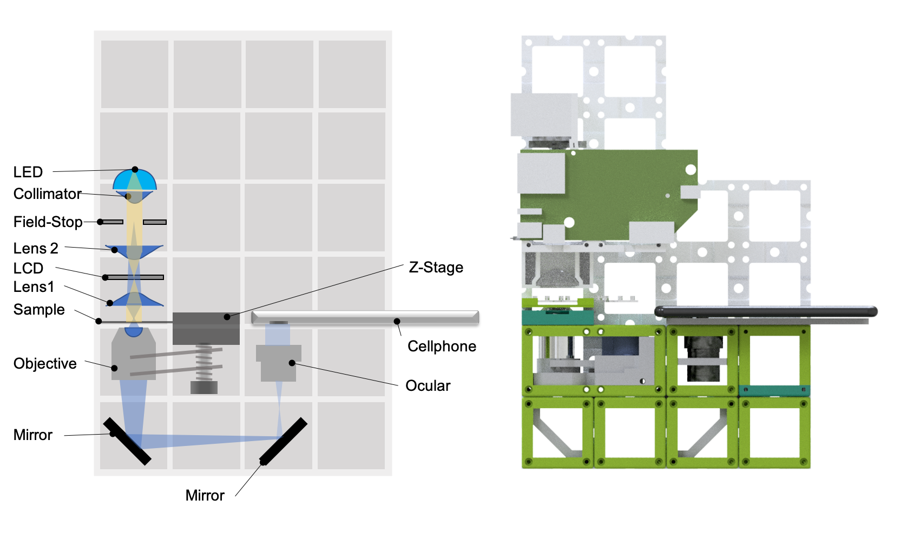
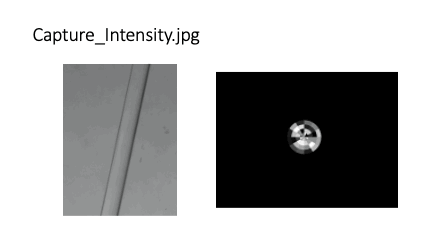

## openKOEHLER

This is the repository for the openKOEHLER project which integrates an adaptive diaphragm (e.g. variable effective light-source plane) in [Koehler configuration](https://en.wikipedia.org/wiki/K%C3%B6hler_illumination) into the UC2-system.

***Fig 1:*** *This is the ready-to-print module which clicks into the UC2-system*

This module is based on the work "*Using machine-learning to optimize phase contrast in a low-cost cellphone microscope*" which can be found in [PLoS One](https://journals.plos.org/plosone/article/authors?id=10.1371/journal.pone.0192937). The idea is to generate phase-contrast images by varying the effective light-source shape in the pupil plane of the condenser. Therefore we place an LCD in Koehler configuration which is conjugate to the back focal plane (BFP) of the microscope objective lens. We rely on a low-cost LED HDMI projector which can be optained from Ebay.

The module holds all optical components in place:

***Fig 2:*** *The PCB drives the high-power LED and the LCD. A HDMI connection to an external computer controls the pixels of the adaptive light source.*

***Fig 3:*** *Backside of the module which hosts all components in place.*

The angle between the collimated and expanded Laser-beam and the DMD is 25° in order to get the maximum in the diffracted orders.

## Device's features:

- Variable light-source in Koehler configuration (conjugate to BFP)
- Very low cost:  ~100€
- Easy to align
- Open-Source

## Parts

### Bill of material

|  Type | Details  |  Price | Link  |
|---|---|---|---|
| Aspherical Lenses |  Thorlabs ACL3026U, f'=60mm |  32 € | [Thorlabs](https://www.thorlabs.com/thorproduct.cfm?partnumber=ACL3026U-A)  |
| HDMI LED Projector |  A30 MINI LED Laser Projektor Beamer Cinema Heimkino HD 1080p USB SD AV HDMI VGA |  55 € | [Ebay](https://www.ebay.de/itm/A30-MINI-LED-Laser-Projektor-Beamer-Cinema-Heimkino-HD-1080p-USB-SD-AV-HDMI-VGA/283179326469?epid=21010262499&hash=item41eecd9c05:g:S6IAAOSw-BJfmrYj)  |
* Check out the [RESOURCES](../../TUTORIALS/RESOURCES) for more information!

### 3D printed parts

Parts to print:

* 1× [Koehler-Module](./STL/Assembly_HDMI_Projector_30_Cube_Projector_frame_10)

## Assembly

Please have a look [here](./DOCS/Beamerscope_Instructions) (borrowed from the beamerscope). 

## Software  

Displaying patterns can conviently be done with a power-point presentation. More python-based software will follow soon. 

## Result

This is just some stack where we measured intensity while variyng the illumination source shape:

## Participate!

Do you want to show your own results? Do you have ideas for improvements? Let us know!
