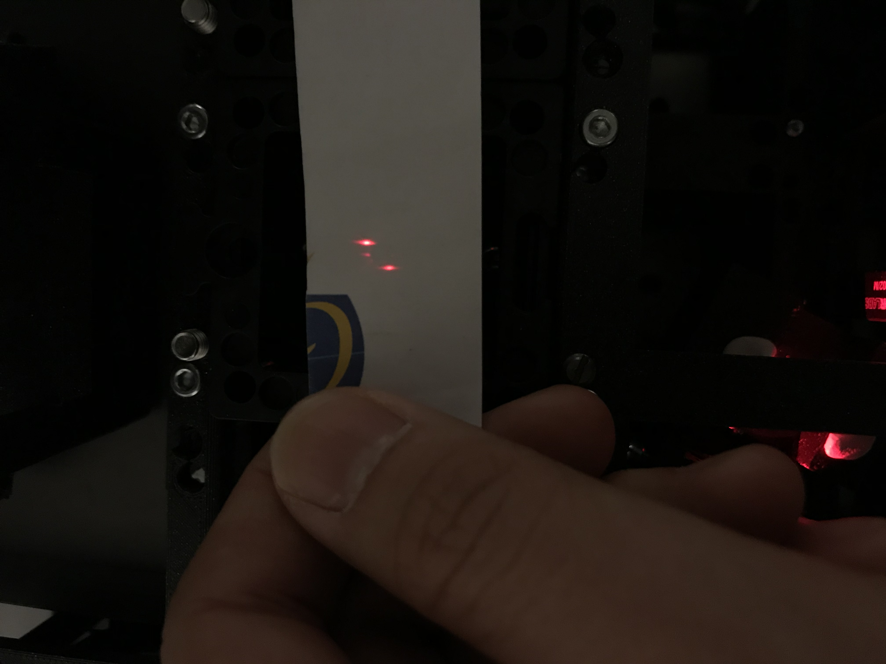
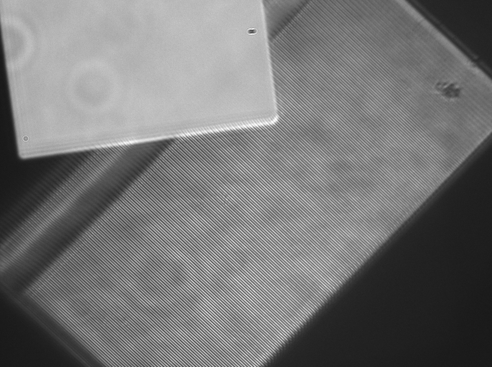
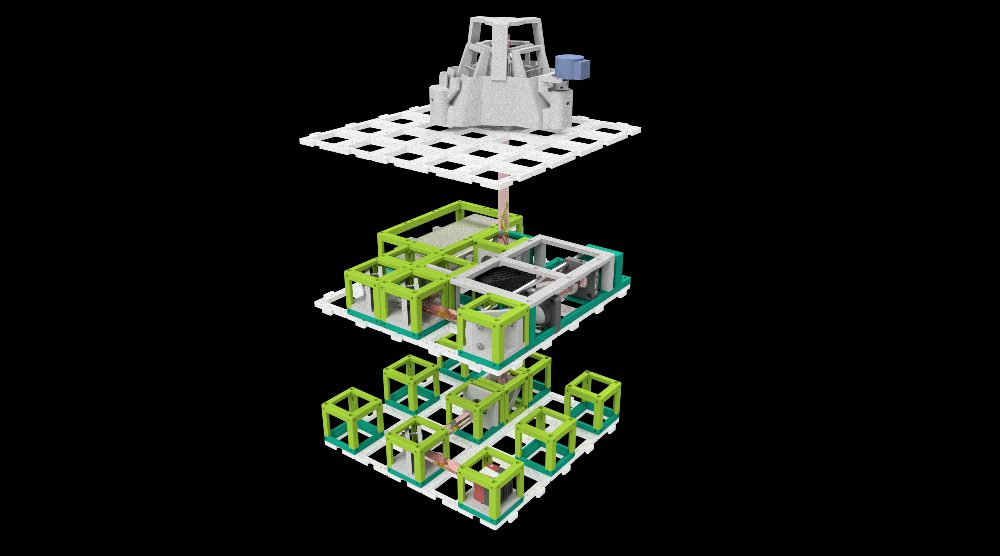

# SIM alignment tutorial

This tutorial is aming to align the openSIM module of the UC2 modular 3D printed microscope. The fundamental is a set of full prepared components in hand, which listed in the ```readme.md``` for openSIM. The parts used for aligning the system are:

  - openSIM module
  - optical components
  - UC2 cubes and inserts
  - target sample
  - magical hands

## Align the camera
In the openSIM setup, the camera module is arranged on the bottom layer, therefore, it needs to focus to infinity first. Try to find a far away object (e.g a building or mountain) and image it with the camera clearly by adjusting the distance between the camera and the tube lens. Following image shows an example image took by an infinity-focused camera.

<p align="center">

</p>

***Fig. 1*** *An example image of an infinity-corrected camera. The mountain on the picture is far away from our office.*

When the camera is infinity-focused, the bottom layer of the system can be placed as shown here:

<p align="center">

</p>

***Fig. 2*** *A top view of the system's bottom layer which contains camera module.*
	
In this layer, it has some empty cubes spread around in order to support the upper layers.

## Align the illumination laser source
The laser we used is a 638 nm diode laser. In order to get a bigger illumination spot size, the collimator of the laser is teared down and a 20 mm lens is set in front. Move the laser on its mount back and forth to collimate the laser. Check the beam size in front of the lens as well as far away, it should keep the same size and larger than the mirror array of the DMD.

<p align="center">

</p>

***Fig. 3*** *The laser beam is collimated by the 20 mm lens and the beam size doesn't change with the propagation distance.*

## Prepare Fourier mask and align the telescope

The telescope consists of two 50mm achromatic lenses and a fourier mask, which block the zero-order illumination and regenerate the intermediate image of the DMD at the focus the second lens. The telescope is fixed in the openSIM module.

<p align="center">

</p>

***Fig. 4*** *The bottom layer of the setup is built with camera module and some empty cubes.*

A 3D printed Fourier mask is applied in the telescope, the 3D model of the mask case can be found in the ``STL`` repository. One thin copper wire is splitted from electric cable, first make a small knot on the wire which is roughly the size of the desired tin drop. Then solder a small drop of soldering tin onto the knot.

<p align="center">

</p>

***Fig. 5*** *A single copper wire is taken from an electrical cable (left), a knot is crossed on the wire and can easliy add correct size of soldering tin on it.*

Mount the wire on the 3D printed part with the help of glue or fix gum, such as [UHU Patafix](https://www.uhu.de/de/produkt.3311). In order to aviod unexpected reflextion of the soldering tin, we can use black color marker pen and paint on the tin drop. At the end, the tin drop should be positioned at the middle of the mask. 
 
<p align="center">

</p>

***Fig. 6*** *A prepared Fourier mask which has a soldering tin painted with black on it. The copper wire is fixed with fix gum.*

To check the alignment of the telescope, a collimated laser diode (or other collimated light source) is mounted into a single UC2 cube. Put the laser diode cube beside the telescope (the position of the first reflecting mirror out of the SIM module) and heading to the DMD mirror, if the telescope is good calibrated, the laser beam should illuminate onto the DMD chip with its original spot size.

## Bring the system to the table

### Setup the Raspberry Pi
The DMD is controlled by Raspberry Pi, when the Raspberry Pi connected with the DMD we need to remote control it with a PC for display images. For transport the generated illunimation images or python code to raspberry pi, using [WinSCP](https://winscp.net/eng/download.php) on Windows or [Putty](https://www.putty.org/) on Mac makes it easier.

Turn on a WiFi Hotspot such as
```
SSID: Blynk
Password: 12345678
```
Turn on the Raspberry Pi and wait until it connects. Note the IP Address of the Pi (in our case ```192.168.43.9```). Connect to the Pi with SSH on you computer using the following line:
```
ssh pi@192.168.43.9
```
The default password of Raspberry Pi is ``raspberry``. Then we need to activate the external display of Raspi with the command:
```
export DISPLAY=:0
```
The grating pattern we used is generated by a python script ``pygame_grating.py``. The grating is default set in vertical direction and the grating constant is 6 pixel size of the DMD micromirror and rolling 1 pixel distance in each second. You can end the infinite loop with ``Ctrl + C``.

### Adjust the mirrors
The setup has two mirrors to direct the illumination beam to the objective. The aim of adjust the mirrors is to reflect the laser beam straightly into the objective. The mirror has three directional flexibilities which can be changed by the screws behind the kinetic mirror mount. The mirrors should be plugged onto the base one by one, and after each mirror the propagation direction of the beam should stay the same with the optical axis.

When raw adjustment is done, set the tube lens and the dichroic mirror at their position, the frequency of the DMD image should be located and focused at the position of the back focal plane of the objective. When the python script ``pygame_grating.py`` is running on the Raspberry Pi, three beams should located at the center of the cube.

<p align="center">

</p>

***Fig. 7*** *Three beam pattern should locate at the center of the back focal plane of the objective.*

Insert the objective cube and linear z-stage with bright LED illumination above the dichroic mirror, use one surface reflecting sample, such as a [negative Thorlabs USAF Target](https://www.thorlabs.com/thorproduct.cfm?partnumber=R3L1S4N). Move some structures of the target into the field of view, and adjust the linear stage to focus on the structures sharply. At that time, it should be some unclear DMD illumination signal on the sample. (When not, it is recommanded to go back to adjust the direction of the two mirrors, make the propagation direction of the laser beam parallel to the axial direction of the objective.) Keep the target structure sharp and adjust the two mirrors, make the illumination pattern sharp at the sample plane. With a three beam interference, the image generated by ``pygame_grating.py`` with grating constant of 6 pixel size should look like this:

<p align="center">

</p>

***Fig. 8*** *Three beam interference at the sample plane. Left above is a structure from the USAF target, right grating is the illumination pattern from the DMD.*

Then remove the objective from the system, try to adjust the position of the fourier mask in the telescope to block the zero-order of the illumination. To check the process, hold a small piece of paper at the position of the back focal plan, their should be only two first-order spot left like this:

<p align="center">

</p>

***Fig. 9*** *Using the Fourier mask to block the zero-order illumination. You can easily check the block efficiency with a paper by removing the objective from the system.*

Place the objective back, put again a paper slightly above the sample plane, you should observe two same-shaped beam spot. 

<p align="center">

</p>

***Fig. 10*** *The two beam is interferencing at the sample plane and divergent above the sample plane.*

Refocus onto the target sample, the two beam interference pattern should be shown on the camera. If not, try to slightly tilt the mirror to refocus the both patterns on the sample plane. A example image is shown as below:

<p align="center">

</p>

***Fig. 11*** *The expected two beam interference pattern on the camera. Right side is the detail of the interference pattern.*


## Ready for play

Now the openSIM setup is ready to play. Enjoy the new toy!

<p align="center">
<<<<<<< HEAD

=======

>>>>>>> 1754cd7e9fb32e5d89a2b30627f5440ad85cec6c
</p>

***Fig. 12*** *Overview of the SIM/ISM setup.*


