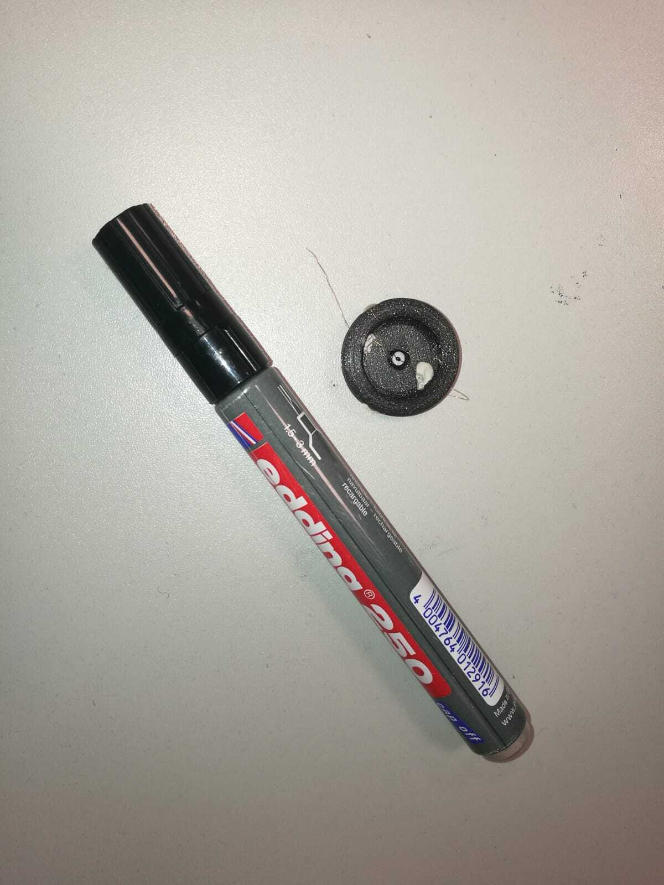

# SIM alignment tutorial

This tutorial is aming to align the openSIM module to the microscope. The fundamental is a full prepared components in hand.

  - openSIM module
  - optical components
  - UC2 cubes and inserts
  - target sample
  - magical hand

## Prepare the Fourier mask (put it on the outside part)
A 3D printed Fourier mask is applied in the setup, which is used to block the zero-order of the illumination. The 3D model can be found in the ``STL`` repository. One thin copper wire is splitted from electric cable, first make a small knot on the wire which is roughly the size of the tin drop. Then solder a small drop of soldering tin onto the Knot.

<p align="center">

</p>

Mount the wire into the 3D printed part with the help of glue or fix gum, such as [UHU Patafix](https://www.uhu.de/de/produkt.3311). To aviod unexpected reflextion of the soldering tin, can use black marker pen and paint on it. At the end, the tin drop should be positioned at the middle of the mask. 
 
 <p align="center">

</p>

## Align the camera
In our setup, the camera module is arranged on the bottom layer and it needs to be aligned first. Try to find a object far away and try to image it onto the camera by adjust the distance between the camera and tube lens. Following shows a example image of an infinity-corrected camera module.

<p align="center">

</p>

## Align the laser source
The laser we used is a 638 nm diode laser. In order to get a big illumination spot size, the collimator of the laser is teared down and a 30 mm lens is set in front. Move the laser position on its mount back and forth to collimate the laser. Check the spot size in front of the lens as well as far away. The spot size should be larger than the mirror area of the DMD.

<p align="center">

</p>

## Align the telescope

The telescope consists of two 50mm achromatic lenses and a fourier mask, which block the zero-order illumination and regenerate the intermediate image of the DMD. The telescope is fixed in the openSIM module. The collimated laser beam should focus onto the fourier mask and recollimate by the second lens.

<p align="center">

</p>

A collimated laser diode (or other light source) is mounted into a single UC2 cube in order to check the alignment of the telescope. Put the laser diode cube beside the telescope and head to the DMD, if the telescope is good calibrated, the laser beam should illuminate onto the DMD chip with its original spot size.

## Mirror part
The setup has two mirrors to direct the illumination beam to the objective. The aim of adjust the mirrors is to direct the laser beam straightly into the objective. The mirror has three direction variations which can tilted by the screws. The mirrors should be mounted on the base one by one, after each mirror the propagation direction of the beam should stay the same.

## Check the 2 beam on BFP
After raw adjustment is down, set the tube lens and the dichroic mirror in, the fourier transform of the DMD image should be located and focused at the position of the back focal plane of the objective. Insert the objective cube and linear stage with bright LED illumination at their position, use one surface refractive sample, such as a [negative Thorlabs USAF Target](https://www.thorlabs.com/thorproduct.cfm?partnumber=R3L1S4N). Focus onto some structures of the target, and adjust the linear stage, to make the structures sharp. At that time, it should be some unsharp DMD illumination signal on the sample. (When not, it is recommanded to go back to adjust the direction of the two mirrors, make the propagation direction of the laser beam parallel to the axial direction of the objective.) Keep the target structure sharp and adjust the two mirrors, make the illumination pattern sharp at the sample plane as well. With a three beam interference, the image generated by ``pygame_grating.py`` with grating constant of 6 pixel size should look like this:

<p align="center">

</p>

Then remove the objective from the system, try to move the fourier mask in the telescope to block the zero-order of the illumination. To check the process, hold a small piece of paper at the position of the back focal plan, their should be only two first-order left like this:

<p align="center">

</p>

Place the objective back, put a paper slightly above the sample plane, you should observe two same-shaped beam spot. 

<p align="center">

</p>

Apply the target sample back, the two beam interference pattern should be shown on the camera. If not, try to slightly tilt the mirror to refocus the pattern on the sample plane. A example image is shown as below.

<p align="center">

</p>


## Setup the Raspberry Pi
For transport the generated illunimation images to raspberry pi, using [WinSCP](https://winscp.net/eng/download.php) on Windows or [Putty](https://www.putty.org/) on Mac makes it easier.

Turn on the wifi Hotspot with
```
SSID: Blynk
Password: 12345678
```
Turn on the Raspberry Pi and wait until it connects. Note the IP Address of the pi (in our case 192.168.43.9). Connect to the pi with SSH on you computer using the following line:
```
ssh pi@192.168.43.9
```
The default password of Raspberry Pi is ``raspberry``. Then we need to activate the external display of Raspi with the command:
```
export DISPLAY=:0
```
The grating pattern we used is generated by a python script ``pygame_grating.py``. The grating is set in vertical direction and the grating constant is 6 pixel size of the DMD micromirror. You can end the infinite loop with ``Ctrl + C``.


## Ready for play

Now the openSIM setup is ready to play. Enjoy the new toy!


