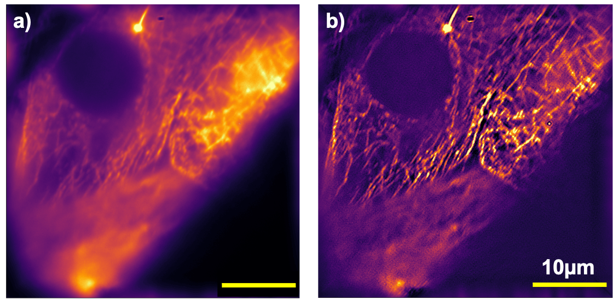

## openSIM

This is the repository for the openSIM project which integrates structured illumination microscopy into the UC2-system.

***Fig 1:*** *This is the ready-to-print module which clicks into the UC2-system*

This module is based on the work by the Huser-Lab and can be found as a preprint on Bioarxiv [1]. It uses a low-cost single-mode diode laser (532 nm) and a Raspberry Pi driven DMD module to generate a structured illumination for microscopy. Since we use coherent illumination, we can create pattern suitable for SIM in order to increase the lateral resolution. So far we're not aiming for any super-resolution, but rather give a proof of principle.  

***Fig 2:*** *A beam-expander magnifies the collimated beam which hits the DMD displaying a set of gratings*

The angle between the collimated and expanded Laser-beam and the DMD is 25° in order to get the maximum in the diffracted orders.

[1] *DMD-based super-resolution structured illumination microscopy visualizes live cell dynamics at high speed and low cost
Alice Sandmeyer, Mario Lachetta, Hauke Sandmeyer, Wolfgang Hübner, Thomas Huser, Marcel Müller
bioRxiv 797670; doi: [https://doi.org/10.1101/797670](https://doi.org/10.1101/797670)*

## Device's features:

- "True" two-beam SIM
- Very low cost:  ~300€
- Easy to align
- Open-Source

## Optical System

***Fig 3:*** *The full system based on the modular cubes*

The system of a classical two-beam interference SIM is straight forward and based on common 4f (i.e. fourier imaging) system, where focal lengtheses of adjacent lenses are following each other. The core idea is to place two delta-peaks inside the BFP of the objective lens. The lens fourier-transforms the peaks and therefore form a grating in the sample plane.

In order to keep the whole system small, the telescope imaging the DMD is  based on two lenses with ***f'=50mm*** (e.g. Thorlabs achromates). A tube-lens of ***f'=180mm*** fourier-transforms the image folded by the mirror and places the different diffraction order inside the BFP of the objective lens. To produce 2D-Sim a fourier mask in the fourier-plane after the DMD, blocks the zeroth order.

The DMD, driven by a Raspberry Pi, gets illuminated by a more-less plane wave from a coherent laser source. The pattern which are displayed are then actually coherently reimaged inside the sample plane by the whole system.

## Parts

### Bill of material

|  Type | Details  |  Price | Link  |
|---|---|---|---|
| Laser |  12V 532nm 200mw Green Laser Dot Module Fan Cooling TTL 0-30KHZ-Long time working |  90 € | [Lilly Electronics](http://www.lillyelectronics.com/12v-532nm-200mw-green-laser-dot-module-fan-cooling-ttl-0-30khz-long-time-working)  |
| DMD |  Evaluierungsmodul (EVM) DLP® LightCrafter™ Display 2000 |  90 € | [Digikey](https://www.digikey.de/product-detail/de/texas-instruments/DLPDLCR2000EVM/296-47119-ND/7598640)  |
| Raspberry Pi | Raspi+SD-Card+Case+Powersupply(for DMD+Raspi, 5V, >=3A!) |  70 € | [Reichelt](https://www.reichelt.de/raspberry-pi-4-b-4x-1-5-ghz-1-gb-ram-wlan-bt-rasp-pi-4-b-1gb-p259874.html?PROVID=2788&gclid=Cj0KCQiAz53vBRCpARIsAPPsz8X9hCOt9yVVB_WqLCmKSs2e-KuThVnrMEtl2TRbAUTqtVoNZU3zM3YaAg2ZEALw_wcB&&r=1)  |
| Tube-lens | Lens, f=180mm |  10 € | [PGI-Versand](https://www.pgi-versand.de/?id=47&mode=artdet&artnr=564.OA.64)  |
| Telescope-lens | 2x Achromatic 1inch Lens, f=50mmmm |  82 € | [Thorlabs](https://www.thorlabs.com/thorproduct.cfm?partnumber=AC254-050-A)  |
| Dichroics  |  Various |  200 € | [Thorlabs]()  |
| Mirror | 1inch Silver Mirror, Protected |  50 € | [Thorlabs]()  |
| iPhone Lens | iPhone 5 lens for the telescope  (optional) |  5 € | [Amazon]()  |
| Lens | 25mm lens for the telescope (optional) |  5 € | [Amazon]()  |
| Dichroics  |  Various |  200 € | [Thorlabs]()  |
| PCB for Raspi-DMD connection  |  Various |  8 € | [See below]()  |

* Check out the [RESOURCES](../../TUTORIALS/RESOURCES) for more information!

### 3D printed parts

Parts to print:

* 1x [SIM-Module 2×4](./STL/Assembly_openSIM_module_v2_30_CUBE_openSIM_base_v2_1.stl)
* 1x [Telescope for Beam Expansion](./STL/Assembly_openSIM_module_v2_30_CUBE_OpenSIM_Beamexpander_v2_9.stl)
* 1x [DMD Adapter](./STL/Assembly_openSIM_module_v2_30_CUBE_openSIM_DLP2000_Holder_mirrored_3.stl)

### Additional parts for the whole setup
- 1x Kinematic Mirror Mount (for 1inch Silver mirror!) [here](../ASSEMBLY_CUBE_Mirror_Kinematic_45_v2)
- 1x Mirror Mount (for 1inch Silver mirror!) [here](../ASSEMBLY_CUBE_Mirror_45_v2)
- 1x OpenFlexure Delta-Stage (by Richard Bowman et al.) + Adapter + Objective lens (you can choose!)  [here](../ [here](../CUBE_INSERT_OpenFlexure_Deltastage))
- Dichroic Mirror Cube [here](../ASSEMBLY_CUBE_Dichroic_Beamsplitter_v2)
- Basler-Camera + Adapter [here](../ASSEMBLY_CUBE_BaslerCam)

## Electronics

A dedicated Tutorial which explains how to assemble and setup the electronics can be found in the [Readme_Electronics.md](Readme_Electronics.md).

## Software

A dedicated Tutorial how to setup the software can be found in the [Readme_Software.md](Readme_Software.md).

## Optics

A dedicated Tutorial how to align the optical setup can be found in the [Readme_SIM_alignment_tutorial.md](Readme_SIM_alignment_tutorial.md).

## Result

This is just some stack where we measured the fluorescent signal on a Fluochart:

This is the result of the openSIM with a 100x 1.25 objective lens from China with Alexa Fluor 647 labelled microtubules. a) Widefield, b) SIM reconstruction on 2 angles and 5 phases

## Participate!

Do you want to show your own results? Do you have ideas for improvements? Let us know!
