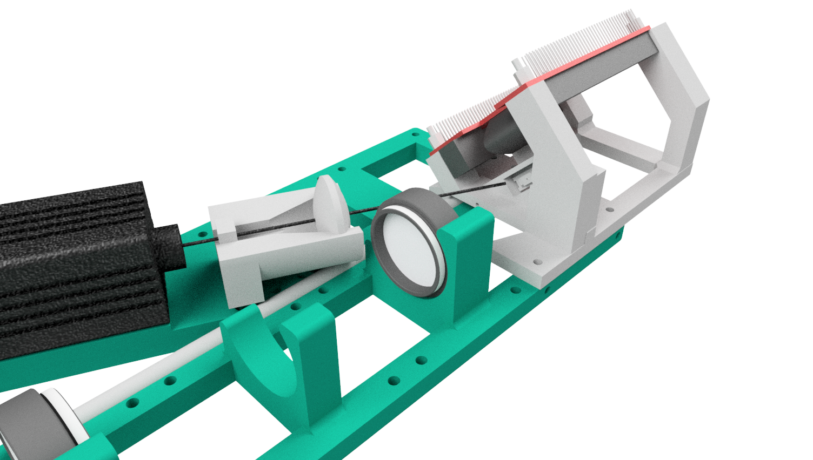
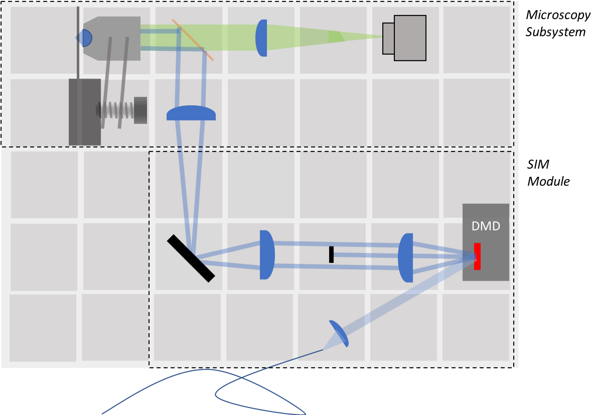
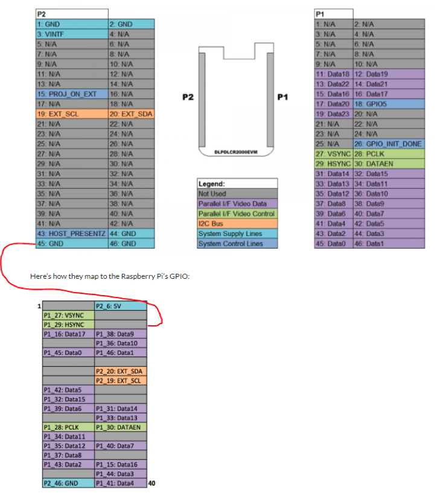
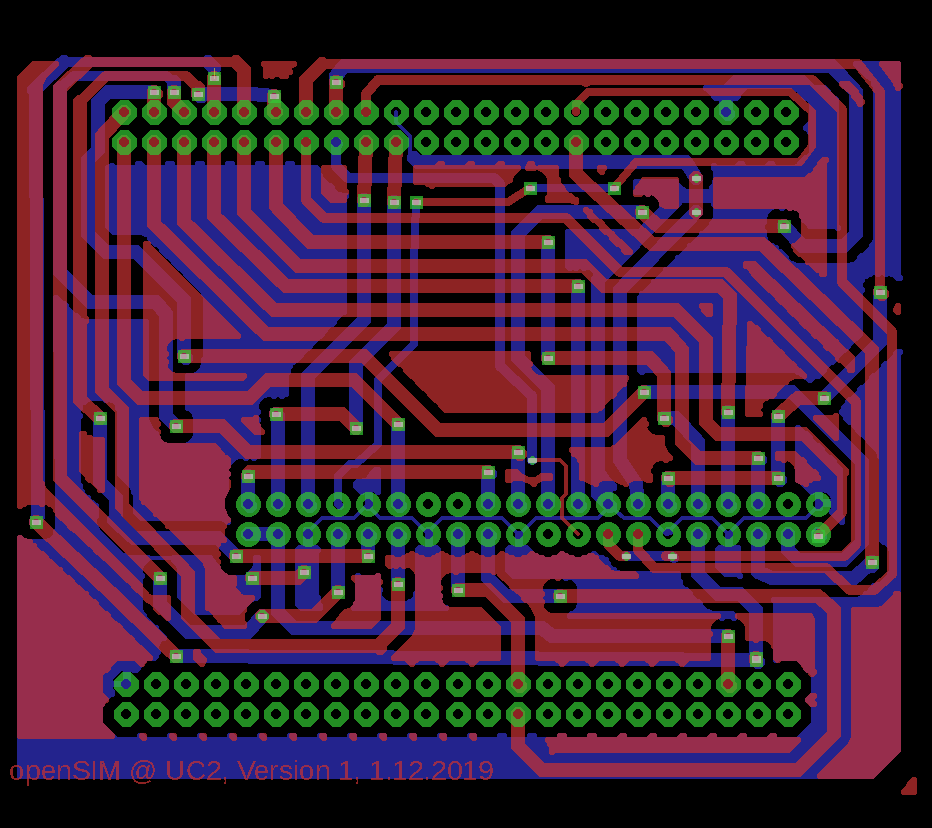
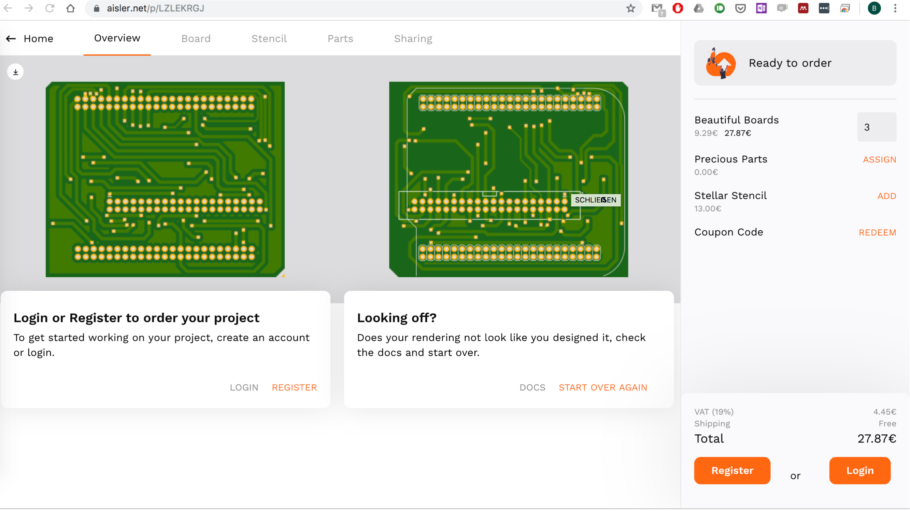
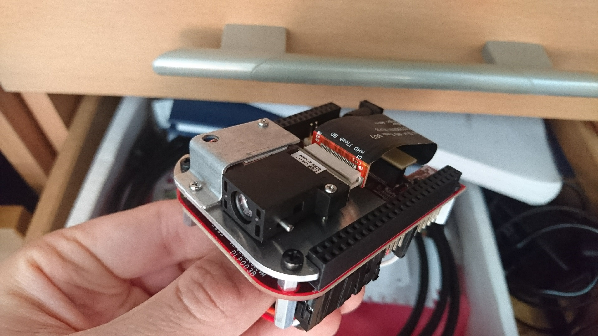
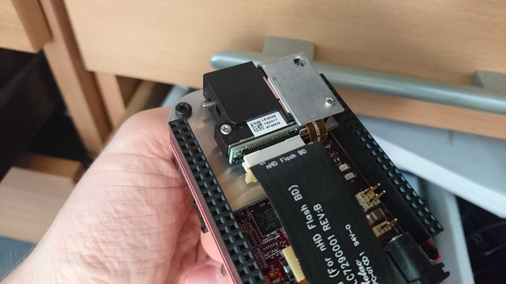
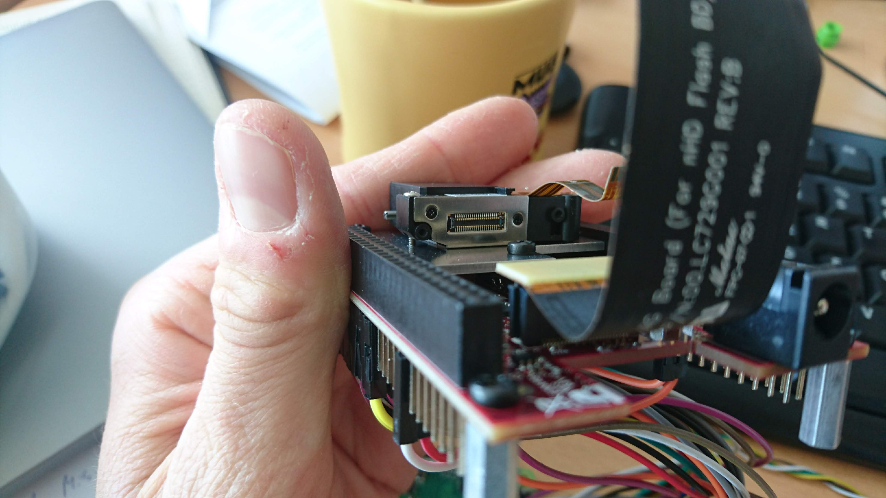
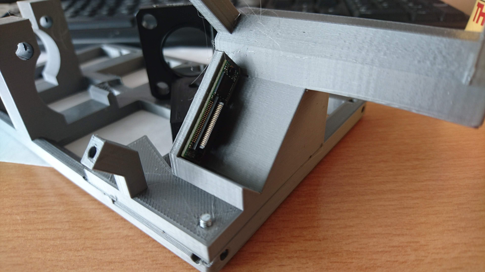

## openSIM

This is the repository for the openSIM project which integrates structured illumination microscopy into the UC2-system.

<p align="center">

</p>

***Fig 1:*** *This is the ready-to-print module which clicks into the UC2-system*


This module is based on the work by the Huser-Lab and can be found as a preprint on Bioarxiv [1]. It uses a low-cost single-mode diode laser (532 nm) and a Raspberry Pi driven DMD module to generate a structured illumination for microscopy. Since we use coherent illumination, we can create pattern suitable for SIM in order to increase the lateral resolution. So far we're not aiming for any super-resolution, but rather give a proof of principle.  

<p align="center">

</p>

***Fig 2:*** *A beam-expander magnifies the collimated beam which hits the DMD displaying a set of gratings*

The angle between the collimated and expanded Laser-beam and the DMD is 25° in order to get the maximum in the diffracted orders.


[1] *DMD-based super-resolution structured illumination microscopy visualizes live cell dynamics at high speed and low cost
Alice Sandmeyer, Mario Lachetta, Hauke Sandmeyer, Wolfgang Hübner, Thomas Huser, Marcel Müller
bioRxiv 797670; doi: [https://doi.org/10.1101/797670](https://doi.org/10.1101/797670)*

## Device's features:

- "True" two-beam SIM
- Very low cost:  ~300€
- Easy to align
- Open-Source

## Optical System

<p align="center">

</p>

***Fig 3:*** *The full system based on the modular cubes*

The system of a classical two-beam interference SIM is straight forward and based on common 4f (i.e. fourier imaging) system, where focal lengtheses of adjacent lenses are following each other. The core idea is to place two delta-peaks inside the BFP of the objective lens. The lens fourier-transforms the peaks and therefore form a grating in the sample plane.

In order to keep the whole system small, the telescope imaging the DMD is  based on two lenses with ***f'=50mm*** (e.g. Thorlabs achromates). A tube-lens of ***f'=180mm*** fourier-transforms the image folded by the mirror and places the different diffraction order inside the BFP of the objective lens. To produce 2D-Sim a fourier mask in the fourier-plane after the DMD, blocks the zeroth order.

The DMD, driven by a Raspberry Pi, gets illuminated by a more-less plane wave from a coherent laser source. The pattern which are displayed are then actually coherently reimaged inside the sample plane by the whole system.


## Parts

### Bill of material

|  Type | Details  |  Price | Link  |
|---|---|---|---|
| Laser |  12V 532nm 200mw Green Laser Dot Module Fan Cooling TTL 0-30KHZ-Long time working |  90 € | [Lilly Electronics](http://www.lillyelectronics.com/12v-532nm-200mw-green-laser-dot-module-fan-cooling-ttl-0-30khz-long-time-working)  |
| DMD |  Evaluierungsmodul (EVM) DLP® LightCrafter™ Display 2000 |  90 € | [Digikey](https://www.digikey.de/product-detail/de/texas-instruments/DLPDLCR2000EVM/296-47119-ND/7598640)  |
| Raspberry Pi | Raspi+SD-Card+Case+Powersupply(for DMD+Raspi, 5V, >=3A!) |  70 € | [Reichelt](https://www.reichelt.de/raspberry-pi-4-b-4x-1-5-ghz-1-gb-ram-wlan-bt-rasp-pi-4-b-1gb-p259874.html?PROVID=2788&gclid=Cj0KCQiAz53vBRCpARIsAPPsz8X9hCOt9yVVB_WqLCmKSs2e-KuThVnrMEtl2TRbAUTqtVoNZU3zM3YaAg2ZEALw_wcB&&r=1)  |
| Tube-lens | Lens, f=180mm |  10 € | [PGI-Versand](https://www.pgi-versand.de/?id=47&mode=artdet&artnr=564.OA.64)  |
| Telescope-lens | 2x Achromatic 1inch Lens, f=50mmmm |  82 € | [Thorlabs](https://www.thorlabs.com/thorproduct.cfm?partnumber=AC254-050-A)  |
| Dichroics  |  Various |  200 € | [Thorlabs]()  |
| Mirror | 1inch Silver Mirror, Protected |  50 € | [Thorlabs]()  |
| iPhone Lens | iPhone 5 lens for the telescope  (optional) |  5 € | [Amazon]()  |
| Lens | 25mm lens for the telescope (optional) |  5 € | [Amazon]()  |
| Dichroics  |  Various |  200 € | [Thorlabs]()  |
| PCB for Raspi-DMD connection  |  Various |  8 € | [See below]()  |

* Check out the [RESOURCES](../../TUTORIALS/RESOURCES) for more information!


### 3D printed parts

Parts to print:

* 1x [SIM-Module 2×4](./STL/Assembly_openSIM_module_v2_30_CUBE_openSIM_base_v2_1.stl)
* 1x [Telescope for Beam Expansion](./STL/Assembly_openSIM_module_v2_30_CUBE_OpenSIM_Beamexpander_v2_9.stl)
* 1x [DMD Adapter](./STL/Assembly_openSIM_module_v2_30_CUBE_openSIM_DLP2000_Holder_mirrored_3.stl)

### Additional parts for the whole setup
- 1x Kinematic Mirror Mount (for 1inch Silver mirror!) [here](../ASSEMBLY_CUBE_Mirror_Kinematic_45_v2)
- 1x Mirror Mount (for 1inch Silver mirror!) [here](../ASSEMBLY_CUBE_Mirror_45_v2)
- 1x OpenFlexure Delta-Stage (by Richard Bowman et al.) + Adapter + Objective lens (you can choose!)  [here](../ [here](../CUBE_INSERT_OpenFlexure_Deltastage))
- Dichroic Mirror Cube [here](../ASSEMBLY_CUBE_Dichroic_Beamsplitter_v2)
- Basler-Camera + Adapter [here](../ASSEMBLY_CUBE_BaslerCam)


## Electronics

### Wiring of the Raspberry Pi + DMD Module

In order to control the ***DMD DLP2000EVM*** with the Raspberry Pi we followed the nicely written Blog post here: [http://frederickvandenbosch.be/?p=2948](http://frederickvandenbosch.be/?p=2948).
We decided to have a stable wired version using a customized PCB. The wiring follows this chart:

<p align="center">

</p>

We created a PCB design which can directly be used with a Raspberry Pi and the DMD2000EVM module. All EAGLE-files can be found in the folder [ELECTRONICS](.\ELECTRONICS\Piprojector).


The resulting two-sided PCB appears to look like that:

<p align="center">

</p>

It can conveniently be ordered through online resources. Ours came from [aisler](https://aisler.net/) and cost 9€:

<p align="center">

</p>


### Assemble the DMD Module

The SIM-setup uses the bare DMD to display images into the sample-plane. This means, that we need to get rid of the LED illumination. Unfortunately the module stops working once the LED is put away from the electronics. Therefore we need to cover it with dark tape.

***1.) Take the DMD Module***
<p align="center">

</p>

***2.) Remove all screws you can find***
<p align="center">

</p>

***3.) Remove the connection flat-band cable***
<p align="center">

</p>

***4.) Disassemble the DMD module***
<p align="center">

</p>

***5.) Mount the DMD module on the 3D printed module and add the cables***
<p align="center">

</p>


## Software  

Using the PCB, setting up the module is again straight forward. After setting up the Raspberry Pi operating system, the *I2C* registers have to be set in order to display a fullscreen image on the DMD at a true resolution of *640x460* pixels.

This can be done from remote through SSH (e.g. ```ssh pi@192.168.178.39```) or using a secondary screen.
Opening a terminal connection one need to enter the following commands:

```
sudo apt-get update
sudo apt-get upgrade
sudo apt-get install mplayer

```

To edit the *I2C* settings the following is requiered:

Edit the entry at boot by typing ```nano /etc/rc.local``` and add (make sure the number after ```-y``` matches your I2C device by listing ```ls /dev/``` (e.g. ```/dev/i2c-11```)
Don't use ```sudo``` for ```i2cset```!!
```
i2cset -y 11 0x1b 0x0b 0x00 0x00 0x00 0x00 i
i2cset -y 11 0x1b 0x0c 0x00 0x00 0x00 0x1b i
# export DISPLAY=:0 (use this to access the screen from a remote SSH session)
```

In order to keep this after a reboot this can be added to the boot-config.txt.


Another thing before it starts working is to set the timings of the video-display.
Therefore type the following:

```nano /boot/config.txt```

and enter the following text:

```
# and your display can output without overscan
disable_overscan=1

# Enable audio (loads snd_bcm2835)
dtparam=audio=on

# Add support for software i2c on gpio pins
dtoverlay=i2c-gpio,i2c_gpio_sda=23,i2c_gpio_scl=24,i2c_gpio_delay_us=2

# DPI Video Setup
dtoverlay=dpi18
overscan_left=0
overscan_right=0
overscan_top=0
overscan_bottom=0
framebuffer_width=640
framebuffer_height=360
enable_dpi_lcd=1
display_default_lcd=1
dpi_group=2
dpi_mode=87

dpi_output_format=458773
hdmi_timings=640 0 14 4 12 360 0 2 3 9 0 0 0 60 0 32000000 3

```


Once you have created a proper video-file which contains the RAW-frames (e.g. ```ABC.avi```) you can start the video on the screen remotely by typing the following:

```mplayer -fs -loop 0 ./Desktop/ABS.avi```


### Video generation

#### Fiji Plugin

For generating the frames we suggest to use the freely available pattern-generation software which is part of the ***fairSIM*** project by Marcel Müller et al. This can generate patterns using the following GUI:


<p align="center">

</p>

The created stack (i.e. TIF) need to be imported and saved as an uncompressed 8-Bit monochromatic AVI-file in order to get displayed using mplayer on the Raspberry Pi.

The plugin is available from Marcel Müller on his [Repo](https://github.com/fairSIM/fastSIM-GratingSearch/releases). Download the file ```SLM_GratingSearch.jar``` and add it to the plugin directory. 

#### Matlab Programm

The Matlab based version of the SLM Pattern generation can be found in our [fastSIM Repository](https://github.com/nanoimaging/fastSIM_GratingSearchforSLM).

#### Java Programm

There is also a Java implementation for CUDA enabled graphic cards available from the University Bielefeld [here](https://github.com/biophotonics-bielefeld/coherent-dmd-sim-simulator).

## Further reading

- [DATASHEET DMD](https://www.digikey.at/de/product-highlight/t/texas-instruments/dlp-lightcrafter-display-2000-eval-module)
- [DMD for Photo-Lithography](https://hackaday.io/project/25260/gallery#f8c0a842e59a10156db102aedcd8b790)
- [Hands-on and review of DMD module](https://www.element14.com/community/roadTestReviews/2662/l/dlp-pico-display-projector-evm-beaglebone-black-review)
- [Alternative fiber-coupled laser](https://de.aliexpress.com/item/32880918252.html)
- [Deeper Reading into the I2C settings](https://mikrokontroler.pl/2019/01/02/projektor-dlp-z-wykorzystaniem-raspberry-pi-3-oraz-modulu-ti-lightcrafter-display-2000/2/)
- [Datasheet DLP2000](http://www.ti.com/lit/ds/symlink/dlp2000.pdf)
- [Display Timinigs on Raspi](https://www.raspberrypi.org/documentation/hardware/raspberrypi/dpi/)
- [Flickering Problem on DLP](https://e2e.ti.com/support/dlp/f/94/t/700072?DLPDLCR2000EVM-Screen-Jitter-Glitch-on-Output-of-DLP-Lightcrafter-2000)


## Result

This is just some stack where we measured the fluorescent signal on a Fluochart:
<p align="center">

</p>


## Participate!

Do you want to show your own results? Do you have ideas for improvements? Let us know!
