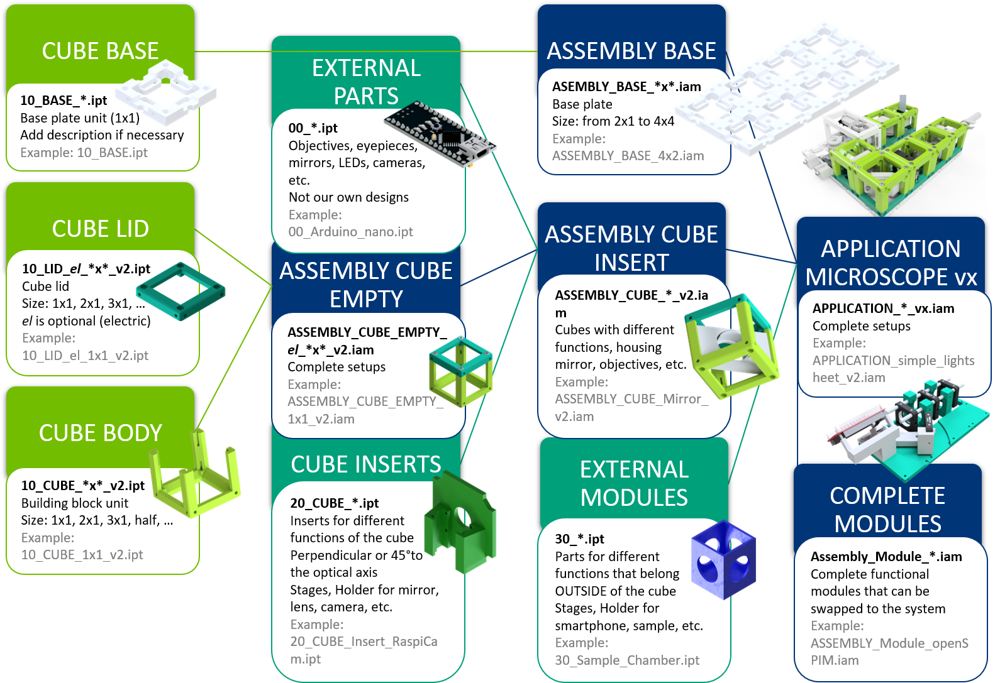

## Applications
 Here you can find all the optical setups we tested or proposed so far.

* For printing and assembly of all the cubes and modules go to [CAD](../CAD)
* For setups compilations go to [TheBOX](../TheBOX)
* For beginner's tutorials, how-to guides and more guidelines go to [TUTORIALS](../TUTORIALS)
* For information on the electronic parts go to [ELECTRONICS](../ELECTRONICS)
* For information on the software go to the dedicated repository [UC2-Software-GIT](https://github.com/bionanoimaging/UC2-Software-GIT)
* For the Bill of Materials go to [RESOURCES](../TUTORIALS/RESOURCES)
* For anything else, have a look at the [SITEMAP](../SITEMAP.md)

This is a growing list of available optical setups coming along with tutorials and alignment instructions. The most important part is the core building block as you find in every modular toolbox. A detailed description of the the **UC2** cube can be found [here](../CAD/ASSEMBLY_CUBE_Base_v2/Readme.md).

##  List of available Applications (APPs)

### Compilations

* [TheBOX: Concept of a ready-to-use box containing multiple setups at once](../TheBOX/)
* [SimpleBOX: Optical setups from elementary to high-school level ](../TheBOX/SimpleBOX)
* [FullBOX: Optical setups from high-school to university level (contains electronics)](../TheBOX/FullBOX)
* [CourseBOX: Optical setups for Optics and Microscopy courses](../TheBOX/CourseBOX)

### SIMPLE Setups
* [SIMPLE - Projector](./APP_SIMPLE-Projector)
* [SIMPLE - Telescope](./APP_SIMPLE-Telescope)
* [SIMPLE - Smartphone Microscope](./APP_SIMPLE-Smartphone_Microscope)

### BASIC Setups
* [In-Incubator Microscope with X/Y/Z-control and adaptive illumination](./APP_Incubator_Microscope)
* [Light sheet Microscope](./APP_LIGHTSHEET_Workshop)
* [In-line Holographic Microscope](./APP_INLINE_HOLOGRAM)
* [Abbe Diffraction Experiment](./APP_Abbe_Setup)
* [Michelson Interferometer (Interference effect of light)](./APP_Michelson_Interferometer)
* [Mach-Zehnder Interferometer (Interference effect of light)](./APP_Mach-Zehnder_Interferometer)
* [Double Slit Experiment (Interference effect of light)](./APP_Double-slit_Experiment)
* [Spectrometer](APP_Spectrometer)

### COMPLEX Modules and Setups
* [openSIM - Structured Illumination Microscopy (2-Beam Interference Super-Resolution)](./APP_openSIM)
* [openISM - Image Scanning Microscopy (Confocal or Super-confocal imaging)](./APP_openISM)
* [openKOEHLER - Phase Contrast enhancement using an adaptive Koehler illumination](./APP_openKOEHLER)
* [openXYtable - Module](./APP_openXYTable)
* [Ptychography](./APP_Ptychography)
* [Fluorescent Microscope with infinity optics and a Laser ](./APP_Fluorescence_Microscope_infinity)

## General Naming Convetion and Structure of UC2

## Confusion about version v0 vs. version v2

We made a change in the CAD design of the cube in order to be more generic (e.g. point symmetry around the center). We're trying hard to update the APPlications so that everything is based on the new design, but it's a lot of files and there are probably still some forgotten v0 parts.

If you're unsure, check out the [Modular Developer Kit](../MDK) - there you find a general definition of the shape and size of the inserts which is up to date!

The outer cube dimensions stayed the same, but the inserts changed completely!

##  List of available Modules (CUBEs):
A list of available Cubes that are the building blocks of all our setups can be found in [CAD](../CAD).

### Complete overview of setups, modules, parts to buy and parts to print
Find a complete shopping'n'printing list including estimated prices for all modules and setups in this [GoogleDrive Spreadsheet](https://docs.google.com/spreadsheets/d/1U1MndGKRCs0LKE5W8VGreCv9DJbQVQv7O6kgLlB6ZmE/edit?usp=sharing)!

##  Participate
If you have a cool idea, please don't hesitate to contact us, we are happy to incorporate it in our design to make it even better.  
More setups are coming soon!
Inspire us with your ideas - we try to make it work! :-)
