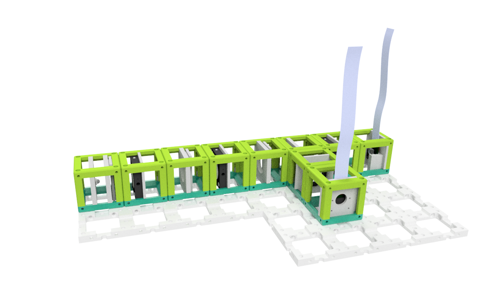

# Abbe Diffraction Experiment
This is the repository for the Abbe Diffraction Experiment. It has two cameras where one captures the fourier plane and the other acquieres the image plane.

## Setup
This is based on old cubes, but the order is the same. All lenses have 50mm focal length.

## Devices' features:

* Capture Fourier Plane
* Capture Image Plane
* Low-cost acquisition
* Open-Source
* Compatible with Educational purposes

## 3D printing

Having two cameras is optional since one camera can be moved between two planes!

### Parts to printing

|  Name | Properties  |  Price | Link  | # |
|---|---|---|---|---|
|  2x4 Baseplate | - | 5€  | [Base-plate](../ASSEMBLY_Baseplate_v2/)  | 1|
|  4x4 Baseplate | - | 5€  | [Base-plate](../ASSEMBLY_Baseplate_v2/)  | 1|
|  Module: Raspberry Pi Camera | -  | 20 €  | [Raspi Camera Cube](../ASSEMBLY_CUBE_RaspiCam_v2)  | 2|
|  Module: LED + Pinhole  | white light LED, 1mm pinhole | 10€  | [LED + Pinhole Cube](../ASSEMBLY_CUBE_LED_v2)  | 1|
|  Module: Lens | all 50mm lenses | 10€  | [Lens Cube](../ASSEMBLY_CUBE_Lens_v2)  | 4 |
|  Module: Beamsplitter | - | 30€  | [Beamsplitter Cube](../ASSEMBLY_CUBE_Beamsplitter_v2)  | 1 |
|  Module: Sampleholder | - | 30€  | [Sampleholder Cube](../ASSEMBLY_CUBE_Sample_Holder_v2)  | 1 |

### Additional components

* 1x Raspberry Pi
* 1x camera splitter for Raspberry Pi
* 1x wired LED (blue)
* Aluminium Foil for the apertures/pinhole
* 1x Power Supply for Raspberry Pi
* long camera cables

## Software
Please have a look at our **ImJoy** [Github-Repository](https://github.com/bionanoimaging/UC2-ImJoy-GIT) for this Application.

## Participate!
If you find this piece usefull or you want to improve it, please feel free to file an issue or write us a message!
