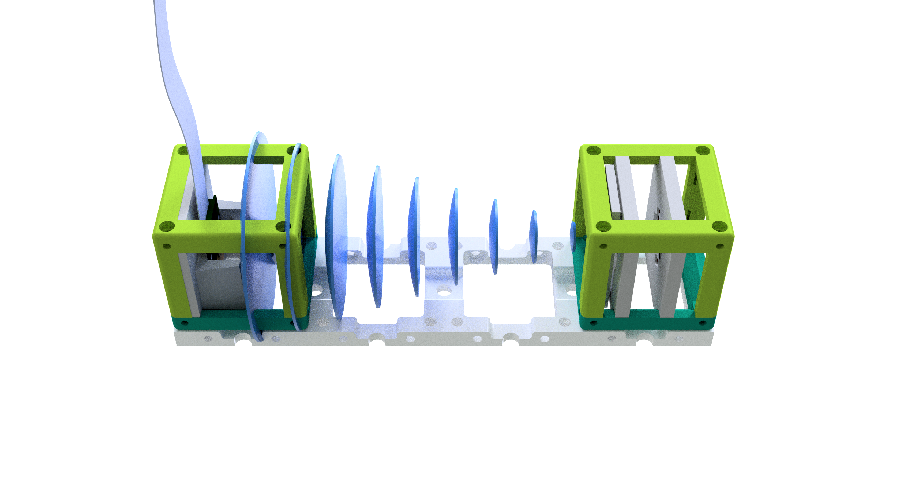
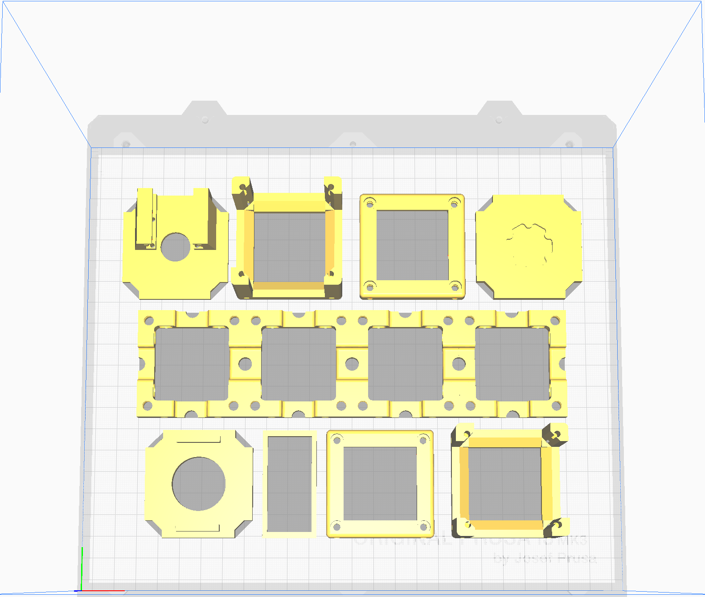

## Inline Holographic Microscope
This is the repository for the inline holographical microscope.

This is be part of the workshop which can be found in WORKSHOP. Note that the designs has been updated since the last workshop was organised. The files and linkd on this page are up to date. The files in the workshop document follow the old version of the cube.

It acquires the interference of the spherial wave coming from a pinhole, illuminated by an LED, and the scattered wave from a transparent (phase) sample.

<p align="center">

</p>


For reconstructing the Hologram, acquired on-chip (Raspi-Cam, left) one only needs to "deconvolve" it with the free propagator at a certain z-distance (i.e. fresnel propagator).

A more in-detail documentation can be found [here](./../../WORKSHOP/INLINE-HOLOGRAMM)

## Devices' features:

* Lensless
* Explain Interference
* Low-cost acquisition
* Open-Source
* Compatible with Educational purposes


## 3D printing

<p align="center">

</p>

### Parts to printing

|  Name | Properties  |  Price | Link  | # |
|---|---|---|---|---|
|  1x4 Baseplate | - | 5€  | [Base-plate](../ASSEMBLY_Baseplate_v2/)  | 1|
|  Module: Raspberry Pi Camera | -  | 20 €  | [Raspi Camera Cube](../ASSEMBLY_CUBE_RaspiCam_v2)  | 1|
|  Module: LED + Pinhole  | - | 10€  | [LED + Pinhole](../ASSEMBLY_CUBE_LED_v2)  | 1|


### Additional components
* 1x Raspberry Pi
* 1x wired LED (blue)
* 1x button
* 1x Power Supply for Raspberry Pi


## Quick-start 

This assumes you have built the Inline-holographical microscope already. 

Soon we will provide a browser-plugin for the image reconstruction using found in our **ImJoy** [Github-Repository](https://github.com/bionanoimaging/UC2-ImJoy-GIT).

<p align="center">

</p>

This is an example for an acquired inline hologram. 

###Image Acquisition

In order to use this setup one has to take a picture with the Raspberry Pi camera module. This can conveniently be done using the command-line tool ```raspistill``` which can be called from the Terminal in the Raspberry Pi. 

A more in-detail documentation can be found [here](https://www.raspberrypi.org/documentation/usage/camera/raspicam/raspistill.md).

We use a very basic setting with auto-white-balance, auto-exposure and jpeg compression by typing

```
cd ~
mkdir inlineholo
cd inlineholo
raspistill -f my_inline_test.jpg
```

This will open the camera, capture an image and saves it as ```my_inline_test.pg```in the folder ```inlineholo``` in the Pi-home directory. Using a USB-drive one can copy the file to a computer for further processing. 

##Image Reconstruction

We have created an ```iPython-Notebook``` for this task which can be found [here](CODE/Listings_1_ReconHoloInline.ipynb). 


### Tutorial for installing the Inline-Hologram Reconstruction software 

Install Anaconda 3.6 (latest version for windows).
Therefore follow the tutorial in this link: [Anaconda Installation](https://docs.anaconda.com/anaconda/install/) (external). 

0. After you've installed Anacoda, download the ipython notebook file: ```Listings_1_ReconHoloInline.ipynb``` by clicking this [link](./Listings_1_ReconHoloInline.ipynb) and type control+s for saving it somewhere on the computer
<p align="center"></p>

1. Copy Image in the same folder as the ```.iypnb```-file
<p align="center"></p>

2. ```Windows+R``` => Run prompt
3. enter ```CMD``` and hit enter
4. The Terminal opens 
5. Copy the path where you have the image and script file (e.g. C:\Users\diederichbenedict\Downloads\HOLOGRAM)
<p align="center"></p>
6. Enter: cd "C:\Users\diederichbenedict\Downloads\HOLOGRAM" (or whatever path; right click is paste in the terminal)
<p align="center"></p>
7. Type "ipython notebook" -> enter
<p align="center"></p>
8. Browser opens at http://localhost:8888 (copy paste if not opening automatically)
9. Go to the field "Define experimental parameters" and change the variable name "my_holo_file" to the filename you acquired (e.g. "hologram_mouse.jpg"
<p align="center"></p>
10. Go to Cell and hit "run all" and keep your fingers crossed!! 
11. Vary the position of the slider in the 
<p align="center"></p>


If you're not happy with the region of interest (ROI) change the center coordinates ```center_x``` and ```center_y``` to what you would like to see in the RAW-hologram. 
Rerun the programm by hitting "run all" 

If you want to process a bigger field of view or ROI change the variable "mysize" to a bigger number, but take into account, that the processing time increasing!

If you think, that the refocussing range is either too small or too large (i.e. too close or too far away), than change the parameters:

```
# Creating costume widget
FocusSlider = widgets.FloatSlider(
    min = 0,
    max = .01,
    step = 1e-3,
    value=0,
    description = 'ZPos',
    continuous_update = True
)
```


```min```, ```max``` and step which describe the minimal/maximal focal distance between the sensor and the sample as well as the stepsize where the algorithm calculates the refocussed hologram.


## Contribution
If you find this piece usefull or you want to improve it, please feel free to file an issue or write us a message!
