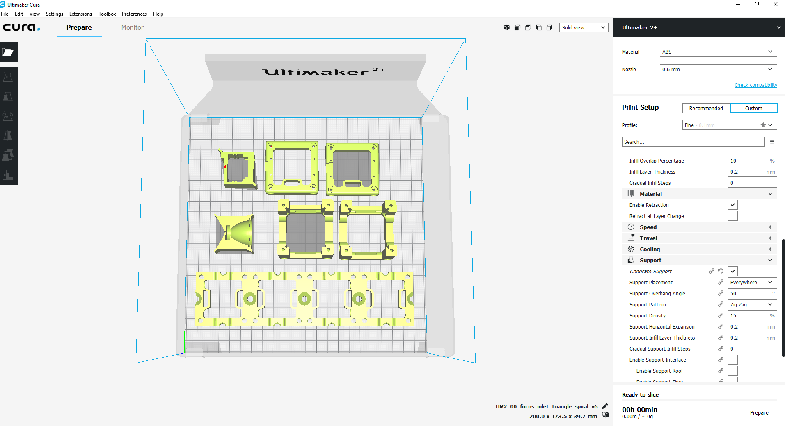

## Inline Holographic Microscope
This is the repository for the inline hographical microscope. This will be part of the workshop which can be found in WORKSHOP.

It acquires the interference of the spherial wave coming from a pinhole, illuminated by an LED, and the scattered wave from a transparent (phase) sample.

For reconstructing the Hologram, acquired on-chip (Raspi-Cam, left) one only needs to "deconvolve" it with the free propagator at a certain z-distance (i.e. fresnel propagator).

A more in-detail documentation can be found [here](./../../WORKSHOP/INLINE-HOLOGRAMM)

## Devices' features:

* Lensless
* Explain Interference
* Low-cost acquisition
* Open-Source
* Compatible with Educational purposes

## 3D printing

### Parts to printing

|  Name | Properties  |  Price | Link  | # |
|---|---|---|---|---|
|  1x4 Baseplate | - | 5€  | [Base-plate](../ASSEMBLY_Baseplate_v2/)  | 1|
|  Module: Raspberry Pi Camera | -  | 20 €  | [Raspi Camera Cube](../ASSEMBLY_CUBE_RaspiCam_v2)  | 1|
|  Module: LED + Pinhole  | - | 10€  | [LED + Pinhole](../ASSEMBLY_CUBE_LED_v2)  | 1|

### Additional components
* 1x Raspberry Pi
* 1x wired LED (blue)
* 1x button
* 1x Power Supply for Raspberry Pi

## Software
Please have a look at our **ImJoy** [Github-Repository](https://github.com/bionanoimaging/UC2-ImJoy-GIT) for this Application.

## Comments
Nothing to say.

## Contribution
If you find this piece usefull or you want to improve it, please feel free to file an issue or write us a message!
