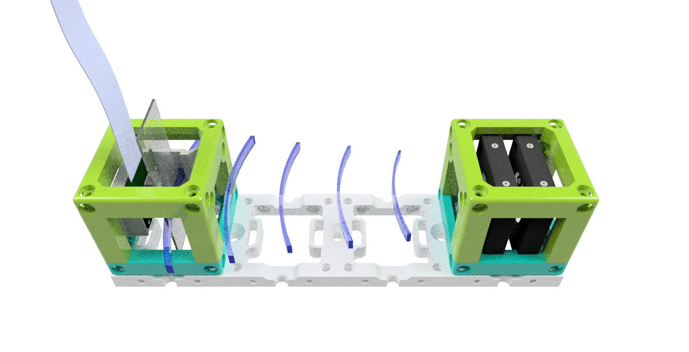

## Inline Holographical microscope
This is the repository for the inline holographical microscope. This will be part of the workshop which can be found in [WORKSHOP](../../WORKSHOP/INLINE-HOLOGRAMM).

It acquires the interference of the spherial wave coming from a pinhole, illuminated by an LED, and the scattered wave from a transparent (phase) sample. 

For reconstructing the Hologram, acquired on-chip (Raspi-Cam, left) one only needs to "deconvolve" it with the free propagator at a certain z-distance (i.e. fresnel propagator). 

Devices features:

	* Lensless
	* Explain Interference
	* Low-cost acquisition
	* Open-Source
	* Compatible with Educational purposes
