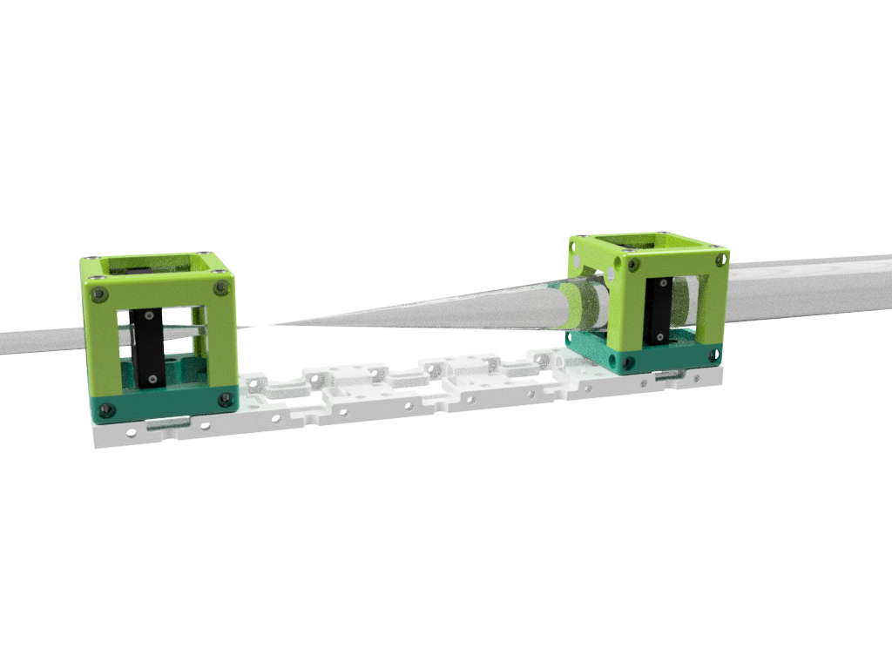
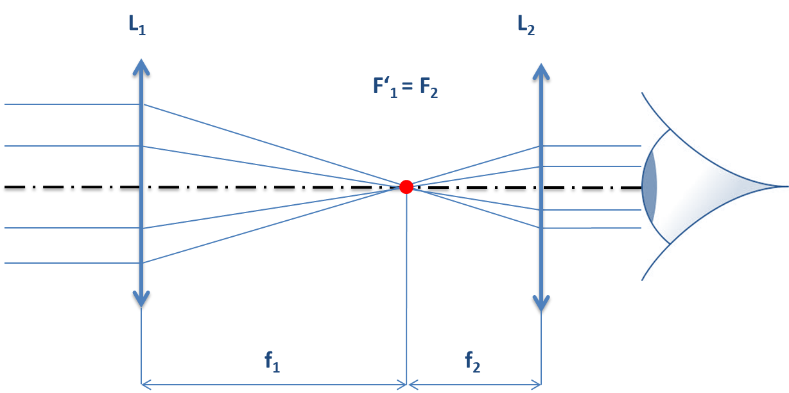
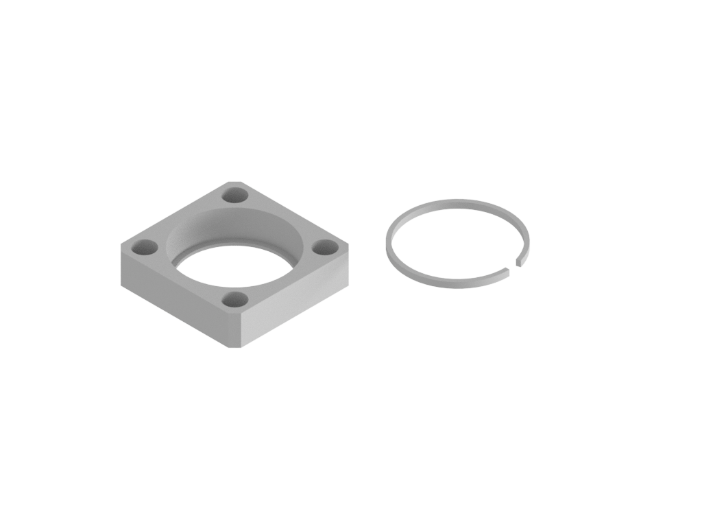

## Simple Telescope

We developed a very easy-to-use setup to let people understand how a telescope works. It guides you through  different varieties of optical designs all with the goal: magnifying of far-away objects (e.g. Stars).

In the end the setup should look like this here:

We created a German [Workshop-Document (GER)](UC2_Telescope.pdf) and English [Workshop-Document (EN)](UC2_Telescope_EN.pdf) which goes into details of assembling the Telescope and comes with a quiz to test your knowledge about telescopes. Are you able to answer all of them?

### Keplerian Telescope

It consists of two lenses with positive focal-length, where the focal lengths (f1) of the first falls into the focal length (f2) of the latter one. The magnification is thus given by the ratio of m=f1/f2.

The core idea is to form an image of (red spot) from an object which is infinitely far away, thus having ~plane wave as input. The entrance pupil - namely the diameter of L1 - limits the plane wave. The second lens L2 reimages the red-spot again to infinity, where the outgoing diameter of the rays parallel to the optical axis are (de-)magnified by the ratio m. The eye can then conveniently form an image on the retina.

### Galilean Telescope

The core idea of the Galilean telescope is to magnify objects from far away - suprise! The main difference as you might guess from the two images are the components selected in order to build this setup. Compared to the Keplerian telescope, whe have a positive and a negative lens. The concept, that the focal lenght of the first lens falls into the focal length of the latter one is still met, but now the entire setup shrinks because you add a positive f1 to a negative f2 which defines the entire length of this instrument: d=f1+f2.

Another major difference is, that the image is not flipped compared to the Keplerian Telescope!

## Components
The CAD parts can also be found [here](./STL).

In particular you need the following parts:

### 3D-printed components
* 1x [Base Frame](./STL/INLINE_HOLOGRAM_00_Base_4x1_v0.stl)
* 2x [Cube Lid](./STL/INLINE_HOLOGRAM_10_Lid_el_v0.stl)
* 2x [Cube Lid](./STL/INLINE_HOLOGRAM_10_Cube_v0.stl)
* 2x [Lens Holder](./STL/Assembly_Custom_Lens_Adapter_11_Lens_Thorlabs_Mount_Customized_B_1.stl)
* 2x [Lens Holder Ring](./STL/Assembly_Custom_Lens_Adapter_11_Lens_Thorlabs_Mount_Ring_B_2.stl)

### Lenses (Kepler+Galileo)
* 1x biconvex lens, Diameter=20mm, 50mm
* 1x plano-concave lens, Diameter=20mm, -50mm
* 1x biconvex lens, Diameter=20mm, 150mm

### Miscellaneous
* 4x [Aluminium Rods, Diameter=6mm, length=50mm, EBAY](https://www.ebay.de/itm/Aluminium-rund-6mm-Lange-wahlbar-Rundstange-Alu-AlCuMgPb-Rundmaterial-Stab/142225734720?hash=item211d507c40:m:mAppPewY6qYHfgAQt2GatDg)
* 8x [Ball-Magnets - 5mm, Neo-Dym, AMAZON](https://www.amazon.de/Unbekannt-100-Neodym-Kugelmagnete-5-mm/dp/B00HXLBH6K/ref=pd_sbs_196_4/261-4292290-0235846?_encoding=UTF8&pd_rd_i=B00HXLBH6K&pd_rd_r=985b1a67-4b1e-11e9-b3ce-5b3ae6a6812b&pd_rd_w=Yei4i&pd_rd_wg=eETBx&pf_rd_p=74d946ea-18de-4443-bed6-d8837f922070&pf_rd_r=Z3BJWK5PJB16K7PF8ENR&psc=1&refRID=Z3BJWK5PJB16K7PF8ENR)
* 8x [M3 srews, DIN 912, magnetic (!), 18mm long, AMAZON](https://www.amazon.de/Edelstahl-Innensechskant-Schrauben-Sortiment-250-tlg/dp/B0065GSI34)

## Assembly of the cube
Putting the parts together is as simple as that:

## Assembly of the lenses
Putting the parts together is as simple as that:

Put the lens into the inner hole of the adapter, add the retaining ring and you're done. If you have a specifc lens shape, let us know, we can customize the inner diameter in order to make it work! This part goes on the 6mm rod which goes inside cube.

## Suggestions
If you have any problems or suggestions, please file an issue. Thank you!
