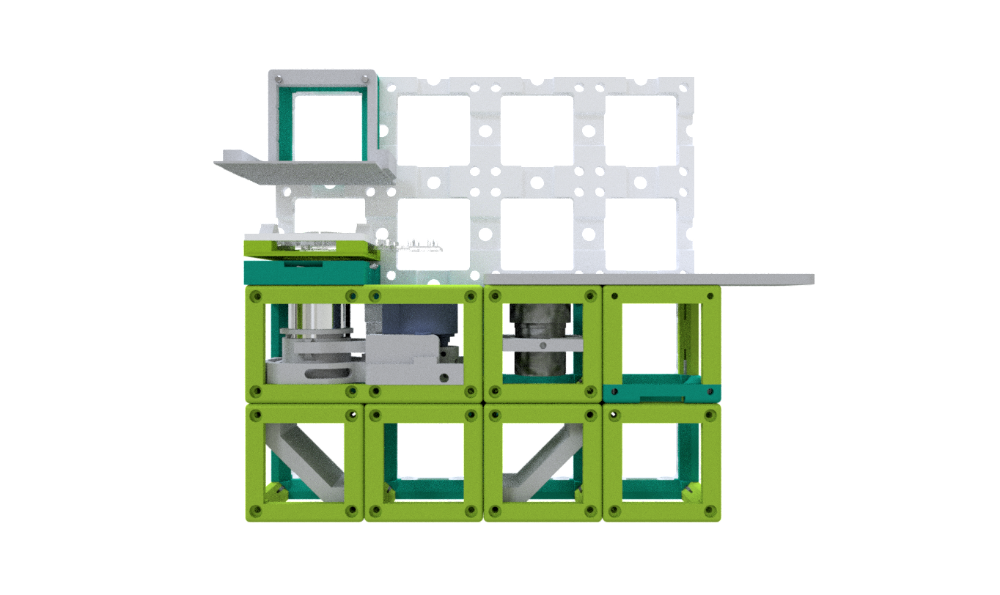
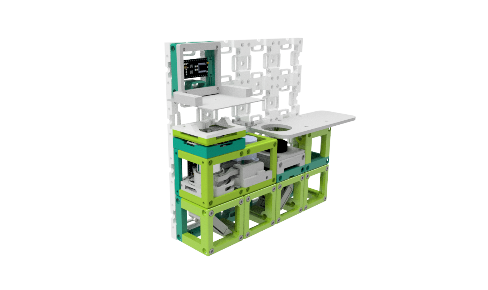
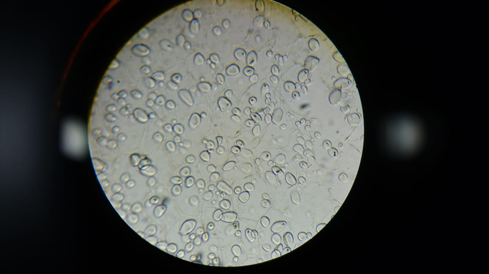

## Smartphone Microscope
This is the repository for the Smartphone Microscope. 

It's based on a compound microscope which itself relies on finite corrected objective lenses. The Smartphone reimages the image of the ocular onto the camera sensor. This means that the cellphone's camera lens acts like the eye. Proper imaging is achieved if the exit pupil of the eyepiece is matching well with the entrance pupil of the smartphone camera. 

Further details can also be found in the ```cell-scope```publication by Professor Fletcher at Berkeley. It can also be found on their website [https://cellscope.berkeley.edu/](https://cellscope.berkeley.edu/). 


<p align="center">

</p>

The optical path is relying on the finite corrected objective (MO) lens which produces an intermediate image in its tube-length. This image is propagated to infinty by the eyepiece (EP). The smartphone (CAM) expects this image to form an image on the cellphone's camera-sensor. The mirrors (M) are basically just folding the beam, the LED-Array (LA) is giving the opportunity to have different imaging modalities like Dark-, Brightfield or (quantitative) Differential Phase Contrast.

<p align="center">

</p>

The files contain a fluorescent module which works in darkfield configuration.

## 3D printing

<p align="center">

</p>

Parts to print (not up to date! - please check the STL folder directly for all parts!) 

* 1x [Base-plate](./STL/INLINE_HOLOGRAM_00_Base_4x1_v0.stl)
* 2x [Cube base](./STL/INLINE_HOLOGRAM_10_Cube_v0.stl)
* 2x [Cube lid](./STL/INLINE_HOLOGRAM_10_Lid_el_v0.stl)
* 1x [Cube Insert Camera](./STL/INLINE_HOLOGRAM_11_Mirror_Adapter_for_RaspiCam.stl)
* 1x [Cube Insert for the LED+Aluminium foil](./STL/INLINE_HOLOGRAM_10_Inlet_LED_Reflector)

In the end it should look like that:

<p align="center">

</p>


## Results 
This is a quick result we shot with an Xperia Z5 of potatoe starch cells:
<p align="center">

</p>


## Additional components
* 1x Cellphone 
* 1x LED-Array, Neopixel, 8x8
* 32x 5mm Ball magnets
* 32x DIN 906 M3x18mm Screws 
* 1x Objective Lens (e.g. 10x, NA: 0.3)
* 1x Eyepiece (e.g. 10x)
* 2x Mirrors (e.g. 10x10 Toymirrors)
* 2x Arduino Nano
* 1x Cheap Stepper Motor
* 4x Star-LEDs blue (high power 1-3 Watt)
* 1x MOS-FET/Power PNP Transistor
* Wires, 0.14 mm^2 

## Devices features:

	* Z-Focus
	* Inverted/Upright Microscope
	* High resoltion
	* Open-Source
	* Compatible with Educational/Professional fields
	* Compatible with almost any cellphone
	* Different imaging modalities 
	* Fluorescent Module enables "true" fluorescent imaging