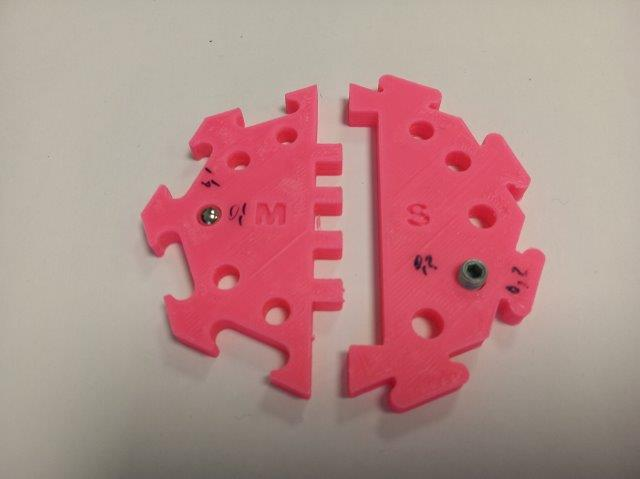
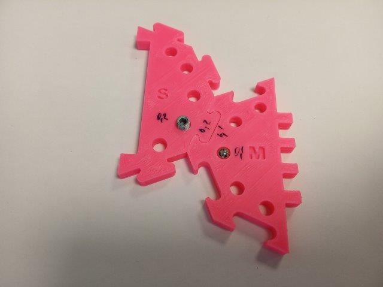
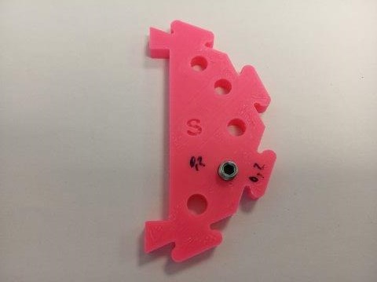
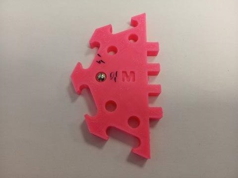
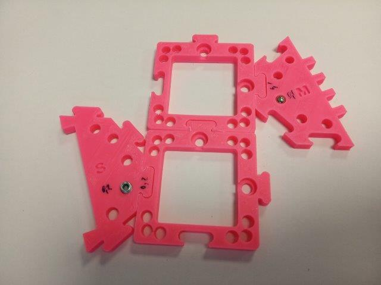

## 3D-printed Baseplate
Here you find the guidelines for 3D-printing the baseplate puzzles. For general information about baseplates look [here](../). For Assembly guidelines look [here](../#-assembly).

The baseplate puzzles are produced using injection moulding (IM) but it is also possible to 3D print (3DP) them. The IM and 3DP puzzles are compatible.  
However, the size of the 3DP puzzles may vary between different printers and filaments. It is therefore advisable to calibrate the baseplate with your printer.

###  Additional parts
* Ballmagnets (one for testing) - 5 mm diameter [🢂](https://www.magnetmax.de/Neodym-Kugelmagnete/Magnetkugel-Kugelmagnet-O-5-0-mm-Neodym-vernickelt-N40-haelt-400-g::158.html)
* M5×8 screw (one for testing) [🢂](https://eshop.wuerth.de/Produktkategorien/ISO-4026-Stahl-45H-verzinkt/14013511052004.cyid/1401.cgid/de/DE/EUR/?CatalogCategoryRef=14013511052004%40WuerthGroup-Wuerth-1401&SelectedFilterAttribut=%255B%257B%2522name%2522%253A%2522AT_ThreadTypeXNominalDiameter%2522%252C%2522value%2522%253A%255B%2522M5%2522%255D%252C%2522title%2522%253A%2522Gewindeart%2520x%2520Nenndurchmesser%2522%257D%252C%257B%2522name%2522%253A%2522AT_Length%2522%252C%2522value%2522%253A%255B%25228%2520mm%2522%255D%252C%2522title%2522%253A%2522L%25C3%25A4nge%2522%257D%255D)

### :elephant:: Printing tips and tricks!
Have you heard about the "elephant foot issue" when it comes to 3D-printing? It might be the reason why your printed puzzle pieces can't fit nicely together.

When printing the first layer is squished against the heated print bed and as a result, it’s usually a bit wider than it should be. This creates a big trouble for the puzzle. But luckily, it can be fixed. If you are using Prusaslicer, they have an easy solution to compensate for this as described [here](https://help.prusa3d.com/en/article/elephant-foot-compensation_114487). If you don't use this slicer, there are also options to [compensate for this](https://all3dp.com/2/elephant-s-foot-3d-printing-problem-easy-fixes/).

## Calibrate the size of the baseplate puzzle
The size of the 3DP puzzles may vary between different printers and filaments. How to take this aspect into account?

1. Print the Baseplate calibrator from [here](UC2_30_printing_calibrator_v3.stl). Use the 3D printer and filament you'll be using for all the parts.

2. Find which pair of puzzle connectors fit best together.

3. Using an M5 screw, find on the S side of the calibrator the correct offset for the holes for the pins/screws. In the correct hole, the screws should not get stuck but it also should not fall through.

4. If you'll be using magnets in the baseplates, find on the M side of the calibrator the correct offset for the holes for the magnets - they should be inserted with force but without breaking hands or the 3D printed calibrator.

5. This gives you the offset from the default size

6. Open the Baseplate puzzle on [Thingiverse](https://www.thingiverse.com/thing:4712377) using their Customizer and insert the offsets you found using the calibrator.

7. Generate an STL-file for the Baseplate that will work best with your printer. To make sure it works, firstly print only two baseplates and check if the puzzles connect firmly. For the holes, there is more tolerance.

8. Next: [Assemble the baseplate with magnets](../#-assembly)

### Adapting the baseplate
These files were generated using OpenSCAD. You may use them if you'd like to change other parameters of the baseplate.

Here you find the following file:
* [10_Base_puzzle_v3.scad](10_Base_puzzle_v3.scad) that can be customised to have the puzzles fit properly. Find the details in [ASSEMBLY Baseplate](../../ASSEMBLY_Baseplate).

If you're looking for more UC2 openSCAD design, have a look at the [BASE CUBE](../../ASSEMBLY_CUBE_Base/OPENSCAD).

To start working on it, you have to do the following steps:

* Download the file you want to work with and open it in openSCAD
* Change the design as you need
* Render it, export an STL file and print it
* Let us know about your ideas and updates! ([CONTRIBUTING](../../../CONTRIBUTING.md))
