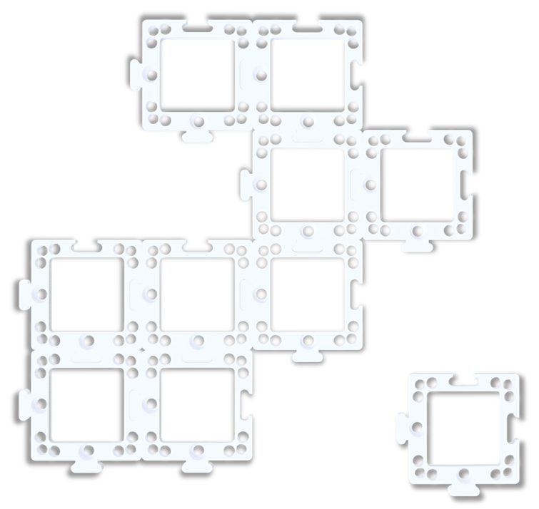
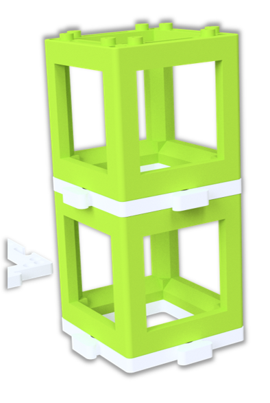
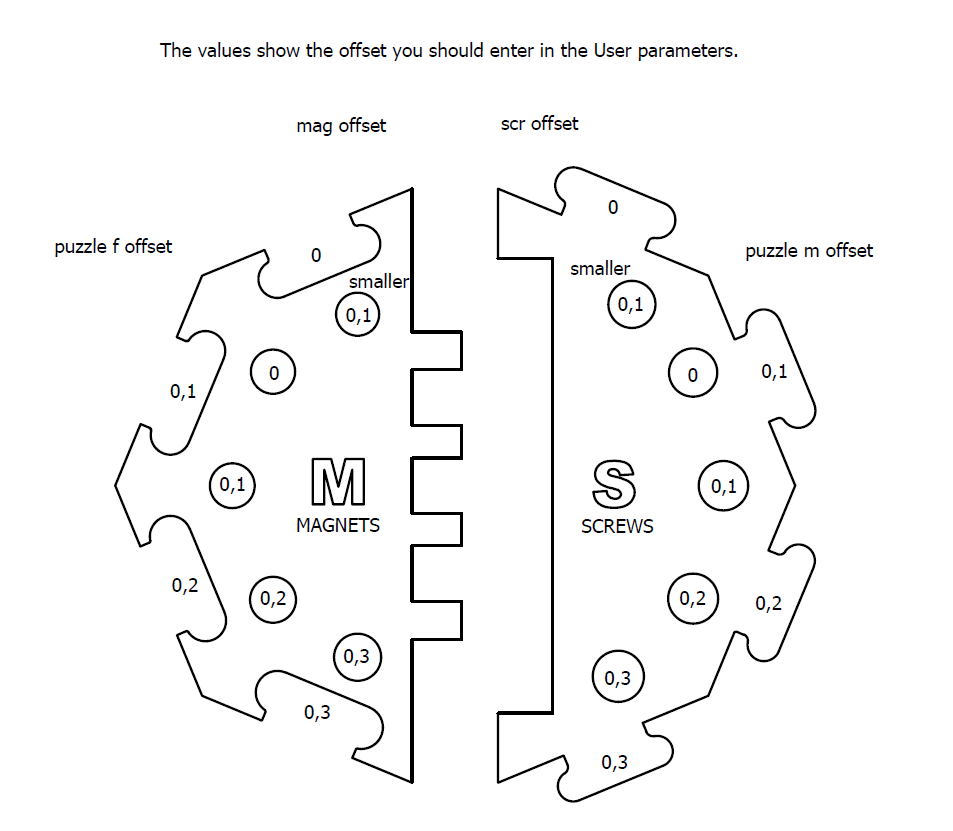
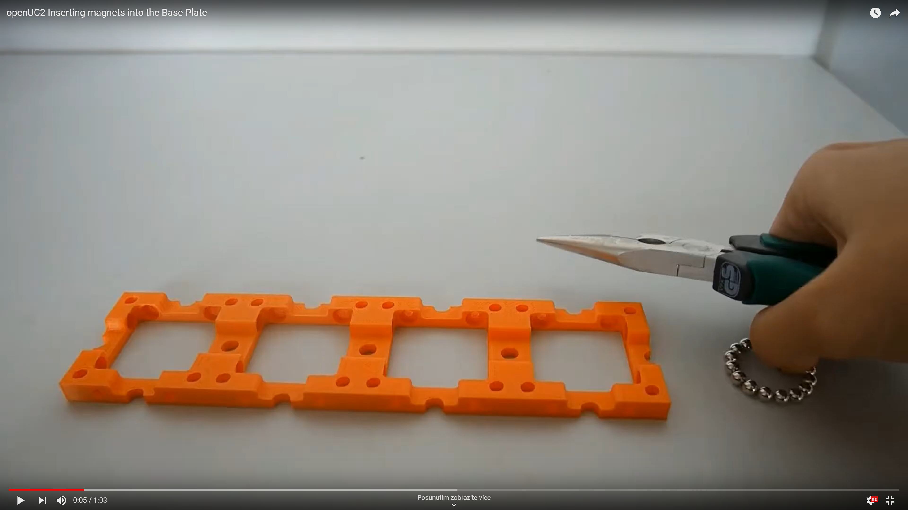

# Baseplate
This is the repository for the design of the baseplates.

The STL-files of this part are in the [RAW](../RAW/STL) folder. The module can be built using injection-moulded (IM) or 3D-printed (3DP) parts.

([TUT04 of TUTORIALS](../../TUTORIALS))

## Purpose
Baseplates serve as a spine of any setup you build using the cubes. The basic unit is a puzzle piece.

The puzzle pieces can be arbitrarily combined into a baseplate of a desired size and shape. For better stability, the baseplate can be screwed to a Thorlabs breadboard, optical table or a wooden board.

The baseplates can be also concatenated in third dimension,  being build in a "sandwich"-like structure.

## Parts
The baseplate puzzles are produced using injection moulding (IM) but it is also possible to 3D print (3DP) them. The IM and 3DP puzzles are compatible.  
However, the size of the 3DP puzzles may vary between different printers and filaments. It is therefore advisable to calibrate the baseplate with your printer. Details below.

Find out more about combining the IM and 3DP cubes in the [Modular Developer Kit](../../MDK).

###  3D printing parts
The Baseplate puzzle for 3D printing is found in the [RAW/STL](../RAW/STL) folder here:
* [10_Base_puzzle_v3.stl](../RAW/STL/UC2_v3_10_Base_puzzle_v3_77.stl)

#### Calibrate the size of the baseplate puzzle
The size of the 3DP puzzles may vary between different printers and filaments. How to take this aspect into account?

1. Print the Baseplate calibrator from [here](../RAW/STL/UC2_v3_30_printing_calibrator_69.stl). Use the 3D printer you'll be using for all the parts.
1. Find which pair of puzzle connectors fit best together
1. Using an M5 screw, find on the S side of the calibrator the correct offset for the holes for the pins/screws
1. If you'll be using magnets in the baseplates, find on the M side of the calibrator the correct offset for the holes for the magnets - they should be inserted with force but without breaking hands or the 3D printed calibrator
1. This gives you the offset from the default size

1. Open the Baseplate puzzle on [Thingiverse](https://www.thingiverse.com/thing:4712377) using their Customizer and insert the correct offsets.
1. Generate an STL-file for the Baseplate that will work best with your printer. To make sure it works, firstly print only two baseplates and check if the puzzles connect firmly. 

###  Additional parts

* Check out the [RESOURCES](../../TUTORIALS/RESOURCES) for more information!
* Optional - the magnets are necessary for using 3DP cubes and for certain modules: Ballmagnets (four magnets per baseplate unit) - 5 mm diameter [🢂](https://www.magnetmax.de/Neodym-Kugelmagnete/Magnetkugel-Kugelmagnet-O-5-0-mm-Neodym-vernickelt-N40-haelt-400-g::158.html)

##  Assembly
      This part needs an update!

### Assembly Video Tutorial

###  Assembly Tutorial with images

1. All parts for this model. Here, v0 parts are shown, but the principle of the baseplate assembly haven't changed.

2. Place the magnets on the screws and center the cube on the Base

3. Apply some force to press-fit the magnets into their corresponding holes. Hint: Do it one by one, always putting most pressure on one corner

4. Done!

