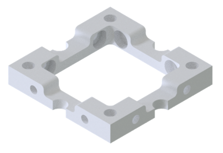
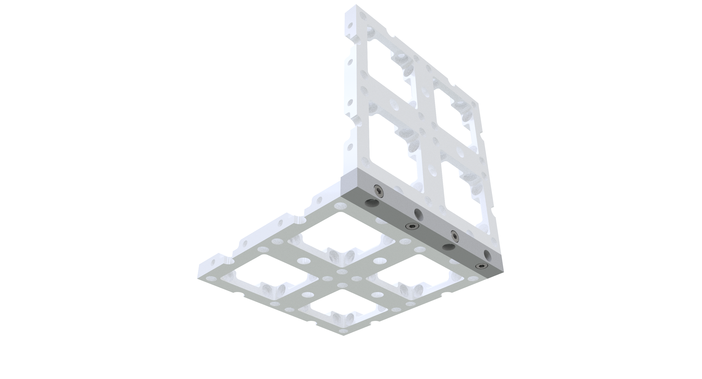
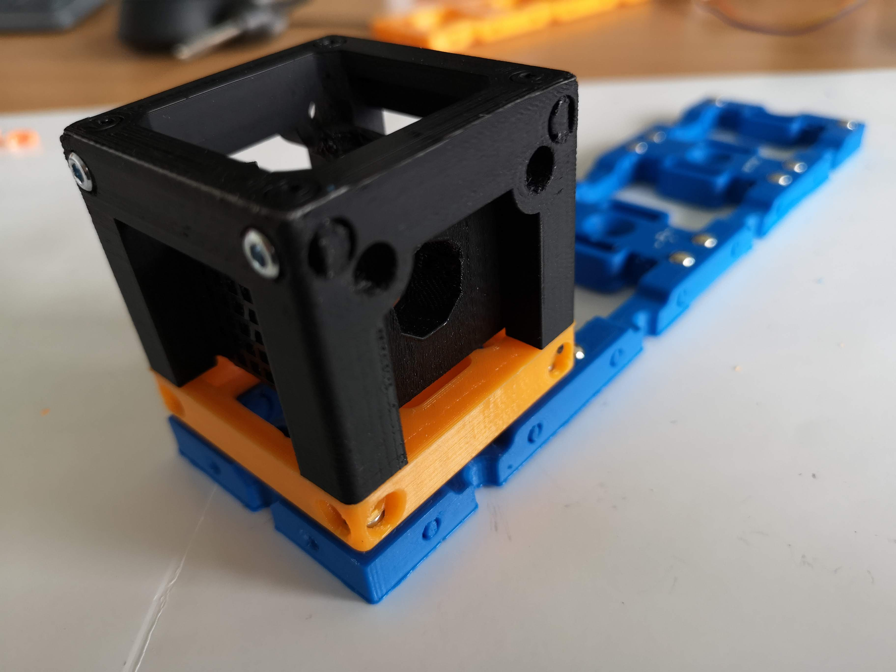

# Baseplate
This is the repository for the design of the baseplates. The stl-files can be found in the folder [STL](./STL).

## Purpose
Baseplates serve as a spine of any setup you build using the cubes. The basic unit has a size of 1×1. The 5 mm ballmagnets are inserted in the baseplate.

Most useful baseplates are 4×1, 4×2 and 4×4. But any size or shape can be contancated. For better stability, the printed baseplate can be screwed to a Thorlabs breadboard, optical table or a wooden board.

The baseplates can be aslo contancated in 90° using the Baseplate Connector. This allows you to build setups in 3D!

### 3D printing parts
Always print the baseplate the flat side down. The files in [STL](./STL) might sometimes be the other way around. Make sure to rotate them into the correct position in your 3D printer slicing software before saving the gcode.

### Additional parts

* Ballmagnets - 5 mm diameter [🢂](https://www.magnetmax.de/Neodym-Kugelmagnete/Magnetkugel-Kugelmagnet-O-5-0-mm-Neodym-vernickelt-N40-haelt-400-g::158.html)
* Screws DIN912 ISO 4762 M3×12 mm [🢂](https://eshop.wuerth.de/Zylinderschraube-mit-Innensechskant-SHR-ZYL-ISO4762-88-IS25-A2K-M3X12/00843%20%2012.sku/de/DE/EUR/)

## Assembly-Tutorial with images (Base)

1. All parts for this model

2. Place the magnets on the screws and center the cube on the Base

3. Apply some force to press-fit the magnets into their desired wholes

4. Done!

