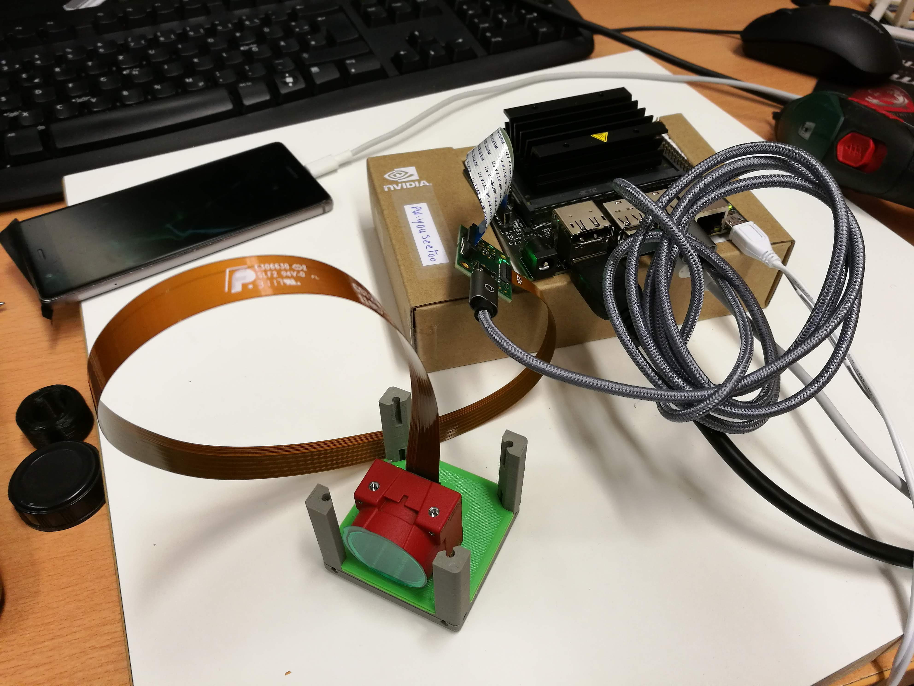
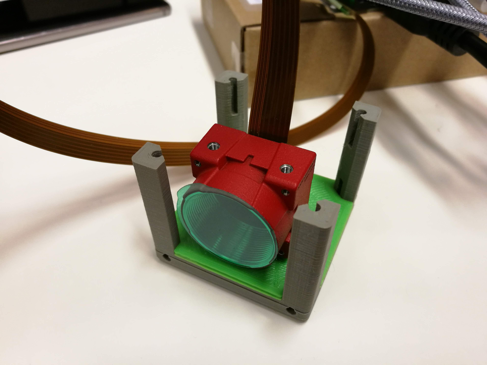

# Camera Cube (Allied Vision Alvium)
This is the repository for the Camera Cube which hosts an embedded vision camera from Allied Vision (Alvium).

The stl-files can be found in the folder [STL](./STL).

## Purpose
It adapts an Allied Vision Camera to the UC2 system.

<p align="center">

</p>

The sensor is put into an adapter which holds the camera in the center of the cube. The height can be varied by sliding the adapter along the slides.

### Properties
* design is derived from the base-cube
* camera adapter can be adjusted to individual needs

## Parts

###  3D printing parts
* No support needed in all designs
* Carefully remove all support structures (if applicable)

The Cube consists of the following components.

* **The Lid** where the Arduino + Electronics finds its place ([LID](./STL/10_Lid_1x1_v2.stl))
* **The Cube** which will be screwed to the Lid. Here all the functions (i.e. Mirrors, LED's etc.) find their place ([BASE](./STL/10_Cube_1x1_v2.stl))
* **The Camera Insert** which holds the camera and makes it adaptable to the base-cube ([INSERT](./STL/20_Cube_insert_AlliedVision_Alvium.stl))
* *OR* **The Adjustable Camera Insert** which holds the camera and makes it adaptable to the base-cube and makes it possible to slide it throught the cube and fix its position with screws ([INSERT](./STL/20_Cube_insert_AlliedVision_Alvium_adjustable.stl))

###  Additional parts
* Check out the [RESOURCES](../../TUTORIALS/RESOURCES) for more information!
* 7× DIN912 M3×12 screws (galvanized steel) [🢂](https://eshop.wuerth.de/Zylinderschraube-mit-Innensechskant-SHR-ZYL-ISO4762-88-IS25-A2K-M3X12/00843%20%2012.sku/de/DE/EUR/)
* Allied Vision Camera: CSI ALVIUM 1800 C-158

### Making it work

We use the following configuration:

- Nvidia Jetson Nano (100€)
- CSI ALVIUM 1800 C-158 (250€)
- Adapter Board CSI-2 (30€)
- Adapter Cable CSI-2 420 mm (10€)
- USB 5V charger (5€)
- USB Micro cable for the Adapter-Board supply voltage (!)
- SD Card, 64 GB (15€)

## Assembly
Put all the components together as this here

<p align="center">

</p>

#### Jetson Nano Preparation

1.) Prepare the SD card following this link: [https://developer.nvidia.com/embedded/learn/get-started-jetson-nano-devkit](https://developer.nvidia.com/embedded/learn/get-started-jetson-nano-devkit) (use Etcher and format the SD card before installing firmware!)

2.) Install all necessary packages + PYthon following this link [https://docs.nvidia.com/deeplearning/frameworks/install-tf-jetson-platform/index.html](https://docs.nvidia.com/deeplearning/frameworks/install-tf-jetson-platform/index.html)
(Tensorflow/Keras, etc. is not required yet)

3.) Install the Video4Linux2 (V4L2) support for python
[https://pypi.org/project/pyv4l2/](https://pypi.org/project/pyv4l2/)
```sudo apt-get install qv4l2```
```sudo apt-get install libv4l-dev```
and
```pip3 install pyv4l2```


4.) A package to detect the camera is this here:
```sudo apt-get install v4l-utils```
find the camera (```/dev/video0```) by typing:
```v4l2-ctl --list-devices​```

it may give you something like this:

```
vi-output, avt_csi2 6-003c (platform:54080000.vi:0):
        /dev/video0
```

5.) Install some further python packages:
[v4l2capture](https://pypi.org/project/v4l2capture/)
[pyv4l2](https://pypi.org/project/pyv4l2/)

6.) Test Allied Vision Examples:

```
cd ~Downloads

git clone https://github.com/alliedvision/examples

cd GStreamer

sudo ./gstreamer_install.sh

./gstreamer_live.sh -b nvidia -d /dev/video0
```

you should now see a live-stream of the camera. Eventually reboot before this step.

## Use VIMBA Python with the USB version

The Allied vision cameras come as CSI and USB3 versions. The latter can work with the ```Vimba Python``` API as an installable package provided by Allied Vision on their [github page](https://github.com/alliedvision/VimbaPython).

We managed to get it run on the Nvidia Jetson. Though it's not straight forward, since Vimba requires Python 3.7 and OpenCV. Therefore we need to build it from source. Nevertheless, the effort is worth it!

### 1. Install Python 3.7
If you haven't already done so execute:

```
sudo apt install python3.7-dev
```
and make it the default python version on the Jetson:

```
update-alternatives  --install /usr/bin/python python /usr/bin/python3.7 1
```

### 2 Install Allied Vision SDK

Go to their website and download the SDK for ARM64 and follow the installation instructions
https://www.alliedvision.com/en/products/software.html#c6444

### 3 Install OpenCV on Python 3.7 (takes a while)

#### Swap-file

The build-process requires quiet some RAM, so we need to expand it by creating a swap file:

```
sudo dd if=/dev/zero of=/swapfile bs=1M count=4096

sudo chmod 600 /swapfile
sudo mkswap /swapfile
sudo swapon /swapfile
```


Also, to make the swapfile activated during reboot, edit ```/etc/fstab```:

```
sudo nano /etc/fstab
```

And add the following line:
```
/swapfile none swap 0 0
```


#### Install dependencies

Please see this [post](https://pythops.com/post/compile-deeplearning-libraries-for-jetson-nano)

```
sudo apt-get update
sudo apt-get upgrade
dependencies=(build-essential
              cmake
              pkg-config
              libavcodec-dev
              libavformat-dev
              libswscale-dev
              libv4l-dev
              libxvidcore-dev
              libavresample-dev
              python3-dev
              libtbb2
              libtbb-dev
              libtiff-dev
              libjpeg-dev
              libpng-dev
              libtiff-dev
              libdc1394-22-dev
              libgtk-3-dev
              libcanberra-gtk3-module
              libatlas-base-dev
              gfortran
              wget
              unzip)
sudo apt install -y ${dependencies[@]}
```

#### Download and build OpenCV from source
```
cd ~/Downloads
wget https://github.com/opencv/opencv/archive/4.2.0.zip -O opencv-4.2.0.zip
wget https://github.com/opencv/opencv_contrib/archive/4.2.0.zip -O opencv_contrib-4.2.0.zip
unzip opencv-4.2.0.zip
unzip opencv_contrib-4.2.0.zip
mkdir opencv-4.2.0/build
cd opencv-4.2.0/build
Configure the build
cmake -D CMAKE_BUILD_TYPE=RELEASE \
      -D WITH_CUDA=ON \
      -D CUDA_ARCH_PTX="" \
      -D CUDA_ARCH_BIN="5.3,6.2,7.2" \
      -D WITH_CUBLAS=ON \
      -D WITH_LIBV4L=ON \
      -D BUILD_opencv_python3=ON \
      -D BUILD_opencv_python2=OFF \
      -D BUILD_opencv_java=OFF \
      -D WITH_GSTREAMER=OFF \
      -D WITH_GTK=ON \
      -D BUILD_TESTS=OFF \
      -D BUILD_PERF_TESTS=OFF \
      -D BUILD_EXAMPLES=OFF \
      -D OPENCV_EXTRA_MODULES_PATH=../../opencv_contrib-4.2.0/modules \
      -D PYTHON3_LIBRARY=/usr/lib/aarch64-linux-gnu/libpython3.7m.so \
      -D PYTHON3_EXECUTABLE=/usr/bin/python3.7 \
      -D PYTHON3_INCLUDE_DIR=/usr/include/python3.7m \
      ..
```

The last part for Python3.7 support is important!

#### Build the package and install

```
make -j4
sudo make install
```

#### Verification

```python```

and enter

```import cv2```

#### Optional packages:

```
#reinstall numpy
pip install -I numpy
sudo python -m pip install matplotlib
sudo pip uninstall PIL -y
sudo pip uninstall Pillow -y
sudo pip install Pillow
```

## Install Vimba Python API

```
cd ~/Downloads
git clone https://github.com/alliedvision/VimbaPython
chmod 755 Install.sh
sudo ./Install.sh
# alternatively
# pip install ./ -e
-> Python 3.7
-> With numpy
-> With OpenCV

cd VimbaPython/examples
python asynchronous_grab_opencv.py
```


**Done!**


​


### Things to do
- Control camera acquisition parameters through python/opencv (i.e. gain, exposure time) for still-image acquisition
	- V4L2 allows Register Access, so we should be able to do that?
- We would like to use the ```cv2.CaptureVideo``` method to load frames from the camera insid the MAT container. How could we do that?

### 3D Printing:
* No support required in all designs

##  Assembly
* Mount the camera to the insert using 3x M3 screws
* Take the mounted camera adapter inlet and slide it into the base-cube
* Take the cube lid and mount it using the 4 hex screws
* Done!

Once it's done it looks like this:

<p align="center">

</p>
