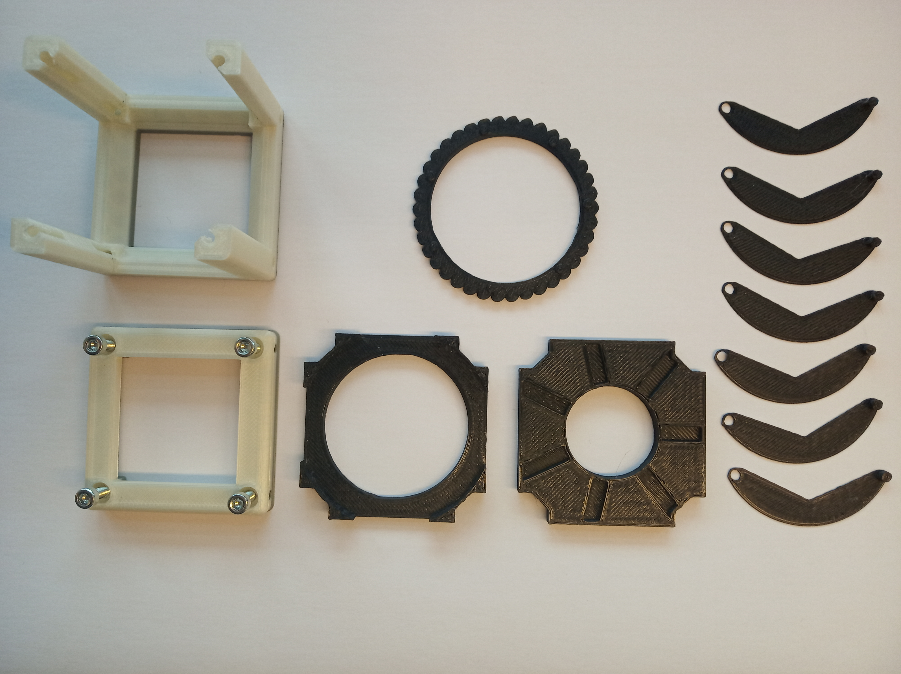
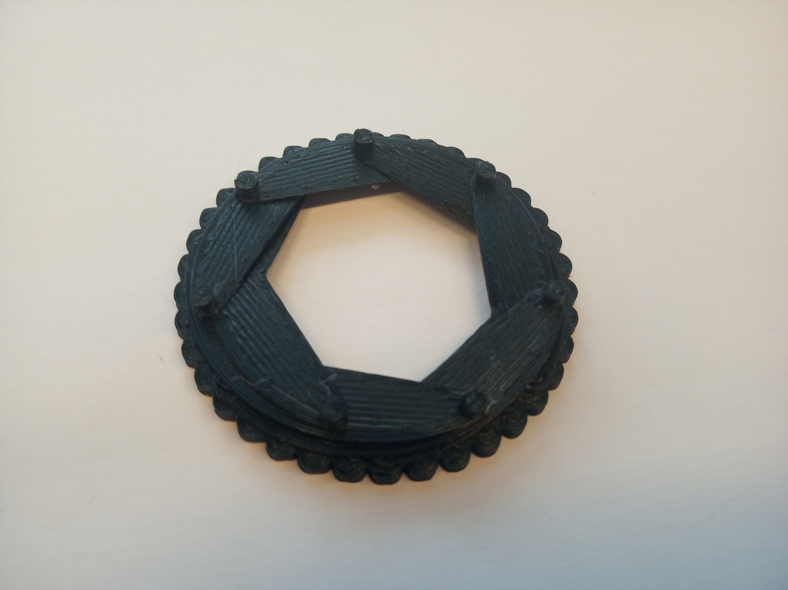
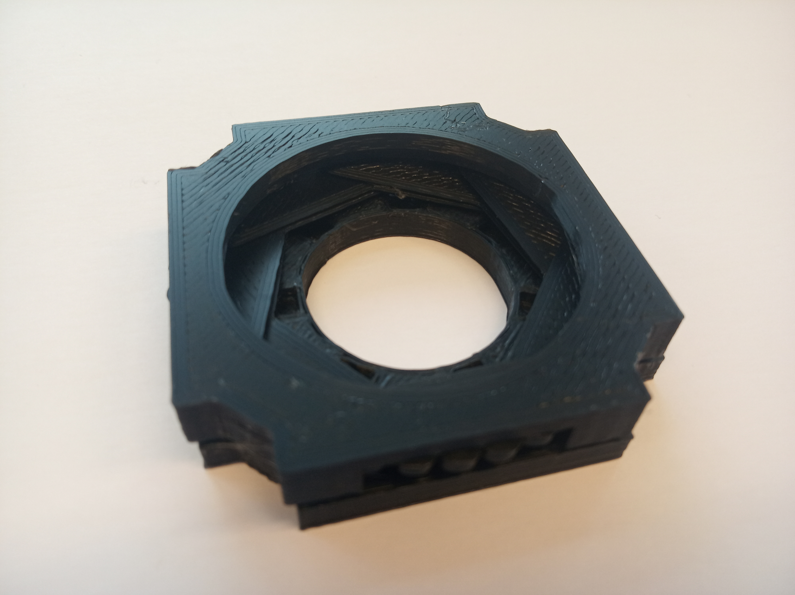
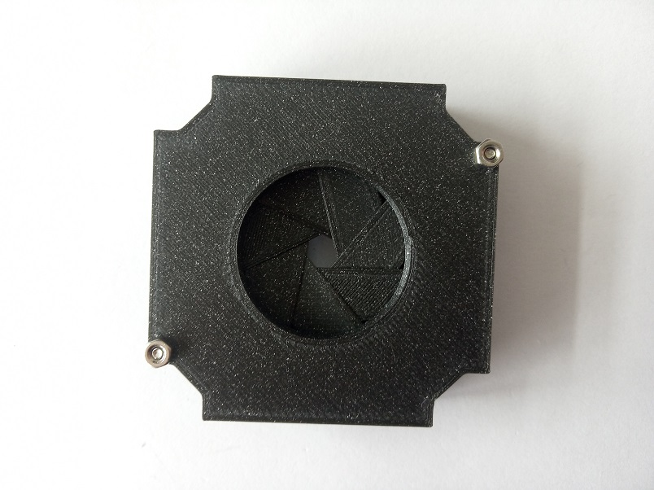

# Circular Aperture Cube
This is the repository for a circular aperture incorporated into the basic Cube.

The stl-files can be found in the folder [STL](./STL).

## Purpose
The aperture diaphragm is typically used in the case of critical or Köhler illumination, where it allows for controlling the intensity and/or diameter of the illuminated area.

### Properties
* the diameter of the aperture goes from 25 mm to approximately 2 mm
* design is inspired by [mechanical aperture](https://www.thingiverse.com/thing:2796724) but adapted to the Cube size and for the purpose of microscopy

## Parts

###  3D printing parts
* No support needed in all designs
* Carefully remove all support structures (if applicable)

The Cube consists of the following components.

* **The Lid** which closes the Cube ([LID](./STL/10_Lid_1x1_v2.stl))
* **The Cube** which will be screwed to the Lid. Here all the functions (i.e. Mirrors, LED's etc.) find their place ([BASE](./STL/10_Cube_1x1_v2.stl))
* **The Aperture Guide** which controls the movement of the leaves ([GUIDE](./STL/Assembly_Cube_CircularAperture_20_Cube_Insert_CirAp_Guide_3.stl))
* **The Aperture Wheel** which opens and closes the aperture when rotated ([WHEEL](./STL/Assembly_Cube_CircularAperture_20_Cube_Insert_CirAp_Wheel_2.stl))
* **The Aperture Leaf** which moves when the wheel is rotated. Print ALL the leaves in the STL folder ([LEAF](./STL/Assembly_Cube_CircularAperture_20_Cube_Insert_CirAp_Leaf_4.stl))
* **The Aperture Lid** which holds the wheel in position by pressing it against the guiding part ([APERTURE LID](./STL/Assembly_Cube_CircularAperture_20_Cube_Insert_CirAp_Lid_1.stl))

###  Additional parts
* Check out the [RESOURCES](../../TUTORIALS/RESOURCES) for more information!
* 8× DIN912 M3×12 screws (galvanized steel) [🢂](https://eshop.wuerth.de/Zylinderschraube-mit-Innensechskant-SHR-ZYL-ISO4762-88-IS25-A2K-M3X12/00843%20%2012.sku/de/DE/EUR/)
* 2× M2×16 screw with nuts (non-magnetic)

##  Assembly
* Assemble the aperture
* Add the insert to the Cube
* Add screws to the Cube
* Done!

###  Assembly Tutorial with images

1. All parts for this model: Don't forget to print SEVEN leaves!

1. Start with putting all the leaves on the pins of the wheel. Don't worry if they seem too loose, they will be held in place once the aperture is assembled.

1. Next, smooth into overlapping pattern. Hold the leaf on the pin of the wheel when moving it, so it doesn't fall off.

1. Put the wheel carrying the leaves together with the leave-guide. The pins of each leaf has to fall into the rail on the guide. When done correctly, the wheel and guide end up being parallel. See pictures:

1. Close the assembly with the aperture-lid. The lid holds the wheel centered.

1. Add the assembled aperture to the cube and close the cube with the lid, using four M3×12 screws. Make sure the guide and the lid are close enough, so the leaves can't move anywhere else that following the rails in the guide.

1. Assembled Aperture cube allows for opening and closing the aperture from the outside. Fully open aperture has the diameter of 25 mm, fully closed is approximately 2 mm in diameter.

1. In the latest version on this module, we added two holes for M2 screws to hold the aperture together and make the movement of it inside the cube more convenient.  
When you assemble the aperture, make sure that the holes in the Lid and Guide part are matching. Then put the M2 screws into the holes and fix the aperture by putting nuts on the screws.

