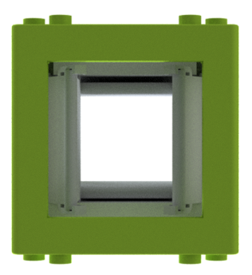
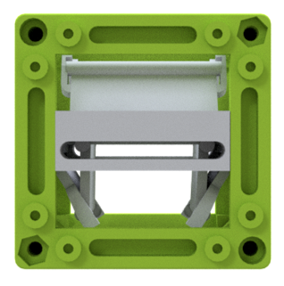
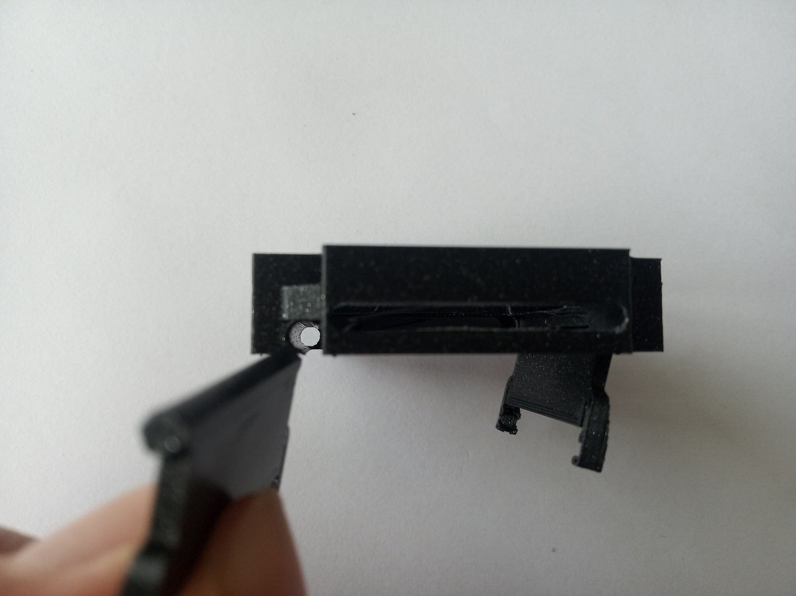
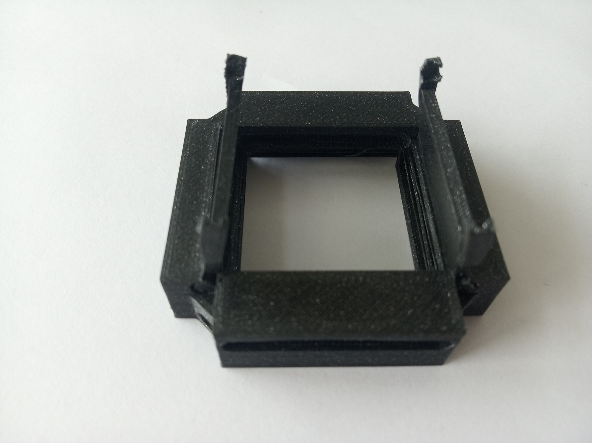
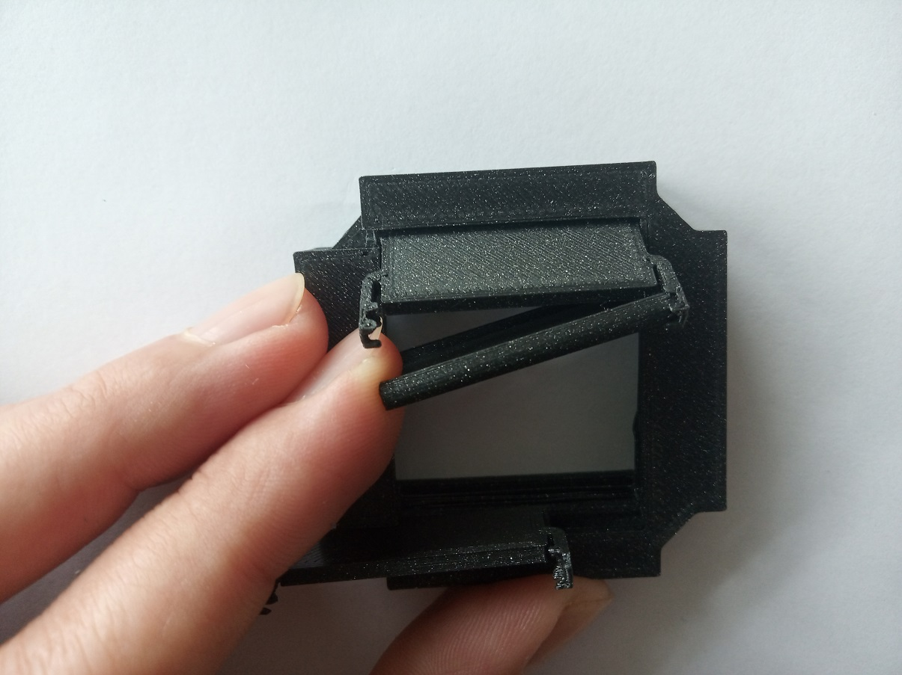
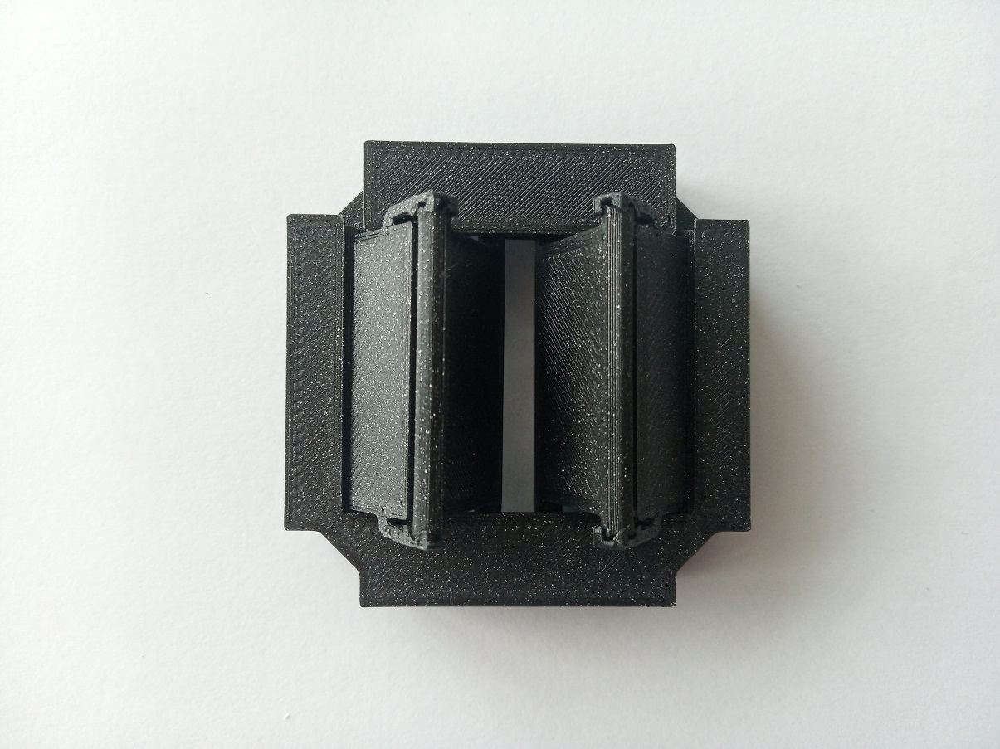
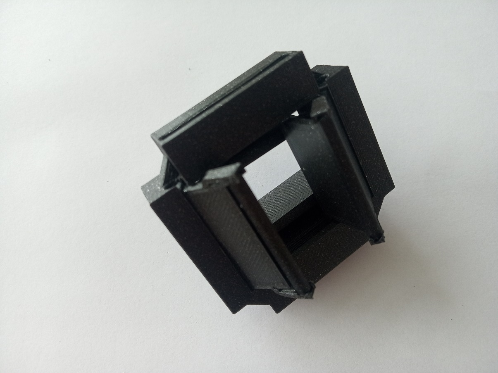
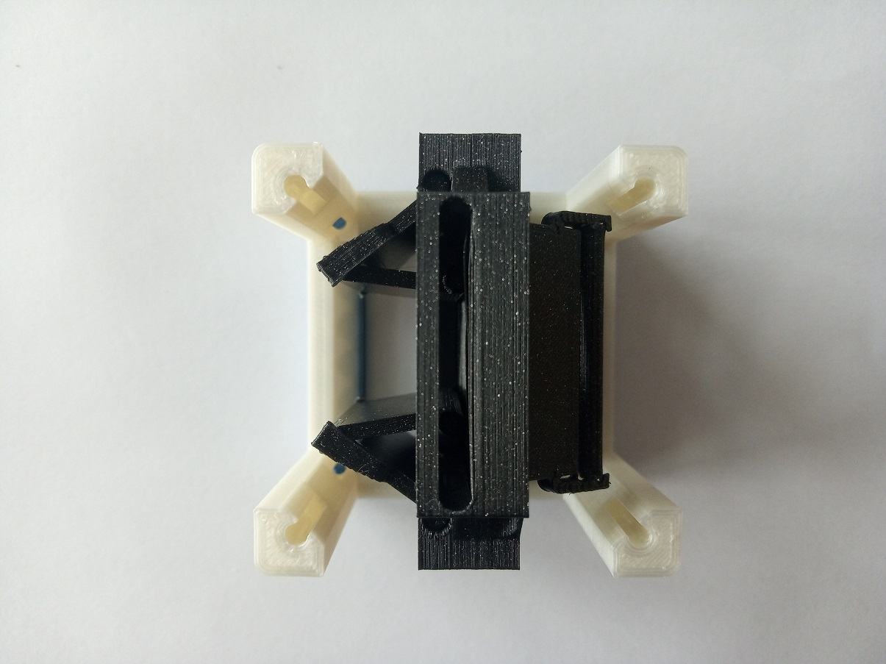
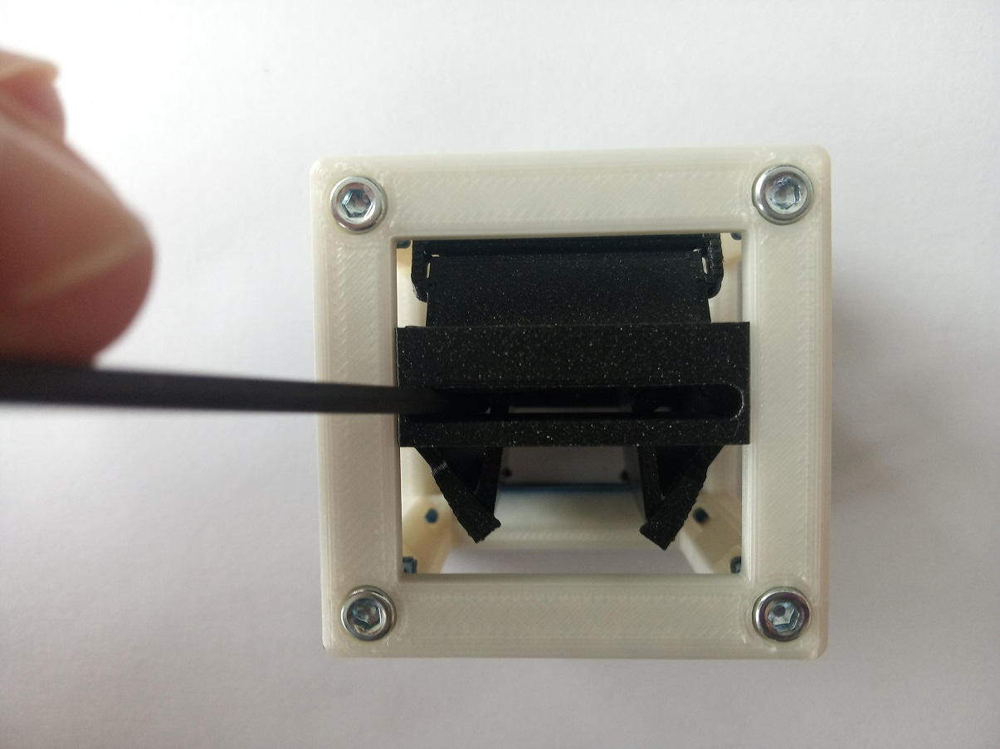

# Rectangular Aperture Cube
This is the repository for a rectangular aperture incorporated into the basic Cube.

To acquire the STL-files use the [UC2-Configurator](). The files themselves are in the [RAW](../RAW/STL) folder. The module can be built using injection-moulded (IM) or 3D-printed (3DP) cubes.

## Purpose
The aperture can limit the light beam in X and Y independently and asymmetrically from both sides.  

### Properties
* the opening of the aperture goes from fully closed to approximately 20 mm
* The mechanism is still a little fragile and suggestions for improvements are warmly welcome!

## Parts
The [Bill of Materials](https://docs.google.com/spreadsheets/d/1U1MndGKRCs0LKE5W8VGreCv9DJbQVQv7O6kgLlB6ZmE/edit?usp=sharing) is always the most up-to-date version!

###  3D printing parts
* No support needed in all designs
* Carefully remove all support structures (if applicable)

The Cube consists of the following components.

#### Default:
* **IM Cube** which houses the insert and adapts it into a UC2 setup.
* **The Aperture Insert** which holds the mechanism in place ([20_Rect_Aperture_for_printing_v3.stl](../RAW/STL))
* **The Aperture Door - sliding part** which is the part of the door that does most of the movement. You need four of them ([20_Rect_Aperture_door_slide.stl](../RAW/STL))
* **The Aperture Door - hinge part** which is the part of the door that supports the movement. You need four of them ([20_Rect_Aperture_door_hinge.stl](../RAW/STL))

#### Alternatives:
* **3DP Cube** which will be screwed to the Lid. Here all the functions (i.e. Mirrors, LED's etc.) find their place ([10_Cube_1x1_v3.stl](../RAW/STL)) and **3DP Lid** which closes the Cube ([10_Lid_1x1_v3.stl](../RAW/STL)) - find the details in [ASSEMBLY_CUBE_Base](../ASSEMBLY_CUBE_Base)

###  Additional parts
* Check out the [RESOURCES](../../TUTORIALS/RESOURCES) for more information!
* There are no other parts needed for this module

##  Assembly
* Assemble the aperture
* Add the insert to the Cube
* Close the cube accordingly (IM/3DP)
* Done!

###  Assembly Tutorial with images
:grey_exclamation: This tutorial shows a UC2_v2 cube but the assembly of the insert is still the same. For assembly of the cube (IM/3DP) check the [ASSEMBLY_CUBE_Base](../ASSEMBLY_CUBE_Base).

1. All parts for this model

1. There are in total four doors and the assembly is the same for all of them. Firstly, insert the DOOR-HINGE into the slit in the insert part. You should be able to move the hinge when it's done correctly. The slits might need some filing, especially on the bottom-printed side of the insert (depending on your 3D printer).

1. Now comes the sliding part of the door. Insert the pins in the slit that will lead the sliding movement of this part.

1. Connect the two parts of the door. Be careful not to break the little 'wings' that hold the hinge mechanism. Insert fist one side and then press it into the other, as shown in the pictures.

1. Follow the same step for the other door on the same side and for the doors on the other side of the insert.

1. Insert the insert into the Cube, add screws - Done!

1. Open/close the doors using a hex key or a thin screwdriver.

