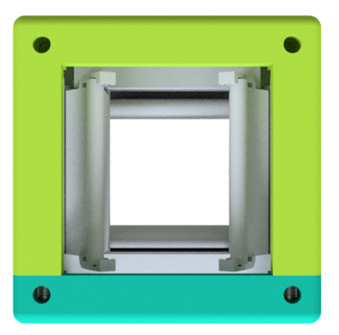
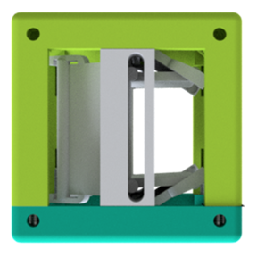
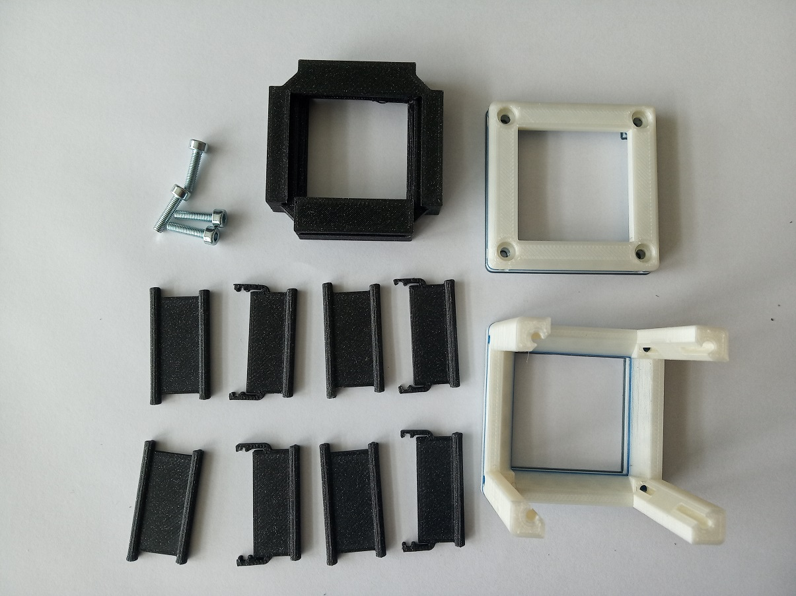
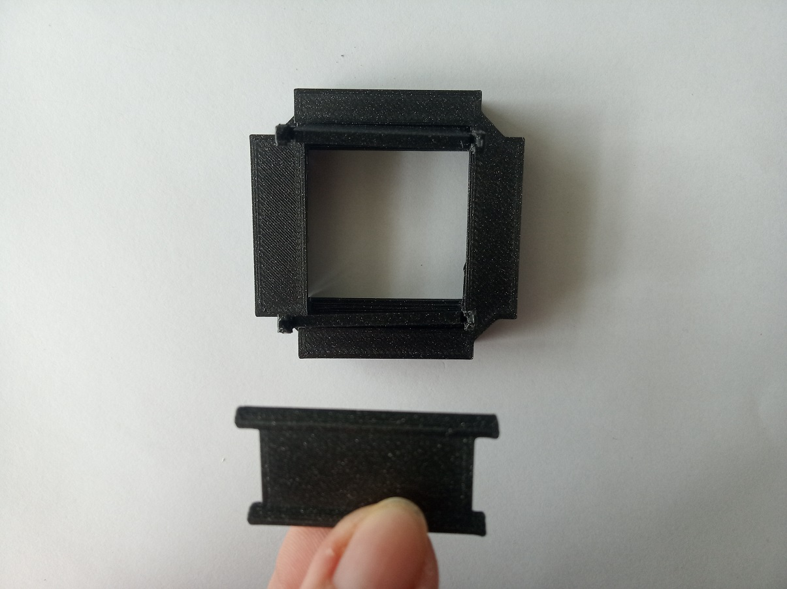
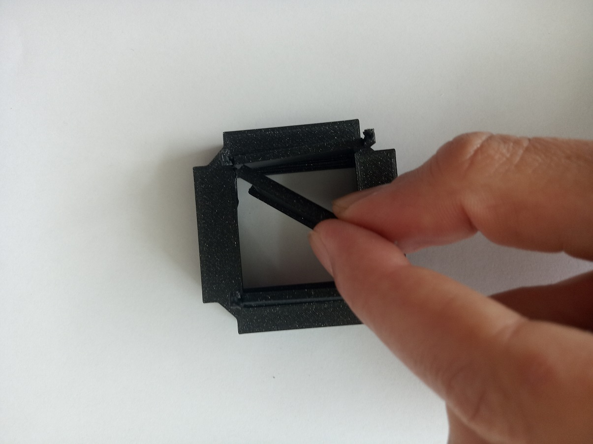
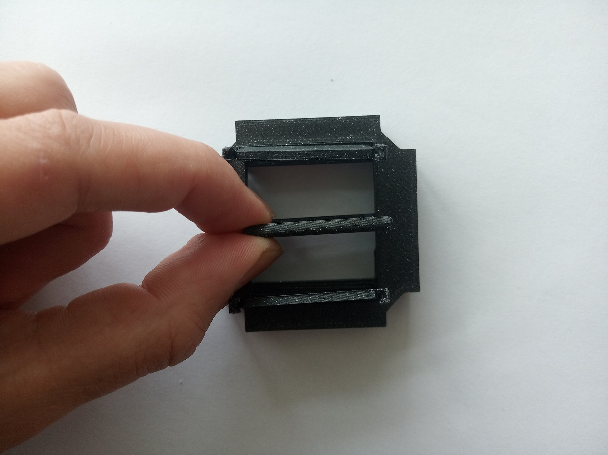
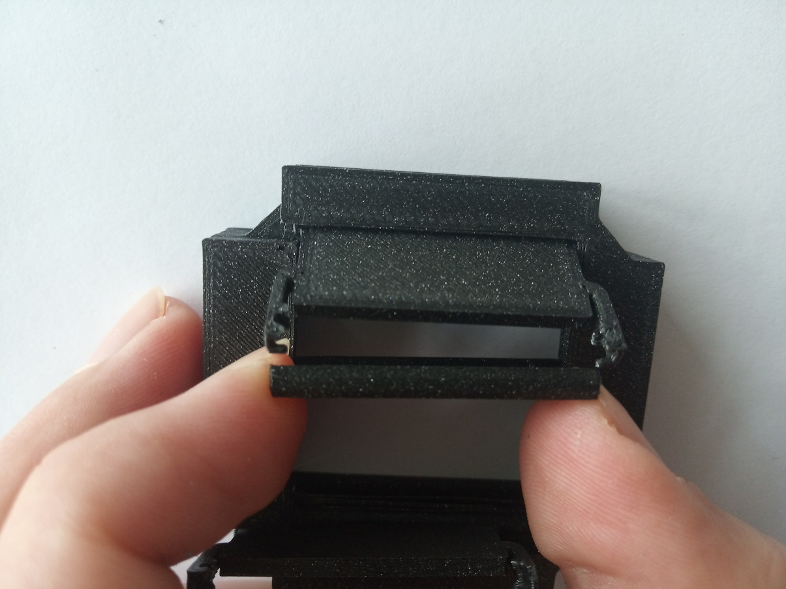
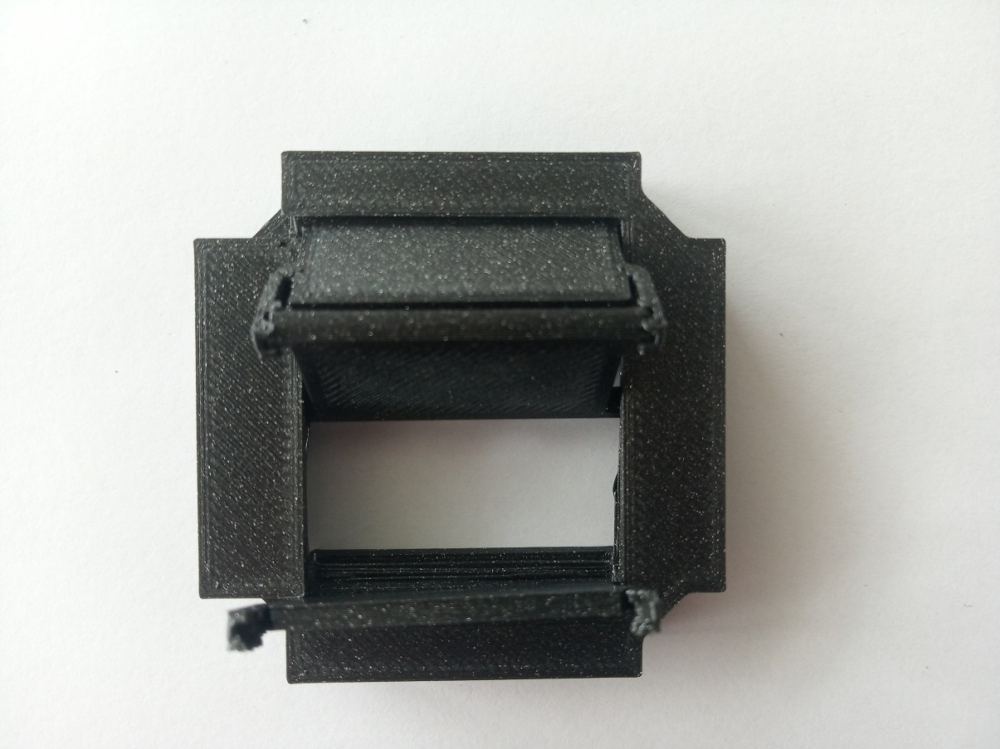
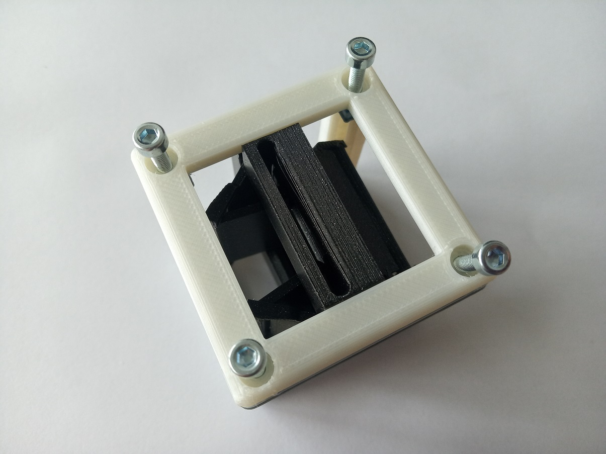

# Rectangular Aperture Cube
This is the repository for a rectangular aperture incorporated into the basic Cube.

The stl-files can be found in the folder [STL](./STL).

## Purpose
The aperture can limit the light beam in X and Y independently and asymmetrically from both sides.  

### Properties
* the opening of the aperture goes from fully closed to approximately 20 mm
* The mechanism is still a little fragile and suggestions for improvements are warmly welcome!

## Design
The original design files are in the [INVENTOR](./INVENTOR) folder. These files were generated using Autodesk Inventor 2019 Student Version.

To start working on it, you have to do the following steps:
1. Download the `Assembly_Cube_Rect_Aperture_v2.zip` and unzip it
1. Open Inventor and import existing project
1. Select filename `Assembly_Cube_Rect_Aperture_v2.ipj`
1. Now you can modify the parts
1. If you have a cool improvement for this part, please let us know! ([CONTRIBUTING](../../CONTRIBUTING.MD))

## Parts

###  3D printing parts
* No support needed in all designs
* Carefully remove all support structures (if applicable)

The Cube consists of the following components.

* **The Lid** which closes the Cube ([LID](./STL/10_Lid_1x1_v2.stl))
* **The Cube** which will be screwed to the Lid. Here all the functions (i.e. Mirrors, LED's etc.) find their place ([BASE](./STL/10_Cube_1x1_v2.stl))
* **The Aperture Insert** which holds the mechanism in place ([INSERT](./STL/20_Cube_Insert_RectAp_v2.stl))
* **The Aperture Door - sliding part** which is the part of the door that does most of the movement. You need four of them ([DOOR SLIDE](./STL/20_Rect_Aperture_door_slide.stl))
* **The Aperture Door - hinge part** which is the part of the door that supports the movement. You need four of them ([DOOR HINGE](./STL/20_Rect_Aperture_door_hinge.stl))

###  Additional parts
* Check out the [RESOURCES](../../TUTORIALS/RESOURCES) for more information!
* 8× DIN912 M3×12 screws (galvanized steel) [🢂](https://eshop.wuerth.de/Zylinderschraube-mit-Innensechskant-SHR-ZYL-ISO4762-88-IS25-A2K-M3X12/00843%20%2012.sku/de/DE/EUR/)

##  Assembly
* Assemble the aperture
* Add the insert to the Cube
* Add screws to the Cube
* Done!

###  Assembly Tutorial with images
1. All parts for this model

1. There are in total four doors and the assembly is the same for all of them. Firstly, insert the DOOR-HINGE into the slit in the insert part. You should be able to move the hinge when it's done correctly. The slits might need some filing, especially on the bottom-printed side of the insert (depending on your 3D printer).

1. Now comes the sliding part of the door. Insert the pins in the slit that will lead the sliding movement of this part.

1. Connect the two parts of the door. Be careful not to break the little 'wings' that hold the hinge mechanism. Insert fist one side and then press it into the other, as shown in the pictures.

1. Follow the same step for the other door on the same side and for the doors on the other side of the insert.

1. Insert the insert into the Cube, add screws - Done!

1. Open/close the doors using a hex key or a thin screwdriver.

