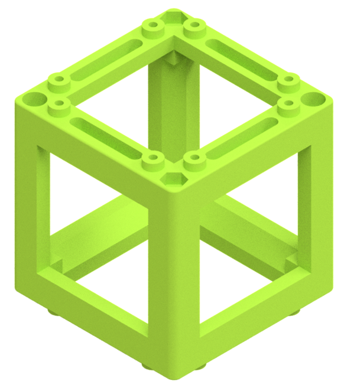
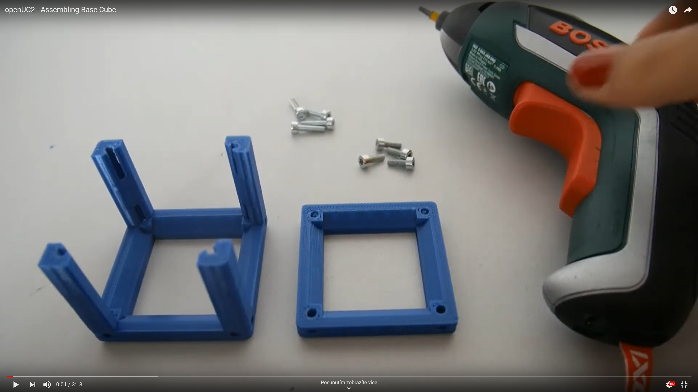
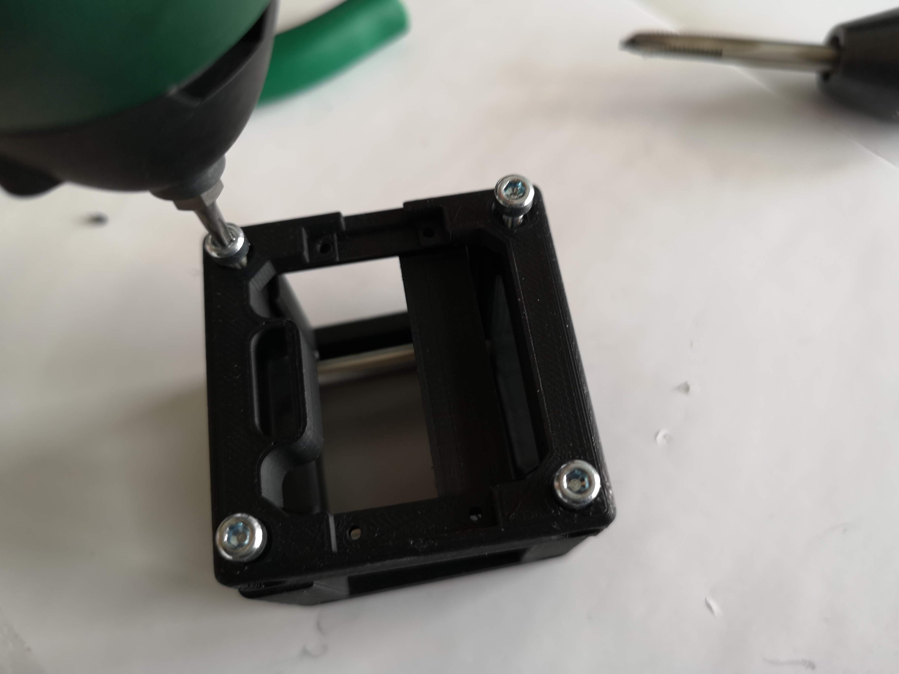

# BASE CUBE
This is the repository for the base cube design. The design-files can be found in the folder [INVENTOR](./INVENTOR).

<p align="center">

</p>

The base cube comes in two versions - **injection moulded (IM)** and **3D-printed (3DP)** that are fully compatible with each other. You can either print all the baseplates and cubes and assemble and connect them using screws and magnets, or you can use the IM cubes and baseplate puzzles that connect via the lego-like pins.

The IM cube is shown in the first picture. The two identical halves fit perfectly together and each of the two pinned sides of the cube fits to the baseplate.
<p align=center>

</p>

The 3D-printed cube is in the next picture. The body and the lid are held together by the M3 screws that attach to the magnets of the baseplate. Additionally, M5 screws are added to the position of the pins for better alignment precision.
<p align=center>

</p>

The 3D-printed baseplate puzzles are fully compatible with both types of cubes and with the IM puzzles. It is important to pay attention to calibration of your printer according to the guide in the [baseplate CAD page](../ASSEMBLY_Baseplate). There you also find general information on building a setup from Cubes and Basepate puzzles.

The basic building unit always consists of 3 components - two parts of a cube that close around an insert and a baseplate. The actual architecture of the Cube depends on the production method:

Parts|IM Cube | 3DP Cube
:---|:---|:---
||
Baseplate| **The Baseplate puzzle (IM)** which serves as the skeleton of all setups. [More about baseplates.](../ASSEMBLY_Baseplate) | **The Baseplate puzzle (3DP)** which serves as the skeleton of all setups and where the ball magnets will be fed in. [More about baseplates.](../ASSEMBLY_Baseplate)
Building block| **The half-Cube** that is symmetrical and two of them form a Cube. Thanks to the IM production, the parts are very precise, so the halves are just pressed together and stay assembled. | **The Cube Body** where all the functions (i.e. Mirrors, LED's etc.) find their place - inserts that define the function of the cube are placed in the body before closing the lid.
| The Cube has pins, eight on each of the two opposite sides, that connect the Cube to the Baseplate. | **The Lid** that closes the cube. It is attached by four M3 screws.
Additional parts|| **Magnets** (5 mm diameter) are fed into the Baseplate and attach to the M3 screws of the Cube. [🢂](https://www.magnetmax.de/Neodym-Kugelmagnete/Magnetkugel-Kugelmagnet-O-5-0-mm-Neodym-vernickelt-N40-haelt-400-g::158.html)
|| **M3 screws** (M3×12) that hold the Body and Lid together, closing the Cube. They also attach the cube to the Baseplate via magnets. [🢂](https://eshop.wuerth.de/Zylinderschraube-mit-Innensechskant-SHR-ZYL-ISO4762-88-IS25-A2K-M3X12/00843%20%2012.sku/de/DE/EUR/)
|| **M5 screws** (M5×8) that replace the pins of the IM Cube. They make the alignment more precise and the connection between the Cube and the Baseplate more stable. [🢂](https://eshop.wuerth.de/Produktkategorien/ISO-4026-Stahl-45H-verzinkt/14013511052004.cyid/1401.cgid/de/DE/EUR/?CatalogCategoryRef=14013511052004%40WuerthGroup-Wuerth-1401&SelectedFilterAttribut=%255B%257B%2522name%2522%253A%2522AT_ThreadTypeXNominalDiameter%2522%252C%2522value%2522%253A%255B%2522M5%2522%255D%252C%2522title%2522%253A%2522Gewindeart%2520x%2520Nenndurchmesser%2522%257D%252C%257B%2522name%2522%253A%2522AT_Length%2522%252C%2522value%2522%253A%255B%25228%2520mm%2522%255D%252C%2522title%2522%253A%2522L%25C3%25A4nge%2522%257D%255D)


The function which fits into the cube is not necessarily bound to optics. It can be anything!
The function is defined by the insert and all our insert are in the respective module folder in [CAD](../)

<p align="center">

</p>

The details about the size and other properties of the basic building block is found in the [Modular Developer Kit (MDK)](../../MDK).

### Devices features:

* Click-Mount via pins (IM) or Ball-Magnets/Screws (3DP)
* Fill in whatever function you want
* Modularized design
* Low-cost production
* Very precise
* Open-Source
* Mount it in all possible directions

## [3D Printing](./STL)

### Assembly Video Tutorial

[](https://www.youtube.com/watch?v=zAMedY0mWKA)

## Assembly Tutorial with images
([TUT02 of TUTORIALS](../TUTORIALS))
### OLD VERSION!!! Assembly Tutorial with images (Cube v0)
      This section needs a update!

1. All parts for this model
<p align="center">

</p>

2. Widen the holes to <~5.9mm with a drillin-tool
<p align="center">

</p>

3. Insert the lens inside the part (don't touch it!)
<p align="center">

</p>

4. Add the fixation ring
<p align="center">

</p>

5. Fix the ring so that the lens is not loose - don't touch the lens!
<p align="center">

</p>

6. Insert rods inside the cube
<p align="center">

</p>

7. Mount the lens on the rods
<p align="center">

</p>

8. Fasten the rods
<p align="center">

</p>

9. Add the lid to the cube and screw it
<p align="center">

</p>

10. Check if it's tilting - if so: Align screws!
<p align="center">

</p>

11. Done!
<p align="center">

</p>

## Electronics
The Arduino/ESP32 can be introduced with hot-glue or a rubber band, for parts with motors or LEDs.

## CAD Design
Please also see the Module developer kit ([MDK](../../MDK)) for further design instructions on how you sould adapt to the UC2 cubes.

## OpenSCAD files
Open-Souce also means, that one should be able to modify the files with open-source software. Therefore we provide the basic cube as an ```.scad``` file in the [OPENSCAD](./OPENSCAD) folder.  The Inventor files will follow soon!

## Tutorial on how to design an insert in Inventor
Find the tutorial in the [INVENTOR](./INVENTOR) folder.

## Participation
We are eager to see your results! Feel free to file a pull-request or share it via mail or [@openUC2 on Twitter](https://twitter.com/openUC2) .
