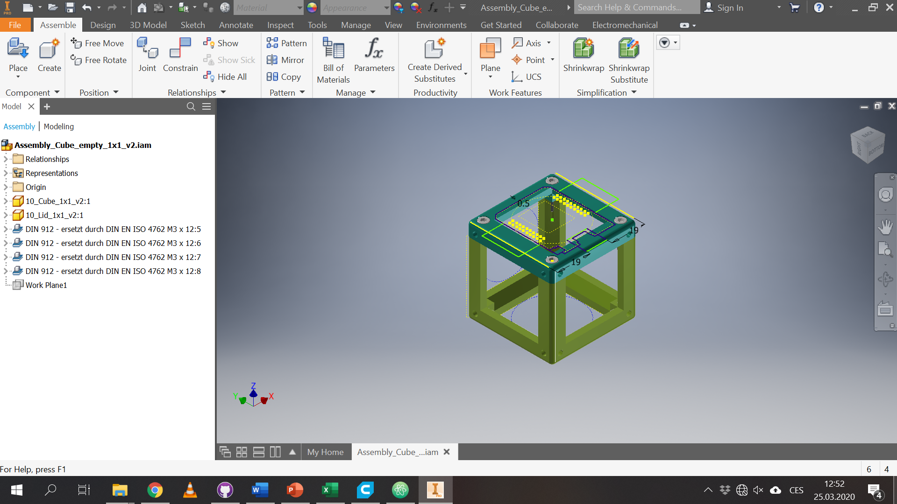
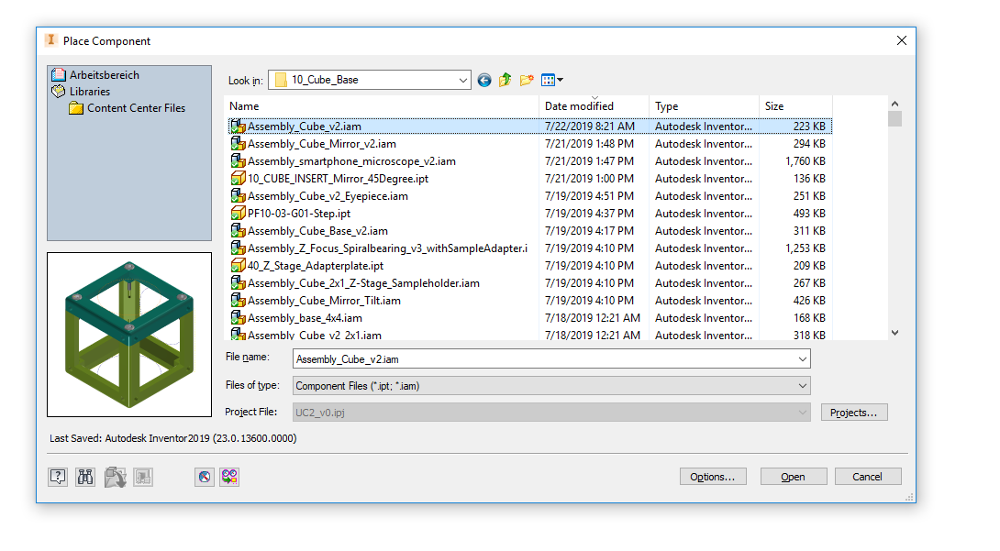
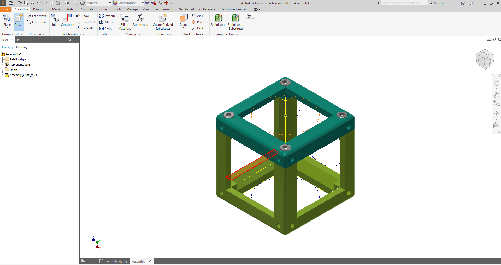
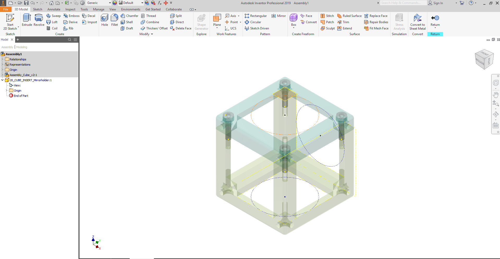
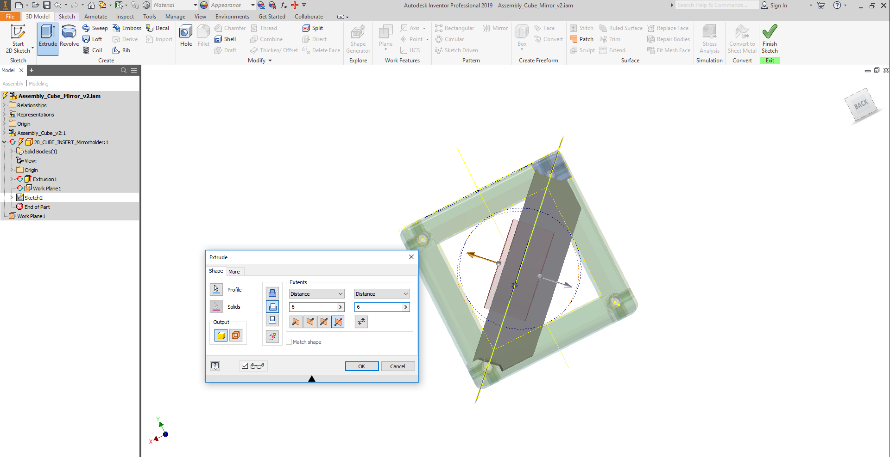

## BASE CUBE Design Files

These files were generated using Autodesk Inventor 2019 Student Version.

To start working on it, you have to do the following steps:

1. Download the `Assembly_Cube_empty_1x1_v2.zip` and unzip it
1. Open Inventor and import existing project
2. Select filename `Assembly_Cube_empty_1x1_v2.ipj`
3. Then open the assembly `Assembly_Cube_empty_1x1_v2.iam` in Inventor
4. The base-cube has two components: `10_Lid_1x1_v2.ipt` and `10_Cube_1x1_v2.ipt` which can be modified to personal needs.
1. If you have a cool improvement for this part, please let us know! ([CONTRIBUTING](../../../CONTRIBUTING.MD))

Screenshot of the cube in Inventor:
<p align="center">

</p>

Alternatively the cube can also be used in the free (educational purposes) CAD software Autodesk Fusion 360 by first importing all components:
<p align="center">

</p>

and then opening the `.iam`-file (this is a v0 image):
<p align="center">

</p>

## Tutorial on how to design an insert in Inventor
This is an example of designing an insert for any function you like. We are eager to see your results! Feel free to file a pull-request or share it via mail or [@openUC2 on Twitter](https://twitter.com/openUC2) .

**Video Tutorial on How to design a Cube Insert (Perpendicular to the optical axis)**
[](https://www.youtube.com/watch?v=q2DNw-Q1KEo&t=2s)


#### 1. Open Autodesk Inventor 2019 (Student) and open the UC2 project
<p align="center">

</p>

#### 2. Create a new Assembly
<p align="center">

</p>

#### 3. Place the UC2 base cube
<p align="center">

</p>

#### 4. Select the file. and pPlace the UC2 base cube
<p align="center">

</p>

#### 5. Ground the cube so that this is the reference for the insert
<p align="center">

</p>

#### 6. Create a new part which should hold a mirror
<p align="center">

</p>

#### 7. Give it a name and save everything
<p align="center">

</p>

#### 8. Select a reference plane for the new part to start a drawing
<p align="center">

</p>

#### 9. Start the drawing
<p align="center">

</p>

#### 10. Start the drawing II
<p align="center">

</p>

#### 11. Select the reference plane for the drawing
<p align="center">

</p>

#### 12. Derive the CAD-Drawings from the base cube
<p align="center">

</p>

#### 13. Have a look at the reference design for the cube insert
We want to design an insert which basically fits inside the cube. Thus, it has to be ```53.8mm``` in diagonal and ```6.28mm```at the edges as shown below:

<p align="center">

</p>

#### 14. Create a rectangular sketch
<p align="center">

</p>

#### 15. Create a rectangular sketch
The dimensions are derived from the CAD-drawing in 13.
<p align="center">

</p>

#### 16. Add some support to make it 'slidable'
This is exemplary. You can add any shape you want as long as you can slide it inside the cube and keep dimensions in step 13 in your mind.
<p align="center">

</p>

#### 17. Extrude the sketch
It can be any value so that the part fits inside the cube. It has to be less than ```32mm```though (see step 13.)
<p align="center">

</p>

#### 18. Look up the external devices Parameters (CAD Dimensions)
Here we review a Thorlabs silver mirror with 1 inch in diameter and 6mm in thickness
<p align="center">

</p>

#### 19. Create a sketch which represents a hole for the Thorlabs mirror
<p align="center">

</p>

#### 20. Extrude the hole so that a mirror fits in there
Add some imprecision boundary (e.g. .1-.2 mm)
<p align="center">

</p>

#### 21. Create a rectangular sketch
<p align="center">

</p>

#### 22. You're done! :)
Add any modifications to your design to make it work and share it - please! :-)
[@openUC2 on Twitter](https://twitter.com/openUC2) and as a github pull request :-)

<p align="center">

</p>
